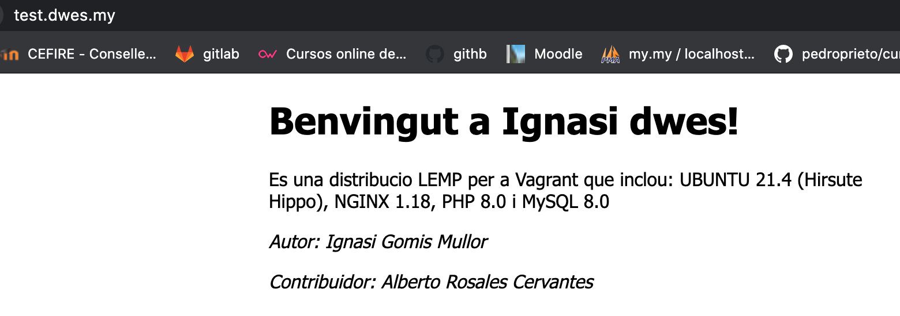
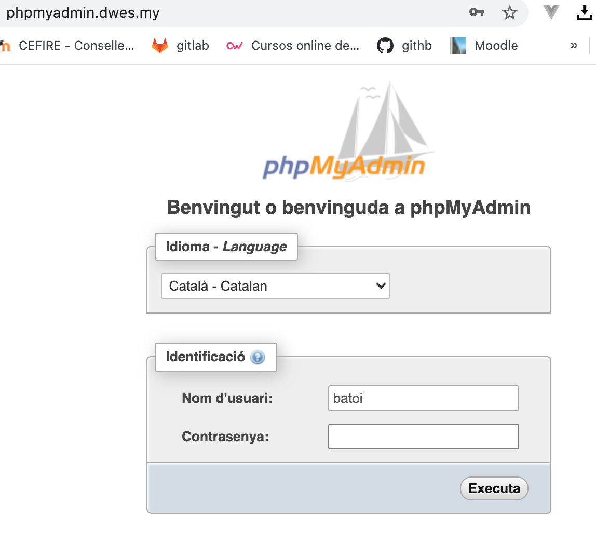

## Introducció al desenvolupament d'aplicacions web

Las aplicacions web es basen en el **model client-servidor**. El client inicia el procés amb una sol·licitud al servidor que genera un missatge de resposta. Ambdos es comuniquen utilitzant un protocol comú. En el cas del servidors web, els clients solen ser navegadors els que realitzen peticions, i estos responen amb la pàgina web sol·licitada o amb un missatge d'error.

La comunicació es realitza mitjançant els protocols HTTP (80) o HTTPS (553), i on la **capa de presentació** s'executa en el navegador, la **capa de negoci** al servidor i la **capa de dades** en el servidor de base de dades.  

### Generació dinàmica de pàgines web 

El llenguatge bàsic és el HTML. Si el contingut no varia estariem parlant de **pàgines estàtiques**. Quan s'utilitza un llenguatge de programació al servidor tindrem **pàgines dinàmiques** i es poden generar diferentes respostes segons l'usuari connectat,el navegador amb el qual s'accedisca, les accions anteriors dels usuaris o les peticions de l'usuari. Encara que estariem parlant de diferents llenguatges de programació, la resposta que genera el servidor ha de ser una pàgina entendible pel navegador, en llenguatge **HTML**.

###### Esquema de funcionamient

##### Execució de codi

Hi ha dos tipus de codi que fan una web dinàmica:

* El que s’executa en el navegador (front-end). Típicament javascript i els seus derivats.
* El que s’executa en el servidor (back-end).
* També hi han models híbrids on s'obtenen dades del servidor des del codi javascript utilitzant peticions AJAX.

#### Llenguatges de programació en entorns servidor

* PHP: El més estés. Normalment s'executa com un mòdul al servidor. Es fàcil i barat trobar allotjaments que l'oferisquen.
* JSP: La versió de Java per a la web. Li cal un contenidor web.
* ASP.NET: Integrada en la plataforma de microsoft .NET
* Ruby: Molt apreciat per els desenvolupadors web.
* GO: La versió de google de phyton.
* Phyton: El més popular.
* NodeJS: Utilitza Javascript.

A més tenim frameworks associats. (Laravel, Symphony, Ruby on Rails, Django)

Quins criteris utilitzariem a l'hora de triar un llenguatje per a fer un lloc web.

* Com és el lloc web.
* Com esperem que siga el creixement.
* Com necesitem que siga de ràpida.
* Qué serà més prevalent el back-end o el front-end.
* Quin llenguatge coneixem.
* On l'allotjarem.
* Quin suport tindrem.
* Quins components tindrem.
* Quina actualització tindrem.

[Comparació de llenguatges](https://www.codementor.io/@iliawebdev/top-programming-languages-for-web-development-in-2021-1hzczfuoei)

[Criteris per apendre un llenguatge de programació](https://blog.educacionit.com/2018/04/10/4-criterios-para-elegir-tu-primer-lenguaje-de-programacion/)

## Instal·lació de l'entorn de desenvolupament

Pera fer correr les aplicacions de servidor ens cal, com a mínim, un **servidor web**, l'interpret de **php** i un **motor de base de dades**. Hem de distinguir l'**entorn de desenvolupament**, on anem a programar i mantindre la nostra aplicació, de l'**entorn de producció**, on anem a executar-la.
Normalment el primer depén de nosaltres mentre que el segon pot dependre de l'empresa on s'allotjarà la nostra web. Per a preparar el nostre entorn de desenvolupament podem optar per:

* Qualsevol solució **LAMP** (Linux, Apache, Mysql, PHP). Als que haurem d'afegir, una vegada els projectes es facen grans **composer, git i les opcions de la part de client**.
* Una màquina virtual ja configurada. 
* Una solució docker.

La primera solució és senzilla d'implementar però no hauria de ser la nostra primera opció per:

* Estem possant en marxa en la nostra màquina una sèrie de servicis que normalment no fariem, baixant el rendiment de la màquina i obrint vulnerabilitats.
* Si treballem en grup, les instal·lacions i el funcionament no són iguals, depenen del sistema operatiu que té instal·lat cadascú. Allò que li funciona a ú  pot ser no li funciona a un altre. Això és inevitable quan el projecte es complica i es perd molt de temps.
* Passa el mateix quan passem a l'entorn de producció.

 
La segona solució soluciona els dos primers problemes, doncs tots els desenvolupadors poden tindre virtualitzada, la mateixa màquina. Encara que si la màquina no la fem nosaltres sinó que utilitzem alguna ja configurada (**vagrant**) o si ens cal instal·lar alguna cosa més, ho hauria de fer tot l'equip. 

Així i tot, tindriem les següents desaventatges:

* A l'instal·lar una maquina virtual sencera ocupa recursos del sistema.
* La màquina instal·la més coses de les necessàries habitualment.
* No reprodueix l'entorn de producció.

Pot ser molt útil, per exemple, quan la fem servir per desenvolupar en un framework, que ja ve configurat per fer-lo funcionar inmediatament i amb totes les característiques instal·lades. 

La tercera opció té les següents característiques:

* Al principi és més difícil de possar en funcionamet ja que calen coneixements de docker.
* Tots els desenvolupadors comparteixen entorn encara que utilitzen màquines o sistemes operatius diferents.
* Si hi ha algun canvi de configuració de l'entorn és fácilment transladable a tots els desenvolupadors.
* Es poden crear tants entorns  de desenvolupament com projectes diferents hi hajen.
* Els contenidors ocupen pocs recursos.
* Els projectes es poden possar en producció utilitzan una solució docker de manera inmediata.

## CONFIGURANT L'ENTORN DE DESENVOLUPAMENT

En el nostre ordinador he de tindre instal·lats:

 * VirtualBox per a allotjar el servidor WEB.
 * Vagrant per a generar la màquina virtual

### Vagrant

**Vagrant** és una eina gratuïta de línia de comandos, disponible per a Windows, MacOS X i GNU/Linux, que permet generar entorns de desenvolupament reproduïbles i compartibles de forma molt senzilla. Per a això, **Vagrant** crea i configura màquines virtuals a partir de simples fitxers de configuració.

N'hi ha prou amb compartir el fitxer de configuració de Vagrant (anomenat “**Vagrantfile**”) amb un altre desenvolupador perquè, amb un simple comando, puga reproduir el mateix entorn de desenvolupament. Això és especialment útil en equips formats per diverses persones, ja que assegura que tots els desenvolupadors tenen el mateix entorn, amb les mateixes dependències i configuració. 

A més, atés que la configuració de la màquina virtual és un simple fitxer de text pla, podem incloure aquest fitxer en el nostre repositori en el control de versions, juntament amb la resta del codi del projecte. D'aquesta manera, un nou desenvolupador que s'incorpore a l'equip simplement haurà de clonar el repositori del projecte i executar Vagrant per a tindre l'entorn de desenvolupament muntat i funcionant en qüestió de minuts.

#### Instal·lació de vagrant

El primer pas és descarregar i instal·lar **Vagrant** i a més instal·lar el proveïdor de màquines virtuals que vulguem utilitzar, que per defecte serà **VirtualBox**, ja que és gratuït i ve integrat en Vagrant. Per a linux:

~~~
curl -fsSL https://apt.releases.hashicorp.com/gpg | sudo apt-key add -
sudo apt-add-repository "deb [arch=amd64] https://apt.releases.hashicorp.com $(lsb_release -cs) main"
sudo apt-get update && sudo apt-get install vagrant
~~~

Una vegada instal·lats, podrem executar el comando **vagrant** per a obtindre un llistat de les opcions disponibles.

Crear una màquina virtual amb **Vagrant** és tan senzill com executar els següents comandos:

~~~
vagrant init nom_del_box
vagrant up
~~~

Vagrant funciona amb Boxes que es poden cercar en [https://app.vagrantup.com/boxes/search](https://app.vagrantup.com/boxes/search)

El comando **vagrant init** crea un fitxer VagrantFile amb la configuració del box i el comando **vagrant up** baixa i engega la màquina en el virtualBox.

### Configuració del box de vagrant:

* Crea un directori en el teu ordinador **DEWS** i dins d'ell un **code** i un altre **vagrant** i ubicat dins del mateix.

~~~
mkdir DWES
cd DWES
mkdir Code
mkdir vagrant
cd vagrant
~~~

* crea un fitxer Vagrantfile amb el següent contingut

~~~
Vagrant.configure("2") do |config|
  config.vm.box = "Ignasi/dwes"
  config.vm.network "private_network", ip: "192.168.99.10"
  config.ssh.password = "vagrant"
  config.vm.synced_folder "../Code", "/home/vagrant/code"
end
~~~

* o baixa'l del github

~~~
git clone https://github.com/igomis/vagrantFile.git .
~~~

* arranca la màquina

~~~
vagrant up
~~~

* aturant la màquina

~~~
vagrant halt
vagrant suspend
~~~

### Configuració del /etc/hosts

En la maquina host hem de configurar el /etc/hosts per tal que pugam fer peticions al nostre navegador i responga el servidor web de la màquina virtual.
La màquina virtual té adreça **192.168.99.10** i té configurat tres llocs web en els següents directoris:

**test.dwes.my** en **/var/www/html**

**phpmyadmin.dwes.my** en **/var/www/html/phpmyadmin**

**php.dwes.my** en **/home/vagrant/code/php/public**

**projecte.dwes.my** en **/home/vagrant/code/projecte/public**

**examen.dwes.my** en **/home/vagrant/code/examen/public**

per lo tant estos dominis els haurè d'afegir al fitxer de hosts, que en **linux i mac** esta ubicat al directori **/etc**

~~~
sudo nano /etc/hosts
~~~

i allì haurè d'afegir les següents línees:

~~~
192.168.99.10   test.dwes.my
192.168.99.10   php.dwes.my
192.168.99.10   phpmyadmin.dwes.my
192.168.99.10   projecte.dwes.my
192.168.99.10   examen.dwes.my
~~~

en **windows** el fitxer es troba en **C:\Windows\System32\drivers\etc\hosts**

### Provant la màquina

[ Funcionament diaria de la màquina vagrant](https://youtu.be/mQC1YQrHsLk)

* Podem començar en provar els dominis de la màquina.

* Si provem **php.dwes.my** ens donarà un missatge d'error perquè no hi ha cap fitxer dins de code/php/public. Així que anem a crear un fitxer index.php dins d'eixes carpetes. Haurem d'ubicar-nos dins del directori **code** que hem creat abans i crear un directori **php** que conté un altre **public** i allí crear un fitxer index.php amb el següent codi.

~~~
<?php

$host = 'localhost';
$dbname = 'test';
$username = 'batoi';
$password = '1234';

try {
    $conn = new PDO("mysql:host=$host;dbname=$dbname", $username, $password);
    echo "Connected to $dbname at $host successfully.";
} catch (PDOException $pe) {
    die("Could not connect to the database $dbname :" . $pe->getMessage());
}
~~~

I ara el provar obtenim

* El primer si volem connectar-nos a la màquina creada o podem fer via **ssh**

~~~
vagrant ssh
~~~

* La podem parar amb

~~~
vagrant halt
~~~

### QUE TROBEM A LA MÀQUINA

### NGINX (1.8)

nginx (pronunciat en anglès "engine X") és un servidor web / proxy invers lleuger d'alt rendiment i un proxy per protocols de correu electrònic ( IMAP / POP3). És programari lliure i de codi obert, llicenciat sota la Llicència BSD simplificada i multiplataforma.

### MYSQL (8.0)

MySQL és un sistema de gestió de bases de dades relacional (anglès RDBMS - Relational DataBase Management System) multi-fil (multithread) i multiusuari, que usa el llenguatge SQL (Structured Query Language).

### PHP (8.0)

PHP és un llenguatge de programació interpretat que s'utilitza per a generar pàgines web de forma dinàmica. S'executa al cantó del servidor, per aquest motiu al navegador web ja l'hi arriba la pàgina en format HTML, no podent visualitzar-ne el codi php. 

#### COMPOSER

El composer és un ferrament molt útil per a incorporar paquets de tercers a les nostres aplicacions i per a ordenar les classes del nostre projecte dins d'un espai de noms i així control.lar les depedències entre fitxers.
Poden trobar la [documentació](https://getcomposer.org/) en la seua pàgina web.

Per començar, cada vegada que en baixe un projecte i el pose en marxa, hauré d'executar el composer per baixar els paquets associats.

### MAILHOG

MailHog és una eina de proves de correu electrònic de codi obert dirigida principalment als desenvolupadors. Us permet provar les capacitats d'enviament i recepció de correu electrònic de la vostra aplicació web de forma més eficient. El podeu vore en funcionament si aneua a [192.168.99.10:8025](https://192.168.99.10:8025)

### PHPMYADMIN

phpMyAdmin és una eina d'administració de programari lliure i de codi obert per a MySQL i MariaDB. És una aplicació web escrita principalment en PHP, s'ha convertit en una de les eines d'administració MySQL més populars, especialment per a allotjament web. El podeu trobar en [https://phpmyadmin.dwes.my](https://phpmyadmin.dwes.my)

### ALTRES EINES IMPRESCINDIBLES

#### GITHUB

Està ferramenta online ens permet possar al núvol els nostres projectes, compartint-los, permet el treball en equip i ens servirà per a la correció dels treballs.

### IDE: PHPSTORM

#### Instal.lació

Podem fer-ho de manera automàtica utilitzant snap. Per fer-ho amb linux-mint

~~~
sudo rm /etc/apt/preferences.d/nosnap.pref
sudo apt update
sudo apt install snapd
sudo snap install phpstorm --classic
~~~

També es pot instal·lar baixant-se el paquet de la pàgina web.

####  Llicència

Podeu sol·licitar una llicència a igomis@cipfpbatoi.es

#### GitHub Classroom

Us podeu [registrar](https://classroom.github.com/)

**Metodologia de treball amb el github classroom**

* Se proporcionarà a l'alumnat un enllaç amb la invitació.
* Accedint a l'enllaç a cada alumne se li crearà un repositori individual en l'organització.
* L'alumnat treballa en el seu repositori assignat. Se'l pot baixar per treballar en local.
* Inicialment, l'alumne crea una branca nova sobre la que va a treballar.
* Quan vullga sol.licitar ajuda o revisió del professor, l'alumne genera una pull request a la branca principal del seu repositori en la que cita al professor per tal que reba una notificació.
* El profesor proporciona retroalimentació mitjançant comentaris en la pull request o en un determinat commit individual.
* Opcionalment es poden utilitzar els issues y les cites d'usuari per sol·licitar la intervenció del profesor.
* Quan l'alumne finalitza la tasca, genera una últim pull request
* El profesor revisa la pull request i opcionalment fa comentaris.

