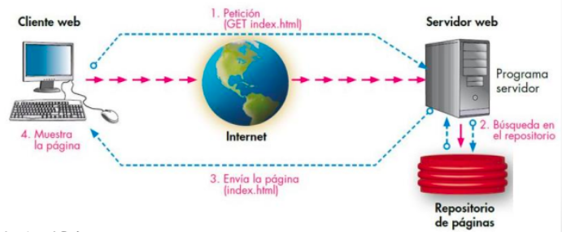
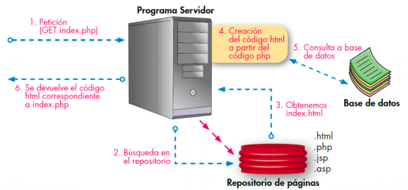

## Introducció al desenvolupament d'aplicacions web

Las aplicacions web es basen en el **model client-servidor**. El client inicia el procés amb una sol·licitud al servidor que genera un missatge de resposta. Ambdos es comuniquen utilitzant un protocol comú. En el cas del servidors web, els clients solen ser navegadors els que realitzen peticions, i estos responen amb la pàgina web sol·licitada o amb un missatge d'error.

La comunicació es realitza mitjançant els protocols HTTP (80) o HTTPS (553), i on la **capa de presentació** s'executa en el navegador, la **capa de negoci** al servidor i la **capa de dades** en el servidor de base de dades.  

### Generació dinàmica de pàgines web 

El llenguatge bàsic és el HTML. Si el contingut no varia estariem parlant de **pàgines estàtiques**. Quan s'utilitza un llenguatge de programació al servidor tindrem **pàgines dinàmiques** i es poden generar diferentes respostes segons l'usuari connectat,el navegador amb el qual s'accedisca, les accions anteriors dels usuaris o les peticions de l'usuari. Encara que estariem parlant de diferents llenguatges de programació, la resposta que genera el servidor ha de ser una pàgina entendible pel navegador, en llenguatge **HTML**.

###### Esquema de funcionamient

##### Execució de codi

Hi ha dos tipus de codi que fan una web dinàmica:

* El que s’executa en el navegador (front-end). Típicament javascript i els seus derivats.
* El que s’executa en el servidor (back-end).
* També hi han models híbrids on s'obtenen dades del servidor des del codi javascript utilitzant peticions AJAX.

#### Llenguatges de programació en entorns servidor

* PHP: El més estés. Normalment s'executa com un mòdul al servidor. Es fàcil i barat trobar allotjaments que l'oferisquen.
* JSP: La versió de Java per a la web. Li cal un contenidor web.
* ASP.NET: Integrada en la plataforma de microsoft .NET
* Ruby: Molt apreciat per els desenvolupadors web.
* GO: La versió de google de phyton.
* Phyton: El més popular.
* NodeJS: Utilitza Javascript.

A més tenim frameworks associats. (Laravel, Symphony, Ruby on Rails, Django)

Quins criteris utilitzariem a l'hora de triar un llenguatje per a fer un lloc web.

* Com és el lloc web.
* Com esperem que siga el creixement.
* Com necesitem que siga de ràpida.
* Qué serà més prevalent el back-end o el front-end.
* Quin llenguatge coneixem.
* On l'allotjarem.
* Quin suport tindrem.
* Quins components tindrem.
* Quina actualització tindrem.

[Comparació de llenguatges](https://www.codementor.io/@iliawebdev/top-programming-languages-for-web-development-in-2021-1hzczfuoei)

[Criteris per apendre un llenguatge de programació](https://blog.educacionit.com/2018/04/10/4-criterios-para-elegir-tu-primer-lenguaje-de-programacion/)

## Instal·lació de l'entorn de desenvolupament

Pera fer correr les aplicacions de servidor ens cal, com a mínim, un **servidor web**, l'interpret de **php** i un **motor de base de dades**. Hem de distinguir l'**entorn de desenvolupament**, on anem a programar i mantindre la nostra aplicació, de l'**entorn de producció**, on anem a executar-la.
Normalment el primer depén de nosaltres mentre que el segon pot dependre de l'empresa on s'allotjarà la nostra web.

* Podem optar per qualsevol solució **LAMP** (Linux, Apache, Mysql, PHP). Als que haurem d'afegir, una vegada els projectes es facen grans **composer, git i les opcions de la part de client**.
* Podem optar per una màquina virtual ja configurada. 
* Podem optar per una solució docker.

La primera solució és senzilla d'implementar però no hauria de ser la nostra primera opció per:

* Estem possant en marxa en la nostra màquina una sèrie de servicis que normalment no fariem, baixant el rendiment de la màquina i obrint vulnerabilitats.
* Si treballem en grup, les instal·lacions i el funcionament no són iguals, depenen del sistema operatiu que té instal·lat cadascú. Allò que li funciona a ú  pot ser no li funciona a un altre. Això és inevitable quan el projecte es complica i es perd molt de temps.
* Passa el mateix quan passem a l'entorn de producció.

 
La segona solució soluciona els dos primers problemes, doncs tots els desenvolupadors poden tindre virtualitzada, la mateixa màquina. Encara que si la màquina no la fem nosaltres sinó que utilitzem alguna ja configurada (vagrant) o si ens cal instal.lar alguna cosa més, ho hauria de fer tot l'equip. 

Així tindriem les següents desaventatges:

* A l'instal·lar una maquina virtual sencera ocupa recursos del sistema.
* La màquina instal·la més coses de les necessàries habitualment.
* No reprodueix l'entorn de producció.

Pot ser molt útil, per exemple, quan la fem servir per desenvolupar en un framework, que ja ve configurat per fer-lo funcionar inmediatament i amb totes les característiques instal·lades. I nosaltres l'utilitzarem quan vejam el framework laravel.

La tercera opció té les següents característiques:

* Al principi és més difícil de possar en funcionamet ja que calen coneixements de docker.
* Tots els desenvolupadors comparteixen entorn encara que utilitzen màquines o sistemes operatius diferents.
* Si hi ha algun canvi de configuració de l'entorn és fácilment transladable a tots els desenvolupadors.
* Es poden crear tants entorns  de desenvolupament com projectes diferents hi hajen.
* Els contenidors ocupen pocs recursos.
* Els projectes es poden possar en producció utilitzan una solució docker de manera inmediata.

L'utilitzarem per a vore php.

### Instal·lació de Docker

La instal·lació de docker dependrà del sistema operatiu que estem utilitzant. Ací anem a vore la que efecturan els que utilitzen linux, amb el sistema operatiu linux-mint o ubuntu , que és el que ve instal·lat en les imatges suministrades. Per a mac o windows s'haurà de mirar la pàgina web de [docker](https://www.docker.com/get-started)

Ens donem privilegis

~~~
sudo su
~~~

Utilitzant els repositoris de docker l'instal·lem:

~~~
echo "deb [arch=amd64] https://download.docker.com/linux/ubuntu focal stable" | tee /etc/apt/sources.list.d/docker.list

curl -fsSL https://download.docker.com/linux/ubuntu/gpg | apt-key add -

apt update

apt install docker-ce docker-ce-cli containerd.io pigz
~~~

Donem permisos a l'usuari afegint-lo al grup de docker

~~~
usermod -aG docker $USER
~~~
On $USER és el teu usuari.

També haurem d'instal·lar el docker-compose

~~~
curl -L "https://github.com/docker/compose/releases/download/1.26.1/docker-compose-$(uname -s)-$(uname -m)" -o /usr/local/bin/docker-compose

chmod +x /usr/local/bin/docker-compose
~~~

I provem

~~~
docker --version
~~~

Faltarà engegar el servei de docker per a poder executar contenidors

~~~
sudo systemctl start docker.service
~~~

### IDE: PHPSTORM

#### Instal.lació

Podem fer-ho de manera automàtica utilitzant snap. Per fer-ho amb linux-mint

~~~
sudo rm /etc/apt/preferences.d/nosnap.pref
sudo apt update
sudo apt install snapd
sudo snap install phpstorm --classic
~~~

També es pot instal·lar baixant-se el paquet de la pàgina web.

####  Llicència

Podeu sol·licitar una llicència a igomis@cipfpbatoi.es

### ALTRES EINES IMPRESCINDIBLES

#### GIT

El git ens permet control·lar les versions del nostre programari. 

#### COMPOSER

El composer és una ferrament molt útil per a incorporar paquets de tercers a les nostres aplicacions i per a ordenar el nostre projecte dins d'un espai de noms i així control.lar les depedències entre fitxers.
Poden trobar la [documentació](https://getcomposer.org/) en la seua pàgina web.

Per començar cada vegada que en baixe un projecte i el pose en marxa, hauré d'executar el composer per baixar els paquets associats.

#### GITHUB

Està ferramenta online ens permet possar al núvol els nostres projectes, compartint-los, permet el treball en equip i ens servirà per a la correció dels treballs.

#### GitHub Classroom

Us podeu [registrar](https://classroom.github.com/)

**Metodologia de treball amb el github classroom**

* Se proporcionarà a l'alumnat un enllaç amb la invitació.
* Accedint a l'enllaç a cada alumne se li crearà un repositori individual en l'organització.
* L'alumnat treballa en el seu repositori assignat. Se'l pot baixar per treballar en local.
* Inicialment, l'alumne crea una branca nova sobre la que va a treballar.
* Quan vullga sol.licitar ajuda o revisió del professor, l'alumne genera una pull request a la branca principal del seu repositori en la que cita al professor per tal que reba una notificació.
* El profesor proporciona retroalimentació mitjançant comentaris en la pull request o en un determinat commit individual.
* Opcionalment es poden utilitzar els issues y les cites d'usuari per sol·licitar la intervenció del profesor.
* Quan l'alumne finalitza la tasca, genera una últim pull request
* El profesor revisa la pull request i opcionalment fa comentaris.

**Posada en marxa d'un repositori en el IDE**

* Es clona el repositori en un directori
* Es canvia el .env.example a .env
* Es canvia la variable BASE_DIRECTORY del .env al directori utilitzat
* Es posa en marxa els contenidors amb **sh start.sh**
* La primera vola s'executa el composer amb **sh composer.sh**

Nota: Al principi de curs es canviarà el /etc/hosts per afegir la linea

> 127.0.0.1 batoi2021.my
