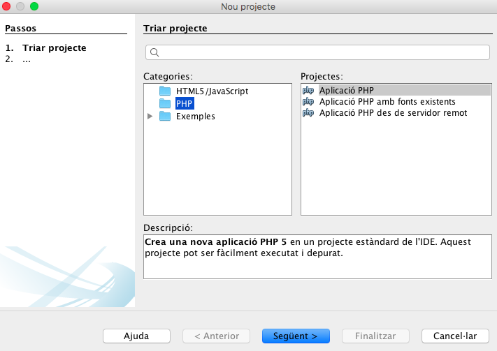
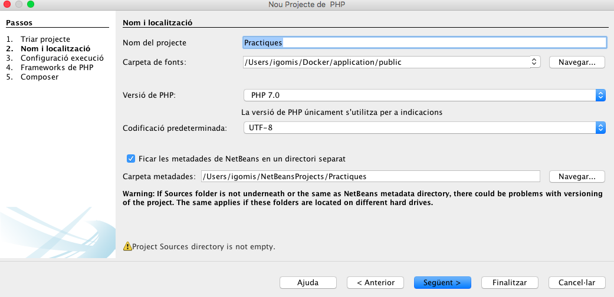
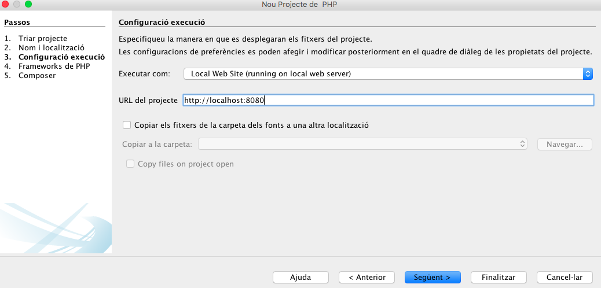

## Introducció al desenvolupament d'aplicacions web

Las aplicacions web es basen en el **model client-servidor**. El client inicia el procés amb una sol·licitud al servidor que genera un missatge de resposta. Ambdos es comuniquen utilitzant un protocol comú. En el cas del servidors web, els clients solen ser navegadors els que realitzen peticions, i estos responen amb la pàgina web sol·licitada o amb un missatge d'error.

La comunicació es realitza mitjançant els protocols HTTP (80) o HTTPS (553), i on la **capa de presentació** s'executa en el navegador, la **capa de negoci** al servidor i la **capa de dades** en el servidor de base de dades.  

### Generació dinàmica de pàgines web 

El llenguatge bàsic és el HTML. Si el contingut no varia estariem parlant de **pàgines estàtiques**. Quan s'utilitza un llenguatge de programació al servidor tindrem **pàgines dinàmiques** i es poden generar diferentes respostes segons l'usuari connectat,el navegador amb el qual s'accedisca, les accions anteriors dels usuaris o les peticions de l'usuari. Així i tot la resposta quen genere el servidor serà una pàgina entendible pel navegador, en llenguatge **HTML**.

###### Esquema de funcionamient

##### Execució de codi

Hi ha dos tipus de codi que fan una web dinàmica:

* El que s’executa en el navegador (front-end)
* El que s’executa en el servidor (back-end)
* També hi han models híbrids on s'obtenen dades del servidor des del codi javascript utilitzant peticions AJAX

#### Llenguatges de programació en entorns servidor

* PHP: El més estés. Normalment s'executa com un mòdul al servidor.
* JSP: La versió de Java per a la web. Li cal un contenidor web.
* ASP.NET: Integrada en la plataforma de microsoft .NET
* Ruby: Molt apreciat per els desenvolupadors web.

A més tenim frameworks associats. (Laravel, Symphony, Ruby on Rails, Django)

## Instal·lació de l'entorn de desenvolupament

Pera fer correr les aplicacions de servidor ens cal, com a mínim, un **servidor web**, l'interpret de **php** i un **motor de base de dades**. Hem de distinguir l'**entorn de desenvolupament**, on anem a programar i mantindre la nostra aplicació, de l'**entorn de producció**, on anem a executar-la.
Normalment el primer depén de nosaltres mentre que el segon pot dependre de l'empresa on s'allotjarà la nostra web.

* Podem optar per qualsevol solució **LAMP** (Linux, Apache, Mysql, PHP). Als que haurem d'afegir, una vegada els projectes es facen grans composer, git i les opcions de la part de client.
* Podem optar per una màquina virtual ja configurada. 
* Podem optar per una solució docker.

La primera solució pot és senzilla d'implementar però no hauria de ser la nostra primera opció per:

* Estem possant en marxa en la nostra màquina una sèrie de servicis que normalment no fariem, baixant el rendiment de la màquina i obrint vulnerabilitats.
* Si treballem en grup, les instal·lacions i el funcionament no són iguals, depenen del sistema operatiu que té instal·lat cadascú. Allò que li funciona a ú  pot ser no li funciona a un altre. Això és inevitable quan el projecte es complica i es perd molt de temps.
* Passa el mateix quan passem a l'entorn de producció.

 
La segona solució soluciona els dos primers problemes, doncs tots els desenvolupadors poden tindre virtualitzada, la mateixa màquina. Encara que si la màquina no la fem nosaltres sinó que utilitzem alguna ja configurada (vagrant), si ens cal instal.lar alguna cosa més, ho hauria de fer tot l'equip. Sobre la tercera opció de l'avantatge de la seua facilitat d'instal·lament i com a desaventatges:

* A l'instal·lar una maquina virtual sencera ocupa recursos del sistema.
* La màquina instal·la més coses de les necessàries habitualment.
* No reprodueix l'entorn de producció.

Pot ser molt útil, per exemple, quan la fem servir per desenvolupar en un framework, que ja ve configurat per fer-lo funcionar inmediatament i amb totes les característiques instal·lades. I nosaltres l'utilitzarem quan vejam el framework laravel.

La tercera opció té les següents característiques:

* Al principi és més difícil de possar en funcionamet ja que calen coneixements de docker.
* Tots els desenvolupadors comparteixen entorn encara que utilitzen màquines o sistemes operatius diferents.
* Si hi ha algun canvi de configuració de l'entorn és fácilment transladable a tots els desenvolupadors.
* Es poden crear tants entorns  de desenvolupament com projectes diferents hi hajen
* Els contenidors ocupen pocs recursos.
* Els projectes es poden possar en producció utilitzan una solució docker de manera inmediata.

L'utilitzarem per a vore php.

### Instal·lació de Docker

La instal·lació de docker dependrà del sistema operatiu que estem utilitzant. Ací anem a vore la que efecturan els que utilitzen linux, amb el sistema operatiu linux-mint o ubuntu , que és el que ve instal·lat en les imatges suministrades. Per a mac o windows s'haurà de mirar la pàgina web de [docker](https://www.docker.com/get-started)

Utilitzant els repositoris de docker l'instal·lem:

~~~
echo "deb [arch=amd64] https://download.docker.com/linux/ubuntu focal stable" | sudo tee /etc/apt/sources.list.d/docker.list
curl -fsSL https://download.docker.com/linux/ubuntu/gpg | sudo apt-key add -
sudo apt update
sudo apt install docker-ce docker-ce-cli containerd.io pigz
~~~

Donem permisos a l'usuari afegint-lo al grup de docker

~~~
sudo usermod -aG docker $USER
~~~

També haurem d'instal·lar el docker-compose

~~~
sudo curl -L "https://github.com/docker/compose/releases/download/1.26.1/docker-compose-$(uname -s)-$(uname -m)" -o /usr/local/bin/docker-compose
sudo chmod +x /usr/local/bin/docker-compose
~~~

I provem

~~~
docker --version
~~~

#### Composer per visibilitzar les errades 

El composer és una ferrament molt útil per a incorporar paquets de tercers a les nostres aplicacions i per a ordenar el nostre projecte dins d'un espai de noms i així control.lar les depedències entre fitxers.

Per començar anem a instal.ar en els nostres projectes el bootstrap i un gestor d'errades, que ens facilitarà el saber on i perquè el nostre codi està malament. A més indicarem un fitxer on possarem les funcions que volem accesibles des de tots el fitxers del nostre projecte.

Ens situem,dins del homestead, al directori d'inici del nostre projecte i iniciem el composer

~~~
cd /home/vagrant/code/intranet
composer init
~~~

Acò ens crea un fitxer composer.json que anem a modificar per tal que es quede de la següent manera:

~~~
{
    "require": {
        "filp/whoops": "^2.4",
        "twbs/bootstrap": "^4.3"
    },
    "autoload": {
        "files": [
            "Helpers/myHelpers.php"
        ]
    }
}
~~~

Després fem

~~~
composer update
~~~

que ens crea un directori vendor on instal.la els paquets externs i un fitxer
**autoload.php** que haurem d'importar en tots els nostres fitxers.

~~~
<?php
require dirname(__FILE__) . "/../vendor/autoload.php";
$whoops = new \Whoops\Run;
$whoops->pushHandler(new \Whoops\Handler\PrettyPageHandler);
$whoops->register();
?>
~~~

#### Entorns de desenvolupament
El millor per a PHP és el PHPStorm, que és de pagament encara que podeu conseguir una licència gratuita per ser estudiants. Mentre el sol.licteu podeu continuar amb el netBeans.

#### Configuració netbeans

A l'hora de crer un nou projecte haurem de seleccionar les següents opcions

### Instal·lació laravel/homestead

Als ordinadors d'aula està instal.lada la màquina laravel/homestead que requerix del vagrant per a poder correr. L'instal.lacio la podeu consultar en la pàgina oficial de [laravel](https://laravel.com/docs/7.x/homestead). 
Està maquina ja té tots els paquets instal.lats per a funcionar ràpidament. Si tenim el vagrant instal.lat és molt senzill fer-la còrrer en el sistema de virtualització que tenim al nostre equip.

~~~
vagrant box add laravel/homestead
git clone https://github.com/laravel/homestead.git ~/Homestead
cd ~/Homestead
bash init.sh
~~~

Ara hem de configurar el nostre equip per a sincronitzar-lo amb el homestead. Primer crearem un directori **code** on aniran el codi de les nostres apliacions web. I després crearem els directoris del nostres projectes. 

* Crearem un directori intranet i dins un public, que és on tindrem el fitxers accessibles del nostre projecte.

~~~
cd
mkdir code
cd code
mkdir intranet
cd intranet
mkdir public
~~~

Ara anem a dir-li a la màquina homestead on estan els nostres fitxers i quin domini serà el que ha de crear. Per tal de fer-ho tenim in fitxer dins del directori Homestead, anomenat **Homestead.yaml** on l'apartat folders ha de quedar:

~~~
folders:
    - map: ~/code
      to: /home/vagrant/code
~~~

i l'apartat sites:

~~~
sites:
    - map: intranet.my
      to: /home/vagrant/code/intranet/public
~~~

Per últim haurem de afegir una entrada en el fitxer /etc/hosts amb el domini creat:

~~~
192.168.10.10  intranet.my
~~~

#### Possada en funcionament de la màquina virtual.

Per arrancar la màquina virtual hem d'anar al directori Homestead i executar:

~~~
vagrant up
~~~

I per connectar-se a una consola en la màquina virtual

~~~
vagrant ssh
~~~

I per apagar la màquina

~~~
vagrant halt
~~~

#### Base de dades

El homestead incorpora el mysql en el port 33060 i el postgreSQL en el 54320.
El nom d'usuari i el password són homestead / secret per als dos.

Si volem instal.lar el phpmyadmin ho haurem de fer des de la consola de la màquina virtual

~~~
sudo apt-get update
sudo apt-get install phpmyadmin
~~~

Després haurem de crear un enllaç símbolic a un directori dins del directori code i crear un lloc web especific per accedir des del navegador

~~~
sudo ln -s /usr/share/phpmyadmin/ /home/vagrant/code/phpmyadmin
serve my.my /home/vagrant/code/phpmyadmin
~~~

i afegir al /etc/host de la màquina física el domini creat (ja està fet als ordinadors d'aula)

~~~
192.168.10.10   my.my
~~~

