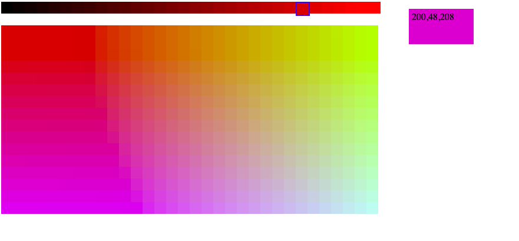

## Activitat 2.5. Recuperació

* Desarrolla un script que muestre una cinta horizontal con degradado de color rojo (Desde negro rgb(0,0,0) hasta rojo(255,0,0) en saltos de 8. Cada color ha de ser un enlace al mismo script, que mostrará una tabla con el componente rojo seleccionando variando el color verde y el azul de forma similar a como se hizo con el rojo. Cada color de la tabla será un enlace al mismo script, que mostrará un cuadro más grande con el color seleccionado. (2p)

	Por tanto:
Si se ejecuta color.php sin parámetros, muestra la cinta de variación del rojo
Si se ejecuta color.php?r=120 muestra la cinta del rojo y una tabla variando el verde y el azul, con el rojo fijo a 120
Si se ejecuta color.php?r=120&v=210&a=90 se muestra la cinta, la tabla y un cuadrado relleno con color 120,210,90

~~~
		
~~~

* Desarrolla un script PHP de alta de usuarios en una web, que solicite: (2p)

		nombre de usuario
		Edad
		email
		Sexo
		Observaciones
		Contraseña deseada (campo tipo password)
		Un checkbox de "Acepto las condiciones ....."
	
	Al enviar los datos se validan, y si son correctos se muestra el mensaje "Datos correctos. Usuario dado de alta". Si no lo son, se muestra de nuevo el formulario con los valores introducidos para corregirlos y los mensajes de error. Las validaciones a hacer son: 
	
		El nombre de usuario es requerido
		La edad es numérica entre 1 y 100
		La contraseña ha de tener al menos 6 caracteres 
		El email ha de ser correcto (vale con comprobar que lleva una @)
		Se ha marcado la casilla de aceptación de condiciones

* Desarrolla un script PHP que solicite: (2p)
		* El importe bruto de una factura
		* El % de IVA con un desplegable de los tipos vigentes
		* El % de descuento a aplicar
		* Si se aplica o no el recargo de equivalencia (con un checkbox)

	Al enviar los datos, muestra el cálculo del total de la siguente forma:
		
		Importe Bruto 1000,00 
		10% Dto -100,00 
		21% IVA 189,00
		4% Rec.Equiv 36,00
		Total Factura 1125,00
			
	Si una linea tiene importe 0 no debe mostrarse (no hay descuento, por ejemplo)
	Hay que validar :
	
		El importe bruto es requerido y es númerico
		El % de descuento, si lo hay, es numérico entre 0 y 99