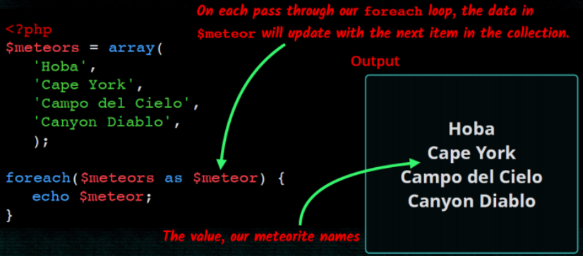
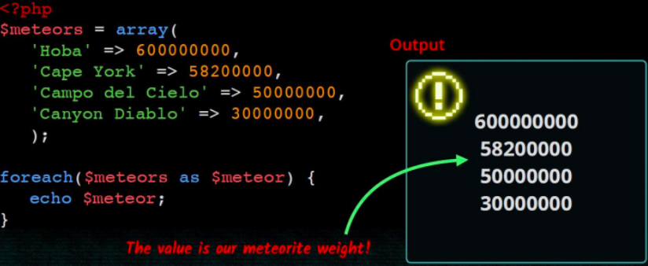
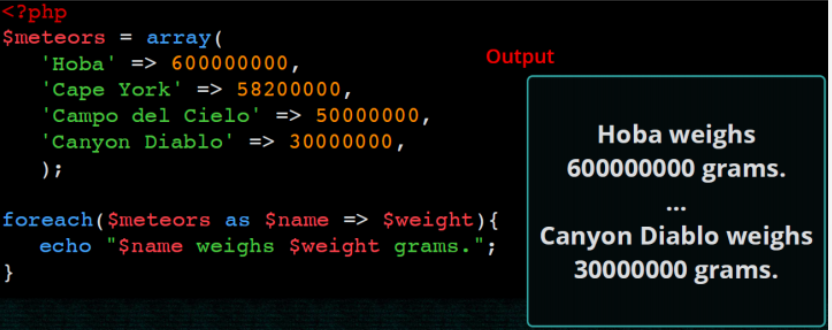
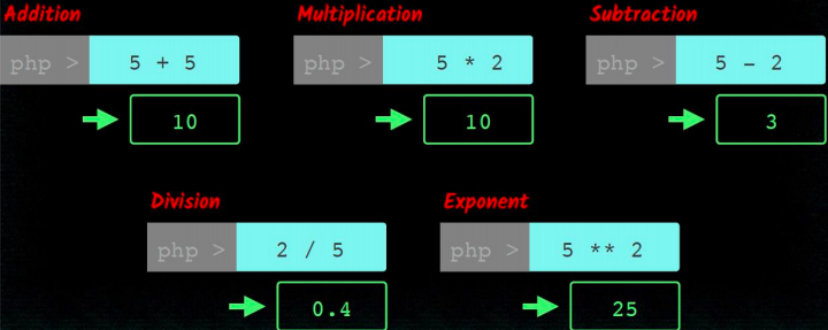
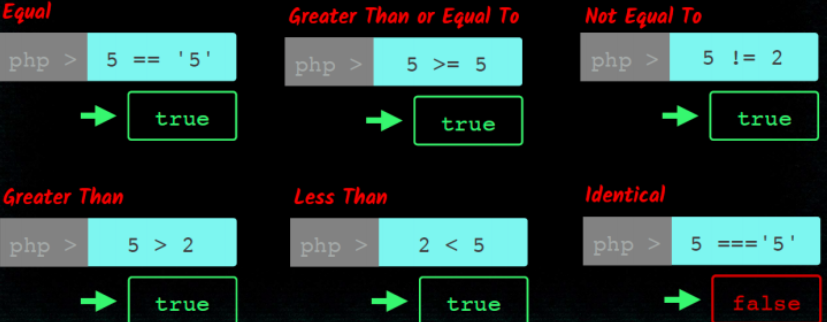
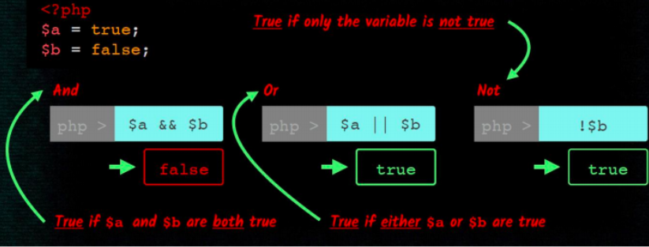
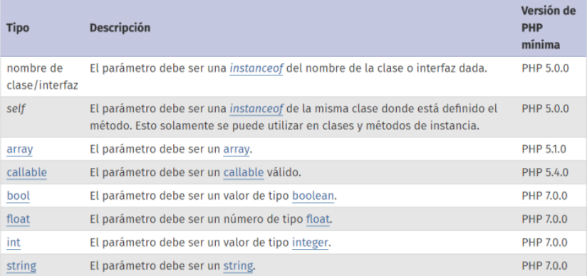

# Introducció al llenguatge PHP.
	
El llenguatge PHP és flexible i permiteix programar xicotets scripts rapidament. La sintaxi és semblant a JAVA i C, encara que requereix meyns codi. 
	
Taula de continguts

* [PHP i HTML. Codi incrustat](#php-i-html)
* [Variables i tipus de dades](#variables)
	* [Tipus de dades](#tipus-de-dades-en-php)
	* [Comentaris](#comentaris)
	* [Estructures de control de flux](#estructures-de-control-de-flux)
	* [Operadors](#operadors)
* [Separar la lògica de la presentació](#separar-la-lògica-de-la-presentació)
* [Cadenes de text](#cadenes-de-text)
* [Arrays](#arrays)
* [Funcions i llibreries](#funcions-i-llibreries)


## PHP i HTML 

### Codi incrustat

El documents que contenen codi php s'han d'anomenar amb l'extensió **.php**

#### El nostre primer codi PHP 
[Video](https://youtu.be/hsITH9fpfFQ)

* El codi php sempre va entre els simbolos **<?php** y **?>**.
* Les instruccions php acaben sempre amb ;
* Per a generar codi html des de php podem utilitzar el mètode echo passant-li el text del codi que volem generar.
* El codi pot anar entre les etiquetes de \<html>

```php
<html>
<head></head>
<body>
	<h1><?php echo 'Hola món' ?></h1>
<body>
```

* També podem utilitzar l'etiqueta **<?=** fa el echo al mateix temps.

```php
<html>
<head></head>
<body>
	<h1><?= Hola món ?></h1>
<body>
```


### Comentaris

* De bloc entre /* i */
* De linea començant per // o per #


## Variables 

 
Una de les característiques de php és que és un llenguatge **no fortament tipat**. De fet no cal declarar la variable ni indicar el tipus de dades si la declare. Encara que si volem codi de qualitat ho hauriem de fer.

#### Declaració 

* Els noms de les variables sempre comencen per **$** 
* Després del $ els noms de les variables han d'anar seguits per una lletra o el caràcter _ i poden contenir també números. 
* No és necessari declarar una variable ni especificar-li un tipus (sencer, cadena,...) concret.

Per crear una variable que continga el text a generar i mostrar-la:

```php
<html>
<head></head>
<body>
	<h1>
	<?php 
		$salutacio = 'Hola món';
		echo $salutacio; 
	?>
	</h1>
<body>
```

#### Tipus de les variables

* El tipus de la variable es decideix en funció del context en què s'utilitze.
* En assignar-li el valor 7, la variable és de tipus “sencer” 

```php
$la_meua_variable = 7;  // ara és un número
$la_meua_variable = "set"; // ara és cadena
```

Si li canviem el contingut passa a ser de tipus “cadena”

##### Variable no inicialitzades

Si s'intenta utilitzar una variable abans d'assignar-li un valor, es genera un error de tipus **E_NOTICE** però no s'interromp l'execusió de l'script. L'eixida mostrarà un avís cada volta que s'intente.
 
##### Constants

Per a definir variables utilitze **define()**, que reb el nom de la constant i el valor que li volem donar

```php
define("LIMITE",1000);
```

És habitual i una bona pràctica, utilitzar identificadors en **majuscules** per a les constants.

#### [Tipus de dades](https://www.php.net/manual/es/language.types.php) en PHP

* booleà (**boolean**). Els seus possibles valors són true i false. A més, qualsevol nombre enter es considera com true, excepte el 0 que és false.
* sencer (**integer**). Qualsevol nombre sense decimals. Es poden representar en format decimal, octal (començant per un 0), o hexadecimal (començant per 0x).
* real (**float**). Qualsevol nombre amb decimals. Es poden representar també en notació científica.
* cadena (**string**). Conjunts de caràcters delimitats per cometes simples o dobles.
* vector (**array**). Conjunt de variables del mateix tipus ordenades.
* Objecte (**object**). Utilitzat per les instàncies de classes.
* [**null**](<http://php.net/manual/es/language.types.null.php>). És un tipus de dades especial, que s'usa per a indicar que la variable no té valor.


#### Àmbit de les variables

L'àmbit d'una variable és la part del codi en que és visible. Una variable declarada en un fitxer de PHP està disponible en eixe fitxer i en els que l'incloguen.
Les funcions definixen un àmbit local, separat de la resta del codi.
Es poden definir variables globlals amb la paraula reservada **global**, encara que no són aconsellables.


#### Variables predefinides
Són variables internes i globals predefinides de PHP que poden usar-se des de qualsevol àmbit. Tomem forma **d'arrays associatius** que contenen un conjunt de valors.

  * **$_SERVER**. Conté informació sobre l'entorn del servidor web i d'execució.
  * **$_GET, $_POST i $_COOKIE** contenen les variables que s'han passat al
script actual utilitzant, respectivament, els mètodes GET (paràmetres en la URL), HTTP POST i Cookies HTTP 
  * **$_REQUEST** junta en un solament el contingut dels tres *arrays anteriors,
$_GET, $_POST i $_COOKIE. 
  * **$_ENV** conté les variables que es puguen haver passat a PHP des de l'entorn en què s'executa. 
  * **$_FILES** conté els fitxers que es puguen haver pujat al servidor utilitzant el mètode POST. 
  * **$_SESSION** conté les variables de sessió disponibles per al guió actual.

<http://es.php.net/manual/es/language.variables.superglobals.php>

#### Expansió de variables

* Podem introduir una variable dins d'un text sempre que usem les cometes dobles per a delimitar el text. Açò farà que el contingut de la variable s'expandisca i es concatene amb el text existent en la cadena.

```php
echo "<p>Mòdul: $module</p>"
```

* A voltes, és necessari envoltar-la entre claus

```php
echo "<p>Mòdul: {$module}DAW</p>"
```

* Si no posàrem les claus l'intèrpret cercaria una variable que es cride $moduleDAW


## Separar la lògica de la presentació

[Video](https://youtu.be/wb4l-ZV5TlU)

Quan estem programant, sempre hem de fer que cada fitxer, classe, funció ... s'encarregue d'una sola cosa. La més clara és separem la lògica del programa (en el nostre cas en php) de la presentació a l'usuari (majoritariament amb codi html). 
Per a poder separar estes dos funcions en calen sentències per incloure fixers.

### Sentències per a incloure Fitxers

Les sentències **include()** i **include_once()** i **require()** i **require_once()** inclouen i avaluen l'artxiu especificat. **include_once()** i **require_once()**  verifica que l'arxiu no haja sigut inclòs abans i és preferible a include. Cal ser curòs amb el path de l'arxiu a incloure. La diferència entre require i include és el tractament de l'error quan el fitxer no existeix.

```php
fruites.php
<?php

$color = 'verde';
$fruta = 'manzana';
include('fruite.view.php')

?>
```

```html
fruites.view.php

<html>
<head>
<title>Fruites</title>
</head>
<body>
	<h3>
 		<?= "Una $fruta $color" ?> 
 	</h3>		
</body>
</html>
```

## Arrays


[Video](https://youtu.be/pwsaZIjney0)

Un array és un tipus de dades que ens permet emmagatzemar diversos valors.Per tal d'accedir a un valor utilitzarem una *clau*. Les claus poden ser nombres o textos (*arrays associatius*).Si no indiquem cap clau, a cada element se li associarà una clau numèrica correlativa.

### Crear array

* Podem crear un array buit de dues formes:

```php
$noms = array();
$noms = [];
``` 

* Si volem assignar valors al array en el moment de crear-ho: 

```php
$noms = array('Sandra', 'Pedro', 'Andrea'); 
$noms = ['Sandra', 'Pedro', 'Andrea'];
```

#### Mostrar el contingut d'un array

Si intentem mostrar el contingut d'un array amb **echo** no obtindrem  les dades que hi ha dins del array. En lloc d'açò podem utilitzar la funció print_r: 

```php
print_r($noms);
```

Però si necessitem donar-li format als continguts del array, haurem de recórrer-ho amb un bucle i anar mostrant element a element.

#### Afegint elements al array

Podem afegir elements al array utilitzant claudàtors buits. La clau d'aquests elements serà el següent índex numèric disponible.

```php
$noms[] = 'Raul'; $noms[] = 'Marta';
```

#### Accedir als elements del array

Accedirem als elements del array indicant la clau de l'element entre claudàtors:

```php
echo $noms[2];
```

 També podem modificar el seu valor:

```php
$noms[0] = 'Sara';
```
#### Recórrer arrays



### Arrays associatius

[Video](https://youtu.be/FIUBcebp2vQ)

Si el array conté dades diverses i/o ens interessa accedir a ells amb claus més específiques que un simple índex numèric podem utilitzar arrays associatius: 

```php
$alumne  = array('nom' => 'Sara', 'cognom' => 'García', 'edat' => 22 );
$alumne = ['nom' => 'Sara', 'cognom' => 'García', 'edat' => 22 ];
$alumne['nom'] = 'Verónica';
echo $alumne['nom'];
```
#### Recórrer arrays associatius



#### Recórrer claus i valors



#### Arrays multidimensionals
Imagina que volem tenir un array els elements del qual són noms d'esports. Volem dividir-los en esports d'hivern i esports d'estiu. Podem crear un array esports que continga dos elements que al seu torn també seran arrays.

```php
$esports = ['hivern' => ['esquí de fons', 'hoquei sobre gel'], 'estiu' => [ 'natació', 'voley platja'] ];
```

Per a accedir al primer esport d'hivern:

```php
echo $esports['hivern'][0];
```

#### Funcions d'arrays

* Podem consultar-les en <http://es.php.net/manual/es/ref.array.php>

## Cadenes de text

[Video](https://youtu.be/1dbh545zNL4)

* Podem utilitzar tant cometes simples com a cometes dobles.
* Per a concatenar cadenes utilitzarem l'operador punt (.)

```php
 $fullName = $name.' '.$surnames;
```


#### Funcions de cadenes

Pots consultar-les en <http://es.php.net/manual/es/ref.strings.php> (no té sentit enumerar-les una a una)


## Operadors  

#### Operadors Aritmètics



#### Operadors de Cadena

El **.** concatena dos cadenes

#### Operadors d'asignació

El **=** s'utilitza per asignar un valor a una variable. També es poden combinar amb els operadors aritmètics com l'exemple

**$a += $b** equival a **$a = $a + $b**

**$a -= $b** equival a **$a = $a - $b**

#### Operadors de comparació



#### Operadors lògics



#### Operador ternari

Funciona com un condicional **condició ? valor si true : valor si false** i que es pot simplificar ** condició	

<https://www.php.net/manual/es/language.operators.php>

## Estructures de control de flux
* Les instruccions de control de flux en PHP funcionen exactament igual que en altres llenguatges de programació.

* Les més habituals són:

  * Condicionals: if, if else, switch 
  * Bucles: while, do while, for

seguint les estructures:

```php
if (condició) {
	// instruccions
}
else {
	// instruccions
}
```
```php
switch ($variable) {
	case valor:
		//instruccio1
		break;
	case valor:
		//instruccio1
		break;
	default:
		//instruccio1
}			
```
```php
while (condició) {
	//instruccions
}
```
```php
do {
	//instruccions
} while (condició);
```
```php
for ($i=1;$i<10;$i++){
	//instruccions
}
```


<http://php.net/manual/es/language.control-structures.php>


## Funcions i llibreries

#### Funcions predefinides

* **is_null($var)** determina si una variable és nula o no.
* **isset($var)** determina si una variable estan definida i no és NULL.
* **unset($var)** destrueix les variables especificades.
* **empty($var)** torna **true** si no existeix o és **FALSE**
* **is_int($var)**, **is_float()**, **is_bool()**, **is_array()**
* **var_dump($var)** mostra informació de la variable.

#### Funcions definides per l'usuari

Per a crear les teues pròpies funcions, hauràs d'usar la paraula **function**:

```php
function suma($a, $b){ return $a + $b; }
```

Per tal d'invocar la funció:

```php
$resultat = suma(5, 7);
```

Si una funció no té una sentència **return**, retorna **null** en finalitzar.

#### Valors per defecte en els paràmetres

* Podem indicar valors per defecte per als paràmetres. Si quan cridem a la funció no indiquem el valor d'un paràmetre es prendrà el valor per defecte indicat.

```php
function preuAmbIva($preu, $iva=0.21){
	return $preu * (1 + $iva);
}
$preu = 10;
$pIva = preuAmbIva($preu);
```

* Pot haver-hi més d'un paràmetre amb valor per defecte, però sempre han d'estar al final.

#### Pas de paràmetres per referència

Per defecte els paràmetres es passen per valor. Per a passar un paràmetre per referència afegirem el símbol **&** davant del seu nom.

```php
function preuAmbIva(&$preu, $iva=0.18){
	$preu *= (1 + $iva);
}
```

#### Declaracions de tipus (Type Hinting)

Les funcions obliguen al fet que els paràmetres siguen de cert tipus. Si el valor donat és d'un tipus incorrecte, es generarà un error. Per això s'ha d'anteposar-se el nom del tipus al nom del paràmetre. Es pot fer que una declaració accepte valors **NULL** si el valor predeterminat del
paràmetre s'estableix a NULL.

#### Tipus vàlids



#### Exemple

```php
function suma(int a, int b):int
{
	return $a + $b;
}
$resultado = suma(3,5);
```

#### Funcions com a paràmetres

En PHP és possible passar funcions com a paràmetres a altres funcions. Només cal passar el nom de la funció entre cometes. 
Exemple:

```php
 function calculator($operation,$numA,$numB){
	return $operation($numA,$numB); }
function sumar($a,$b) { return $a+$b; }
function restar($a,$b) {return $a-$b; }

$a=4;$b=6;
echo calculator('sumar',$a,$b);
echo calculator('restar',$a,$b);
```

#### Funcions anònimes (**closures**)

* Estan implementades usant la classe **Closure**
* Permeten la creació de funcions que no tenen un nom específic
* Podem assignar la funció a una variable o passar-la com a paràmetre a una altra funció.
* Exemple
  
Sense paràmetres:

```php
$anonima = function () {
echo "Hola"; 
}; 
$anonima();
```

Amb paràmetres:

```php
$anonima = function ($nom) {
echo "Hola {$nom}"; 
}; 
$anonima('Álex');
```

#### Usar variables de l'àmbit superior

* Una funció anònima pot usar variables de l'àmbit superior mitjançant la paraula reservada **use**: 

```php
function saluda(callable $fnSaluda) {
	$fnSaluda('Álex'); 
} 
$salutació = 'Hola'; 
$anonima = function ($nom) use ($salutació) {
	echo "{$salutació} {$nom}"; 
}; 
saluda($anonima);
```

#### Llibreries

Podem fer llibreries de funcions guardant-les en un fitxer que desprès importem des d'on les utilitzem. Ho podem fer amb include, o utilitzant composer per a fer-ho.
