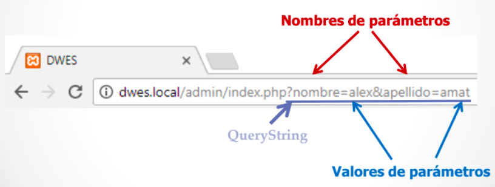
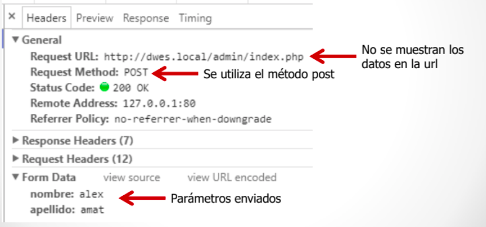

# Introducció al llenguatge PHP.
	
El llenguatge PHP és flexible i permiteix programar xicotets scripts rapidament. La sintaxi és semblant a JAVA i C, encara que requereix meyns codi. 
	
Taula de continguts

* [PHP i HTML. Codi incrustat](#php-i-html)
* [Variables i tipus de dades](#variables)
	* [tipus de dades](#tipus-de-dades-en-php)
* [Comentaris](#comentaris)
* [Estructures de control de flux](#estructures-de-control-de-flux)
* [Operadors](#operadors)
* [Cadenes de text](#cadenes-de-text)
* [Arrays](#arrays)
* [Funcions i llibreries](#funcions-i-llibreries)
* [Incloure fitxers](#incloure-fitxers)
* [Pas de paràmetres](#pas-de-paràmetres)
* [Formularis](#formularis)

## PHP i HTML 

### Codi incrustat

El documents que contenen codi php s'han d'anomenar amb l'extensió **.php**

#### El nostre primer codi PHP
* El codi php sempre va entre els simbolos **<?php** y **?>**.
* Les instruccions php acaben sempre amb ;
* Per a generar codi html des de php podem utilitzar el mètode echo passant-li el text del codi que volem generar.
* El codi pot anar entre les etiquetes de \<html>

```php
<html>
<head></head>
<body>
	<h1><?php echo 'Hola món' ?></h1>
<body>
```

* O podem imprimir etiquetes html amb instruccions de php, i el resultat és el mateix.

```php
<html>
<head></head>
<body>
	<?php echo '<h1>Hola món</h1>'; ?>
<body>
```

### Comentaris

* De bloc entre /* i */
* De linea començant per // o per #


## Variables 

 
Una de les característiques de php és que és un llenguatge **no fortament tipat**. De fet no cal declarar la variable ni indicar el tipus de dades si la declare. Encara que si volem codi de qualitat ho hauriem de fer.

#### Declaració 

* Els noms de les variables sempre comencen per **$** 
* Després del $ els noms de les variables han d'anar seguits per una lletra o el caràcter _ i poden contenir també números. 
* No és necessari declarar una variable ni especificar-li un tipus (sencer, cadena,...) concret.

Per crear una variable que continga el text a generar i mostrar-la:

```php
<html>
<head></head>
<body>
	<h1>
	<?php 
		$salutacio = 'Hola món';
		echo $salutacio; 
	?>
	</h1>
<body>
```

#### Tipus de les variables

* El tipus de la variable es decideix en funció del context en què s'utilitze.
* En assignar-li el valor 7, la variable és de tipus “sencer” 

```php
$la_meua_variable = 7;  // ara és un número
$la_meua_variable = "set"; // ara és cadena
```

Si li canviem el contingut passa a ser de tipus “cadena”

##### Variable no inicialitzades

Si s'intenta utilitzar una variable abans d'assignar-li un valor, es genera un error de tipus **E_NOTICE** però no s'interromp l'execusió de l'script. L'eixida mostrarà un avís cada volta que s'intente.
 
##### Constants

Per a definir variables utilitze **define()**, que reb el nom de la constant i el valor que li volem donar

```php
define("LIMITE",1000);
```

És habitual utilitzar identificadors en majuscules per a les constants.

#### Tipus de dades en PHP

* booleà (**boolean**). Els seus possibles valors són true i false. A més, qualsevol nombre enter es considera com true, excepte el 0 que és false.
* sencer (**integer**). Qualsevol nombre sense decimals. Es poden representar en format decimal, octal (començant per un 0), o hexadecimal (començant per 0x).
* real (**float**). Qualsevol nombre amb decimals. Es poden representar també en notació científica.
* cadena (**string**). Conjunts de caràcters delimitats per cometes simples o dobles.
* vector (**array**). Conjunt de variables del mateix tipus ordenades.
* Objecte (**object**). Utilitzat per les instàncies de classes.
* **null**. És un tipus de dades especial, que s'usa per a indicar que la variable no té valor. (<http://php.net/manual/es/language.types.null.php>)

#### Àmbit de les variables

L'àmbit d'una variable és la part del codi en que és visible. Una variable declarada en un fitxer de PHP està disponible en eixe fitxer i en els que l'incloguen.
Les funcions definixen un àmbit local, separat de la resta del codi.
Es poden definir variables globlals amb la paraula reservada **global**, encara que no són aconsellables.


#### Variables predefinides
Són variables internes predefinides de PHP que poden usar-se des de qualsevol àmbit. Tomem forma **d'arrays associatius** que contenen un conjunt de valors.

  * **$_SERVER**. Conté informació sobre l'entorn del servidor web i d'execució.
  * **$_GET, $_POST i $_COOKIE** contenen les variables que s'han passat al
script actual utilitzant, respectivament, els mètodes GET (paràmetres en la URL), HTTP POST i Cookies HTTP 
  * **$_REQUEST** junta en un solament el contingut dels tres *arrays anteriors,
$_GET, $_POST i $_COOKIE. 
  * **$_ENV** conté les variables que es puguen haver passat a PHP des de l'entorn en què s'executa. 
  * **$_FILES** conté els fitxers que es puguen haver pujat al servidor
utilitzant el mètode POST. 
  * **$_SESSION** conté les variables de sessió disponibles per al guió
actual.

<http://es.php.net/manual/es/language.variables.superglobals.php>

## Operadors  

#### Operadors Aritmètics


#### Operadors de Cadena

El **.** concatena dos cadenes

#### Operadors d'asignació

El **=** s'utilitza per asignar un valor a una variable. També es poden combinar amb els operadors aritmètics com l'exemple

**$a += $b** equival a **$a = $a + $b**

**$a -= $b** equival a **$a = $a - $b**

#### Operadors de comparació


#### Operadors lògics


#### Operador ternari

Funciona com un condicional **condició ? valor si true : valor si false** i que es pot simplificar ** condició	

<https://www.php.net/manual/es/language.operators.php>

Farem alguns **exercicis**: [Exercisi 2.0 Conceptes bàsics](2.0.Activitat.md)

## Estructures de control de flux
* Les instruccions de control de flux en PHP funcionen exactament igual que en altres llenguatges de programació.

* Les més habituals són:

  * Condicionals: if, if else, switch 
  * Bucles: while, do while, for

seguint les estructures:

```php
if (condició) {
	// instruccions
}
else {
	// instruccions
}
```
```php
switch ($variable) {
	case valor:
		//instruccio1
		break;
	case valor:
		//instruccio1
		break;
	default:
		//instruccio1
}			
```
```php
while (condició) {
	//instruccions
}
```
```php
do {
	//instruccions
} while (condició);
```
```php
for ($i=1;$i<10;$i++){
	//instruccions
}
```


<http://php.net/manual/es/language.control-structures.php>


## Cadenes de text
* Podem utilitzar tant cometes simples com a cometes dobles.
* Per a concatenar cadenes utilitzarem l'operador punt (.)

```php
 $fullName = $name.' '.$surnames;
```

#### Expansió de variables

* Podem introduir una variable dins d'un text sempre que usem les cometes dobles per a delimitar el text. Açò farà que el contingut de la variable s'expandisca i es concatene amb el text existent en la cadena.

```php
echo "<p>Mòdul: $module</p>"
```

* A voltes, és necessari envoltar-la entre claus

```php
echo "<p>Mòdul: {$module}DAW</p>"
```

* Si no posàrem les claus l'intèrpret cercaria una variable que es cride $moduleDAW

#### Funcions de cadenes

Pots consultar-les en <http://es.php.net/manual/es/ref.strings.php> (no té sentit enumerar-les una a una)

Farem alguns *exercicis*: [Exercisi 2.1 Cadenes](2.1.Activitat.md)

## Arrays
Un array és un tipus de dades que ens permet emmagatzemar diversos valors.Per tal d'accedir a un valor utilitzarem una *clau*. Les claus poden ser nombres o textos (*arrays associatius*).Si no indiquem cap clau, a cada element se li associarà una clau numèrica correlativa.

#### Crear array

* Podem crear un array buit de dues formes:

```php
$noms = array();
$noms = [];
``` 

* Si volem assignar valors al array en el moment de crear-ho: 

```php
$noms = array('Sandra', 'Pedro', 'Andrea'); 
$noms = ['Sandra', 'Pedro', 'Andrea'];
```

#### Mostrar el contingut d'un array

Si intentem mostrar el contingut d'un array amb **echo** no obtindrem  les dades que hi ha dins del array. En lloc d'açò podem utilitzar la funció print_r: 

```php
print_r($noms);
```

Però si necessitem donar-li format als continguts del array, haurem de recórrer-ho amb un bucle i anar mostrant element a element.

#### Afegint elements al array

Podem afegir elements al array utilitzant claudàtors buits. La clau d'aquests elements serà el següent índex numèric disponible.

```php
$noms[] = 'Raul'; $noms[] = 'Marta';
```

#### Accedir als elements del array

Accedirem als elements del array indicant la clau de l'element entre claudàtors:

```php
echo $noms[2];
```

 També podem modificar el seu valor:

```php
$noms[0] = 'Sara';
```

#### Arrays associatius

Si el array conté dades diverses i/o ens interessa accedir a ells amb claus més específiques que un simple índex numèric podem utilitzar arrays associatius: 

```php
$alumne  = array('nom' => 'Sara', 'cognom' => 'García', 'edat' => 22 );
$alumne = ['nom' => 'Sara', 'cognom' => 'García', 'edat' => 22 ];
$alumne['nom'] = 'Verónica';
echo $alumne['nom'];
```

#### Arrays multidimensionals
Imagina que volem tenir un array els elements del qual són noms d'esports. Volem dividir-los en esports d'hivern i esports d'estiu. Podem crear un array esports que continga dos elements que al seu torn també seran arrays.

```php
$esports = ['hivern' => ['esquí de fons', 'hoquei sobre gel'], 'estiu' => [ 'natació', 'voley platja'] ];
```

Per a accedir al primer esport d'hivern:

```php
echo $esports['hivern'][0];
```

#### Recórrer arrays


#### Recórrer arrays associatius


#### Recórrer claus i valors


#### Funcions d'arrays

* Podem consultar-les en <http://es.php.net/manual/es/ref.array.php>

És el moment de fer alguns *exercicis*: [Exercisi 2.2 Arrays](2.2.Activitat.md)

## Funcions i llibreries

#### Funcions predefinides

* **is_null($var)** determina si una variable és nula o no.
* **isset($var)** determina si una variable estan definida i no és NULL.
* **unset($var)** destrueix les variables especificades.
* **empty($var)** torna **true** si no existeix o és **FALSE**
* **is_int($var)**, **is_float()**, **is_bool()**, **is_array()**
* **var_dump($var)** mostra informació de la variable.

#### Funcions definides per l'usuari

Per a crear les teues pròpies funcions, hauràs d'usar la paraula **function**:

```php
function suma($a, $b){ return $a + $b; }
```

Per tal d'invocar la funció:

```php
$resultat = suma(5, 7);
```

Si una funció no té una sentència **return**, retorna **null** en finalitzar.

#### Valors per defecte en els paràmetres

* Podem indicar valors per defecte per als paràmetres. Si quan cridem a la funció no indiquem el valor d'un paràmetre es prendrà el valor per defecte indicat.

```php
function preuAmbIva($preu, $iva=0.21){
	return $preu * (1 + $iva);
}
$preu = 10;
$pIva = preuAmbIva($preu);
```

* Pot haver-hi més d'un paràmetre amb valor per defecte, però sempre han d'estar al final.

#### Pas de paràmetres per referència

Per defecte els paràmetres es passen per valor. Per a passar un paràmetre per referència afegirem el símbol **&** davant del seu nom.

```php
function preuAmbIva(&$preu, $iva=0.18){
	$preu *= (1 + $iva);
}
```

#### Declaracions de tipus (Type Hinting)

Les funcions obliguen al fet que els paràmetres siguen de cert tipus. Si el valor donat és d'un tipus incorrecte, es generarà un error. Per això s'ha d'anteposar-se el nom del tipus al nom del paràmetre. Es pot fer que una declaració accepte valors **NULL** si el valor predeterminat del
paràmetre s'estableix a NULL.

#### Tipus vàlids


#### Exemple

```php
function suma(int a, int b):int
{
	return $a + $b;
}
$resultado = suma(3,5);
```

#### Funcions com a paràmetres

En PHP és possible passar funcions com a paràmetres a altres funcions. Només cal passar el nom de la funció entre cometes. 
Exemple:

```php
 function calculator($operation,$numA,$numB){
	return $operation($numA,$numB); }
function sumar($a,$b) { return $a+$b; }
function restar($a,$b) {return $a-$b; }

$a=4;$b=6;
echo calculator('sumar',$a,$b);
echo calculator('restar',$a,$b);
```

#### Funcions anònimes (**closures**)

* Estan implementades usant la classe **Closure**
* Permeten la creació de funcions que no tenen un nom específic
* Podem assignar la funció a una variable o passar-la com a paràmetre a una altra funció.
* Exemple
  
Sense paràmetres:

```php
$anonima = function () {
echo "Hola"; 
}; 
$anonima();
```

Amb paràmetres:

```php
$anonima = function ($nom) {
echo "Hola {$nom}"; 
}; 
$anonima('Álex');
```

#### Usar variables de l'àmbit superior

* Una funció anònima pot usar variables de l'àmbit superior mitjançant la paraula reservada **use**: 

```php
function saluda(callable $fnSaluda) {
	$fnSaluda('Álex'); 
} 
$salutació = 'Hola'; 
$anonima = function ($nom) use ($salutació) {
	echo "{$salutació} {$nom}"; 
}; 
saluda($anonima);
```

#### Llibreries

Podem fer llibreries de funcions guardant-les en un fitxer que desprès importem des d'on les utilitzem. Ho podem fer amb include, o utilitzant composer per a fer-ho.

* És el moment de fer més exercisis: [Exercisi 2.3 Funcions](2.3.Activitat.md)

## Incloure fitxers

Les sentències **include()** i **include_once()** inclouen i avaluen l'artxiu especificat. **include_once()** verifica que l'arxiu no haja sigut inclòs abans i és preferible a include. Cal ser curòs amb el path de l'arxiu a incloure.

```php
vars.php
<?php

$color = 'verde';
$fruta = 'manzana';

?>

test.php
<?php

echo "Una $fruta $color"; // Una

include 'vars.php';

echo "Una $fruta $color"; // Una manzana verde

?>
```

També es pot incloure un arxiu dins d'una funció, i es comportarà com si hagués sigut definida dins.

```php
<?php

function foo()
{
    global $color;

    include 'vars.php';

    echo "Una $fruta $color";
}

/* vars.php está en el ámbito de foo() así que *
* $fruta NO está disponible por fuera de éste  *
* ámbito. $color sí está porque fue declarado *
* como global.                                 */

foo();                      // Una manzana verde
echo "Una $fruta $color";   // Una verde

?>
```


## Pas de paràmetres

Una **petició http** és la sol·licitud d'un recurs al servidor:
  * Es realitzen a través d'una url
  * Es poden passar paràmetres amb la petició
* Hi ha diferents mètodes (**METHOD**) de realitzar una petició **(GET, POST, PUT, DELETE, PATCH, etc.)**, encara que els més habituals són GET i POST

### Petició GET
* S'utilitza per a sol·licitar dades d'un recurs
  * Es Mostren els paràmetres que s'envien en la url
  * Es poden utilitzar directament en enllaços
  * Romanen en l'historial del navegador
  * La grandària dels paràmetres està limitat a 255 caràcters




##### Accedir a les dades de la petició GET

* Usem la variable superglobal **$_GET**
  * És un array associatiu
  * Les claus del array coincidiran amb els noms que li hem donat als paràmetres.
  * Per a accedir als paràmetres de la petició anterior:

```php
echo $_GET['nom'] . ' ' . $_GET['cognom'];
```

### Petició POST
* S'utilitza per a enviar dades a un recurs
  * Els paràmetres van en el cos de la petició, no són visibles per a l'usuari
  * No es pot utilitzar en un enllaç
  * No roman en l'historial
  * Se solen utilitzar en els formularis
  * No tenim la limitació de grandària dels paràmetres





##### Accedir a les dades de la petició POST
* Usem la variable superglobal **$_POST**
  * Funciona igual que $_GET.
  * Mostrar totes les dades rebudes:
 
```php
var_dump($_POST);
```
	
  * Mostrar les dades individualment:
   
```php
echo $_POST['nom']; echo $_POST['cognom'];
```

## Formularis

Al crear un formulari li assignem un metode (habitualment POST) i una destinació (pàgina que tractarà el formulari)

```php
<form method='POST' action='pagina.php'>
```


#### Enviar les dades al mateix script que mostra el formulari

És habitual que la pàgina que tracta el formulari siga la mateixa que la que el conté. Per poder fer-ho: 

* La variable **$_SERVER** conté dades relacionades amb l'entorn del servidor de la petició HTTP
  * Una de les dades que conté és el script php que s'està executant **($_SERVER['PHP_SELF'])**. Si indiquem el action del formulari així: **action="\<?= $_SERVER['PHP_SELF']; ?>"**, serà la pròpia pàgina del formulari la que processe les dades.
  
* Si és així haurem de programar dos blocs:
	* Un inicial de comprovació que s'executa quan s'accedix pel mètode POST,es a dir, a l'enviar el formulari. Si les dades són correctes es processarà el formulari. En cas contrari es crea la variable **$err** i continua l'script.
  	* L'HTML, que s'executa quan s'accedix mitjançant GET (no ve del formulari) o després d'executar el primer bloc, si així ho volem.

##### Verificar que el formulari s'ha enviat
* Abans de mostrar les dades verificarem que s'haja enviat el formulari:


```php
<?php
/* si va bien redirige a principal.php si va mal, mensaje de error */
	if ($_SERVER["REQUEST_METHOD"] == "POST") {  
		if($_POST['usuario'] === "usuario" and $_POST["clave"] === "1234"){		header("Location: principal.php");
		}else{
			$err = true;
		}	
	}
?>
<!DOCTYPE html>
<html>
	<head>
		<title>Formulario de login</title>		
		<meta charset = "UTF-8">
	</head>
	<body>			
		<?php if(isset($err)){
			echo "<p> Revise usuario y contraseña</p>";
		}?>
		<form action = "<?php echo htmlspecialchars($_SERVER["PHP_SELF"]);?>" method = "POST">
			<label for = "usuario">Usuario</label> 
			<input value = "<?php if(isset($usuario))echo $usuario;?>"
			id = "usuario" name = "usuario" type = "text">				
			
			<label for = "clave">Clave</label> 
			<input id = "clave" name = "clave" type = "password">			
			
			<input type = "submit">
		</form>
	</body>
</html>
```
     
##### Accedir a paràmetres no existents


#### Validació del formulari
* Hem de comprovar que les dades del formulari són correctes
* Validacions a realitzar:
  * Els camps requerits no han de quedar buits 
  * Els camps email i data han de tenir el format esperat 
  * Tots els camps s'han de filtrar.
 
###### Valors buits
* Els camps requerits no haurien de quedar-se buits.
* Per a verificar que un valor no queda buit podem utilitzar la funció **empty()** de PHP. <http://php.net/manual/es/function.empty.php> .

###### Espais en blanc
* Hem d'eliminar els espais en blanc del principi i final dels camps
* S'utilitza la funció **trim()**

##### Filtrar l'entrada
* Sempre hem de filtrar l'entrada amb **htmlspecialchars()** abans de mostrar el camp amb echo o similar

###### Comprovar l'email
* Per a verificar si un email és correcte podem utilitzar la funció **filter_var**($email, FILTER_VALIDATE_EMAIL)) <http://php.net/manual/es/function.filter-var.php>

###### Dates
* En PHP les dates s'emmagatzemen com a números.
* S'utilitza la classe **DateTime** per a representar-les
* Igual que ocorre amb les cadenes no té sentit estudiar les funcions relacionades una a una. Les pots consultar en: <http://php.net/manual/es/ref.datetime.php>
* Per a comprovar la data devem crear una funció a aquest efecte
* Podemos utilitzar el mètode **createFromFormat()** de la classe DateTime <http://php.net/manual/es/datetime.createfromformat.php>

###Pujada de fitxers

Es un cas especial. En primer lloc en el formulari cal utilitzar l'atribut enctype="multipart/form-data" i el metode POST. Per al fitxer s'utilitza una etiqueta \<input type="file">.

 ```php
<!DOCTYPE html>
<html>
	<body>
		<form action="procesar_subida.php" method="post" enctype="multipart/form-data">    
			Escoja un fichero
			<input type="file" name="fichero">
			<input type="submit" value="Subir fichero">
		</form>
	</body>
</html>
 ```
 
En l'script que reb el fitxer la variable global *$_FILES* conté la informació sobre el fitxer en un array bidimensional.

#### Elements del array del fitxer pujat
* **$_FILES['imatge']['tmp_name']**: lloc i nom de l'arxiu temporal en el servidor.
* **$_FILES['imatge']['name']**: Nom original del fitxer en la màquina client.
* **$_FILES['imatge'][size']**: Grandària en bytes del fitxer pujat.
* **$_FILES['imatge'][type']**: Tipus MIME associat al fitxer. Per exemple, "image/gif" o "text/plain".
* **$_FILES['imatge'][error']**: Codi d'error associat al fitxer pujat.  

```php
<?php
	$tam = $_FILES["fichero"]["size"];
	if($tam > 256 *1024){
		echo "<br>Demasiado grande";
		return;
	}
	echo "Nombre del fichero: " . $_FILES["fichero"]["name"];
	echo "<br>Nombre temporal del fichero en sel servidor: " . $_FILES["fichero"]["tmp_name"];	
	$res = move_uploaded_file($_FILES["fichero"]["tmp_name"],"subidos/" . $_FILES["fichero"]["name"]);
    if($res){
		echo "<br>Fichero guardado";
    } else {
        echo "<br>Error";
    }
 ```
 
#### Grandària del fitxer a pujar
* Podemos fixar el límit de grandària en el fitxer php.ini
	* http://php.net/manual/es/ini.core.php#ini.upload-max-filesize
* També podem fixar el límit en el propi formulari
* A través d'un camp ocult (type="hidden") denominat **MAX_FILE_SIZE**.

 ```php
<input type="hidden" name="MAX_FILE_SIZE" value="1000000">
 ```

#### Ruta temporal del fitxer pujat
* En carregar un arxiu, es guardarà en una ubicació temporal indicada per l'opció upload_tmp_dir en el php.ini.
	* http://php.net/manual/es/ini.core.php#ini.upload-tmp-dir
* Si no movem l'arxiu o ho canviem de nom, quan acabe l'execució del script, este serà eliminat.


#### Problemes més habituals
* Especificar en upload\_tmp\_dir un directori al com no es té accés
* La directiva memory\_limit té un valor molt baix o inferior a upload_max_filesize
* La directiva max\_execution\_time té un valor baix i el script ho excedeix durant la pujada del fitxer
* La directiva post\_max\_size té un valor baix i el teu fitxer ho excedeix. El seu valor ha de ser major a upload\_max\_filesize

##### Codis d'error
* El primer que caldrà fer és comprovar el codi d'error del fitxer pujat **($_FILES['imatge'][error'])**
* Si és diferent de **UPLOAD_ERR_OK** hi ha hagut algun problema
* Veure els codis d'error:
	* http://php.net/manual/es/features.file-upload.errors.php

##### Comprovació del tipus de fitxer
* A continuació comprovarem que el tipus myme està dins dels esperats:

```php
if ($_FILES['imatge']['type'] !== 'image/gif') {
	echo 'Error: No es tracta d'un fitxer .GIF.'; 
	exit; 
 }
```

##### Evitar atacs
* Ataque comú:
	* http://seclists.org/bugtraq/2000/sep/55
* Per a evitar aquest tipus d'atacs es va incloure la funció:
	* bool is\_uploaded\_file ( string nom_arxiu )
* Retorna true si l'arxiu donat va ser carregat a través d'HTTP POST
* Li passarem el paràmetre **$_FILES['imatge']['tmp_name']**

##### Moure l'arxiu pujat
* Per a moure l'arxiu temporal a la seua ubicació correcta usem la funció
	* bool move\_uploaded\_file(string nom\_arxiu, string destinació)
* Aquesta funció s'assegura que l'arxiu siga un arxiu carregat vàlid.
* Si existeix un arxiu destine amb el mateix nom, est serà sobreescrit.

##### Evitar sobrescritures
* Abans de moure l'arxiu pujat és convenient comprovar que no existeix un arxiu amb el mateix nom
	* bool is\_file(string nom\_arxiu) 
	* Li passarem $_FILES['imatge']['name']
* En cas que existisca caldrà canviar el nom, per exemple afegint una marca de temps com a prefix

És el moment de fer més exercisis: [Exercisi 2.4 Formularis](2.4.Activitat.md)
