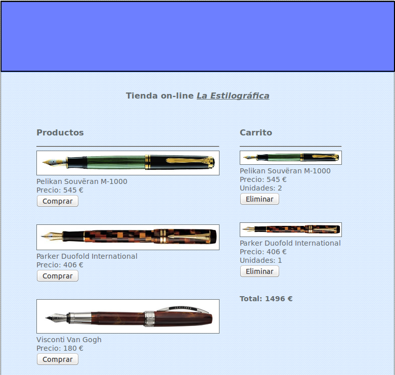

## Activitat 2. Sessions i seguretat

* Escriu un programa que calcule la mitjana de una sèrie de numeros introduïts per tecla (formulari amb una sola casella). A priori el programa no sap quants números s'introduiran. L'usuari indicarà que ha acabat quan pose un número negatiu. Utilitza sessions.
* Establix un control d'accès mitjançant usuari i contrasenya per al problema anterior. L'aplicació no ens deixarà continuar fins que no iniciem sessió.
* Tria un dels dos:
	* Realitza un programa que trie a l'atzar 5 paraules d'un minidiccionari anglès-valencià. El programa demanarà que l'usuari tecleje la traducció al valencià de cada una de les paraules (de una en una) i comprovarà si són correctes. Al final el programa haurà de mostrar cuantes respostes són vàlides i quantes errònees. 

	* Crea una tenda on-line senzilla amb un catàleg de productes (4 o 5) i un carret de la compra. De cada producte es deu conèixer al meyns la descripció, el preu i una imatge que els identifique. Al costat de cada producte del catàleg haurà d'aperèixer un botó comprar que permetrà afegir-lo al carret de la compra.  Per cada producte que està al carret, hi haurà un botó eliminar per si l'usuari s'arrepentix i vol llevar-lo. 
		* Tindre la classe producte (__construct(), render())
		* Tindre la classe carret (__construct(), afegirElement(), eliminarElement(), estaProducteEnElCarret()), BuidarCarret()
		* No cal identificació d'usuari
		* Hi haura un botó per buidar el carret.
		* No cal mostrar el carret.

* **Exercisi addcional**
	* Fes que hi haja un opció per tal d'introduïr paraules al diccionari.
	* Fes que d'un producte es puguen introduïr més d'un i fes una pantalla per a vore el carret.  	

