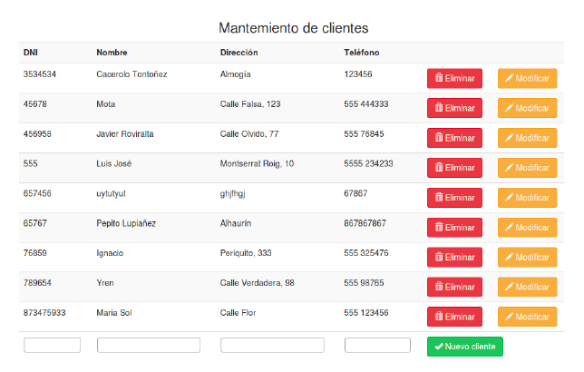

## Activitat 3.3. Accés a base de dades

1. Crearem una aplicació que conté la lògica típica de treball amb aplicacions que requereixen validació: entrar en sessió, executar l'aplicació i eixir de sessió. Inclourem també el registre d'usuaris. Utilitzarem accés a base de dades amb **PDO**

	a) LOGIN

	Per a la validació d'usuari utilitzarem la taula usuaris de la base de dades de mostra test. La contrasenya emmagatzemada és el resultat de la funció **md5()** de la contrasenya real.
	Crearem un script anomenat **login.php**, que s'encarrega de mostrar el formulari per a introduir usuari i contrasenya, i per a validar a l'usuari comprovant que existeix en el fitxer de claus i que la contrasenya és correcta.

	Si l'usuari no és correcte, es mostra un missatge d'error i es tornen a demanar les dades.

	Si l'usuari és correcte, s'enllaça automàticament amb el segon script: **main.php**, que seria l'encarregat d'executar l'aplicació que desenvolupem:

	* Si l'usuari no està validat, redirigeix a *login.*php
	* Si ho està, mostra el nom de l'usuari actiu, i un enllaç per a eixir de sessió, mitjançant **logout.php**
	* Crearem un script, **logout.php**, que s'encarrega de tancar la sessió i redirigir l'execució a **login.php**

	b) REGISTRE D'USUARIS

	En la pantalla de login posarem un botó **"Registrar-se"** que em porta al script **register.php**. 
	Aquest mostra un formulari on se sol·liciten a l'usuari les seues dades (usuari,nom,email, contrasenya). S'ha de validar que siguen correctes i que no hi ha un altre usuari amb el mateix email o nom d'usuari. Si és tot correcte, s'insereix en la base de dades i es torna a la pantalla de **login**. Si no és correcte es mostra el formulari de nou amb els errors.

	c) RECORDAR CONTRASENYA

	En la pantalla de login afegim un botó : **"Recordar contrasenya"**, que em porta al script "remember.php". Aquest sol·licita a l'usuari l'email, comprova que existeix com a usuari , li genera una contrasenya aleatòria nova, modificant-la en la base de dades, i li envia un correu amb les dades de la seua nova manera d'accedir.
	
2. Crea una aplicació web que permeta fer llistat, alta, baixa i modificació sobre la taula client de la base de dades test.

	* Per a realitzar el llistat bastarà un SELECT.
	* L'alta es realitzarà mitjançant un formulari on s'especificaran tots els camps del nou registre. Després aqueixes dades s'enviaran a una pàgina que executarà INSERT.
	* Per a realitzar una baixa, es mostrarà un botó que executarà DELETE.
	* La modificació es realitza mitjançant UPDATE.
	En fer un alta, s'ha de comprovar que no existisca cap client amb el DNI introduït en
	el formulari.
	* L'opció d'esborrat ha de demanar confirmació.
	* Quan es realitze la modificació de les dades d'un client, els camps que no s'han canviat hauran de romandre inalterats en la base de dades.

**Exercisi Opcional**

3. Junta els dos exercicis anteriors en uno sol, de manera que al identificar-se es puga accedir a la pantalla per a vore els clients.
4. Fes l'exercisi del clients utilitza la classe client, amb els mètodes:
	* static listAll()
	* find($id)
	* update($id,array $fields)
	* create(array $fields)
	* delete($id) 	