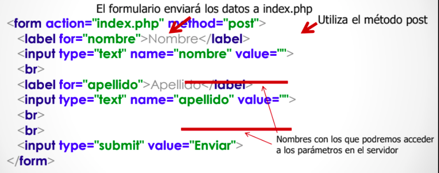

# Desenvolupament d'aplicacions web amb PHP

## Pas de paràmetres
Una **petició http** és la sol·licitud d'un recurs al servidor:
  * Es realitzen a través d'una url
  * Es poden passar paràmetres amb la petició
* Hi ha diferents mètodes (**METHOD**) de realitzar una petició **(GET, POST, PUT, DELETE, PATCH, etc.)**
  * Els més habituals són GET i POST

### Petició GET
* S'utilitza per a sol·licitar dades d'un recurs
  * Es Mostren els paràmetres que s'envien en la url
  * Es poden utilitzar directament en enllaços
  * Romanen en l'historial del navegador
  * La grandària dels paràmetres està limitat a 255 caràcters

##### Accedir a les dades de la petició GET
* Usem la variable superglobal **$_GET**
  * És un array associatiu
  * Les claus del array coincidiran amb els noms que li hem donat als paràmetres.
  * Per a accedir als paràmetres de la petició anterior:

~~~
echo $_GET['nom'] . ' ' . $_GET['cognom'];
~~~

### Petició POST
* S'utilitza per a enviar dades a un recurs
  * Els paràmetres van en el cos de la petició, no són visibles per a l'usuari
  * No es pot utilitzar en un enllaç
  * No roman en l'historial
  * Se solen utilitzar en els formularis
  * No tenim la limitació de grandària dels paràmetres

##### Accedir a les dades de la petició POST
* Usem la variable superglobal **$_POST**
  * Funciona igual que $_GET.
  * Mostrar totes les dades rebudes:
 
  ~~~
	var_dump($_POST);
	~~~
  * Mostrar les dades individualment:
   
~~~
echo $_POST['nom']; echo $_POST['cognom'];
~~~

## Formularis

Al crear un formulari li assignem un metode (habitualment POST) i una destinació (pàgina que tractarà el formulari)

~~~
	<form method='POST' action='pagina.php'>
~~~

#### Enviar les dades al mateix script que mostra el formulari

És habitual que la pàgina que tracta el formulari siga la mateixa que la que el conté. Per poder fer-ho: 

* La variable **$_SERVER** conté dades relacionades amb l'entorn del servidor de la petició HTTP
  * Una de les dades que conté és el script php que s'està executant **($_SERVER['PHP_SELF'])**.
  * Si indiquem el action del formulari així: **action="<?= $_SERVER['PHP_SELF']; ?>"**
  * Serà la pròpia pàgina del formulari la que processe les dades del mateix
El bloc inicial de comprovació s'executa quan s'accedix pel mètode POST,es a dir, a l'enviar el formulari. Si les dades són correctes es redirecciona a una altra pàgina. En cas contrari es crea la variable **$err** i continua l'script.
L'HTML s'executa quan s'accedix mitjançant GET (no ve del formulari) o no falla la comprobació de l'usuari.
   
##### Accedir a paràmetres no existents

##### Verificar que el formulari s'ha enviat
* Abans de mostrar les dades verificarem que s'haja enviat el formulari:

> if ($_SERVER['REQUEST_METHOD'] === 'POST') {...}

  ~~~
<?php
/* si va bien redirige a principal.php si va mal, mensaje de error */
	if ($_SERVER["REQUEST_METHOD"] == "POST") {  
		if($_POST['usuario'] === "usuario" and $_POST["clave"] === "1234"){		header("Location: principal.php");
		}else{
			$err = true;
		}	
	}
?>
<!DOCTYPE html>
<html>
	<head>
		<title>Formulario de login</title>		
		<meta charset = "UTF-8">
	</head>
	<body>			
		<?php if(isset($err)){
			echo "
 Revise usuario y contraseña
";
		}?>
		<form action = "<?php echo htmlspecialchars($_SERVER["PHP_SELF"]);?>" method = "POST">
			<label for = "usuario">Usuario</label> 
			<input value = "<?php if(isset($usuario))echo $usuario;?>"
			id = "usuario" name = "usuario" type = "text">				
			
			<label for = "clave">Clave</label> 
			<input id = "clave" name = "clave" type = "password">			
			
			<input type = "submit">
		</form>
	</body>
</html>
  ~~~

#### Validació del formulari
* Hem de comprovar que les dades del formulari són correctes
* Validacions a realitzar:
  * Els camps requerits no han de quedar buits 
  * Els camps email i data han de tenir el format esperat 
  * Tots els camps s'han de filtrar.
 
###### Valors buits
* Els camps requerits no haurien de quedar-se buits.
* Per a verificar que un valor no queda buit podem utilitzar la funció **empty()** de PHP. <http://php.net/manual/es/function.empty.php> .

###### Espais en blanc
* Hem d'eliminar els espais en blanc del principi i final dels camps
* S'utilitza la funció **trim()**

##### Filtrar l'entrada
* Sempre hem de filtrar l'entrada amb **htmlspecialchars()** abans de mostrar el camp amb echo o similar

###### Comprovar l'email
* Per a verificar si un email és correcte podem utilitzar la funció **filter_var**($email, FILTER_VALIDATE_EMAIL)) <http://php.net/manual/es/function.filter-var.php>

###### Dates
* En PHP les dates s'emmagatzemen com a números.
* S'utilitza la classe **DateTime** per a representar-les
* Igual que ocorre amb les cadenes no té sentit estudiar les funcions relacionades una a una. Les pots consultar en: <http://php.net/manual/es/ref.datetime.php>
* Per a comprovar la data devem crear una funció a aquest efecte
* Podemos utilitzar el mètode **createFromFormat()** de la classe DateTime <http://php.net/manual/es/datetime.createfromformat.php>

###Pujada de fitxers

Es un cas especial. En primer lloc en el formulari cal utilitzar l'atribut enctype="multipart/form-data" i el metode POST. Per al fitxer s'utilitza una etiqueta \<input type="file">.

 ~~~
<!DOCTYPE html>
<html>
	<body>
		<form action="procesar_subida.php" method="post" enctype="multipart/form-data">    
			Escoja un fichero
			<input type="file" name="fichero">
			<input type="submit" value="Subir fichero">
		</form>
	</body>
</html>
 ~~~
 
En l'script que reb el fitxer la variable global *$_FILES* conté la informació sobre el fitxer en un array bidimensional.

#### Elements del array del fitxer pujat
* **$_FILES['imatge']['tmp_name']**: lloc i nom de l'arxiu temporal en el servidor.
* **$_FILES['imatge']['name']**: Nom original del fitxer en la màquina client.
* **$_FILES['imatge'][size']**: Grandària en bytes del fitxer pujat.
* **$_FILES['imatge'][type']**: Tipus MIME associat al fitxer. Per exemple, "image/gif" o "text/plain".
* **$_FILES['imatge'][error']**: Codi d'error associat al fitxer pujat.  

  ~~~
<?php
	$tam = $_FILES["fichero"]["size"];
	if($tam > 256 *1024){
		echo " Demasiado grande";
		return;
	}
	echo "Nombre del fichero: " . $_FILES["fichero"]["name"];
	echo " Nombre temporal del fichero en sel servidor: " . $_FILES["fichero"]["tmp_name"];	
	$res = move_uploaded_file($_FILES["fichero"]["tmp_name"],"subidos/" . $_FILES["fichero"]["name"]);
    if($res){
		echo " Fichero guardado";
    } else {
        echo " Error";
    }
 ~~~
 
#### Grandària del fitxer a pujar
* Podemos fixar el límit de grandària en el fitxer php.ini
	* http://php.net/manual/es/ini.core.php#ini.upload-max-filesize
* També podem fixar el límit en el propi formulari
* A través d'un camp ocult (type="hidden") denominat **MAX_FILE_SIZE**.

 ~~~
<input type="hidden" name="MAX_FILE_SIZE" value="1000000">
 ~~~

#### Ruta temporal del fitxer pujat
* En carregar un arxiu, es guardarà en una ubicació temporal indicada per l'opció upload_tmp_dir en el php.ini.
	* http://php.net/manual/es/ini.core.php#ini.upload-tmp-dir
* Si no movem l'arxiu o ho canviem de nom, quan acabe l'execució del script, este serà eliminat.

#### Problemes més habituals
* Especificar en upload\_tmp\_dir un directori al com no es té accés
* La directiva memory\_limit té un valor molt baix o inferior a upload_max_filesize
* La directiva max\_execution\_time té un valor baix i el script ho excedeix durant la pujada del fitxer
* La directiva post\_max\_size té un valor baix i el teu fitxer ho excedeix. El seu valor ha de ser major a upload\_max\_filesize

##### Codis d'error
* El primer que caldrà fer és comprovar el codi d'error del fitxer pujat **($_FILES['imatge'][error'])**
* Si és diferent de **UPLOAD_ERR_OK** hi ha hagut algun problema
* Veure els codis d'error:
	* http://php.net/manual/es/features.file-upload.errors.php

##### Comprovació del tipus de fitxer
* A continuació comprovarem que el tipus myme està dins dels esperats:

 ~~~
if ($_FILES['imatge']['type'] !== 'image/gif') {
	echo 'Error: No es tracta d'un fitxer .GIF.'; 
	exit; 
 }
 ~~~

##### Evitar atacs
* Ataque comú:
	* http://seclists.org/bugtraq/2000/sep/55
* Per a evitar aquest tipus d'atacs es va incloure la funció:
	* bool is\_uploaded\_file ( string nom_arxiu )
* Retorna true si l'arxiu donat va ser carregat a través d'HTTP POST
* Li passarem el paràmetre **$_FILES['imatge']['tmp_name']**

##### Moure l'arxiu pujat
* Per a moure l'arxiu temporal a la seua ubicació correcta usem la funció
	* bool move\_uploaded\_file(string nom\_arxiu, string destinació)
* Aquesta funció s'assegura que l'arxiu siga un arxiu carregat vàlid.
* Si existeix un arxiu destine amb el mateix nom, est serà sobreescrit.

##### Evitar sobrescritures
* Abans de moure l'arxiu pujat és convenient comprovar que no existeix un arxiu amb el mateix nom
	* bool is\_file(string nom\_arxiu) 
	* Li passarem $_FILES['imatge']['name']
* En cas que existisca caldrà canviar el nom, per exemple afegint una marca de temps com a prefix

## Sessions i seguretat

Com Http és un protocol sense estat, les diferents peticions d'un client a un servidor són independents, no estan relacionades entre si. Per associar-les s'utilitzen les sessions. 

El terme sessió fa referència al conjunt d'informació relativa a un usuari concret. Aquesta informació pot ser tan simple com el nom del propi usuari, o més complexa, com els articles que ha dipositat en la cistella de compra d'una tenda online.

Cada usuari diferent d'un lloc web té la seua pròpia informació de sessió.Per a distingir una sessió d'una altra s'usen els identificadors de sessió (SID). Un SID és un atribut que s'assigna a cadascun dels visitants d'un lloc web i ho identifica. Si el servidor web utilitza el SID d'un usuari, per a relacionar-ho amb la informació que posseeix sobre ell, que es manté en la sessió de l'usuari.

El procés de maneig de sessions en PHP està automatitzat. 

#### Accedir a les dades de la sessió

* Una vegada oberta la sessió, usem la variable superglobal  **$_SESSION** per a afegir informació a la sessió de l'usuari, o per a accedir a la informació emmagatzemada en la sessió
* Per exemple, per a explicar el nombre de vegades que l'usuari visita la pàgina, podem fer: 

 ~~~
// Iniciem la sessió o recuperem l'anterior sessió existent 
session_start(); 
// Comprovem si la variable ja existeix 
if (isset($_SESSION['visites']))
	$_SESSION['visites']++; 
else
	$_SESSION['visites'] = 0;
 ~~~

#### Eliminar una variable de la sessió
* Per a eliminar una variable de la sessió usarem la funció unset()

 ~~~
	unset($_SESSION['visites']);
 ~~~
 
* Per a tancar la sessió de forma manual utilitzarem la funció **session_destroy()**
* Abans hem d'eliminar les variables de la sessió de la següent forma:
	*  $_SESSION = [];

#### Autenticació amb sessions
* Probablement, l'ús més estès del control de sessions siga el seguiment d'usuaris autenticats a través d'un mecanisme d'inici de sessió. Per a açò necessitarem un formulari de login.

login.php

~~~
<?php
/*formulario de login habitual
si va bien abre sesión, guarda el nombre de usuario y redirige a principal.php 
si va mal, mensaje de error */
function comprobar_usuario($nombre, $clave){
	if($nombre === "usuario" and $clave === "1234"){
		$usu['nombre'] = "usuario";
		$usu['rol'] = 0;
		return $usu;
	}elseif($nombre === "admin" and $clave === "1234"){
		 $usu['nombre'] = "admin";
		 $usu['rol'] = 1;
		 return $usu;
	}else return false;
}
if ($_SERVER["REQUEST_METHOD"] == "POST"){  
	$usu = comprobar_usuario($_POST['usuario'], $_POST['clave']);
	if($usu==false){
		$err = true;
		$usuario = $_POST['usuario'];
	}else{	
		session_start();
		$_SESSION['usuario'] = $_POST['usuario'];
		header("Location: principal.php");
	}	
}
?>
<!DOCTYPE html>
<html>
	<head>
		<title>Formulario de login</title>		
		<meta charset = "UTF-8">
	</head>
	<body>	
		<?php if(isset($_GET["redirigido"])){
			echo "
Haga login para continuar
";
		}?>
		<?php if(isset($err) and $err == true){
			echo "
revise usuario y contraseña
";
		}?>
		<form action = "<?php echo htmlspecialchars($_SERVER["PHP_SELF"]);?>" method = "POST">
			Usuario: 
			<input value = "<?php if(isset($usuario))echo $usuario;?>"
			id = "usuario" name = "usuario" type = "text">							
			Clave :			
			<input id = "clave" name = "clave" type = "password">			<input type = "submit">
		</form>
	</body>
</html>

~~~
 
principal.php
 
 ~~~
 <?php 
	session_start();
	if(!isset($_SESSION['usuario'])){	
		header("Location: sesiones1_login.php?redirigido=true");
	}	
?>
<!DOCTYPE html>
<html>
	<head>
		<title>Página principal</title>
		<!--<link rel = "stylesheet" href = "./css/alta_usuarios.css">-->
		<meta charset = "UTF-8">
	</head>
	<body>		
		<?php echo "Bienvenido ".$_SESSION['usuario'];?>
		 <a href = "logout.php"> Salir <a>
	</body>
</html>
 ~~~
 
logout.php
 
 ~~~
<?php
	session_start();    // unirse a la sesión
						//comprobar si existe la variable usuario????
	$_SESSION = array();
	session_destroy();	// eliminar la sesion
	header("Location: login.php");
 ~~~
 
La informació d'autenticació (nom i contrasenya dels usuaris) s'envia en text pla des del navegador fins al servidor web. Açò és altament insegur i mai ha d'usar-se sense un protocol com a HTTPS que permeta xifrar les comunicacions amb el servidor web

## Enviament de correu electrònic

Encara que la funció **mail()** permet l'enviament de correus electrònics, és habitual utilitzar alguna llibreria que s'ocupe dels detalls del format.

 ~~~
 composer require phpmailer/phpmailer
 ~~~

En principi es possible enviar un correu utilitzant la configuració de sendmail (en Linux) o un servidor SMTP local, en la pràctica els filtres antispam fan que no arriben els correus enviats des de servidors no registrats correctament. A més des de les aules tampoc es pot fer.

Si no es disposa d'un servidor de correu en Internet, l'opció més comoda per tal d'enviar un correu és utilitzar un compte de Gmail. En Gmail cal activar l'opció "Permetre aplicacions meyns segures" en la secció d'ajustos de compte.

El següent programa permet enviar un correu mitjançant Google:

~~~
<?php 	
 	use PHPMailer\PHPMailer\PHPMailer;
 	require "vendor/autoload.php";
 	$mail = new PHPMailer();
 	$mail->IsSMTP();
 	// cambiar a 0 para no ver mensajes de error
 	$mail->SMTPDebug  = 2; 							
 	$mail->SMTPAuth   = true;
 	$mail->SMTPSecure = "tls";                 
	$mail->Host       = "smtp.gmail.com";    
	$mail->Port       = 587;                 
	// introducir usuario de google
	$mail->Username   = ""; 
	// introducir clave
	$mail->Password   = "";   	
	$mail->SetFrom('user@gmail.com', 'Test');
	// asunto
	$mail->Subject    = "Correo de prueba";
	// cuerpo
	$mail->MsgHTML('Prueba');
	// adjuntos
	$mail->addAttachment("empleado.xsd");
	// destinatario
	$address = "destino@servidor.com";
	$mail->AddAddress($address, "Test");
	// enviar
	$resul = $mail->Send();
	if(!$resul) {
	  echo "Error" . $mail->ErrorInfo;
	} else {
	  echo "Enviado";
	} 
~~~

## Accés a Bases de dades

### Accés a BBDD des de  PHP
* Per a accedir a BBDD  mysql o mariabd tenim dues opcions:
	* El  driver natiu  **mysqli** o El  driver genèric  **PDO**
* En aquest curs utilitzarem  PDO, encara que l'ús de  mysqli és molt similar al de  PDO
* Accions a realitzar:
	* Establir connexions 
	* Executar sentències  SQL
	* Obtenir els registres afectats o retornats per una sentència  SQL.
	* Emprar transaccions
	* Gestionar els errors que es produïsquen durant la connexió o en l'establiment de la mateixa

#### Establiment de la connexió
* Haurem de  instanciar un objecte de la classe  PDO passant-li els següents paràmetres (només el primer és obligatori):
	* Origen de dades (DSN). Cadena de text que indica què controlador es va a utilitzar i, a continuació, separades pel caràcter dos punts, els paràmetres específics necessaris pel controlador, com per exemple, el nom o adreça IP del servidor i el nom de la base de dades
	* Nom d'usuari amb permisos per a establir la connexió
	* Contrasenya de l'usuari
	* Opcions de connexió, emmagatzemades en forma de  array

Per exemple, si utilitzem el controlador per a  Mysql, la cadena  DSN rebrà els paràmetres següents (a continuació del prefix  mysql:):
	* host. Nom o adreça IP del servidor 
	* port. Nombre de port  TCP en el qual escolta el servidor 
	* dbname. Nom de la base de dades

~~~
$conn = new PDO ('mysql:host=mysql;port=3306;dbname=juegoRol', 'root', '1234');
~~~

#### Opcions de la connexió

* En el  array d'opcions que li passem en crear la connexió podem utilitzar, entre unes altres, les següents:
	* Perquè extraga les dades de la base de dades en  utf8:
		*  PDO:: MYSQL_ ATTR_ INIT_ COMMAND => "SET  NAMES  utf8"
	*  Perquè retorne els errors en forma d'excepcions:
		*  PDO:: ATTR_ ERRMODE =>  PDO:: ERRMODE_ EXCEPTION
	* Per a establir una connexió persistent utilitzarem la següent opció en realitzar la connexió:
		* PDO:: ATTR_ PERSISTENT =>  true

Per exemple:

~~~
$opcions =  array(
 PDO:: MYSQL_ ATTR_ INIT_ COMMAND => "SET  NAMES  utf8",  PDO:: ATTR_ ERRMODE =>  PDO:: ERRMODE_ EXCEPTION,  PDO:: ATTR_ PERSISTENT =>  true );

$ pdo =  new  PDO(
' mysql: host=agenda.local; dbname=agenda; charset= utf8', ' usuAgenda', ' globalnet', $opcions);
~~~

* Per a més informació:
	* http://es.php.net/manual/es/pdo.drivers.php

#### PDOException

Totes les excepcions que genera  PDO són del tipus  **PDOException** que hereta de la classe  Exception. Si hagueren errors de connexió, es llançarà una excepció  PDOException. Si no capturem l'excepció, es finalitzarà el  script i mostrarà informació de seguiment, que podria revelar detalls de la connexió a la base de dades, incloent el nom d'usuari i la contrasenya

#### Tancament de la connexió

La connexió romandrà activa durant el temps de vida de l'objecte  PDO. Per a tancar la connexió és necessari destruir l'objecte assegurant-se que totes les referències a ell siguen eliminades. Açò es pot fer assignant  NULL a la variable que conté l'objecte. Si no es realitza explícitament,  PHP tancarà automàticament la connexió quan el  script finalitze. Si la connexió és persistent s'emmagatzemarà en la  cache per a posteriors connexions

### Presentació i recuperació de dades
* Si la consulta genera un conjunt de dades (SELECT), s'utilitza el mètode **query** per executa una sentència SQL. La sentencia retorna false si hi ha errors o un conjunt de resultats com un objecte  **PDOStatement**

~~~
<?php
$parametres_connexio = 'mysql:dbname=almacen;host:127.0.0.1';
$usuari = 'root';
$passwd = '...';
try {
		$bd = new PDO($parametres_connexio,$usuari,$passwd);
		echo "Connexio realitzada correctament!! ";
		$sql = "SELECT producte, unitats  FROM stock";
		$productes =  $bd->query($sql);
		echo $productes->rowCount()." elements ";
		echo '<ul>';
		foreach ($productes as $producte){
			echo '<li>'.$producte['producte'].' '.$producte['unitats'].'</li>';
		}
		echo '</ul>';
	} catch (PDOException $e) {
    echo 'Error con la base de datos: ' . $e->getMessage();
	} 
~~~

* Treballar amb consultes d'esta manera és vulnerable a injeccions  SQL. En el seu lloc es recomana utilitzar consultes preparades.

#### Consultes preparades

Ens aporten dos avantatges importants:
	* Per a sentències que seran executades en múltiples ocasions amb diferents paràmetres optimitza el rendiment de l'aplicació. 
	* Ajuda a prevenir injeccions  SQL eliminant la necessitat de entrecomillar manualment els paràmetres.

Utilitzem el mètode **prepare** de la classe PDO que retorna un objecte de la classe PDOStatement. A més, els paràmetres es poden marcar utilitzant signes d'interrogació o amb nom, utilitzant :.

~~~
 $pdoSt = $pdo->prepare('INSERT INTO família (cod,nom)  VALUES (?, ?)');
~~~
~~~
 $pdoSt = $pdo->prepare('INSERT INTO família (cod,nom)  VALUES (:cod,:nom)');
~~~

Abans d'executar la consulta, cal assignar un valor als paràmetres.Utilitzem el mètode **bindParam** de la classe PDOStatement. Si hem utilitzat signe d'interrogació posarem l'índex del paràmetre començant per 1. Si usem paràmetres amb nom, indiquem el nom en la cridada a bindParam.

~~~
$cod_producte = " TABLET";  
$nom_producte = " Tablet PC"; 
$pdoSt->bindParam(1,$ cod_producte); 
$pdoSt->bindParam(2,$nom_producte);
~~~

~~~
$pdoSt->bindParam(":cod",$cod_producte); 
$pdoSt->bindParam(":nom",$nom_producte);
~~~

Una vegada preparada la consulta i enllaçats els paràmetres amb els seus valors, s'executa la consulta utilitzant el mètode  **execute** de la classe  PDOStatement. També, és possible assignar els valors dels paràmetres en el moment d'executar la consulta, utilitzant un  array (associatiu o amb claus numèriques depenent de la forma en què hages indicat els paràmetres) en la cridada a  execute

~~~
<?php
$cadena_conexion = 'mysql:dbname=empresa;host=127.0.0.1';
$usuario = 'root';
$clave = '';
try {
    $bd = new PDO($cadena_conexion, $usuario, $clave);
	echo "Conexión realizada con éxito ";		
	$sql = 'SELECT nombre, clave, rol FROM usuarios';
	$usuarios = $bd->query($sql);
	echo "Número de usuarios: " . $usuarios->rowCount() . " ";
	foreach ($usuarios as $usu) {
		print "Nombre : " . $usu['nombre'];
		print " Clave : " . $usu['clave'] . " ";
	}
	/* consulta preparada, parametros por orden */	
	$preparada = $bd->prepare("select nombre from usuarios where rol = ?");	
	$preparada->execute( array(0));
	echo "Usuarios con rol 0: " .  $preparada->rowCount() . " ";
	foreach ($preparada as $usu) {
		print "Nombre : " . $usu['nombre'] . " ";
	}
	/* consulta preparada, parametros por nombre */	
	$preparada_nombre = $bd->prepare("select nombre from usuarios where rol = :rol");
	$preparada_nombre->execute( array(':rol' => 0));
	echo "Usuarios con rol 0: " .  $preparada->rowCount() . " ";
	foreach ($preparada_nombre  as $usu) {
		print "Nombre : " . $usu['nombre'] . " ";
	}	
	} catch (PDOException $e) {
		echo 'Error con la base de datos: ' . $e->getMessage();
	}
~~~	

### Inserció, esborrat i modificat

S'utilitza el mètode  **PDO::exec**, que executa una sentència  SQL i retorna el nombre de registres afectats

~~~
	$registres = $pdo->exec('DELETE FROM stock WHERE unitats=0');  
	echo "\
S'han esborrat $registres registres.\
";
~~~

Aquesta sentència és vulnerable a injeccions SQL. En el seu lloc es recomana utilitzar consultes preparades

~~~
<?php
// datos conexión
$cadena_conexion = 'mysql:dbname=empresa;host=127.0.0.1';
$usuario = 'root';
$clave = '';
try {
	// conectar
    $bd = new PDO($cadena_conexion, $usuario, $clave);	
	echo "Conexión realizada con éxito ";	
	// insertar nuevo usario
	$ins = "insert into usuarios(nombre, clave, rol) values('Alberto', '33333', '1');";
	$resul = $bd->query($ins);	
	//comprobar errores
	if($resul) {
		echo "insert correcto  ";
		echo "Filas insertadas: " . $resul->rowCount() . " ";
	}else print_r( $bd -> errorinfo());	
	// para los autoincrementos
	echo "Código de la fila insertada" . $bd->lastInsertId() . " "; 
	// actualizar
	$upd = "update usuarios set rol =  0 where rol = 1";
	$resul = $bd->query($upd);	
	//comprobar errores
	if($resul){
		echo "update correcto  ";
		echo "Filas actualizadas: " . $resul->rowCount() . " ";
	}else print_r( $bd -> errorinfo());	
	// borrar
	$del = "delete from usuarios where nombre = 'Luisa'";
	$resul = $bd->query($del);	
	//comprobar errores
	if($resul){
		echo "delete correcto  ";
		echo "Filas borradas: " . $resul->rowCount() . " ";
	}else print_r( $bd -> errorinfo());
	
} catch (PDOException $e) {
	echo 'Error con la base de datos: ' . $e->getMessage();
} 
~~~

### Transaccions

Una transacció consistix en un conjunt d'operacions que han de realitzar-se de forma atòmica. Es a dir, o es realitzen totes o cap.

Per defecte PDO treballa en manera  **autocommit**, així esconfirma de forma automàtica cada sentència que executa el servidor.

Per a treballar amb transaccions,  PDO incorpora tres mètodes:
	* **beginTransaction**. Deshabilita la manera  autocommit i comença una
nova transacció, que finalitzarà quan executes un dels dos mètodes següents.
	*  **commit**. Confirma la transacció actual 
	*  **rollback**. Reverteix els canvis duts a terme en la transacció actual

Una vegada executat un  commit o un  rollback, es tornarà a la manera de confirmació automàtica

~~~
	<?php
	$cadena_conexion = 'mysql:dbname=empresa;host=127.0.0.1';
	$usuario = 'root';
	$clave = '';
	try {
	    $bd = new PDO($cadena_conexion, $usuario, $clave);
		echo "Conexión realizada con éxito ";
		// comenzar la transacción
		$bd->beginTransaction();	
		$ins = "insert into usuarios(nombre, clave, rol) values('Fernando', '33333', '1')";
		$resul = $bd->query($ins);	
		// se repite la consulta
		// falla porque el nombre es unique
		$resul = $bd->query($ins);	
		if(!$resul){
			echo "Error: " . print_r($bd->errorinfo());
			// deshace el primer cambio
			$bd->rollback();
			echo " Transacción anulada ";
		}else{
			// si hubiera ido bien...
			$bd->commit();
		}	
	} catch (PDOException $e) {
	    echo 'Error al conectar: ' . $e->getMessage();
	} 
~~~

## Proves

Per a executa proves la ferramenta més utilitzada en php és phpunit.

~~~
composer require --dev phpunit/phpunit
~~~

L'element base del phpunit es el **cas de prova**, una classe que ha d'heretar de **TestCase** de la llibreria. Dins d'un cas de prova hi ha varias proves.
Per a provar una classe de nom **Usuari** es crearà una classe de nom **UsuariTest**. Esta classe contindrà una sèrie de mètodes amb les proves que es volen realitzar. Estos mètodes han de ser publics, encara que les classe podrà contindre altres mètodes auxiliars per tal de realitzar les proves.
Per a indicar que el mètode és una prova hi ha dues opcions:

* Que el nombre començe per test

~~~
public function testCanCreateUsuari()
~~~

* Utilitzar un bloc de comentaris específics amb la notació test  

~~~
/**
/* #test
*/
public function testCanCreateUsuari()
~~~

Dins d'estos mètodes, la majoria de les comprovacions es realitzen utilitzant **asserts**, mètodes definits en la classe **TestCase**, que comprova si es complixen o no algunes condicions. Si alguna de les assercions no s'acomplixen es considera que la prova ha fallat.

Per exemple podem provar la classe següent:

~~~
<?php
   class Matematicas{
	/* funcion factorial */
		public static function factorialEx($num){
			if ($num < 0) {
				throw new InvalidArgumentException("N�mero negativo");
			}	
			$resul = 1;
			for($i=2; $i <= $num; $i++){
				$resul = $resul * $i;
			}
			return $resul;
		}
   }
~~~
  
amb la següent classe:

~~~
<?php
	require "vendor/autoload.php";
	require "Matematicas.php";
	use PHPUnit\Framework\TestCase;
	class MatematicasTest extends TestCase{    		
		public  function testCero(){
			$this->assertEquals(1, Matematicas::factorialEx(0));						
		}		
		/**
		* @test
		* @expectedException InvalidArgumentException
		*/
		public static function Excepcion(){
			//equivalente a la anotación  @expectedException
			//$this->expectException(InvalidArgumentException::class);
			return Matematicas::factorialEx(-1);			
			
		}
	}   
~~~

on el primer mètode comprova que calcula be el factorial de 0, i el segon mètode comprova que si el paràmetre és negatiu es llança una exempció.

Per a executar la prova cal executar phpunit des de la línea de comanaments

~~~
 /vendor/bin/phpunit MatematicasTest.php
~~~

Per a més informacio https://phpunit.readthedocs.io/es/latest/

## Composer

Composer ens resol dos problemes:

* Gestionar les dependències amb llibreries de tercers (N'hi ha prou que declarem les dependències i Composer s'encarregarà de descarregar i instal·lar tot el que siga necessari)
* Autoloading del nostre codi (Ja no haurem de fer més requires, Composer ho farà per nosaltres)

#### Gestió de les dependències

* La instal·lació de les llibreries sempre és local per a cada projecte
* S'instal·len en un directori del projecte
* Per defecte aqueix directori és vendor/
* Passos:
	* Declarar les llibreries de les quals depèn el projecte
	* Composer descàrrega i instal·la automàticament les versions correctes de cadascuna d'aqueixes llibreries i les seues dependències

#### Instal·lació (soles sistemes sense docker)
* Es pot instal·lar localment per a cada projecte o globalment
* Anem a instal·lar-ho globalment:
>
> $curl -sS https://getcomposer.org/installer | php 
> 
> $ sudo mv composer.phar /usr/local/bin/composer
> 

* Hem descarregat composer i ho hem mogut a un directori que està dins del PATH. A partir d'ara, podem executar Composer simplement escrivint composer

#### Preparar l'arxiu composer.json
* Necessari per a usar composer en un projecte
* Consisteix en una sèrie d'estructures d'informació niades
* Exemple:

> {
> "require": {
>"monolog/monolog": "1.2." } 
>}
>

* require mapea noms de paquets (en l'exemple, monolog/monolog) amb versions de paquets (en aquest cas, 1.2.)

#### Exemple d'ús
* Estem desenvolupant un projecte i necessitem una llibreria per a guardar missatges de log
* Decidim utilitzar la llibreria monolog
* Per a incloure aquesta llibreria:
	* Anem a crear un arxiu composer.json

>
>{ "require": {"monolog/monolog": "1.0." } } 
>
	
	* Estem indicant que el projecte depèn d'un paquet anomenat monolog/monolog i que li serveix qualsevol versió la numeració de la qual comence per 1.0

#### Noms de paquets
* Està format per dues parts:
	* La primera indica qui és la seua "vendor" o creador 
	* La segona indica el nom del projecte
* Sovint les dues parts són idèntiques
* El nom del creador és important per a evitar col·lisions entre projectes amb el mateix nom
 
#### Versions de paquets
* En l'exemple anterior, la versió requerida de la llibreria és 1.0.
* Es pot utilitzar qualsevol versió de la branca 1.0 (com per exemple 1.0.0, 1.0.2 o 1.0.20)
* Aquesta versió és equivalent a =1.0 > <1.1
* Les versions requerides es poden especificar de moltes maneres:
	* Versió exacta: com per exemple 1.0.2 
	* Rang de versions: S'usen operadors de comparació: >, >=, <, <=, !=.
( Exemples: >=1.0 o >=1.0,<2.0)
	* Comodins: La versió 1.0. per exemple és equivalent a =1.0, ><1.1 
	* La següent versió significativa: que s'indica mitjançant l'operador ~ i s'interpreta de la següent manera: ~1.2 és equivalent a =1.2, ><2.0, mentre que ~1.2.3 és equivalent a =1.2.3, ><1.3 (útil per a aquells projectes que segueixen el versionat semàntic)

#### Versionat semàntic (Semver)
* Els nombres de versió i la forma en què canvien informen sobre el que va ser modificat d'una versió a una altra
* Veure l'especificació en el següent document:
	* http://semver.org/lang/es/

#### Instal·lant les dependències
* Executem el següent comando:

>
> composer install
> 

* Es generarà el directori vendor/ amb les llibreries de les quals depèn el projecte
* MOLT IMPORTANT: Hem d'afegir el directori vendor/ a l'arxiu .gitignore
* El comando també crea un arxiu composer.lock

#### L'arxiu composer.lock

* Guarda la versió exacta que s'ha instal·lat de cada llibreria
* El projecte es fixa a unes determinades versions
* Tant el composer.lock com el composer.json han d'estar en el repositori
* El comando install comprova primer si existeix l'arxiu composer.lock, i si existeix, descàrrega exactament les versions que s'indiquen en aqueix arxiu
* Si treballem en equip, tot l'equip tindrà les mateixes versions
 
#### Actualitzar versions
* Si tenim l'arxiu composer.lock sempre s'instal·laran les mateixes versions de les llibreries
* Per a actualitzar a noves versions, usem el comando update
* Fa que **composer** cerque les versions més recents de les llibreries
* Sempre que seguisquen complint les restriccions de les versions indicades en l'arxiu composer.json
* També actualitza l'arxiu composer.lock
* Si solament volem instal·lar o actualitzar una dependència, podem indicar el seu nom després del comando:

>
>composer update monolog/monolog
> 

#### Afegint dependències
* El comando require afig noves dependències en l'arxiu composer.json
	* composer require
* Ens preguntarà què llibreries volem afegir
* Després d'afegir aquestes noves dependències, s'instal·len o actualitzen les dependències que siguen necessàries
* Podem passar les noves dependències com a argument del comando

>
>  composer require monolog/monolog:1.
> 

#### Packagist
* Repositori central de Composer (lloc del que s'obtenen els paquets)
* Lloc web: http://packagist.org
 
#### Càrrega automàtica de classes
* Normalment les llibreries proporcionen informació sobre la càrrega automàtica de les seues classes
* Composer genera un arxiu vendor/autoload.php
* Incloent aquest arxiu en el projecte, podem utilitzar qualsevol classe instal·lada a través de Composer sense haver d'incloure-la explícitament:

>
>require 'vendor/autoload.php';
> 

#### Ús de la llibreria
* Per a usar la llibreria Monolog podem usar les seues classes i Composer s'encarregarà de carregar-les:

>
>$log = new Monolog\Logger('name'); 
>
>$log->pushHandler(
new Monolog\Handler\StreamHandler('app.log', Monolog\Logger::WARNING) );
>
>$log->addWarning('Foo');
> 

#### Espais de noms
* Són una manera d'encapsular elements
* Podemos fer un simil entre els namespaces i els directoris:
	* Els directoris serveixen per a agrupar fitxers relacionats 
	* El fitxer foo.txt pot existir en els directoris /home/greg i /home/un altre, però no poden coexistir dues còpies de foo.txt en el mateix directori
	* Per a accedir al fitxer foo.txt fóra del directori /home/greg,
s'ha d'anteposar el nom del directori al nom del fitxer, emprant el separador de directoris per a així obtenir /home/greg/foo.txt
* Aquest mateix principi s'estén als espais de noms en el món de la programació

#### Introducció als namespaces
* Els namespaces són una característica de PHP que s'introdueix en la versió 5.3
* L'ús de namespaces és molt convenient per dos motius:
 	* El conflicte de noms entre el codi que es crea i les
classes/funciones/constants internes de PHP o les classes/funciones/constants de tercers 
	* La capacitat de sobrenomenar (o abreujar) Noms_Extra_Llargs millorant la llegibilitat del codi font
* Només usarem namespaces per a noms de classes
 
#### Definir espais de noms
* Només les classes (incloent abstractes i traits), interfícies, funcions i constants es veuen afectats per espais de noms
* Es declaren utilitzant la paraula reservada namespace
* S'ha de declarar a l'inici del fitxer, abans que qualsevol altre codi
* Només hi ha una excepció: la paraula reservada declare

>
>namespace MiProyecto;
>
>const CONNECTAR_OK = 1; 
>
>class Connexió { / ... / } 
>
>function connectar() { / ... / }
 
#### Ubicació de la declaració
* Tot el que no siga codi PHP no pot precedir a la declaració de l'espai de noms

>
> \<html> <?php namespace MiProyecto;
> 
>  // error fatal - el espacio de nombres debe ser la primera sentencia del script ?>
> 

#### Declarar subespacios de noms
* Un nom d'un espai de noms es pot definir amb subnivells

>
>namespace MiProyecto\Sub\Nivell;
>
>const CONNECTAR_OK = 1; 
>
>class Connexió { / ... / } 
>
>function connectar() { / ... / }
> 

#### Ús de namespaces en els nostres projectes
* Cada aplicació que creiem tindrà un espai de noms diferent
* Podrem separar els subnoms del namespace amb el caràcter \
* Per exemple:

>
>namespace CursoPhp7\Core; Class Request { ... }
>

* La classe Request estarà dins de l'espai de noms CursoPhp7\Core

#### Usar elements que estan dins de namespaces
* Per a poder usar la classe Request de l'exemple anterior haurem d'indicar el 

>
>nom complet CursoPhp7\Core\Request
>
>
* Per a abreujar els usos podem utilitzar la instrucció use que permet indicar els espais de noms que anem a utilitzar:

>
>use CursoPhp7\Core\Request;
>

* Ara ja podrem usar la classe Request sense indicar la ruta completa
* També podem definir un àlies per a una classe de la següent forma:

>
> use CursoPhp7\Core\Request as Req;
> 

* Ara podrem usar la classe Request com Req
* És una molt bona pràctica fer coincidir els namespaces amb els directoris on es troben els arxius
* Açò ens permetrà utilitzar el autoloader de Composer que veurem més endavant
* En el nostre projecte tots els arxius pengen del directori \
* Més endavant, veurem que podem associar el nom del directori de nostre projecte amb un espai de noms, per exemple, CursoPhp7.
* Per tant, els namespaces començaran per CursoPhp7\
* Per exemple:
	* CursoPhp7\App\Controllers o CursoPhp7\Core o CursoPhp7\Database o ...

#### Afegir els uses
* En tots els llocs on utilitzem un namespace, haurem d'afegir l'use de l'espai de noms corresponent
* A més, quan utilitzem una classe d'alguna llibreria o del propi PHP, com per exemple PDO, haurem d'afegir-li una \ davant per a indicar que la classe està en l'espai de noms arrel

>
>return $statement->fetchAll(
\PDO::FETCH_CLASS, 'Agenda\\Entities\\'.$classEntity);
> 

#### Autoloading amb Composer
* Cada vegada que afegim una nova classe a la nostra aplicació hem d'inserir el require corresponent en el nostre bootstrap.php
* Per a evitar açò podem utilitzar l'eina composer amb la seua funcionalitat de autoloading
 
##### Càrrega automàtica de les nostres classes

* La càrrega automàtica de classes en composer es controla mitjançant la propietat autoload de l'arxiu composer.json
* Es permeten quatre valors:
	* El carregador de classes que segueix l'estàndard PSR-0 
	* El carregador de classes que segueix l'estàndard PSR-4 (substitueix a l'anterior)
	* El mapa de classes (classmap) 
	* Els arxius individuals (files)
* El mètode recomanat és el carregador PSR-4 perquè és el més flexible (no fa falta per exemple regenerar el carregador de classes quan s'afig una nova classe al projecte)

#### Ús de PSR-4
* Podemos consultar l'especificació en la següent url:
	* http://www.php-fig.org/psr/psr-4/
* Es basa que els noms dels namespaces han de coincidir amb els directoris on se situen els arxius
* Per a activar-ho afegirem la clau autoload indicant l'opció psr-4 i amb quin directori es mapea el namespace principal

##### Exemple

>
>{
>
>"autoload": {
>
>"psr-4": {"Acme\\": "src/"} } }
>

* Composer crearà un carregador automàtic de classes per al namespace Acme que seguirà les normes de l'estàndard PSR-4 de PHP
* El directori src/ estarà en l'arrel del projecte, al mateix nivell que el directori vendor/
* Contindrà el codi del projecte
* Així, l'arxiu src/Acme/Foo.php hauria de contenir la classe Acme\Foo
* Després d'afegir l'opció autoload, cal executar el comando **composer dump-autoload** perquè es regenere l'arxiu vendor/autoload.php

#### Incloure el autoloader
* Perquè tot funcione correctament caldrà incloure el fitxer autoload.php en el controlador frontal (index.php) abans d'incloure el bootstrap.php
* Ara podrem eliminar tots els requires de classes que tinguem en el bootstrap.php
* El autoload s'encarregarà cercar els fitxers i utilitzar-los
	