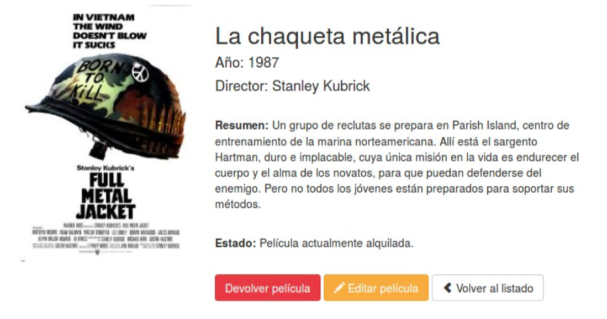

# FRAMEWORK LARAVEL


## Controladors i injecció de dependències

Fins al moment hem vist solament com retornar una cadena per a una ruta i com associar una vista a una ruta directament en el fitxer de rutes. Però en general la forma recomanable de treballar serà associar aquestes rutes a un mètode d'un controlador. Els controladors permeten estructurar millor el codi de la nostra aplicació. La seua principal utilitat radica
a alliberar als arxius de rutes d'haver d'ocupar-se també de gestionar una certa lògica comuna de les
peticions, com l'accés a les dades, validació de formularis, etc. 

Com ja vam veure en la secció d'introducció, els controladors són el punt d'entrada de les peticions dels usuaris i són els que han de contenir tota la lògica associada al processament d'una petició, encarregant-se de realitzar les consultes necessàries a la base de dades, de preparar les dades i de cridar a la vista corresponent amb aquestes dades.

### Definició de controladors


Per a definir un controlador en la nostra aplicació, hem de tirar mà de nou del comando **php artisan** vist prèviament. En concret, utilitzarem l'opció **make:controller** seguida del nom que li vulguem donar al controlador. Típicament, els noms de controladors acaben amb el sufix Controller, per la qual cosa podem crear un de prova així:

```php
php artisan make:controller PruebaController
```

Això generarà una classe buida amb el nom del controlador. Per defecte, els controladors es guarden en la subcarpeta **app/Http/Controllers** del nostre projecte Laravel.

#### Controladors d'un sol mètode (invoke)

El comando anterior admet alguns paràmetres addicionals més. Un molt útil és el paràmetre -i , que crea el controlador amb un mètode anomenat __invoke , que s'acte executa quan és anomenat des d'algun procés d'encaminament. Per exemple, si creem el controlador així:

```php
php artisan make:controller PruebaController -i
```

Es crearà la classe PruebaController en la carpeta app/Http/Controllers , amb un contingut com aquest:

```php
<?php
namespace App\Http\Controllers;
use Illuminate\Http\Request;
class PruebaController extends Controller
{
...
public function __invoke(Request $request)
{
...
}
}

```

Dins del mètode __invoke podem definir la lògica de generar o obtindre les dades que necessita una vista, i renderitzar-la. Per exemple:

```php
public function __invoke(Request $request)
{
	$datos = array(...);
	return view('miVista', compact('datos'));
}
```

Així, en l'arxiu de rutes, n'hi ha prou amb definir la ruta que vulguem, i com segon paràmetre del mètode **get** , indicar el nom del controlador que es dispararà per a processar aqueixa ruta. Addicionalment,
també li podem assignar un nom a la ruta, com ja hem fet en exemples anteriors.

```php
Route::get('prueba', 'PruebaController')->name('prueba');
```

#### Controladors de multiples mètodes

##### Controladors de recursos

Si creem un controlador amb l'opció -r en lloc de l'opció -i utilitzada en l'exemple anterior, crearà un controlador de recursos ( resources ), i predefinirà en ell una sèrie de mètodes d'utilitat per a les operacions principals que es poden realitzar sobre una entitat de la nostra aplicació:

* index : mostra un llistat dels elements d'aqueixa entitat o recurs
* create : mostra el formulari per a donar d'alta nous elements
* store : emmagatzema en la base de dades el recurs creat amb el formulari anterior
* show : mostra les dades d'un recurs específic (a partir de la seua clau o id).
* edit : mostra el formulari per a editar un recurs existent
* update : actualitza en la base de dades el recurs editat amb el formulari anterior
* destroy : elimina un recurs pel seu identificador.

Òbviament, el codi de tots aquests mètodes apareixerà buit al principi, i els haurem d'emplenar amb les operacions corresponents més endavant.
Si volem utilitzar un controlador d'aquest tipus, i cridar a algun dels seus mètodes des d'alguna ruta, ja no n'hi ha prou amb posar el nom del controlador, com féiem abans amb els de tipus **invoke**, ja que ara hi ha més d'un mètode que triar. El que farem serà posar el nom del controlador, seguit d'una
arrova @ i el nom del mètode a invocar. Per exemple:

```php
Route::get('prueba', 'PruebaController@index')->name('listado_prueba');
```

#### Controladors API

Com a alternativa als controladors de recursos vistos abans, podem crear els controladors amb l'opció --api. Crearà un controlador amb els mateixos mètodes que el de recursos, excepte els mètodes create i edit , encarregats de mostrar els formularis de creació i edició de recursos, ja que en les APIs aquests formularis no són necessaris, com veurem en sessions posteriors.

#### Reanomenant les vistes

A mesura que el projecte creix, generarem un bon nombre de vistes associades a controladors, i és necessari estructurar aquestes vistes d'una forma adequada per a poder-les identificar ràpidament. Una convenció que podem seguir és nomenar les vistes a partir del controlador o model al qual fan referència, i a l'operació que realitzen. Per exemple, si tenim un controlador anomenat
PruebaController , se suposa que actuarà sobre una taula anomenada prueba (ho veurem més endavant, en la sessió d'accés a dades). I, podem emmagatzemar les vistes en la subcarpeta **resources/views/pruebas** , i definir dins les vistes
associades a cada operació del controlador que tinguem definida. Per exemple:
index.blade.php
show.blade.php
...

Paral·lelament, cada vegada que anem a carregar una vista des d'algun controlador o ruta, farem referència a aquest nom.

#### Unint totes les rutes d'un controlador

Al final de tot el procés d'implementació d'un controlador (de recursos o de API) tindrem en l'arxiude rutes una dedicada a cada mètode del controlador (una per a index , una altra per a show , etc.).
Aquestes rutes poden agrupar-se en una sola usant el mètode resource de la classe Route , en lloc de get, indicant-li com a paràmetres el nom base de la ruta, i el controlador que s'encarregarà d'ella:

```
Route::resource('libros', 'LibroController');
```

La ruta anterior definirà una ruta GET cap a /llibres , atesa pel mètode index del controlador,una altra ruta GET cap a /llibres/{id} atesa pel mètode show del controlador... etc.
També podem utilitzar el mètode only per a indicar per a quins mètodes volem rutes:

```
Route::resource('libros', 'LibroController')->only(['index', 'show']);
```

Des del costat oposat, tenim disponible el mètode *except per a indicar que es generen totes les rutes excepte aquelles per als mètodes indicats:

```
Route::resource('libros', 'LibroController')->except(['update', 'edit']);
```

Amb els controladors de tipus API també podem generar automàticament totes les rutes per als seus mètodes, utilitzant el mètode apiResource de la classe Route , en lloc del mètode resource empleat abans:

```
Route::apiResource('prueba', 'PruebaController');
```

#### Reanomenant les rutes

Si generem rutes automàtiques per als mètodes d'un controlador, veurem que per als formularis de crear i editar es defineix una ruta acabada en /create o en /edit , respectivament. Això pot xocar si pretenem una web feta en un altre idioma. Però podem canviar el nom que es genera automàticament per a aquestes rutes, editant el proveïdor de serveis AppServiceProvider , situat en la carpeta app/Providers. En el mètode boot , podem cridar al mètode resourceVerbs de la
classe Route i canviar de nom els verbs utilitzats per a accedir a les rutes del recurs. Per exemple:

```php
public function boot()
{
	Route::resourceVerbs([
		'create' => 'crear',
		'edit' => 'editar'
	])
}
```

NOTA: haurem d'incloure amb use l'espai de noms **Illuminate\Support\Facades\Route** per a poder emprar la classe Route en el proveïdor de serveis.

Podem consultar el conjunt de rutes al qual està responent la nostra aplicació en tot moment amb aquest comando:

```
php artisan route:list
```

#### Controladors i espais de noms

També podem crear sub-carpetes dins de la carpeta Controllers per a organitzar-nos millor. En aquest cas, l'estructura de carpetes que creem no tindrà res a veure amb la ruta associada a la petició i, de fet, a l'hora de fer referència al controlador únicament haurem de fer-ho a través del seu espai de noms.

Com hem vist en referenciar el controlador en el fitxer de rutes únicament hem d'indicar el seu nom i no tota la ruta ni l'espai de noms App\Http\Controllers. Açò és perquè el servei encarregat de carregar les rutes afig automàticament l'espai de noms arrel per als controladors. 
Si fiquem tots els nostres controladors dins del mateix espai de noms no haurem d'afegir res més. Però si decidim crear sub-carpetes i organitzar els nostres controladors en sub-espais de noms, llavors sí que haurem d'afegir aqueixa part.

Per exemple, si vam crear un controlador en **App\Http\Controllers\Photos\AdminController**, llavors per a registrar una ruta fins a aquest controlador hauríem de fer:

```
	Route::get('foo', 'Photos\Admincontroller@method');
```

#### Caché de rutes
Si definim totes les nostres rutes perquè utilitzen controladors podem aprofitar la nova funcionalitat per a crear una caché de les rutes.
És important que estiguen basades en controladors perquè si definim respostes directes des del fitxer de rutes (com vam veure en el capítol anterior) la caché no funcionarà.
Gràcies a la caché Laravel indiquen que es pot accelerar el procés de registre de rutes fins a 100 vegades. 
Per a generar la caché simplement hem d'executar el comando de Artisan:

```
	php artisan route:cache
```

Si cregem més rutes i volem afegir-les a la caché simplement hem de tornar a llançar el mateix comando. 

Per a esborrar la caché de rutes i no generar una nova caché hem d'executar:

```
	php artisan route:clear
```

La caché es recomana crear-la solament quan ja anem a passar a producció nostra web. Quan estem treballant en la web és possible que afegim noves rutes i sinó ens acordem de regenerar la caché la ruta no funcionarà.


## Injecció de dependències

El concepte d'injecció de dependències és molt habitual en l'ús de frameworks. Consisteix en un mecanisme que facilita recursos als diferents components de l'aplicació, i és una cosa que ja hem utilitzat, sense saber-ho, en els mètodes que s'han generat per als controladors.
Per exemple, quan definim un mètode en un controlador que necessita processar una petició, se li passa
com a paràmetre un objecte de tipus **Request**. Automàticament, Laravel processa el tipus de dada i
obté l'objecte associat (en aquest cas, la petició del client).

```
class PruebaController extends Controller
{
	...
	public function store(Request $request)
	{
		...
	}
}
```

### Exemple: La resposta

Igual que tenim un objecte Request per a obtindre dades de la petició, també existeix un **Response** per a gestionar la resposta. Laravel proporciona un mètode **response** al qual li podem passar diversos paràmetres:

1. El contingut de la resposta
2. El codi d'estat HTTP de resposta (si no s'especifica, per defecte és 200)
3. Un array amb les capçaleres de resposta (per defecte està buit).

Així, si per exemple volem emetre una resposta determinada amb el seu codi d'estat des d'un
controlador, podem fer això (per exemple, per a un codi 201):

```
response("Mensaje de respuesta", 201);
```
Les capçaleres poden especificar-se com un array, o enllaçant anomenades al mètode **header** (una per a cada capçalera):

```
response("Mensaje de respuesta", 201)
->header('Cabecera1', 'Valor1')
->header('Cabecera2', 'Valor2');
```
En el cas de voler retornar un objecte com a resposta, podem emprar el mètode **json** de la resposta (més endavant veurem que tots els objectes emesos directament al client s'envien en
format **JSON**), i així podrem adjuntar un codi d'estat diferent de 200:

```
return response()->json(['datos' => datos], 201)
->header('Cabecera1', 'Valor1')
...;
```

### Utilitzar la resposta per fer redireccions


Existeix també un mètode redirect que podem emprar per a redirigir a una ruta des d'una altra,bé especificant la ruta com a paràmetre...
```
redirect('/');
```

... o bé indicant una ruta amb nom:

```
redirect()->route('inicio');
```

... O si volem tornar a la ruta anterior simplement podem usar el mètode back: 

```	
	return back();
```


Podem passar valors a la següent redirecció, emmagatzemant-los en sessió amb el mètode **with** ,
encara que aquests valors es perdran en la següent petició (no es queden emmagatzemats en sessió):

```
redirect()->route('inicio')
->with('mensaje', 'Mensaje enviado correctamente');
```


Per a accedir a aquest missatge des de la vista afectada, hem d'utilitzar la funció session :

```
@if(session()->has('mensaje'))
	{{ session('mensaje') }}
@endif
```


Finalment, notar que si fem la redirecció des de dins d'un mètode d'un controlador (per exemple, per a redigir a una ruta des d'una altra), haurem de retornar ( return ) el resultat d'aqueixa
redirecció perquè faça efecte:

```
class LibroController extends Controller
{
	public function index()
	{
		...
	}
	public function store(...)
	{
		...
		return redirect()->route('libros.index');
	}
}
```

#### Redirecció a una acció d'un controlador
També podem redirigir a un mètode d'un controlador mitjançant el mètode action de la forma: 
	
```
	return redirect()->action('Homecontroller@index');
```

Si volem afegir paràmetres per a la trucada al mètode del controlador hem d'afegir-los passant un array com a segon paràmetre:

```
	return redirect()->action('Usercontroller@profile', [1]);
```

#### Redirecció amb els valors de la petició
Les redireccions se solen utilitzar després d'obtenir algun error en la validació d'un formulari o després de processar alguns paràmetres d'entrada. En aquest cas, perquè en mostrar el formulari amb els errors produïts puguem afegir les dades que havia escrit l'usuari haurem de tornar a enviar els valors enviats amb la petició usant el mètode withInput():

```
	return redirect('form')->withInput();
	// O per a reexpedir les dades d'entrada excepte alguns:
	return redirect('form')->withInput($request->except('password'));
```
	
Aquest mètode també ho podem usar amb la funció back o amb la funció action: 

```
	return back()->withInput();
	return redirect()->action('Homecontroller@index')->withInput();
```

### Exemple:Helpers

Per a acabar aquesta introducció al que suposa la injecció de dependències en frameworks de desenvolupament, farem ús d'una eina que ens pot ser útil en algunes situacions: els **helpers**.
Un helper és bàsicament una funció d'utilitat que podem voler utilitzar en diversos punts de la
nostra web, i que necessitem tindre localitzada i compartida. Per exemple, imaginem que volem
ressaltar en el nostre menú de navegació l'opció que tenim actualment visible.
Per a això, podem definir una classe **CSS** amb l'estil que vulguem per a ressaltar (això ho farem a part, en els arxius **CSS** del projecte), i després utilitzar aqueixa classe **CSS** en una condició per a cada menú de navegació.

Per exemple, suposem que la classe **CSS** per a identificar el menú actiu es diu actiu . En aquest cas,
per a un menú de diverses opcions com aquest, n'hi ha prou amb utilitzar el mètode **routeIs** de la petició
( **request** ) per a comprovar si la ruta coincideix amb cada menú, i mostrar-lo com a actiu o no, usant un
operador ternari de comparació:

```html
<nav>
	<ul>
		<li class="{{ request()->routeIs('inicio') ? 'activo' : '' }}">
			<a href="/">Inicio</a>
		</li>
		<li class="{{ request()->routeIs('contacto') ? 'activo' : '' }}">
			<a href="/contacto">Contacto</a>
		</li>
		...
	</ul>
</nav>
```
Aquesta característica també funciona si les rutes tenen paràmetres.
Podem, en canvi, traure fora de la vista la lògica d'establir un camp com a actiu o no. Per a això,
creem un arxiu d'utilitat o **helper**. Ho podem cridar **helpers.php** , i situar-ho en la mateixa
carpeta app, dins d'una carpeta **Helpers**. Dins, definim la funció que ens retornarà si una ruta està activa o no, a partir del seu nom:

```php
function setActivo($nombreRuta)
{
	return request()->routeIs($nombreRuta) ? 'activo' : '';
}
```

I d'aquesta manera, la nostra vista simplement es dedica a cridar a aquesta funció per a cada element del menú:

```html
<nav>
	<ul>
		<li class="{{ setActivo('inicio') }}">
			<a href="/">Inicio</a>
		</li>
		<li class="{{ setActivo('contacto') }}">
			<a href="/contacto">Contacto</a>
		</li>
		...
	</ul>
</nav>
```

En el cas de voler mantindre l'enllaç actiu per a qualsevol subruta a partir de l'original (per exemple,
quan estem veient la fitxa d'un registre a partir del llistat general, podem utilitzar el wildcard d'asterisc
* ):

```html
<li class="{{ setActivo('peliculas.*') }}">
	<a href="{{ route('peliculas') }}">Peliculas</a>
</li>
```

No obstant això, perquè Laravel carregue l'arxiu **helpers.php** que acabem de crear, com no és una
classe, hem d'indicar-ho explícitament (Laravel càrrega automàticament totes les classes de la carpeta
app , però no arxius solts que no siguen classes). Podem fer-ho amb l'autoloader del composer.json de l'arrel del nostre projecte. En la secció autoload cal afegir una secció **files** amb un **array** amb els
arxius que vulguem que es carreguen també:

```
	"autoload": {
	"classmap": [ ... ],
	"psr-4": { ... },
	"files": ["app/helpers.php"]
	},
```

Després d'efectuar el canvi, hem de dir-li a *composer que torne a compilar l'acte carregador. Des de la
carpeta del projecte, executem aquest comando:

```
composer dump-autoload
```

Però la millor forma de fer-ho per a que les funcions d'aquest fitxer siguen visibles en l'aplicació és a crear un ServiceProvider i a registrar-lo:

	php artisan make:provider HelperServiceProvider
	
Crearà un fitxer en la carpeta Providers.
L'editem per afegir el nostre Helper.

```php

	/**
	     * Register services.
	     *
	     * @return void
	     */
	    public function register()
	    {
	        require_once base_path() . '/app/Helpers/myHelpers.php';
	    }
```

	    
I ara registrem el ServiceProvider en el fitxer **config/app.php**

```php

'providers' => [

        /*
         * Laravel Framework Service Providers...
         */
        Illuminate\Auth\AuthServiceProvider::class,
        
        .....

        /*
         * Package Service Providers...
         */

        /*
         * Application Service Providers...
         */
        App\Providers\AppServiceProvider::class,
        App\Providers\AuthServiceProvider::class,
        // App\Providers\BroadcastServiceProvider::class,
        App\Providers\EventServiceProvider::class,
        App\Providers\RouteServiceProvider::class,
        App\Providers\HelperServiceProvider::class,

    ],
```
    
I com cada volta que toquen un fitxer de configuració executem

	php artisan config:cache
	
## VideoClub

En els exercicis d'aquesta part anem a continuar amb el lloc web que comencem per a la gestió d'un videoclub. Primer afegirem els controladors i mètodes associats a cada ruta, i posteriorment també completarem les vistes usant formularis i el sistema de plantilles Blade.

### Definint Controladors
En aquest primer exercici anem a crear els controladors necessaris per a gestionar la nostra aplicació i a més actualitzarem el fitxer de rutes perquè els utilitze.
Comencem per afegir els dos controladors que ens van a fer falta: **CatalogController.php** i **HomeController.php**. 
Per a açò heu d'utilitzar el comando de Artisan que permet crear un controlador buit (sense mètodes).
A continuació anem a afegir els mètodes d'aquests controladors. En la següent taula resumeixen podem veure un llistat dels mètodes per controlador i les rutes que tindran associades:

|Ruta |Controlador| Mètode|
|--|--|--|
|/| HomeController| getHome|
|catalog|CatalogController|getIndex|
|catalog/show/{id}| CatalogController|getShow|
|catalog/create|CatalogController|getCreate|
|catalog/edit/{id}|CatalogController|getEdit|


Acordeu-vos que els mètodes getShow i getEdit hauran de rebre com a paràmetre el \$id de l'element a mostrar o editar, per la qual cosa la definició del mètode en el controlador haurà de ser com la següent:

	public function getShow($id) {
	return view('catalog.show', array('id'=>$id)); }
	
Finalment anem a canviar el fitxer de rutes routes/web.php per tal que totes les rutes que teníem definides (excepte les de login i logout que les deixarem com estan) apunten als nous mètodes dels controladors, per exemple:

	Route::get('/', 'Homecontroller@gethome');

El codi que teníem posat per a cada ruta amb el return amb la generació de la vista ho heu de moure al mètode del controlador corresponent.

Comprova que les proves segueixen funcionant. En cas contrari corregeix les fallades.


**routes.php**

```php 
Route::get('/','homeController@getHome');
Route::get('login', function () {return view('login');});
Route::get('logout', function () { return 'Logout usuari';});
Route::get('catalog','catalogController@getIndex');
Route::get('catalog/show/{id}', 'catalogController@getShow');
Route::get('catalog/create','catalogController@getCreate');
Route::get('catalog/edit/{id}','catalogController@getEdit');
```	
	
**catalogController.php**

```php 
	<?php
	namespace App\Http\Controllers;
	use Illuminate\Http\Request;

	class catalogController extends Controller
	{
	    public function getIndex(){
	        return view('index');
	    }
	    public function getShow($id){
	        return view('show',['pelicula'=>$id]);
	    }
	    public function getCreate(){
	        return view('create');
	    }
	    public function getEdit($id){
	        return view('edit',['pelicula' =>$id]);
	    }
	}
```
	
**homeController.php**

```php 
<?php

	namespace App\Http\Controllers;
		
	use Illuminate\Http\Request;
		
	class homeController extends Controller
	{
	    public function getHome()
	    {
	        return redirect()->action('Catalogcontroller@getindex');
	    }
}
```	

### Completant les vistes

En aquest exercici anem a acabar els mètodes dels controladors que hem creat en l'exercici anterior i a més completarem les vistes associades:

**Mètode Homecontroller@gethome**

En aquest mètode de moment solament anem a fer una redirecció a l'acció que mostra el llistat de pel·lícules del catàleg: 
	
	return redirect()->action('Catalogcontroller@getindex'); 
	
Més endavant haurem de comprovar si l'usuari està logueado o no, i en cas que no l'aquest redirigir-li al formulari de login.

**Mètode CatalogController@getIndex**

Aquest mètode ha de mostrar un llistat de totes les pel·lícules que té el videoclub. El llistat de pel·lícules ho podeu obtenir del fitxer array_peliculas.php facilitat amb els materials. Aquest array de pel·lícules ho heu de copiar com a variable membre de la classe (més endavant les emmagatzemarem en la base de dades). En el mètode del controlador simplement haurem de modificar la generació de la vista per a passar-li aquest array de pel·lícules complet (**$this->arrayPeliculas**).

I en la vista corresponent simplement haurem d'incloure el següent tros de codi en la seua secció content: 


```php
	<div class="row">
		@foreach( $arrayPeliculas as $key => $pelicula ) 		
			<div class="col-xs-6 col-sm-4 col-md-3 text-center">
				<a href="{{ url('/catalog/show/'.$key) }}">
					 
					<h4 style="min-height:45px;margin:5px 0 10px 0">
					{{$pelicula['title']}} </h4>
				</a>
			</div> 
		@endforeach
	</div>
``` 

Com es pot veure en el codi, en primer lloc es crea una fila (usant el sistema de reixeta de Bootstrap) i a continuació es realitza un bucle foreach utilitzant la notació de Blade per a iterar per totes les pel·lícules. Per a cada pel·lícula obtenim la seua posició en el array i les seues dades associades, i generem una columna per a mostrar-los. 

És important que ens fixem en com s'itera pels elements d'un array de dades i en la forma d'accedir als valors. A més s'ha inclòs un enllaç perquè en prémer sobre una pel·lícula ens porte a l'adreça **/catalog/show/{\$key}**, sent key la posició d'aqueixa pel·lícula en el array.

**Mètode Catalogcontroller@getshow**

Aquest mètode s'utilitza per a mostrar la vista detall d'una pel·lícula. Hem de tenir en compte que el mètode corresponent rep un identificador que (de moment) es refereix a la posició de la pel·lícula en el array. Per tant, haurem d'agafar aquesta pel·lícula del array ($this->arrayPeliculas[$id]) i passar-li-la a la vista.

En aquesta vista anem a crear dues columnes, la primera columna per a mostrar la imatge de la pel·lícula i la segona per a incloure tots els detalls. A continuació s'inclou l'estructura HTML que hauria de tenir aquesta pantalla:

```html 
	<div class="row">
		<div class="col-sm-4">
			{{-- TOT: Imatge de la pel·lícula --}}
		</div>
		<div class="col-sm-8">
			{{-- TOT: Dades de la pel·lícula --}}
		</div> 
	</div>
```	

En la columna de l'esquerra completem el TOT per a inserir la imatge de la pel·lícula. En la columna de la dreta s'hauran de mostrar totes les dades de la pel·lícula: títol, any, director, resum i el seu estat. 

Per a mostrar l'estat de la pel·lícula consultarem el valor rented del array, el qual podrà tenir dos casos:

* En cas d'estar disponible (false) apareixerà l'estat "Pel·lícula disponible" i un botó blau per a "Llogar pel·lícula".
* En cas d'estar llogada (true) apareixerà l'estat "Pel·lícula actualment llogada" i un botó roig per a "Retornar pel·lícula".

A més hem d'incloure dos botons més, un botó que ens portarà a editar la pel·lícula i un altre per a tornar al llistat de pel·lícules.

**Nota**: els botons de llogar/retornar de moment no han de funcionar. Acordeu-vos que en Bootstrap podem transformar un enllaç en un botó, simplement aplicant les classes "**btn btn-default**" (més info [en](http://getbootstrap.com/css/#buttons)).
Aquesta pantalla finalment hauria de tenir una aparença similar a la següent:
  
  
**Mètode Catalogcontroller@getcreate**

Aquest mètode retorna la vista "catalog.create" per a afegir una nova pel·lícula. Per a crear aquest formulari en la vista corresponent ens podem basar en el contingut de la plantilla "catalog_create.php". Aquesta plantilla té una sèrie de ToDo's que cal completar. En total haurà de tenir els següents camps:

|Label|Name|Tipus de camp|
|--|--|--|
|Títol| title| text| 
|Any| year | text|
|Director| director | text|
|Poster| poster| text|
|Resum|synopsis| textarea|

A més tindrà un botó al final amb el text "Afegir pel·lícula".
De moment el formulari no funcionarà. Més endavant ho acabarem.

**Mètode Catalogcontroller@getedit**

Aquest mètode permetrà modificar el contingut d'una pel·lícula. El formulari serà exactament igual al d'afegir pel·lícula, així que ho podem copiar i pegar en aquesta vista i simplement canviar els següents punts:
* El títol per "Modificar pel·lícula".
* El text del botó d'enviament per "Modificar pel·lícula".
* Afegir just sota l'obertura del formulari el camp ocult per a indicar que es va a enviar per PUT.
Recordeu que Laravel inclou el mètode  **@method('PUT')** que ens ajudarà a fer açò.
De moment no haurem de fer res més, més endavant ho completarem perquè s'emplene amb les dades de la pel·lícula a editar.

**homeController.php**

```php 
	<?php
	
	namespace App\Http\Controllers;
	
	use Illuminate\Http\Request;
	
	class HomeController extends Controller
	{
	    public function getHome(){
	        return redirect()->action('CatalogController@getIndex');
	    }
	}
```	
	
**catalogController.php**
	
```php 
	..
	private $arrayPeliculas = ...
	
	public function getIndex(){
        return view('index',['arrayPeliculas'=>$this->arrayPeliculas]);
    }
    public function getShow($id){
        $pelicula = $this->arrayPeliculas[$id];
        return view('show',compact('pelicula','id'));
    }
    public function getCreate(){
        return view('create');
    }
    public function getEdit($id){
        return view('edit',['pelicula' =>$id]);
    }
```    
    
**show.blade.php**

```php 
	@extends('layouts.master')
	@section('content')
	    <div class="row">
			<div class="col-sm-4">
	                    
			</div>
			<div class="col-sm-8">
	                    <h2>{{$pelicula['title']}}</h2>
	                    <h4>{{$pelicula['year']}}</h4>
	                    <h4>{{$pelicula['director']}}</h4>
	                    <p><strong>Resumen: </strong>{{$pelicula['synopsis']}}</p>
	                    <p><strong>Estado: </strong>Pel.lícula @if ($pelicula['rented'])  Actualment llogada @else disponible @endif</p>
	                    <p>
	                       @if ($pelicula['rented']) 
	                        <a href='' class="btn btn-info">Tornar Pel.lícula</a> 
	                       @else 
	                        <a href='' class="btn btn-danger">Llogar Pel.lícula</a>
	                       @endif 
	                       <a href="\catalog\edit\{{$id}}" class="btn btn-warning"><i class="fa fa-pencil"></i>Editar Pel.lícula</a>
	                       <a href="\catalog" class="btn btn-default">Tornar catàleg</a>
	                    </p>
			</div> 
		</div>
	@stop
``` 	
	
**create.blade.php**

```php 
	@extends('layouts.master')
	@section('content')
	<div class="row" style="margin-top:20px">
	    <div class="col-md-offset-3 col-md-6">
	        <div class="panel panel-default">
	            <div class="panel-heading">
	                <h3 class="panel-title text-center">
	                    <span class="glyphicon glyphicon-film" aria-hidden="true"></span>
	                    Afegir pel.lícula
	                </h3>
	            </div>
	            <div class="panel-body" style="padding:30px">
	                <form method='POST'>
	                    @csrf
	                    <div class="form-group">
	                        <label for="title">Título</label>
	                        <input type="text" name="title" id="title" class="form-control">
	                    </div>
	
	                    <div class="form-group">
	                        <label for='year'>Any:</label>
	                        <input type='number' name='year' />
	                    </div>
	                    <div class="form-group">
	                        <label for='director'>Director:</label>
	                        <input type='text' name='director' />
	                    </div>
	
	                    <div class="form-group">
	                        <label for='poster'>Poster:</label>
	                        <input type='url' name='poster' />
	                    </div>
	
	                    <div class="form-group">
	                        <label for="synopsis">Resumen</label>
	                        <textarea name="synopsis" id="synopsis" class="form-control" rows="3"></textarea>
	                    </div>
	
	                    <div class="form-group text-center">
	                        <button type="submit" class="btn btn-primary" style="padding:8px 100px;margin-top:25px;">
	                            Afegir pel.lícula
	                        </button>
	                    </div>
	                </form>
	            </div>
	        </div>
	    </div>
	</div>
	@stop
```	
	
**edit.blade.php**

```php 
	@extends('layouts.master')
	@section('content')
	<div class="row" style="margin-top:20px">
	    <div class="col-md-offset-3 col-md-6">
	        <div class="panel panel-default">
	            <div class="panel-heading">
	                <h3 class="panel-title text-center">
	                    <span class="glyphicon glyphicon-film" aria-hidden="true"></span>
	                    Modificar pel.lícula
	                </h3>
	            </div>
	            <div class="panel-body" style="padding:30px">
	                <form method='POST'>
	                    @csrf
	                    @method('PUT')
	                    <div class="form-group">
	                        <label for="title">Título</label>
	                        <input type="text" name="title" id="title" class="form-control">
	                    </div>
	                    <div class="form-group">
	                        <label for='year'>Any:</label>
	                        <input type='number' name='year' />
	                    </div>
	                    <div class="form-group">
	                        <label for='director'>Director:</label>
	                        <input type='text' name='director' />
	                    </div>
	                    <div class="form-group">
	                        <label for='poster'>Poster:</label>
	                        <input type='url' name='poster' />
	                    </div>
	
	                    <div class="form-group">
	                        <label for="synopsis">Resumen</label>
	                        <textarea name="synopsis" id="synopsis" class="form-control" rows="3"></textarea>
	                    </div>
	                    <div class="form-group text-center">
	                        <button type="submit" class="btn btn-primary" style="padding:8px 100px;margin-top:25px;">
	                            Modificar pel.lícula
	                        </button>
	                    </div>
	                </form>
	            </div>
	        </div>
	    </div>
	</div>
	@stop
```	

### Modificant les proves

Perquè totes seguisquen funcionant.

```php 
class BasicTest extends TestCase
	{
	    public function testLoadHomePage(){ 
	        $this->get('/')->assertStatus(302);
	    }
	    public function testLoadCatalogPage(){ 
	        $this->get('/catalog')->assertStatus(200)->assertSee('Catàleg');
	    }
	    public function testLoadCreatePage(){ 
	        $this->get('/catalog/create')->assertStatus(200)->assertSee('Afegir pel.lícula');
	    }
	    public function testLoadEditPage(){ 
	        $this->get('/catalog/edit/2')->assertStatus(200)->assertSee('Modificar pel.lícula');
	    }
	    public function testLoadShowPage(){ 
	        $this->get('/catalog/show/2')->assertStatus(200)->assertSee('Editar Pel.lícula');
	    }
	}
```	

## Exercisis:


#### Exercisi 1 (Branca v2.1)

Sobre el projecte blog de la sessió anterior, afegirem aquests canvis:

* Crea un controlador de recursos (opció -r ) anomenat **PostController** , que ens servirà per a gestionar tota la lògica dels posts del blog.
* Assigna automàticament amb el mètode **resource** cada ruta a la seua funció corresponent del controlador, en l'arxiu **routes/web.php** . Limita amb **only** les accions només a les funcions de llistat (index), fitxa (show), creació (create) i edició (edit).
* Utilitza el proveïdor de serveis **AppServiceProvider** per a "castellanitzar" les rutes de creació i edició, com en l'exemple que hem vist.
* Canvia de nom les vistes de llistat i fitxa d'un post a **index.blade.php** i show.blade.php, dins de la seua carpeta posts, i fes que els mètodes corresponents del controlador de posts renderitzen aquestes vistes. 
* Per als mètodes create i edit , simplement retorna un text pla
indicant "Nou post" i "Edició de post", per exemple.
* Fes els canvis addicionals que siguen convenients (per exemple, en el menú de navegació) perquè els enllaços continuen funcionant, i prova que les quatre rutes (llistat, fitxa, creació i edició) funcionen adequadament.

#### Exercisi 2 (Branca v2.2)

Sobre el projecte blog anterior, afegirem aquests canvis:

* Fes que les funcions de **create** i **edit** del controlador de posts, en lloc de mostrar un missatge de text pla indicant que ací va un formulari, redirigisquen a la pàgina d'inici, usant la instrucció **redirect** .
* Afig un helper al projecte que definisca una funció anomenada **fechaActual** . Rebrà com a paràmetre un format de data (per exemple, "d/m/i") i traurà la data actual en aquest format. Utilitza-ho per a mostrar la data actual en format "d/m/I" en la plantilla base, sota la barra de navegació,
alineada a la dreta.


