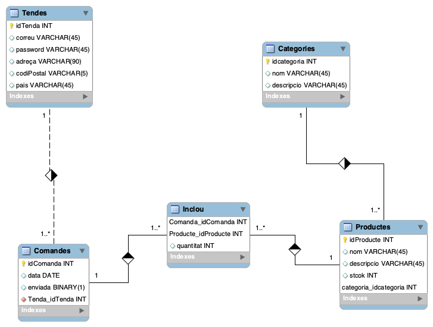

# Exemple d'aplicació completa amb PHP

## Definició del projecte

En l'anàlisi, es defineix la funcionalitat de l'aplicació i les seues limitacions. S'indica les dades que es volen emmagatzemar i es realitze un esquema E/R per a la BBDD. Es definiran:

* Les pantalles que vorà l'usuari
* El fitxers que formaràn l'aplicació i com es pasaran els pràmetres entre ells.
* L'estructura de dades i com manipular-la.
* La base de dades.

Finalment, en la implementació, s'escriuen el fitxers de l'aplicació. 

L'aplicació serà la web de una distribuidora. Tindrem un magatzem central i tendes que fan comandes al magatzem.

## Anàlisi de requeriments

Es requerix realitzar una aplicació per al departament de comandes de la distribuidora d'una cadena de tendes xineses. Les tendes de la cadena utilitzaran l'aplicació per realitzar comandes de productes.
L'aplicació ha de permetre:
* Consultar les categories de productes.
* Consultar els productes.
* Afegir una o més unitats d'un producte a la comanda.
* Consultar la comanda i eliminar productes.
* Realitzar la comanda, actualitzan la base de dades i enviant correus de confirmació a la tenda que fa la comanda i a la central.

Per tal d'accedir a l'aplicació cal autenticar-se. 
De cada categoria es vol emmagatzemar el seu codi, nom, descripció. Dels productes, el seu codi,nom, descripció, quantitat en stock, la categoria a la que pertany,el preu i una imatge. Cada producte pertany a una categoria.

De cada comanda interesa saber:

* La tenda que l'ha realitzat.
* Els productes que s'han demanat, incloent la quantitat.
* La data.
* El preu total
* Si s'ha remés.

Les comandes s'introduiran a la base de dades com a no enviats i el departament de comandes les marcarà com a envidades (l'aplicació no s'encarrega d'això).

De les tendes guardarem:

* El codi
* El correu electrònic.
* La clau
* Pais, adreça i codi postal.

### Esquema Entitat Relació




### Limitacions de l'aplicació

* No hi ha panel d'administració. Els usuaris, categories i productes s'han d'introduir directament a la BBDD
* No hi ha possibilitat d'autoregistre.
* No es control·la l'stock (de moment)

## Disseny de l'aplicació

A partir de l'analisi anterior dissenyarem:

* La base de dades.
* El fluxe de pantalles per a realitzar una comanda.
* L'estructura de dades per a una comanda.
* Els fitxers de l'aplicació i com es passen paràmetres.
* El control d'accés.

### Disseny lògic de la BBDD

A partir de l'esquema anterior s'obtenen les següent taules:

Base de dades **Distribuidora**

Categories(**id**,name,description)
Orders(**id**,date,send,idShop)
OrderLins(**idOrder**,**idProduct**,amount)
Products(**id**,name,description,stock,idCategory,price,image)
Shops(**id**,email,password,adress,PostalCode,country)

Per a passar al disseny físic de la BBDD cal decidir els tipus de dades de les columnes. Així marcarem els correus com a unics i les claus com a autoincrementables. 

```sql
- phpMyAdmin SQL Dump
-- version 4.5.4.1deb2ubuntu2
-- http://www.phpmyadmin.net
--
-- Servidor: localhost
-- Temps de generació: 19-10-2019 a les 19:52:31
-- Versió del servidor: 5.7.21-0ubuntu0.16.04.1
-- Versió de PHP: 7.2.2-1+ubuntu16.04.1+deb.sury.org+1

SET SQL_MODE = "NO_AUTO_VALUE_ON_ZERO";
SET time_zone = "+00:00";


/*!40101 SET @OLD_CHARACTER_SET_CLIENT=@@CHARACTER_SET_CLIENT */;
/*!40101 SET @OLD_CHARACTER_SET_RESULTS=@@CHARACTER_SET_RESULTS */;
/*!40101 SET @OLD_COLLATION_CONNECTION=@@COLLATION_CONNECTION */;
/*!40101 SET NAMES utf8mb4 */;

--
-- Base de dades: `Distribution`
--
CREATE DATABASE IF NOT EXISTS `Distribution` DEFAULT CHARACTER SET utf8 COLLATE utf8_general_ci;
USE `Distribution`;

-- --------------------------------------------------------

--
-- Estructura de la taula `Categories`
--

CREATE TABLE `Categories` (
  `id` int(11) NOT NULL,
  `name` varchar(45) DEFAULT NULL,
  `description` varchar(45) DEFAULT NULL
) ENGINE=InnoDB DEFAULT CHARSET=utf8;

--
-- Bolcant dades de la taula `Categories`
--

INSERT INTO `Categories` (`id`, `name`, `description`) VALUES
(1, 'Begudes', 'Tot tipus de begudes'),
(2, 'Menjar', 'Productes comestibles'),
(3, 'Bateries', 'Tot tipus de bateries'),
(4, 'Joguets', 'Tot tipus de jogets');

-- --------------------------------------------------------

--
-- Estructura de la taula `OrderLines`
--

CREATE TABLE `OrderLines` (
  `idOrder` int(11) NOT NULL,
  `idProduct` int(11) NOT NULL,
  `amount` int(11) DEFAULT NULL
) ENGINE=InnoDB DEFAULT CHARSET=utf8;

-- --------------------------------------------------------

--
-- Estructura de la taula `Orders`
--

CREATE TABLE `Orders` (
  `id` int(11) NOT NULL,
  `date` date DEFAULT NULL,
  `send` binary(1) DEFAULT NULL,
  `idShop` int(11) NOT NULL
) ENGINE=InnoDB DEFAULT CHARSET=utf8;

-- --------------------------------------------------------

--
-- Estructura de la taula `Products`
--

CREATE TABLE `Products` (
  `id` int(11) NOT NULL,
  `name` varchar(45) DEFAULT NULL,
  `description` varchar(45) DEFAULT NULL,
  `stock` int(11) DEFAULT NULL,
  `idCategory` int(11) NOT NULL,
  `price` float NOT NULL,
  `image` varchar(60) NOT NULL
) ENGINE=InnoDB DEFAULT CHARSET=utf8;

--
-- Bolcant dades de la taula `Products`
--

INSERT INTO `Products` (`id`, `name`, `description`, `stock`, `idCategory`, `price`, `image`) VALUES
(3, 'rollito', 'Rollito de primavera', 99, 2, 6, ''),
(4, 'aigua', 'Ampolla d\'aigua', 1000, 1, 0.45, ''),
(5, 'pistola', 'Pistola d\'aigua', 200, 4, 3.5, ''),
(6, 'cafe licor', '1L', 95, 1, 5.99, ''),
(7, 'Pilas AAA', 'piles xicotetes', 1000, 3, 3.4, ''),
(8, 'Quicos', 'Paquete 50gr', 1000, 2, 0.6, '');

-- --------------------------------------------------------

--
-- Estructura de la taula `Shops`
--

CREATE TABLE `Shops` (
  `id` int(11) NOT NULL,
  `mailAdress` varchar(45) DEFAULT NULL,
  `password` varchar(45) DEFAULT NULL,
  `adress` varchar(90) DEFAULT NULL,
  `postalCode` varchar(5) DEFAULT NULL,
  `country` varchar(45) DEFAULT NULL
) ENGINE=InnoDB DEFAULT CHARSET=utf8;

--
-- Bolcant dades de la taula `Shops`
--

INSERT INTO `Shops` (`id`, `mailAdress`, `password`, `adress`, `postalCode`, `country`) VALUES
(1, 'alcoi@tenda.es', '1234', 'Mossen Torregorsa, 2', '03802', 'Espanya'),
(2, 'barcelona@tenda.es', '1234', 'Balmes,340', '46023', 'Catalunya');

--
-- Indexos per taules bolcades
--

--
-- Index de la taula `Categories`
--
ALTER TABLE `Categories`
  ADD PRIMARY KEY (`id`);

--
-- Index de la taula `OrderLines`
--
ALTER TABLE `OrderLines`
  ADD PRIMARY KEY (`idOrder`,`idProduct`),
  ADD KEY `fk_Comanda_has_Producte_Producte1_idx` (`idProduct`),
  ADD KEY `fk_Comanda_has_Producte_Comanda1_idx` (`idOrder`);

--
-- Index de la taula `Orders`
--
ALTER TABLE `Orders`
  ADD PRIMARY KEY (`id`),
  ADD KEY `fk_Comanda_Tenda1_idx` (`idShop`);

--
-- Index de la taula `Products`
--
ALTER TABLE `Products`
  ADD PRIMARY KEY (`id`,`idCategory`),
  ADD KEY `fk_Producte_categoria1_idx` (`idCategory`);

--
-- Index de la taula `Shops`
--
ALTER TABLE `Shops`
  ADD PRIMARY KEY (`id`);

--
-- AUTO_INCREMENT per les taules bolcades
--

--
-- AUTO_INCREMENT per la taula `Categories`
--
ALTER TABLE `Categories`
  MODIFY `id` int(11) NOT NULL AUTO_INCREMENT, AUTO_INCREMENT=5;
--
-- AUTO_INCREMENT per la taula `Orders`
--
ALTER TABLE `Orders`
  MODIFY `id` int(11) NOT NULL AUTO_INCREMENT;
--
-- AUTO_INCREMENT per la taula `Products`
--
ALTER TABLE `Products`
  MODIFY `id` int(11) NOT NULL AUTO_INCREMENT, AUTO_INCREMENT=9;
--
-- AUTO_INCREMENT per la taula `Shops`
--
ALTER TABLE `Shops`
  MODIFY `id` int(11) NOT NULL AUTO_INCREMENT, AUTO_INCREMENT=3;
--
-- Restriccions per taules bolcades
--

--
-- Restriccions per la taula `OrderLines`
--
ALTER TABLE `OrderLines`
  ADD CONSTRAINT `fk_Comanda_has_Producte_Comanda1` FOREIGN KEY (`idOrder`) REFERENCES `Orders` (`id`) ON DELETE NO ACTION ON UPDATE NO ACTION,
  ADD CONSTRAINT `fk_Comanda_has_Producte_Producte1` FOREIGN KEY (`idProduct`) REFERENCES `Products` (`id`) ON DELETE NO ACTION ON UPDATE NO ACTION;

--
-- Restriccions per la taula `Orders`
--
ALTER TABLE `Orders`
  ADD CONSTRAINT `fk_Comanda_Tenda1` FOREIGN KEY (`idShop`) REFERENCES `Shops` (`id`) ON DELETE NO ACTION ON UPDATE NO ACTION;

--
-- Restriccions per la taula `Products`
--
ALTER TABLE `Products`
  ADD CONSTRAINT `fk_Producte_categoria1` FOREIGN KEY (`idCategory`) REFERENCES `Categories` (`id`) ON DELETE NO ACTION ON UPDATE NO ACTION;

/*!40101 SET CHARACTER_SET_CLIENT=@OLD_CHARACTER_SET_CLIENT */;
/*!40101 SET CHARACTER_SET_RESULTS=@OLD_CHARACTER_SET_RESULTS */;
/*!40101 SET COLLATION_CONNECTION=@OLD_COLLATION_CONNECTION */;

```

Partim també d'un fitxer distribuidora.css que conté

```css
/* Creo un tipo de botón personalizado */
.boton{
  width: 100px;
  margin:2px 0;
  background: -webkit-linear-gradient(left, #CAE646, #FFFFFF, #CAE646);
  background: -moz-linear-gradient(left, #CAE646, #FFFFFF, #CAE646);
  background: -o-linear-gradient(left, #CAE646, #FFFFFF, #CAE646);
  background: linear-gradient(left, #CAE646, #FFFFFF, #CAE646);
  background-color: #CAE646;
  -moz-opacity: 0.75;
  opacity: 0.75;
  filter: alpha(opacity=75);
  -moz-border-radius: 5px;
  border-radius: 5px;
  -webkit-border-radius: 5px;
  font-weight: bolder;
}

/* Estado del botón cuando nos situamos sobre él */
.boton:hover{
  cursor: pointer;
  -moz-border-radius: 10px;
  border-radius: 10px;
  -webkit-border-radius: 10px;
  background: -webkit-linear-gradient(left, #FFFFFF, #CAE646, #FFFFFF);
  background: -moz-linear-gradient(left, #FFFFFF, #CAE646, #FFFFFF);
  background: -o-linear-gradient(left, #FFFFFF, #CAE646, #FFFFFF);
  background: linear-gradient(left, #FFFFFF, #CAE646, #FFFFFF);
  background-color: #CAE646;
}
/* Redondeamos las esquinas y le aplicamos un gradiente oblícuo a la pantalla de login*/
fieldset{
  background: -webkit-linear-gradient(left top, #e1f0ff, #fff, #e1f0ff);
  background: -moz-linear-gradient(left top, #e1f0ff, #fff, #e1f0ff);
  background: -o-linear-gradient(left top, #e1f0ff, #fff, #e1f0ff);
  background: linear-gradient(left top, #e1f0ff, #fff, #e1f0ff);
  background-color: #e1f0ff;
  -moz-border-radius: 15px;
  border-radius: 15px;
  -webkit-border-radius: 15px;
}
/* Modificamos la letra del título para el formulario del login*/
legend{
  color: #0b0b79;
  font-style: italic;
  font-weight: bolder;
}
.error {
  font-family: Verdana, Arial, sans-serif; 
  font-size: 0.7em;
  color: #900;
  background-color : #ffff00;
}

.divisor {
  clear:both;
  height:0;
  font-size: 1px;
  line-height: 0px;
}

#login fieldset {
  position: absolute;
  left: 50%;
  top: 50%;
  width: 230px;
  margin-left: -115px;
  height: 160px;
  margin-top: -80px;
  padding:10px;
  border:1px solid #ccc;
  background-color: #eee;
}

#login legend {
  font-family : Arial, sans-serif;
  font-size: 1.3em;
  font-weight:bold;
  color:#333;
}

#login .campo {
  margin-top:8px;
  margin-bottom: 10px;
}

#login label {
  font-family : Arial, sans-serif;
  font-size:0.8em;
  font-weight: bold;
}


#login input[type="text"], #login input[type="password"] {
  font-family : Arial, Verdana, sans-serif;
  font-size: 0.8em;
  line-height:140%;
  color : #000; 
  padding : 3px; 
  border : 1px solid #78eb41;
  height:18px;
  width:220px;
  background-color: #caf79d;
}

#login input[type="submit"] {
  width:100px;
  height:30px;
  padding-left:0px;
}

.pagproductos body, .pagcesta body  {
  font: 100% Verdana, Arial, Helvetica, sans-serif;
  background: #666;
  margin: 0;
  padding: 0;
  text-align: center;
  color: #000000;
}

/* Aplicamos un gradiente oblícuo al fondo del contenedor */
#contenedor { 
  width: 90%;
  margin: 0 auto;
  background: -webkit-linear-gradient(left top, #e1f0ff, #fff, #e1f0ff);
  background: -moz-linear-gradient(left top, #e1f0ff, #fff, #e1f0ff);
  background: -o-linear-gradient(left top, #e1f0ff, #fff, #e1f0ff);
  background: linear-gradient(left top, #e1f0ff, #fff, #e1f0ff);
  background-color: #e1f0ff;
  text-align: left;
} 

/* Redondeamos las esquinas superiores de la cabecera y aplicamos un gradiente
  lineal desde la parte superior*/
#encabezado {
  padding: 10px;
  -moz-border-radius: 10px 10px 0px 0px;
  border-radius: 10px 10px 0px 0px;
  -webkit-border-radius: 10px 10px 0px 0px;
  background: -webkit-linear-gradient(top, #9cf, #fff, #9cf);
  background: -moz-linear-gradient(top, #9cf, #fff, #9cf);
  background: -o-linear-gradient(top, #9cf, #fff, #9cf);
  background: linear-gradient(top, #9cf, #fff, #9cf);
  background-color: #9cf;
} 

/* Cambiamos la fuente para el título de los encabezados */
#encabezado h1 {
  margin: 0; 
  padding: 10px 0;
  color: #0b0b79;
  font-style: italic;
  font-weight: bolder;
}

/* Redondeamos la esquina inferior izquierda y aplicamos un gradiente lineal desde
  su parte superior al recuadro de la cesta en el listado de productos */
.pagproductos #cesta {
  float: right;
  width: 12em;
  padding: 0px 0px 10px 0px;
  -moz-border-radius: 0px 0px 0px 10px;
  border-radius: 0px 0px 0px 10px;
  -webkit-border-radius: 0px 0px 0px 10px;
  background: -webkit-linear-gradient(left, #588, #fff, #588);
  background: -moz-linear-gradient(left, #588, #fff, #588);
  background: -o-linear-gradient(left, #588, #fff, #588);
  background: linear-gradient(left, #588, #fff, #588);
  background-color: #588;
}
.pagproductos #cesta h3 {
  margin-left: 10px;
  margin-right: 10px;
}
.pagproductos #cesta p {
  margin-left: 10px;
  margin-right: 10px;
  font-size: 10px;
}

.pagproductos #cesta input[type="submit"] {
  margin-left: 10px;
  margin-right: 10px;
  margin-bottom: 3px;
  width:100px;
  height:30px;
  padding-left:0px;
}

.pagproductos #productos {
  margin: 0 10em 0 10px;
} 

.pagcesta #productos {
  margin: 10px;
  font-size: 12px;
} 

.pagproductos #productos input, .pagproductos #productos p {
  font-size: 10px;
}

/* Ponemos el margen de los párrafos para las características de los ordenadores */
.ordenador {
  margin: 0 10px;
}

/* Posiciones de los botones, para situarlos a la izquierda y a la derecha */
.izq{
  float: left;
  margin-left: 10px;
  position: relative;
  width: 100px;
}
.dch{
  float: right;
  margin-right: 10px;
  position: relative;
  width: 100px;
}

#productos .codigo {
  width: 20%;
  float: left;
} 

#productos .nombre {
  width: 60%;
  float: left;
} 

#productos .precio {
  width: 20%;
  text-align: right;
  font-weight: bold;
}

/* Para marcar las líneas del listado de los productos cuando no situamos sobre ellas */
#productos form:hover{
  background-color: #b0f898;
}

/* Le redondeamos las esquinas inferiores y le aplicamos un gradiente lineal al pie */
#pie {
  -moz-border-radius: 0px 0px 10px 10px;
  border-radius: 0px 0px 10px 10px;
  -webkit-border-radius: 0px 0px 10px 10px;
  background: -webkit-linear-gradient(top, #9cf, #fff, #9cf);
  background: -moz-linear-gradient(top, #9cf, #fff, #9cf);
  background: -o-linear-gradient(top, #9cf, #fff, #9cf);
  background: linear-gradient(top, #9cf, #fff, #9cf);
  background-color: #9cf;
  padding: 0 10px;
} 

```

### Diagrama de fluxe de pantalles

L'objectiu es representar les pantalles per les que pasa l'usuari al realitzar una operació. El següent diagrama pot ser una possible solució a aquest cas:

### La comanda (order)

L'estructura de dades utilitzada per a una comanda és un dels punts més importants de l'aplicació. per a emmagatzemar-la utilitzarem una variable de sessió.

La comanda serà un array associatiatiu en els que les claus dels elements representen el codi del producte, y el valor, el número de unitats demanades.

L'array comença buïd. Quan s'afeguix un producte a la comanda, cal comprovar si ja hi ha en el array un element amb eixa clau. Si no l'afegueix. Si hi ha un element amb eixe codi, s'afegueixen les unitats al valor actual de l'element.

De la mateixa manera, a l'eliminar productes de la comanda, cal cercar l'element corresponent i restar-li les unitats.

### Control d'accés (login)

Quan es realitza un login amb èxit, es crea una nova sessió i dos variables de sessió:

* Un array amb dos camps. 
	* Un per a guardar el ID de la tenda i el seu correu.
	* La variable per a la comanda.

La resta de fitxers de l'aplicació comencen unint-se a la sessió i comprovant que la primera d'estes variables existeix. En cas contrari, no pot accedir i es redirigueix a la pàgina de login.

### Fitxers de l'aplicació
 
 El següent pas es decidir que fitxers formaràn part de l'aplicació i com es comuniquen entre si.
 
| Ruta | Descripció | Paràmetres | Adreçar-se a |
| -- | -- | -- | -- |
| login.php | Formulari de login | $_GET['redirigit'] $\_POST['usuari'] $\_POST['clau'] |categorias.php | 
| logoff.php | Tanca la sessió | | login.php|
| categories.php | Mostra la llista de categories amb vincles a products.php?category=codigo | | products.php?category=codigo|
| header.php | capçalera  | | | 
| footer.php | peu de pagina amb enllaços | | |
| products.php |  mostra els productes de la categoria, permet afegir a la comanda | $\_GET['category'] | |
| order.php | mostra la comanda, permet llevar productes o confirmar-la | | |
| processOrder.php | Insereix la comanda en la BBDD, envia correus de confirmació i mostra missatges d'exit o error | | |
| deleteOrder.php | Esborra la comanda  | | categories.php |
| bd.php | classe per fer la connexio amb la BBDD | | |
| mail.php | classe per a enviar correus | | |
| myHelpers.php | fitxer amb funcions per fer consultes a la base de dades i relaciones amb les sessions | | |
 
 
### Implementació
  
#### configuració del lloc web
  
  Una vegada completat el disseny de l'aplicació, es pot començar en l'implementació. 
  Anem a crear un directori dins de Code que s'anomene **Distribuidora**.
  Entre a la màquina **homestead** i al directori /home/vagrant/Code/Distribuidora:
  
  * Creem el lloc web al ngnix
 
  ```
  serve distribuidora.my /home/vagrant/Code/Distribuidora/public
  ```
 
  * Ara instal.lem les dependències que ens faràn falta mitjançant composer:
  
  ```
  	composer require phpmailer/phpmailer
  	composer require --dev phpunit/phpunit
  	composer require filp/whoops
  ```
  
 Anem a crear els següents directoris:
 
 * **class** per a guardar les classes.
 * **public** on aniran els fitxers de l'aplicatiu.
 * **public/css** per a guardar els fitxers de css.
 * **public/img** per guadar les imatges (cesta.png).
 * **Helpers** on guardem els fitxers de funcions comunes.

 
     
  Modifiquem el fitxer composer.json per a incloure el fitxer de funcions que s'anomenarà **myHelpers.php** i estarà dins de la carpeta Helpers. Aixì qualsevol funció que estiga dins d'eixe fitxer serà visible des de qualsevol fitxer que carregue el **/vendor/autoload.php**. 
  Al mateix temps farem que les classes penjen del namespace **/App** i que estiguen en el directori **class** i així poder importar-les on calguen.
 Així afegim el següent codi:
 
 ```  
  "autoload": {
        "psr-4":{
            "App\\" : "class/"
        },
        "files": [
            "Helpers/myHelpers.php"
        ]
    } 
 ```     
  
  Partint del disseny anterior es van implementant tots els fitxers:

config/database.php

```php
<?php
return [
    'ip' => '192.168.10.10',
    'nom' => 'Distribution',
    'usuari' => 'homestead',
    'clau' => 'secret'
];
```

config/load.php

```php
<?php
require dirname(__FILE__) . "/../vendor/autoload.php";
$whoops = new \Whoops\Run;
$whoops->pushHandler(new \Whoops\Handler\PrettyPageHandler);
$whoops->register();
```
  
clases/bd.php  

```php
<?php
/**
 * Created by PhpStorm.
 * User: igomis
 * Date: 2019-07-17
 * Time: 12:58
 */

namespace App;

class bd extends \PDO
{

    public function __construct()
    {
        $res = $this->leer_config();
        try {
            return parent::__construct($res[0], $res[1], $res[2]);
        }catch (\PDOException $e){
            echo "Error amb la connexió a la base de dades: ".$e->getMessage();
            exit();
        }

    }

    private function leer_config(){
        $config = require '../config/database.php';
        if (!$config){
            throw new InvalidArgumentException("Revise fichero de configuración");
        }
        $resul = [];
        $resul[] = sprintf("mysql:dbname=%s;host=%s", $config['nom'], $config['ip']);
        $resul[] = $config['usuari'];
        $resul[] = $config['clau'];
        return $resul;
    }

}
```  

clases/mail.php
 
```php 
<?php
/**
 * Created by PhpStorm.
 * User: igomis
 * Date: 2019-07-17
 * Time: 18:50
 */
namespace App;

use PHPMailer\PHPMailer\PHPMailer;

class mail
{
    private $order;
    private $id;
    private $email;

    /**
     * mail constructor.
     * @param $order
     * @param $idShop
     * @param $email
     */
    public function __construct($order, $id, $email)
    {
        $this->order = $order;
        $this->id = $id;
        $this->email = $email;
    }


    public function send(){
        return $this->sendMails("$this->email, igomis@cipfpbatoi.es", "Pedido $this->id confirmado");
    }

    private function doMsgHTML(){
        $products = loadProducts(array_keys($this->order));
        $text = "<h1>Pedido nº $this->id </h1><h2>Restaurante: $this->email </h2>";
        $text .= "Detalle del pedido:";
        $text .= "<table>"; //abrir la tabla
        $text .= "<tr><th>Id</th><th>Nom</th><th>Descripció</th><th>Unitats</th></tr>";

        foreach($products as $product)
            $text .= "<tr><td>$product->id</td><td>$product->name</td><td>$product->description</td><td>".$this->order[$product->id]."</td><td></tr>";

        $text .= "</table>";
        return $text;
    }

    private function sendMails($emailsList,  $subject = ""){
        $mail = new PHPMailer();
        $mail->IsSMTP();
        $mail->SMTPDebug  = 0;  // cambiar a 1 o 2 para ver errores
        $mail->SMTPAuth   = true;
        $mail->SMTPSecure = "tls";
        $mail->Host       = "smtp.gmail.com";
        $mail->Port       = 587;
        $mail->Username   = "cipfpbatoi2daw@gmail.com";  //usuario de gmail
        $mail->Password   = "2dawDWES"; //contraseña de gmail
        $mail->SetFrom('noreply@empresafalsa.com', 'Sistema de pedidos');
        $mail->Subject    = $subject;
        $mail->MsgHTML($this->doMsgHTML());

        foreach(explode(",", $emailsList) as $email){
            $mail->AddAddress($email, $email);
        }
        if(!$mail->Send()) {
            return $mail->ErrorInfo;
        } else {
            return TRUE;
        }
    }
}
```  

Helpers/myHelpers.php

```php 
<?php


use App\bd;

function checkLogin($email, $pass){
	$bd = new bd();
	$sth = $bd->prepare("SELECT id, mailAdress FROM Shops WHERE mailAdress LIKE :email AND password LIKE :pass");
	$resul = $sth->execute(['email' => $email,'pass' => $pass]);
	if($resul){
		return $sth->fetch(PDO::FETCH_OBJ);
	}else{
		return FALSE;
	}
}
function loadCategories(){
    $bd = new bd();
    $sth = $bd->prepare("select * from Categories");
    $resul = $sth->execute();
	if (!$resul) return [];
	return $sth->fetchAll(PDO::FETCH_OBJ);
}
function loadCategory($id){
    $bd = new bd();
	$sth = $bd->prepare( "select * from Categories where id = :id");
    $resul = $sth->execute(['id'=>$id]);
	if (!$resul) return [];
    return $sth->fetch(PDO::FETCH_OBJ);
}
function loadProductsCategory($id){
    $bd = new bd();
	$sth= $bd->prepare("select * from Products where idCategory  = :id");
    $resul = $sth->execute(['id'=>$id]);
	if (!$resul) return [];
    return $sth->fetchAll(PDO::FETCH_OBJ);
}


// recibe un array de códigos de productos
// devuelve un cursor con los datos de esos productos
function loadProduct($id){
    $bd = new bd();
    $sth= $bd->prepare("select * from Products where id  = :id");
    $resul = $sth->execute(['id'=>$id]);
    if (!$resul) return [];
    return $sth->fetch(PDO::FETCH_OBJ);
}

// recibe un array de códigos de productos
// devuelve un cursor con los datos de esos productos
function loadProducts(Array $ids){
    $bd = new bd();
    $setProducts = implode(",", $ids);
    $resul = $bd->query( "select * from Products where id in($setProducts)");
    if (!$resul) return FALSE;
    return $resul->fetchAll(PDO::FETCH_OBJ);
}

function addOrder($order, $idShop){
    $bd = new bd();
	$bd->beginTransaction();	

	$sth = $bd->prepare("insert into Orders(date, send, idShop) values (:hora,:send,:idShop)");
	$resul = $sth->execute(['hora'=>date("Y-m-d H:i:s", time()),'send'=>0,'idShop'=>$idShop]);

    if (!$resul) return FALSE;

	// coger el id del nuevo pedido para las filas detalle
	$idOrder = $bd->lastInsertId();
	// insertar las filas en pedidoproductos

    foreach($order as $id=>$amount){
		$sth =  $bd->prepare("insert into OrderLines(idOrder, idProduct, amount) values( :idOrder, :idProduct, :amount)");
        $resul = $sth->execute(['idOrder'=>$idOrder,'idProduct'=>$id,'amount'=>$amount]);
		if (!$resul) {
			$bd->rollback();
			return FALSE;
		}
	}
	$bd->commit();
	return $idOrder;
}

function checkSession(){
    session_start();
    if(!isset($_SESSION['user'])){
        header("Location: login.php?redirigido=true");
        exit();
    }

}

function dd($var){
    var_dump($var);
    exit();
}

``` 

public/login.php

```php
<?php
require dirname(__FILE__) . "/../config/load.php";


/*formulario de login habitual
si va bien abre sesión, guarda el nombre de usuario y redirige a principal.php 
si va mal, mensaje de error */

if(isset($_GET["redirigido"])) $error = 'Haga login para continuar';
else $error = '';

if ($_SERVER["REQUEST_METHOD"] == "POST") {  
	
	$usu = checkLogin($_POST['usuario'], $_POST['clave']);

	if($usu===false){
        $error = 'Revise usuario y contraseña';
		$usuario = $_POST['user'];
	}else{
		session_start();
		// $usu tiene campos correo y codRes, correo 
		$_SESSION['user'] = $usu;
		$_SESSION['order'] = [];
		header("Location: categories.php");
		return;
	}	
}
?>

<!DOCTYPE html>
<html>
	<head>
		<title>Formulario de login</title>
		<meta charset = "UTF-8">
        <link href="/css/distribuidora.css" rel="stylesheet">
	</head>
	<body>
    <div id='login'>
		<form action = "<?php echo htmlspecialchars($_SERVER["PHP_SELF"]);?>" method = "POST">
            <fieldset>
                <legend>Login</legend>
                <div>
                    <span class='error'><?= $error ?></span>
                </div>
                <div class='campo'>
                    <label for = "usuario">Usuari</label>
                    <input value = "<?php if(isset($usuario))echo $usuario;?>" id = "usuario" name = "usuario" type = "text" maxlength="50" />
                </div>
                <div class='campo'>
                    <label for = "clave">Clau</label>
                    <input id = "clave" name = "clave" type = "password"  maxlength="50" />
                </div>
                <div class='campo' style='text-align: center'>
                    <input type = "submit" class="boton" name="enviar" value="enviar">
                </div>
            </fieldset>
		</form>
    </div>
	</body>
</html>
<body>
``` 

public/logoff.php

```php 
<?php
    require dirname(__FILE__) . "/../config/load.php";
    session_start();
	$_SESSION = array();
	session_destroy();	// eliminar la sesion
	setcookie(session_name(), 123, time() - 1000); // eliminar la cookie
    header("Location: login.php");

``` 

public/header.php

```php 
<?php
require dirname(__FILE__) . "/../config/load.php";
checkSession();
?>
<!DOCTYPE html>
<html>
    <head>
        <meta http-equiv="content-type" content="text/html; charset=UTF-8">
        <title>Tarea 5: Listado de Productos con Plantillas</title>
        <link href="/css/distribuidora.css" rel="stylesheet" type="text/css">
    </head>
    <body class="pagproductos">
        <div id="contenedor">``` 
 
public/footer.php

```php 
            <br class="divisor" />
            <div id="pie">
                <form action='categories.php' method='post'>
                    <!-- Botón del mismo tipo que los demás -->
                    <input type='submit' name='categories' class='boton' style='width:100%;' value='Tornar Categories' ?>
                </form>
                <form action='logoff.php' method='post'>
                    <!-- Botón del mismo tipo que los demás -->
                    <input type='submit' name='desconectar' class='boton' style='width:100%;' value='Desconectar usuario <?= $_SESSION['user']->mailAdress ?>'/>
                </form>
            </div>
        </div>
    </body>
</html>
``` 

public/categories.php

```php 
<?php require 'header.php';?>
<div id="encabezado">
    <h1>Llistat de categories</h1>
</div>
<?php
    $categorias = loadCategories();
    foreach($categorias as $cat){
?>
     <p><a href='products.php?category=<?= $cat->id ?>'><?= $cat->name ?></a></p>
<?php };
    require 'footer.php'; ?>

``` 

public/products.php

```php 
<?php
    require 'header.php';
    $cat = loadCategory($_GET['category']);
    $products = loadProductsCategory($_GET['category']);

    if ($_SERVER["REQUEST_METHOD"] == "POST"){
        $id = $_POST['id'];
        if(isset($_SESSION['order'][$id])){
            $_SESSION['order'][$id] += (int)$_POST['amount'];
        }else{
            $_SESSION['order'][$id] = (int)$_POST['amount'];
        }
    }
?>
    <div id="encabezado">
        <h1>Productes categoria <?= $cat->name ?></h1>
    </div>
    <div id="cesta" style="text-align:center">
        <?php require_once "order.php" ?>
    </div>
    <div id="productos">
        <?php foreach($products as $product){ ?>
        <p>
        <form id='<?= $product->id ?>'  method='post'>
            <label><?= $product->name ?> - <?= $product->description  ?>(<?= $product->stock ?>)</label>
            <input name = 'id' type='hidden' value = '<?= $product->id ?>'>
            <input name = 'amount' type='number' min = '1' value = '1'>
            <input type = 'submit' value='Comprar'>
        </form>
        </p>
        <?php }; ?>
    </div>
<?php require 'footer.php'; ?>
``` 
public/order.php
```php
<?php
require dirname(__FILE__) . "/../config/load.php";
checkSession();
if (isset($_POST['empty']))
    unset($_SESSION['order']);
header("Location: categories.php");
```


public/deleteOrder.php

```php 
<?php
require dirname(__FILE__) . "/../config/load.php";
checkSession();
if (isset($_POST['empty']))
    unset($_SESSION['order']);
header("Location: categories.php");
``` 

public/processOrder.php

```php 
<?php
use App\mail;
require 'header.php';

$error = '';
$idOrder = addOrder($_SESSION['order'], $_SESSION['user']->id);
if($idOrder === FALSE) $error = "No s'ha pogut realitzar la comanda";
else{

	$mail = new mail($_SESSION['order'], $idOrder, $_SESSION['user']->mailAdress);
	$resul =$mail->send();
	if($resul !==TRUE) $error = "Error al enviar correu a ". $_SESSION['user']->mailAdress;
	$_SESSION['order'] = [];
}
?>
<div id="encabezado">
	<h1>Processant Comanda <?= $_SESSION['user']->id ?></h1>
	<p><?= empty($error)?'Comanda Processada amb èxit':$error; ?></p>
</div>
<?php require 'footer.php';?>
``` 

Ha arribat el moment de completar la web amb uns exericisis:
[Exercisi 4.1 Aplicació](4.1.Activitat.md)


Amb tot açó tendriem una primera versió de la web. Però tenim algunes deficiències importants:

* Hi ha codi html barrejat amb php. **Solució : crear vistes.**
* Les funcions sql per consultar a la base de dades comencen a ser importants. Si afeguirem un manteniment de tendes, la cosa aniria a mes. **Solució: separar la capa de la base de dades**

### Plantilles per a vistes

Per a solucionar el problema de les vistes, podem instal.lar algun aplicatiu que faça de motor de plantilles. Este ens permetrà separar el que és el codi html del php, agrupant parts comunes i permetent que criden a la plantilla com si de una funció es tractes des de qualsevol lloc del nostre codi php. Així mateix les plantilles podran, a banda de mostrar el html, executar xicotetes parts de codi per visualitzar els resultats calculats abans. Motor de plantilles tenim entre altes **swing,smarty,blade**.
Nosaltres anem a instal·lar el blade, que és el que gasta laravel.


