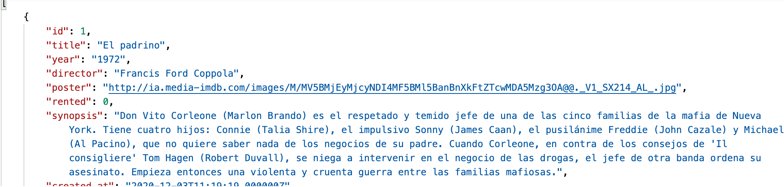
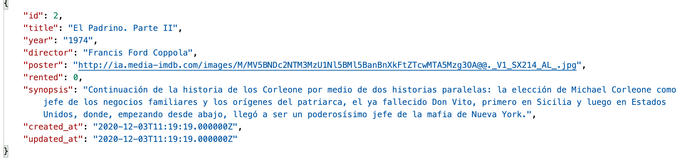
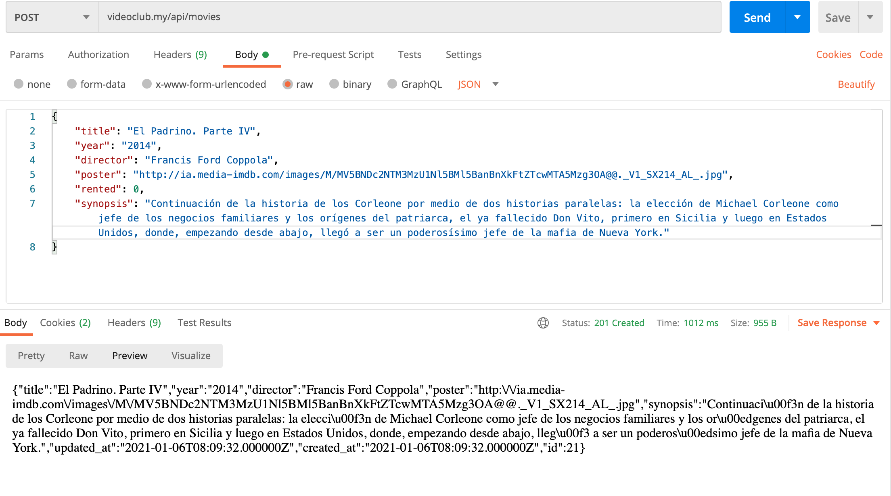
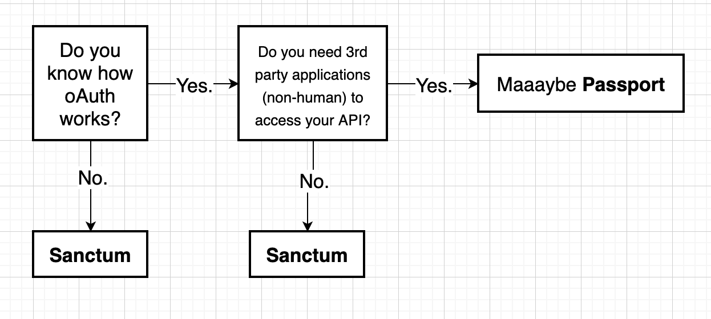

## Desenvolupament de serveis REST

### Introducció als serveis REST

A hores d'ara tots hauríem de tindre clar que qualsevol aplicació web es basa en una arquitectura client-servidor, on un servidor queda a l'espera de connexions de clients, i els clients es connecten als
servidors per a sol·licitar certs recursos. Sobre aquesta base, veurem unes breus pinzellades de com
funciona el protocol HTTP, i en què consisteixen els serveis **REST**.

#### El protocol HTTP

Les comunicacions web entre client i servidor es realitzen mitjançant el protocol **HTTP** (o **HTTPS**, en el cas de comunicacions segures). En tots dos casos, client i servidor s'envien certa informació estàndard,
en cada missatge.

Quant als clients, envien al servidor les dades del recurs que sol·liciten, juntament amb certa informació
addicional, com per exemple les capçaleres de petició (informació relativa a la mena de client o navegador,
contingut que accepta, etc), i paràmetres addicionals anomenats normalment dades del formulari, ja que
 solen contindre la informació d'algun formulari que s'envia de client a servidor.

Pel que respecta als servidors, accepten aquestes peticions, les processen i envien de tornada algunes
dades rellevants, com un codi d'estat (indicant si la petició va poder ser atesa satisfactòriament
o no), capçaleres de resposta (indicant el tipus de contingut enviat, grandària, idioma, etc), i el recurs
sol·licitat pròpiament dit, si tot ha anat correctament.

Aquest és el mecanisme que hem estat utilitzant fins ara a través dels controladors: reben la
petició concreta del client, i envien una resposta, que de moment s'ha centrat en renderitzar un
contingut HTML d'una vista.

Quant als codis d'estat de la resposta, depén del resultat de l'operació que s'haja
realitzat, aquests es cataloguen en cinc grups:

* Codis **1xx**: representen informació sobre una petició normalment incompleta. No són molt
habituals, però es poden emprar quan la petició és molt llarga, i s'envia abans una capçalera
per a comprovar si es pot processar aquesta petició.

* Codis **2xx**: representen peticions que s'han pogut atendre satisfactòriament. El codi més
habitual és el 200, resposta estàndard per a les peticions que són correctes. Existeixen altres variants, com el codi 201, que s'envia quan s'ha inserit o creat un nou recurs en el servidor (una
inserció en una base de dades, per exemple), o el codi 204, que indica que la petició s'ha atés
bé, però no s'ha retornat res com a resposta.

* Codis **3xx**: són codis de redirecció, que indiquen que d'alguna manera la petició original s'ha
redirigit a un altre recurs del servidor. Per exemple, el codi 301 indica que el recurs sol·licitat s'ha
mogut permanentment a una altra URL. El codi 304 indica que el recurs sol·licitat no ha canviat
des de l'última vegada que es va sol·licitar, per si es vol recuperar de la caixet local en aqueix cas.

* Codis **4xx**: indiquen un error per part del client. El més típic és l'error 404, que indica que estem
sol·licitant una URL o recurs que no existeix. Però també hi ha altres habituals, com el 401 (client
no autoritzat), o 400 (les dades de la petició no són correctes, per exemple, perquè els camps del
formulari no són vàlids).

* Codis **5xx**: indiquen un error per part del servidor. Per exemple, l'error 500 indica un error intern del servidor, o el 504, que és un error de **timeout** per temps excessiu a emetre la resposta.

Farem ús d'aquests codis d'estat en els nostres serveis **REST** per a informar el client de la mena d'error
que s'haja produït, o de l'estat en què s'ha pogut atendre la seua petició.

#### Els serveis REST

**REST** són les sigles de REpresentational State Transfer, i designa un estil d'arquitectura d'aplicacions distribuïdes basada en HTTP. En un sistema REST, identifiquem cada recurs a sol·licitar amb una **URI** (identificador uniforme de recurs), i definim un conjunt delimitat de comandos o mètodes a realitzar,que típicament són:

* **GET**: per a obtindre resultats d'algun tipus (llistats complets o filtrats per alguna condició)
POST: per a realitzar insercions o afegir elements en un conjunt de dades
* **PUT**: per a realitzar modificacions o actualitzacions del conjunt de dades

* **DELETE**: per a realitzar esborrats del conjunt de dades

Existeixen altres tipus de comandos o mètodes, com per exemple **PATCH** (similar a PUT, però per a canvis
parcials), **HEAD** (per a consultar només l'encapçalat de la resposta obtinguda), etc. Ens
centrarem de moment en els quatre mètodes principals anteriors.

Per tant, identificant el recurs a sol·licitar i el comando a aplicar-li, el servidor que ofereix aquesta **API REST** proporciona una resposta a aqueixa petició. Aquesta resposta típicament ve donada per un missatge en format **JSON** o XML (encara que aquest cada vegada està més en desús). Això permet que les aplicacions puguen estendre's a diferents plataformes, i accedir als mateixos serveis des d'una aplicació Angular, o una aplicació d'escriptori **.NET**, o una aplicació mòbil en Android, per posar diversos exemples.

ACLARIMENT: per als qui no conegueu la definició de **API** (Application Programming Interface),
bàsicament és el conjunt de mètodes o funcionalitats que es posen a la disposició dels qui els
vulguen utilitzar. En aquest cas, el concepte de **API REST** fa referència al conjunt de serveis REST
proporcionats pel servidor per als clients que vulguen utilitzar-los.


#### [Nivells arquitectura REST](https://www.arquitecturajava.com/arquitecturas-rest-y-sus-niveles/)

#### El format JSON

**JSON** són les sigles de Javascript Object Notation, una sintaxi pròpia de Javascript per a poder representar objectes com a cadenes de text, i poder així serialitzar i enviar informació d'objectes a través de fluxos de dades
(arxius de text, comunicacions client-servidor, etc).
Un objecte Javascript es defineix mitjançant una sèrie de propietats i valors. Per exemple, les dades d'una
persona (com a nom i edat) podríem emmagatzemar-los així:

```javascript
let persona = {
nombre: "Nacho",
edad: 39
};
```

Aquest mateix objecte, convertit a JSON, formaria una cadena de text amb aquest contingut:

```json
{"nombre":"Nacho","edad":39}
```

De la mateixa manera, si tenim una col·lecció (vector) d'objectes com aquesta:

```javascript
let personas = [
{ nombre: "Nacho", edad: 39},
{ nombre: "Mario", edad: 4},
{ nombre: "Laura", edad: 2},
{ nombre: "Nora", edad: 10}
];
```

Transformada a JSON segueix la mateixa sintaxi, però entre claudàtors:

```json
[{"nombre":"Nacho","edad":39}, {"nombre":"Mario","edad":4},
{"nombre":"Laura","edad":2}, {"nombre":"Nora","edad":10}]
```

### Construïnt una API/REST bàsica


Vegem ara quins passos donar per a construir una API REST en Laravel que done suport a les operacions
bàsiques sobre una o diverses entitats: consultes (GET), insercions (POST), modificacions (PUT) i esborrats (DELETE). Emprarem per a això els denominats controladors de API, que comentem breument en
la sessió 3, i que proporcionen un conjunt de funcions ja definides per a donar suport a cadascun d'aquests
comandos.

#### Definint els controlador de la API

Per a proporcionar una API REST als clients que ho requerisquen, necessitem definir un controlador (o
controladors) orientats a oferir aquests serveis REST. Aquests controladors en Laravel es denominen de tipus
**api**, com vam veure en sessions prèvies. Normalment es definirà un controlador API per cadascun dels
models als quals necessitem accedir. Crearem un de prova per a oferir una API REST sobre els
llibres de la nostra aplicació de videoclub.
Existeixen diferents maneres d'executar el comando de creació del controlador de API. Ací mostrarem
potser un dels més útils:

```php
php artisan make:controller Api/MovieController --api --model=Movie
```

Això crearà el controlador en la carpeta **App\Http\Controllers\Api** amb una sèrie de funcions ja predefinides. No és obligatori situar-ho en aqueixa subcarpeta, òbviament, però això ens servirà per a separar els controladors de API de la resta. Aquesta serà l'aparença del controlador generat:

```php
<?php

namespace App\Http\Controllers\Api;

use App\Http\Controllers\Controller;
use App\Models\Movie;
use Illuminate\Http\Request;

class MovieController extends Controller
{
    /**
     * Display a listing of the resource.
     *
     * @return \Illuminate\Http\Response
     */
    public function index()
    {
        //
    }

    /**
     * Store a newly created resource in storage.
     *
     * @param  \Illuminate\Http\Request  $request
     * @return \Illuminate\Http\Response
     */
    public function store(Request $request)
    {
        //
    }

    /**
     * Display the specified resource.
     *
     * @param  \App\Models\Movie  $movie
     * @return \Illuminate\Http\Response
     */
    public function show(Movie $movie)
    {
        //
    }

    /**
     * Update the specified resource in storage.
     *
     * @param  \Illuminate\Http\Request  $request
     * @param  \App\Models\Movie  $movie
     * @return \Illuminate\Http\Response
     */
    public function update(Request $request, Movie $movie)
    {
        //
    }

    /**
     * Remove the specified resource from storage.
     *
     * @param  \App\Models\Movie  $movie
     * @return \Illuminate\Http\Response
     */
    public function destroy(Movie $movie)
    {
        //
    }
}
```

Observem que s'incorpora automàticament la clàusula use per a carregar el model associat, que
hem indicat en el paràmetre **--model** . A més, els mètodes show , update i destroy ja vénen amb un paràmetre de tipus Llibre que facilitarà molt algunes tasques.

Cadascuna de les funcions del nou controlador creat s'associa a un dels mètodes REST comentats
anteriorment:

* index s'associaria amb una operació GET de llistat general, per a obtindre tots els registres (de videos, en aquest cas)

* store s'associaria amb una operació POST, per a emmagatzemar les dades que arriben en la petició
(com un nou video, en el nostre cas)

* show s'associaria amb una operació GET per a obtindre el registre associat a un identificador
concret

* update s'associaria amb una operació PUT, per a actualitzar les dades del registre associat a un
identificador concret

* destroy s'associaria amb una operació DELETE, per a eliminar les dades del registre associat a un
identificador concret

#### Establint les rutes


Una vegada tenim el controlador API creat, definirem les rutes associades a cada mètode del controlador. Si recordem de sessions anteriors, podíem emprar el mètode **Route::resource** en l'arxiu **routes/web.php** per a establir de colp totes les rutes associades a un controlador de recursos.

De manera anàloga, podem emprar el mètode **Route::apiResource** en l'arxiu
**routes/api.php** per a establir automàticament totes les rutes d'un controlador de API. Afegim
aquesta línia en aquest arxiu **routes/api.php** :

```
Route::apiResource('movies',Api\MovieController::class);
```

Les rutes de API (aquelles definides en l'arxiu **routes/api.php** ) per defecte tenen un prefix
api , tal com s'estableix en el provider **RouteServiceProvider** . Per tant, hem definit una
ruta general **api/movies** , de manera que totes les subrutes que es deriven d'ella portaran a l'un o l'altre mètode del controlador de API de video.
Podem comprovar quines rutes hi ha actives amb aquest comando:

```
php artisan route:list

+--------+-----------+--------------------+----------------+--------------------------------------------------+------------+
| Domain | Method    | URI                | Name           | Action                                           | Middleware |
+--------+-----------+--------------------+----------------+--------------------------------------------------+------------+
|        | GET|HEAD  | /                  |                | App\Http\Controllers\HomeController              | web        |
|        | GET|HEAD  | api/movies         | movies.index   | App\Http\Controllers\Api\MovieController@index   | api        |
|        | POST      | api/movies         | movies.store   | App\Http\Controllers\Api\MovieController@store   | api        |
|        | GET|HEAD  | api/movies/{movie} | movies.show    | App\Http\Controllers\Api\MovieController@show    | api        |
|        | PUT|PATCH | api/movies/{movie} | movies.update  | App\Http\Controllers\Api\MovieController@update  | api        |
|        | DELETE    | api/movies/{movie} | movies.destroy | App\Http\Controllers\Api\MovieController@destroy | api        |
|        | GET|HEAD  | api/user           |                | Closure                                          +--------------------------------------------------+------------+

```

#### Serveis GET

Començarem per definir el mètode index . En aquest cas, obtindrem el conjunt de videos de labase de dades i retornar-lo tal qual:

```php
public function index()
{
	$movies = Movie::get();
	return $movies;
}
```

Si accedim a la ruta **api/videos** des del navegador, s'activarà el mètode index que acabem d'implementar, i rebrem els llibres de la base de dades, directament en format JSON.

```json
{
"id": 1,
"title": "El padrino",
"year": "1972",
"director": "Francis Ford Coppola",
"poster": "http://ia.media-imdb.com/images/M/MV5BMjEyMjcyNDI4MF5BMl5BanBnXkFtZTcwMDA5Mzg3OA@@._V1_SX214_AL_.jpg",
"rented": 0,
"synopsis": "Don Vito Corleone (Marlon Brando) es el respetado y temido jefe de una de las cinco familias de la mafia de Nueva York. Tiene cuatro hijos: Connie (Talia Shire), el impulsivo Sonny (James Caan), el pusilánime Freddie (John Cazale) y Michael (Al Pacino), que no quiere saber nada de los negocios de su padre. Cuando Corleone, en contra de los consejos de 'Il consigliere' Tom Hagen (Robert Duvall), se niega a intervenir en el negocio de las drogas, el jefe de otra banda ordena su asesinato. Empieza entonces una violenta y cruenta guerra entre las familias mafiosas.",
"created_at": "2020-12-03T11:19:19.000000Z",
"updated_at": "2020-12-21T10:36:20.000000Z"
},
{
"id": 2,
"title": "El Padrino. Parte II",
"year": "1974",
"director": "Francis Ford Coppola",
"poster": "http://ia.media-imdb.com/images/M/MV5BNDc2NTM3MzU1Nl5BMl5BanBnXkFtZTcwMTA5Mzg3OA@@._V1_SX214_AL_.jpg",
"rented": 0,
"synopsis": "Continuación de la historia de los Corleone por medio de dos historias paralelas: la elección de Michael Corleone como jefe de los negocios familiares y los orígenes del patriarca, el ya fallecido Don Vito, primero en Sicilia y luego en Estados Unidos, donde, empezando desde abajo, llegó a ser un poderosísimo jefe de la mafia de Nueva York.",
"created_at": "2020-12-03T11:19:19.000000Z",
"updated_at": "2020-12-03T11:19:19.000000Z"
}}
```

NOTA: podem instal·lar l'extensió **JSON formatter** per a Chrome, i així poder veure les dades en format JSON més organitzats i amb la sintaxi ressaltada.

D'una forma similar, podríem implementar i provar el mètode show

```php
public function show(Movie $movie)
{
	return $movie;
}
```

En aquest cas, si accedim a la URI **api/movies/1** , obtindrem la informació del video amb id = 1. Notar que Laravel s'encarrega automàticament de buscar el llibre per nosaltres (fer la corresponent operació **find** per a l'id proporcionat). És el que es coneix com a enllaç implícit, i és alguna cosa que
també està disponible en els controladors web normals, sempre que els associem correctament amb el model vinculat. Això es fa automàticament si creem el controlador juntament amb el model o si usem el paràmetre --model per a associar-ho, com hem fet ací.

##### Mes coses sobre el format JSON i la resposta

Després de provar els dos serveis anteriors, hauràs observat que Laravel s'encarrega de transformar directament els registres obtinguts a format JSON quan els enviem mitjançant return , per la qual cosa, en principi, no tenim per què preocupar-nos d'aquest procés. No obstant això, d'aquesta manera s'escapen
algunes coses al nostre control. Per exemple, i sobretot, no podem especificar el codi d'estat de la resposta, que per defecte és 200 si tot ha anat correctament. A més, tampoc podem controlar quina informació enviar de l'objecte en qüestió.

Si volem limitar o formatar la informació a enviar dels objectes que estem tractant, i que no s'envien tots els seus camps sense més, tenim diverses opcions:

* Afegir clàusules **hidden** en els models corresponents, per a indicar que aqueixa informació no ha de ser enviada en cap cas enlloc de l'aplicació. És el que ocorre, per exemple, amb el camp password del model d'Usuari :

```php
protected $hidden = ['password'];
```

* Definir a mà un array amb els camps a enviar en el mètode del controlador. En el cas de la fitxa del video anterior, si només volem enviar el títol i el director, podríem fer una cosa així:

```php
public function show(Movie $movie)
{
	return [
		'titulo' => $movie->title,
		'director' => $movie->director
	];
}
```

* En el cas que el pas anterior siga molt costós (perquè el model té molts camps, o perquè hem de fer el mateix en diverses parts del codi), també podem definir recursos (resources), que permeten separar el codi de la informació a mostrar del propi controlador. [Ací](https://laravel.com/docs/8.x/eloquent-resources) podeu trobar informació sobre aquest tema.

D'altra banda, si volem afegir o modificar més informació en la resposta, com el codi d'estat, l'estructura anterior no ens serveix, ja que sempre s'enviarà un codi 200. Per a això, és convenient emprar el mètode **response()->json(...)** , que permet especificar com a primer paràmetre les dades a enviar, i com segon paràmetre el codi d'estat. Els mètode anterior quedaria així,
enviant un codi 200 com a resposta (encara que si s'omet el segon paràmetre, s'assumeix que és 200):

```php
public function show(Movie $movie)
{
	return response()->json($movie, 200);
}
```

#### Resta dels serveis


Vegem ara com implementar la resta de serveis (POST, PUT i DELETE). En el cas de la inserció (POST), haurem de rebre en la petició les dades de l'objecte a inserir (un llibre, en el nostre exemple). Igual que les dades del servidor al client s'envien en format JSON, és d'esperar en aplicacions que segueixen l'arquitectura REST que les dades del client al servidor també s'envien en format JSON.
El nostre mètode **store** , associat al servei POST, podria quedar d'aquesta manera (retornem el codi d'estat 201, que s'utilitza quan s'han inserit elements nous):

```php
public function store(MoviePost $request)
{
        $movie = new Movie();
        $movie->title = $request->title;
        $movie->year = $request->year;
        $movie->director = $request->director;
        $movie->poster = $request->poster;
        $movie->synopsis = $request->synopsis;
        $movie->save();
        return response()->json($movie, 201);
}
```

De forma semblant tindriem el mètode **update** per al servei PUT. En est cas tornem un codi 200.

```php
 public function update(MoviePost $request, Movie $movie)
    {
        $movie->title = $request->title;
        $movie->year = $request->year;
        $movie->director = $request->director;
        $movie->poster = $request->poster;
        $movie->synopsis = $request->synopsis;
        $movie->save();
        return response()->json($movie);
    }
```    

Finalment, pel servei DELETE, hem d'implementar el mètode **destroy** , que podria quedar així:

```php
public function destroy(Movie $movie)
{
	$movie->delete();
	return response()->json(null, 204);
}
```

Notar que retornem un codi d'estat 204, que indica que no estem retornant contingut (és null). D'altra banda, és habitual en aquesta mena d'operacions d'esborrat retornar en format JSON l'objecte que s'ha eliminat, per si de cas es vol desfer l'operació en un pas posterior. En aquest cas, la resposta del mètode d'esborrat seria així:

```php
return response()->json($movie,204);
```

Com podem començar a intuir, provar aquests serveis no és tan senzill com provar serveis de tipus GET, ja que no podem simplement teclejar una URL en el navegador. Necessitem un mecanisme per a passar-li les dades al servidor en format JSON, i també el mètode (POST, PUT o DELETE).

##### Validació de dades

A l'hora de rebre dades en format JSON per a serveis REST, també podem establir mecanismes de validació similars als vistos per als formularis, a través dels corresponents **requests**, com ja hem fet en els exemples anteriors.

##### Respostes d'error


D'altra banda, hem d'assegurar-nos que qualsevol error que es produïsca en la part del API retorne un contingut en format JSON, i no una pàgina web. Per exemple, si sol·licitem veure la fitxa d'un llibre que el seu id no existeix, no hauria de retornar-nos una pàgina d'error 404, sinó un codi d'estat 404 amb un missatge d'error en format JSON.

Això no es compleix per defecte, ja que Laravel està configurat per a renderitzar una vista amb l'error produït. En el cas de Laravel 8 hem de modificar el mètode **register** dins de la classe **App\Exceptions\Handler.php**. Ho podem deixar de la següent forma:

```php
public function register()
{
	$this->renderable(function (Throwable $exception) {
	if (request()->is('api'))
		{
			if ($exception instanceof ModelNotFoundException)
				return response()->json(['error' => 'Recurso no encontrado'],404);
			else if ($exception instanceof ValidationException)
				return response()->json(['error' => 'Datos no válidos'],400);
			else if (isset($exception))
				return response()->json(['error' => 'Error: ' .$exception->getMessage()], 500);
		}
	});
}
```

### Provant els serveis amb POSTMAN

Ja hem vist que provar uns serveis de llistat (GET) és senzill a través d'un navegador. Però els serveis d'inserció (POST), modificació (PUT) o esborrat (DELETE) exigeixen d'altres eines per a poder ser provats. Podríem definir formularis amb aquests mètodes encapsulats, però l'esforç de definir
aqueixos formularis per a després no utilitzar-los més no mereix molt la pena. Veurem a continuació una eina molt útil per a provar tot tipus de serveis sense necessitat d'implementar gens addicional.

**Postman** és una aplicació gratuïta i multiplataforma que permet enviar tot tipus de peticions a un servidor determinat, i examinar la resposta que aquest produeix. D'aquesta forma, podem comprovar que els serveis ofereixen la informació adequada abans de ser usats per una aplicació client real.

La primera vegada que l'executem ens preguntarà si volem registrar-nos, de manera que puguem compartir els projectes que fem entre els diferents equips en què estiguem registrats, però podem saltar aquest pas fent clic en l'enllaç inferior.

Després d'iniciar l'aplicació, veurem la pantalla d'inici de Postman. Al principi apareixeran diverses opcions en la zona central, per a crear col·leccions o peticions, encara que també les podem crear des del
botó **New** a la cantonada superior esquerra. Per exemple, podem crear una col·lecció "Movies", i apareixerà en el panell esquerre:

Des del mateix botó*New a la cantonada superior esquerra podem crear noves peticions i associar-les a una col·lecció. Existeix una forma alternativa (potser més còmoda) de crear aqueixes peticions, a través del panell
de pestanyes, afegint noves:

#### Afegir peticions GET


Per a afegir una petició, habitualment triarem el tipus de comando sota les pestanyes (GET, POST, PUT, DELETE) i la URL associada a aquest comando. Per exemple:


Llavors, podem fer clic en el botó "Save" en la part dreta, i guardar la petició per a poder-la reutilitzar. En guardar-la, ens demanarà que li assignem un nom (per exemple, "GET movies" en aquest cas), i la
col·lecció en la qual s'emmagatzemarà (la nostra col·lecció de "Movies").


Després, podrem veure la prova associada a la col·lecció, en el panell esquerre, i si seleccionem aquesta prova i premem en el botó blau de "*Send" (part dreta), podem veure la resposta emesa pel servidor en el panell inferior de resposta (si tenim, és clar, el servidor en marxa)



Seguint aquests mateixos passos, podem també crear una nova petició per a obtindre un llibre a partir del seu id, per GET:


Bastaria amb reemplaçar l'id de la URL pel qual vulguem consultar realment. Si provem aquesta petició, obtindrem la resposta corresponent:



#### Afegir altres tipus de peticions

Les peticions POST difereixen de les peticions GET en què s'envia certa informació en el cos de la petició. Aquesta informació normalment són les dades que es volen afegir en el servidor. Com podem fer això amb Postman?
En primer lloc, creem una nova petició, triem el comando POST i definim la URL (en el nostre cas, videoclub.my/api/movies o una cosa similar, depenent de com tinguem en marxa el servidor).
Llavors, fem clic en la pestanya Body, sota la URL, i establim el tipus com **raw** perquè ens deixe escriure'l sense restriccions. També convé canviar la propietat **Text** perquè siga JSON, i que així el servidor reculla el tipus de dada adequada. S'afegirà automàticament una capçalera de petició (**Header**)
que especificarà que el tipus de contingut que s'enviarà són dades JSON. Després, en el quadre de text sota aquestes opcions, especifiquem l'objecte JSON que volem enviar per a inserir:



Després d'això, n'hi ha prou amb guardar la petició com hem fet amb les anteriors, i llançar-la per a veure el resultat.

Quant a les peticions PUT, procedirem de manera similar a les peticions POST: hem de triar el comando (PUT en aquest cas), la URL, i completar el cos de la petició amb les dades que vulguem modificar del contacte. En aquest cas, a més, l'id del llibre l'enviarem també en la pròpia URL:


Per a peticions DELETE, la mecànica és similar a la fitxa de l'element (operació GET), canviant el comando GET per DELETE, i sense necessitat d'establir res en el cos de la petició:


### Autenticació en serveis REST

En una API REST també pot ser necessari protegir certs serveis, de manera que només puguen accedir a ells els usuaris autenticats. No obstant això, en aquest cas no tenim disponible el mecanisme d'autenticació basat en sessions que vam veure en temes anteriors, ja que la parteix client que consula la API
REST no té per què estar basada en un navegador. Podríem accedir des d'una aplicació d'escriptori feta a Java, per exemple, o des d'una aplicació mòbil, i en aquests casos no podríem disposar de les sessions, pròpies de clients web o navegadors. En el seu lloc, emprarem un mecanisme d'autenticació basat en tokens.

#### Fonaments de l'autenticació basada en tokens

L'autenticació basada en tokens és un mecanisme de validació d'usuaris en aplicacions client/servidor que podríem dir que és més universal que l'autenticació basada en sessions, ja que permet autenticar usuaris provinents de diferents tipus de clients. El que es fa és el següent:

* L'usuari necessita enviar les seues credencials (login i password), de manera similar a com es fa en una aplicació web normal, encara que aquesta vegada les dades s'envien normalment en format JSON.
* El servidor valida aqueixes credencials i, si són correctes, genera una cadena de text anomenada **token**, d'una certa longitud, i que servirà per a identificar unívocament a l'usuari a partir d'aqueix moment. Dit token ha de ser enviat de tornada (també en format JSON) al client que es va validar.
* A partir d'aquest punt, el client ha d'adjuntar el token com a part de la informació en cada petició que realitza a una zona d'accés restringit, de manera que el servidor puga consultar el token i comprovar si correspon amb el d'algun usuari autoritzat. Aquest token normalment s'envia en una capçalera de la petició anomenada **Authorization**, com veurem després, i el servidor pot consultar el valor d'aquesta capçalera per a verificar l'accés del client.

#### Alternatives per a la implementació de l'autenticació basada en tokens

Podem emprar diferents alternatives per a l'autenticació basada en tokens baix Laravel. Comentarem dues d'elles.

* D'una banda, podem emprar el mecanisme natiu de Laravel per a autenticació basada en tokens.Com a avantatges principals, no es necessita instal·lar cap dependència addicional, i és relativament senzill d'utilitzar. Com a inconvenients, requereix afegir un camp més a la taula d'usuaris, per a emmagatzemar el token generat per a cada usuari, i requereix també d'una gestió manual del token, encara que és senzilla.

* D'altra banda podem valdre'ns de la llibreria **Laravel Sanctum**, que proporciona mecanismes d'autenticació per a APIs i per a SPAs (Single Page Applications, aplicacions de pàgina única). Entre els seus avantatges podem destacar que és senzilla d'integrar en l'aplicació i automatitza alguns aspectes
de la gestió de tokens, a més de comptar amb el suport oficial de Laravel. Com a inconvenients, és una llibreria més intrusiva que l'anterior, ja que requereix crear una taula addicional on emmagatzemar els tokens.

En els següents apartats veurem com protegir mitjançant tokens un projecte senzill en Laravel emprant cadascun d'aquests mecanismes.

#### Preparant l'entorn

Hem d'editar l'arxiu **App\Exceptions\Hanlder.php** , en concret el seu mètode register per a definir els diferents errors que poden produir-se i els missatges que cal retornar en cada cas:

```php
<?php

namespace App\Exceptions;

use Illuminate\Database\QueryException;
use Illuminate\Foundation\Exceptions\Handler as ExceptionHandler;
use Throwable;
use Illuminate\Validation\ValidationException;
use Illuminate\Auth\AuthenticationException;
use Illuminate\Database\Eloquent\ModelNotFoundException;

class Handler extends ExceptionHandler
{
    /**
     * A list of the exception types that are not reported.
     *
     * @var array
     */
    protected $dontReport = [
        //
    ];

    /**
     * A list of the inputs that are never flashed for validation exceptions.
     *
     * @var array
     */
    protected $dontFlash = [
        'password',
        'password_confirmation',
    ];

    /**
     * Register the exception handling callbacks for the application.
     *
     * @return void
     */
    public function register()
    {
        $this->renderable(function (Throwable $exception) {

            if (request()->is('api*'))
            {
                if ($exception instanceof ModelNotFoundException)
                    return response()->json(['error' => 'Elemento no encontrado'], 404);
                else if ($exception instanceof AuthenticationException)
                    return response()->json(['error' => 'Usuario no autenticado'], 401);
                else if ($exception instanceof ValidationException)
                    return response()->json(['error' => 'Datos no válidos'], 400);
                else if ($exception instanceof QueryException)
                    return response()->json(['error' => 'Datos no válidos'], 400);
                else if (isset($exception))
                    return response()->json(['error' => 'Error en la aplicación (' .get_class($exception) . '):' .$exception->getMessage()], 500);
            }
        });
    }
}
```

#### Autenticació amb token nativa

##### Configuració bàsica

En primer lloc, modifiquem la migració de la taula d'users per a afegir un nou camp on emmagatzemar el token. Aquest camp n'hi ha prou que tinga 60 caràcters de longitud, i serà necessari també que siga únic per a cada usuari:

```
public function up()
    {
        Schema::create('users', function (Blueprint $table) {
            $table->id();
            $table->string('name');
            $table->string('email')->unique();
            $table->timestamp('email_verified_at')->nullable();
            $table->string('api_token', 60)->unique()->nullable();
            $table->string('password');
            $table->rememberToken();
            $table->timestamps();
        });
    }
```  
Llancem la migració i hem de comprovar que el artxiu **config/auth.php** faça referència al model d'usuaris, si utilitzarem un model diferent a User ho canviariem en:

```php
'providers' => [
'users' => [
'driver' => 'eloquent',
'model' => App\Models\Usuario::class,
],
```
No és el cas.

##### Protecció de rutes


Per a protegir les rutes d'accés restringit, primer crearem un controlador que s'encarregue de validar les credencials de l'usuari:

```
php artisan make:controller Api/LoginController
```

Definim un mètode login , per exemple, que validarà les credencials que li arriben (login i password). Si són correctes, generarà una cadena de text aleatòria de 60 caràcters i l'emmagatzemarà en el camp **api_token** de l'usuari validat. També retornarà dit token com a resposta en format JSON. En cas que hi haja un error en l'autenticació, enviarà de tornada un missatge d'error, amb el
codi 401 d'accés no autoritzat.

```php
use App\Http\Controllers\Controller;
use Illuminate\Http\Request;
use Illuminate\Support\Str;
use Illuminate\Support\Facades\Hash;
use App\Models\User;

class LoginController extends Controller
{
	public function login(Request $request)
	{
		$usuario = User::where('email', $request->login)->first();
		if (!$usuario || !Hash::check($request->password, $usuario->password))
		{
			return response()->json(['error' => 'Credenciales no válidas'], 401);
		}
		else
		{
			$usuario->api_token = Str::random(60);
			$usuario->save();
			return response()->json(['token' => $usuario->api_token]);
		}
	}
}
```
Definim en l'arxiu *+routes/api.php** una ruta que redirigisca a aquest mètode, per a quan l'usuari vulga autenticar-se (recorda afegir amb use la corresponent classe):  

```
Route::post('login', [LoginController::class, 'login']);
```

També podem eliminar en aquest cas la ruta predefinida d'aquest arxiu, que empra l'autenticació nativa de Laravel:

```
// Eliminar esta ruta:
Route::middleware('auth:api')->get('/user', function (Request $request) {
return $request->user();
});
```

Per a protegir les rutes que necessitem en els controladors API, les especifiquem en el constructor del controlador. Per exemple, així protegiríem totes les rutes del nostre controlador MovieController , excepte index i show :

```
class MovieController extends Controller
{
public function __construct()
{
	$this->middleware('auth:api',['except' => ['index', 'show']]);
}
...
```

També podem fer-ho en el fitxer de rutes. 

#### Sanctum or Passport

A l'hora de instal·lar una llibreria per a l'autenticació podem triar per Passport que utilitza **OATH2** per autenticació o una versió més simple que no l'utilitza com és Sanctum. Esta senzilla gràfica us pot orientar per saber quin dels dos instal·le. 



#### Autenticació basada en tokens emprant Laravel Sanctum

Com hem comentat anteriorment, **Laravel Sanctum** és una llibreria que proporciona mecanismes d'autenticació per a SPAs (Single Page Applications, aplicacions de pàgina única), i APIs. En el nostre cas, l'emprarem
per a autenticar-nos mitjançant tokens en nostres APIs. 

Els passos a seguir per a laconfiguració són els següents...
En primer lloc, hem d'incorporar Laravel Sanctum al nostre projecte, escrivint aquest comando des de l'arrel d'aquest:

```php
composer require laravel/sanctum
```


Després, hem de publicar la configuració de Sanctum i el seu fitxer de migració, que generarà una taula addicional on emmagatzemar els tokens. Escrivim el següent comando (tot en una línia, encara que ací es divideix en dues per a poder-lo veure complet):

```
php artisan vendor:publish
--provider="Laravel\Sanctum\SanctumServiceProvider"
```

En finalitzar aquest pas, tindrem la migració creada i un arxiu de configuració
**config/sanctum.php** disponible, per a editar la configuració per defecte de la llibreria. Per exemple, podem editar-ho per a especificar el temps de vida (TTL) dels tokens. El següent exemple estableix un temps de vida de 5 minuts, per exemple, encara que en el cas d'aplicacions basades en tokens és habitual
deixar temps molt majors (o indefinits, segons el cas, deixant aquesta propietat a null ):

```
'expiration' => 5,
```

Després, hem de llançar la migració que s'ha creat, juntament amb les quals tinguem pendents (la de la taula d'usuaris, per exemple). S'afegirà una taula anomenada personal_access_tokens a la nostra base de dades.

```
php artisan migrate:fresh --seed
```

Finalment, hem de modificar el model d'usuaris (App\Models\User ) per a afegir el **trait HasApiTokens** . D'aquesta manera es vincula el model d'usuari amb els tokens que es vagen a generar per a aquests.

```
...
use Laravel\Sanctum\HasApiTokens;
class User extends Authenticatable
{
use HasApiTokens, HasFactory, Notifiable;
```

##### Protecció de rutes


Per a protegir les rutes d'accés restringit, primer crearem un controlador que s'encarregue de validar les credencials de l'usuari:

```
php artisan make:controller Api/LoginController
```

Definim un mètode login , per exemple, que validarà les credencials que li arriben (login i password). Si són correctes, cridarà al mètode **createToken** de Sanctum (incorporat a l'usuari a través del **trait HasApiTokens** ), associant-lo al login de l'usuari entrant, i li retornarà el token en
format text pla, com un objecte JSON. En cas que hi haja un error en l'autenticació, enviarà de tornada un missatge d'error, amb el codi 401 d'accés no autoritzat.

```php
use App\Http\Controllers\Controller;
use Illuminate\Http\Request;
use Illuminate\Support\Facades\Hash;
use App\Models\User;

class LoginController extends Controller
{
	public function login(Request $request)
    {
        $usuario = User::where('email', $request->login)->first();
        if (!$usuario || !Hash::check($request->password, $usuario->password))
        {
            return response()->json(['error' => 'Credenciales no válidas'], 401);
        }
        else
        {
            return response()->json(['token' => $usuario->createToken($usuario->email)->plainTextToken]);
        }
    }
}
```

Definim en l'arxiu **routes/api.php** una ruta que redirigisca a aquest mètode, per a quan l'usuari vulga autenticar-se (recorda afegir amb use la corresponent classe):

```php
Route::post('login', 'Api\LoginController@login');
```

També podem eliminar en aquest cas la ruta predefinida d'aquest arxiu, que empra l'autenticació nativa de Laravel:

```
// Eliminar esta ruta:
Route::middleware('auth:api')->get('/user', function (Request $request) {
return $request->user();
});
```

Per a protegir les rutes que necessitem en els controladors API, les especifiquem en el constructor del controlador. Per exemple, així protegiríem totes les rutes del nostre controlador MovieController , excepte index i show :

```
class MovieController extends Controller
{
public function __construct()
{
	$this->middleware('auth:sanctum',['except' => ['index', 'show']]);
}
...
```

### Prova d'autenticació amb POSTMAN

Vegem com provar l'autenticació per token en el projecte de videoclub, per qualsevol dels mètodes vistos abans.
En primer lloc, i després de posar en marxa el projecte, ens assegurarem que podem accedir sense restriccions als dos serveis que no requereixen autorització ( index o show ), igual que abans.


Si accedim a un recurs protegit obtenim 

```json
{ "error": "Credenciales no válidas"}
```

Ara anem a loguejar-se


Ara hem de copiar aquest token, i pegar-ho en la petició d'accés restringit. Haurem de pegar-ho en la capçalera Authorization (obrir aqueixa pestanya sota la URL de la petició en Postman), i el normal és enviar-ho com un **Bearer token**, segons els estàndards. Llavors sí que tindrem la resposta correcta de l'operació
sol·licitada.


A l'hora de traslladar aquestes proves a una aplicació "real", enviaríem les credencials per JSON al servidor, obtindríem el token de tornada i l'emmagatzemaríem localment en alguna variable o suport
(per exemple, en l'element localStorage , si treballem amb algun framework Javascript). Després, davant cada petició JSON que férem al servidor, adjuntaríem aquest token en la capçalera Authorization perquè fóra validat pel servidor.

### Exercisis

#### Exercisi 1 (Branca v7.1)


Sobre el projecte blog , afegirem aquests canvis:

* Crea un controlador de tipus api anomenat PostController en la carpeta App\Http\*Controllers\Api , associat al model Post que ja tenim de sessions prèvies.

* Emplena els mètodes index , show , store , update i destroy perquè, respectivament,facen el següent:

	* index haurà de retornar en format JSON el llistat de tots els posts, amb un codi 200

	* show haurà de retornar la informació del post que rep, amb un codi 200
	* store haurà d'inserir un nou post amb les dades rebudes, amb un codi 201, i utilitzant el
validador de posts que ja vas fer. Per a l'usuari creador del post, passa-li com a paràmetre
JSON un usuari qualsevol de la base de dades.
	* put haurà de modificar els camps del post rebuts, amb un codi 200, i emprant també el validador de posts.
	* destroy haurà d'eliminar el post rebut, retornant null amb un codi 204

Crea una col·lecció en Postman anomenada Blog que definisca una petició per a cadascun dels cinc
serveis implementats. Comprova que funcionen correctament i exporta la col·lecció a un
arxiu.

#### Exercisi 2 (Branca v7.2)

Com a últim exercici d'aquesta sessió, es demana que seguiu els passos indicats per protegir aplicacions basades en serveis REST mitjançant tokens.  El que es demana com a exercicicés que seguiu els passos detallats en qualsevol de les dues opcions  per a protegir el blog.
També heu d'adjuntar la col·lecció de proves de Postman que haureu emprat per a provar la seguretat de l'aplicació.
