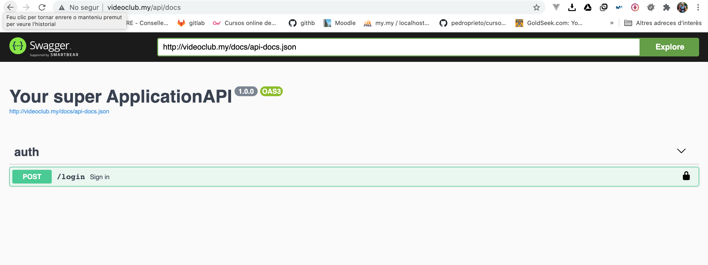

## Desenvolupament de serveis REST

### [Què és swagger](https://www.chakray.com/es/swagger-y-swagger-ui-por-que-es-imprescindible-para-tus-apis/)


### Documentació

Per a poder utilitzar swagger en Laravel podem instal·lar el següent paquet que utilitza Swagger-php i swagger-ui adaptat per treballar amb Laravel.

```
composer require "darkaonline/l5-swagger"
```

i publicarem el fitxers de configuració i vistes

```
php artisan config:cache
php artisan vendor:publish --provider "L5Swagger\L5SwaggerServiceProvider"
```

A continuació, obriu un fitxer **config/l5-swagger.php**.  Passem per les claus essencials: 

* routes.api - Aquest és una URL per accedir a la documentació d'interfície d'usuari.  El vostre equip de frontend l'utilitzarà per accedir a la documentació.  Per defecte és api/documentació.  Podeu canviar-ho a quelcom més petit com api/docs 

* Generar_always — Es millor desactivar-ho ja que generarà documentació sobre la marxa.  No és útil amb l'API gran.  Sempre podeu executar manualment 

```
	php artisan l5-swagger:generate
```

Aquests són els més importants per a començar.  Ara si intenteu crear documents mitjançant aquesta ordre retornarà un error

```
Required @OA\Info() not found
```

Això vol dir que primer heu de crear aquesta notació.  Així que afegim-ho.  Prefereixo crear un controlador abstracte per a una API, però podeu afegir això a **app/Http/Controllers/Controller.php**


```
/**
 * @OA\Info(
 *    title="Your super  ApplicationAPI",
 *    version="1.0.0",
 * )
 */
class Controller extends BaseController
{
    use AuthorizesRequests, DispatchesJobs, ValidatesRequests;
}
```

A continuació, hem d'afegir documents per a almenys una ruta, per exemple per per app/Http/Controllers/Api/LoginController.php:

```
/**
 * @OA\Post(
 * path="/login",
 * summary="Sign in",
 * description="Login by email, password",
 * operationId="authLogin",
 * tags={"auth"},
 * @OA\RequestBody(
 *    required=true,
 *    description="Pass user credentials",
 *    @OA\JsonContent(
 *       required={"email","password"},
 *       @OA\Property(property="email", type="string", format="email", example="user1@mail.com"),
 *       @OA\Property(property="password", type="string", format="password", example="PassWord12345"),
 *       @OA\Property(property="persistent", type="boolean", example="true"),
 *    ),
 * ),
 * @OA\Response(
 *    response=422,
 *    description="Wrong credentials response",
 *    @OA\JsonContent(
 *       @OA\Property(property="message", type="string", example="Sorry, wrong email address or password. Please try again")
 *        )
 *     )
 * )
 */
```
 
 Ara, estàs preparat per generar **php artisan l5-swagger:generate** i vés a l'URL que has proporcionat a la teva configuració.  En el meu cas, serà http://videoclub/api/docs. 

Veuràs una cosa així:



Ara mirarem les anotacions.  Intentaré explicar com utilitzar-les:
 
* **@OA** — significa anotació d'Open API.  Podeu llegir més [aquí](https://swagger.io/specification/) 
* **@OA/POST**  — vol dir petició DE POST.  Hi ha GET, POST, DELETE, etc. 
* **Path** — és un URL 
* **Tags** — us agruparà API per seccions. 
* **@OA\RequestBody** — és obvi pel nom.  Hauria de tenir una anotació JsonContent dins amb propietats (és a dir, descripcions de camp). 
* **OA\Response** — podeu tenir tantes respostes com vulgueu.  Hauríeu de proporcionar totes les respostes possibles d'èxit i error. 

Anem a afegir un codi de resposta 200:

```
* 	@OA\Response(
*     response=200,
*     description="Success",
*     @OA\JsonContent(
*        @OA\Property(property="user", type="object", ref="#/components/schemas/User"),
*     )
*  ),
```

L'anotació **@OA\Property** té una clau de propietat(nom de camp) i un tipus.  El tipus pot tenir valors diferents: string, object, integer, array, boolean, etc. 
En aquesta resposta, vaig utilitzar el tipus objecte.  Podeu passar una referència a aquest objecte.  Crearem un objecte **user**.  Prefereixo afegir això a la classe Model.

```
/**
 *
 * @OA\Schema(
 * required={"password"},
 * @OA\Xml(name="User"),
 * @OA\Property(property="id", type="integer", readOnly="true", example="1"),
 * @OA\Property(property="role", type="string", readOnly="true", description="User role"),
 * @OA\Property(property="email", type="string", readOnly="true", format="email", description="User unique email address", example="user@gmail.com"),
 * @OA\Property(property="email_verified_at", type="string", readOnly="true", format="date-time", description="Datetime marker of verification status", example="2019-02-25 12:59:20"),
 * @OA\Property(property="first_name", type="string", maxLength=32, example="John"),
 * @OA\Property(property="last_name", type="string", maxLength=32, example="Doe"),
 * @OA\Property(property="created_at", ref="#/components/schemas/BaseModel/properties/created_at"),
 * @OA\Property(property="updated_at", ref="#/components/schemas/BaseModel/properties/updated_at"),
 * @OA\Property(property="deleted_at", ref="#/components/schemas/BaseModel/properties/deleted_at")
 * )
 *
 * Class User
 *
 */
```
 
Mireu aquesta notació **@OA\Xml(nom=” Usuari)**.  Aquest nom s'utilitzarà en una clau ref de la **@OA\Property** 

Com podeu veure he utilitzat **#/components/schemas/BaseModel/propertis/* ** per created_at, updated_at i deleted_at.  
Es millor crear un BaseModel abstracte amb anotacions repetibles, encara que pots posar-les on vulgues.  És només la meva manera millor d'estructurar-ho.

Un altre consell per autoritzar alguns URL amb JWT.  Pots afegir un paràmetre de seguretat d'aquesta manera:

```
/**
 * @OA\Post(
 * path="/v1/logout",
 * summary="Logout",
 * description="Logout user and invalidate token",
 * operationId="authLogout",
 * tags={"auth"},
 * security={ {"bearer": {} }},
 * @OA\Response(
 *    response=200,
 *    description="Success"
 *     ),
 * @OA\Response(
 *    response=401,
 *    description="Returns when user is not authenticated",
 *    @OA\JsonContent(
 *       @OA\Property(property="message", type="string", example="Not authorized"),
 *    )
 * )
 * )
 */
``` 

Ara veureu una icona de bloqueig prop de la ruta.  Quan feu clic sobre això, podreu afegir l'autenticació de Bearer.


#### Uns quants exemples més de diferents tipus @OA\Property 

* Podeu utilitzar el format predefinit="email" i fins i tot el patró d'expressió regular.

``` 
@OA\Property(property="email", type="string", pattern="^(?=.*[a-z])(?=.*[A-Z])(?=.*\d).+$", format="email", example="user2@gmail.com"),
``` 

* Podeu utilitzar type=”array” i collectionFormat=”multi” per descriure una matriu d'errors de validació.  Però heu de definir l'anotació **@OA\Items**

``` 
 @OA\Response(
*     response=422,
*     description="Validation error",
*     @OA\JsonContent(
*        @OA\Property(property="message", type="string", example="The given data was invalid."),
*        @OA\Property(
*           property="errors",
*           type="object",
*           @OA\Property(
*              property="email",
*              type="array",
*              collectionFormat="multi",
*              @OA\Items(
*                 type="string",
*                 example={"The email field is required.","The email must be a valid email address."},
*              )
*           )
*        )
*     )
*  )
``` 

* Podeu proporcionar una imatge binària com a exemple si el vostre backend ho permet

``` 
@OA\Property(property="picture", type="string", format="base64", example="data:image/jpeg;base64, yourSuperLongStringBinary"),
``` 

o com a binary

``` 
@OA\Property(property="file", type="string", format="binary"),
``` 
* Quan necessiteu descriure una matriu d'objectes podeu utilitzar la matriu type=”array" i passar l'objecte via @OA\Items

```
@OA\Property(property="data", type="array", @OA\Items(ref="#/components/schemas/City"))
```

#### I alguns exemples més avançats amb paràmetres i esquemes combinats/complexos 

* Podeu crear esquemes combinats utilitzant allOf,anyOf, etc. profileGet esquema contindrà un objecte d'usuari, una matriu d'objectes de classificació d'ordres, etc.

```
/**
 * @OA\Schema(
 *     schema="profileGet",
 * allOf={
 *    @OA\Schema(ref="#/components/schemas/User"),
 *    @OA\Schema(
 *       @OA\Property(property="categories", type="array", @OA\Items(ref="#/components/schemas/OrderCategory")),
 *    ),
 *    @OA\Schema(
 *       @OA\Property(property="locations", type="array", @OA\Items(ref="#/components/schemas/stateCounties")),
 *    ),
 *    @OA\Schema(
 *       @OA\Property(property="avatar", type="object", ref="#/components/schemas/File"),
 *    ),
 *    @OA\Schema(
 *       @OA\Property(property="address", type="object", ref="#/components/schemas/AddressCoordinates"),
 *    )
 * }
 * )
 *
 * @OA\Get(
 * path="/v1/profile",
 * summary="Retrieve profile information",
 * description="Get profile short information",
 * operationId="profileShow",
 * tags={"profile"},
 * security={ {"bearer": {} }},
 * @OA\Response(
 *    response=200,
 *    description="Success",
 *    @OA\JsonContent(
 *       @OA\Property(property="data", type="object", ref="#/components/schemas/profileGet")
 *        )
 *     ),
 * @OA\Response(
 *    response=401,
 *    description="User should be authorized to get profile information",
 *    @OA\JsonContent(
 *       @OA\Property(property="message", type="string", example="Not authorized"),
 *    )
 * )
 * )
 */
```
 
* Quan necessiteu descriure el paràmetre a l'URL (p. ex. /v1/geo/ciutats/{cityId}/zip_codes) podeu utilitzar @OA\Parametre
 
```
 /**
 * @OA\Get(
 * path="/v1/geo/cities/{cityId}/zip_codes",
 * summary="List of zip codes by city",
 * description="Get list of zip codes by city",
 * operationId="geoZipCodes",
 * tags={"geo"},
 * security={ {"bearer": {} }},
 * @OA\Parameter(
 *    description="ID of city",
 *    in="path",
 *    name="cityId",
 *    required=true,
 *    example="1",
 *    @OA\Schema(
 *       type="integer",
 *       format="int64"
 *    )
 * )
 * )
 */
```


