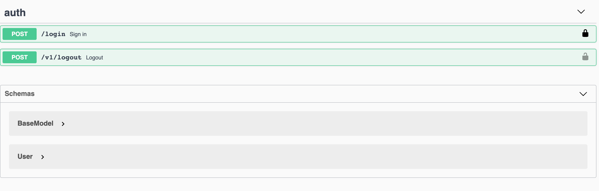

## Desenvolupament de serveis REST

### [Què és swagger](https://www.chakray.com/es/swagger-y-swagger-ui-por-que-es-imprescindible-para-tus-apis/)


### Documentació

Per a poder utilitzar swagger en Laravel podem instal·lar el següent paquet que utilitza Swagger-php i swagger-ui adaptat per treballar amb Laravel.

```
composer require "darkaonline/l5-swagger"
```

i publicarem el fitxers de configuració i vistes

```
php artisan config:cache
php artisan vendor:publish --provider "L5Swagger\L5SwaggerServiceProvider"
```

A continuació, obriu un fitxer **config/l5-swagger.php**.  Passem per les claus essencials: 

* routes.api - Aquest és una URL per accedir a la documentació d'interfície d'usuari.  El vostre equip de frontend l'utilitzarà per accedir a la documentació.  Per defecte és api/documentació.  Podeu canviar-ho a quelcom més petit com api/docs 

* Generar_always — Es millor desactivar-ho ja que generarà documentació sobre la marxa.  No és útil amb l'API gran.  Sempre podeu executar manualment 

```
	php artisan l5-swagger:generate
```

Aquests són els més importants per a començar.  Ara si intenteu crear documents mitjançant aquesta ordre retornarà un error

```
Required @OA\Info() not found
```

Això vol dir que primer heu de crear aquesta notació.  Així que afegim-ho.  Prefereixo crear un controlador abstracte per a una API, però podeu afegir això a **app/Http/Controllers/Controller.php**


```
/**
 * @OA\Info(
 *    title="Your super  ApplicationAPI",
 *    version="1.0.0",
 * )
 */
class Controller extends BaseController
{
    use AuthorizesRequests, DispatchesJobs, ValidatesRequests;
}
```

A continuació, hem d'afegir documents per a almenys una ruta, per exemple per per app/Http/Controllers/Api/LoginController.php:

```
/**
 * @OA\Post(
 * path="/login",
 * summary="Sign in",
 * description="Login by email, password",
 * operationId="authLogin",
 * tags={"auth"},
 * @OA\RequestBody(
 *    required=true,
 *    description="Pass user credentials",
 *    @OA\JsonContent(
 *       required={"email","password"},
 *       @OA\Property(property="email", type="string", format="email", example="user1@mail.com"),
 *       @OA\Property(property="password", type="string", format="password", example="PassWord12345"),
 *       @OA\Property(property="persistent", type="boolean", example="true"),
 *    ),
 * ),
 * @OA\Response(
 *    response=422,
 *    description="Wrong credentials response",
 *    @OA\JsonContent(
 *       @OA\Property(property="message", type="string", example="Sorry, wrong email address or password. Please try again")
 *        )
 *     )
 * )
 */
```
 
 Ara, estàs preparat per generar **php artisan l5-swagger:generate** i vés a l'URL que has proporcionat a la teva configuració.  En el meu cas, serà http://videoclub/api/docs. 

Veuràs una cosa així:


Ara mirarem les anotacions.  Intentaré explicar com utilitzar-les:
 
* **@OA** — significa anotació d'Open API.  Podeu llegir més [aquí](https://swagger.io/specification/) 
* **@OA/POST**  — vol dir petició DE POST.  Hi ha GET, POST, DELETE, etc. 
* **Path** — és un URL 
* **Tags** — us agruparà API per seccions. 
* **@OA\RequestBody** — és obvi pel nom.  Hauria de tenir una anotació JsonContent dins amb propietats (és a dir, descripcions de camp). 
* **OA\Response** — podeu tenir tantes respostes com vulgueu.  Hauríeu de proporcionar totes les respostes possibles d'èxit i error. 

Anem a afegir un codi de resposta 200:

```
* 	@OA\Response(
*     response=200,
*     description="Success",
*     @OA\JsonContent(
*        @OA\Property(property="user", type="object", ref="#/components/schemas/User"),
*     )
*  ),
```

L'anotació **@OA\Property** té una clau de propietat(nom de camp) i un tipus.  El tipus pot tenir valors diferents: string, object, integer, array, boolean, etc. 
En aquesta resposta, vaig utilitzar el tipus objecte.  Podeu passar una referència a aquest objecte.  Crearem un objecte **user**.  Prefereixo afegir això a la classe Model.

```
/**
 *
 * @OA\Schema(
 * required={"password"},
 * @OA\Xml(name="User"),
 * @OA\Property(property="id", type="integer", readOnly="true", example="1"),
 * @OA\Property(property="role", type="string", readOnly="true", description="User role"),
 * @OA\Property(property="email", type="string", readOnly="true", format="email", description="User unique email address", example="user@gmail.com"),
 * @OA\Property(property="email_verified_at", type="string", readOnly="true", format="date-time", description="Datetime marker of verification status", example="2019-02-25 12:59:20"),
 * @OA\Property(property="first_name", type="string", maxLength=32, example="John"),
 * @OA\Property(property="last_name", type="string", maxLength=32, example="Doe"),

 * )
 *
 * Class User
 *
 */
```
 
Mireu aquesta notació **@OA\Xml(nom=” Usuari)**.  Aquest nom s'utilitzarà en una clau ref de la **@OA\Property** 


Ara veureu una icona de bloqueig prop de la ruta.  Quan feu clic sobre això, podreu afegir l'autenticació de Bearer.



### [Exemple](https://blog.quickadminpanel.com/laravel-api-documentation-with-openapiswagger/)

El gran problema d'este component és que no està ben documentat. Partint del següent exemple he documentant el mètode get i post del videoclub i ha quedat així:

Primer cal possar l'inici del swagger en el **Controller.php** de la següent manera:


```
/**
 * @OA\Info(
 *    title="VideoClub ApplicationAPI",
 *    version="1.0.0",
 * )
 */

/**
 * @OA\SecurityScheme(
 *     type="http",
 *     description="Login with email and password to get the authentication token",
 *     name="Token based Based",
 *     in="header",
 *     scheme="bearer",
 *     bearerFormat="JWT",
 *     securityScheme="apiAuth",
 * )
 */
```
La primera part serveix per a identificar el projecte i la segon per a l'autenticació de la API basada en tokens.

Ara omplirem el **model Movie.php** per a generar el schema Movie.

```
/**
 *
 * @OA\Schema(
 * required={"id,title"},
 * @OA\Xml(name="Movie"),
 * @OA\Property(property="id", type="integer", readOnly="true", example="1"),
 * @OA\Property(property="title", type="string", readOnly="true", description="User role"),
 * @OA\Property(property="year", type="integer", readOnly="true",  description="Year", example="1956"),
 * @OA\Property(property="director", type="string", readOnly="true",  description="Director", example="Copolla"),
 * @OA\Property(property="genre", type="string", readOnly="true",  description="Genre", example="Thriller"),
 * )
 */
```
Observeu que en el genre retorne un string perquè serà el que voldrè retornar, en compte de la id de Genre.

Ara generarè el schema de la petició request del post de movie. No és exactament igual que esta perquè ací voldré el genre amb ID i restriccions en alguns camps. Ho puc fer en el **MoviePost.php** dins de request.

```
/**
 * @OA\Schema(
 *      title="Store Movie Request",
 *      required={"title,director,year"},
 *      description="Store Movie request body data",
 *      @OA\Xml(name="MoviePost"),
 * )
 */
 /**
     * @OA\Property(
     *      property = "title",
     *      title="name",
     *      description="Title",
     *      example="Titanic"
     * )
     *
     * @var string
     */
  /**
     * @OA\Property(
     *      property = "year",
     *      title="year",
     *      description="Year",
     *      example="1998"
     * )
     *
     * @var integer
     */
 /**
     * @OA\Property(
     *      property = "genre",
     *      title="genre",
     *      description="Genre",
     *      example="1"
     * )
     *
     * @var integer
     */
 /**
     * @OA\Property(
     *      property = "director",
     *      title="director",
     *      description="Director",
     *      example="Steven Spilberg"
     * )
     *
     * @var string
     */
    /**
     * @OA\Property(
     *      property = "synopsis",
     *      title="synopsis",
     *      description="Synopsis",
     *      example="De que va la pelicula"
     * )
     *
     * @var string
     */

    /**
     * @OA\Property(
     *      property = "poster",
     *      title="poster",
     *      description="Poster",
     *      example="adreça del poster"
     * )
     *
     * @var string
     */         
``` 
No he pogut fer-ho d'un altra manera. Diferix un poc de la que he utilitzat al model Movie, però si no ho feia així no funcionaba.

Falta ara generar la resposta de totes les pelicules per al index. Per aço genere un Resource per a Movies, amb el següent codi.

```php
<?php

namespace App\Http\Resources;

use Illuminate\Http\Resources\Json\JsonResource;
/**
 * @OA\Schema(
 *     title="MovieResource",
 *     description="Project resource",
 *     @OA\Xml(name="MovieResource"),
 * )
 */
class MovieResource extends JsonResource
{
    /**
     * Transform the resource collection into an array.
     *
     * @param  \Illuminate\Http\Request  $request
     * @return array
     */

    /**
     * @OA\Property(
     *     property="data",
     *     title="data",
     *     description="Data wrapper"
     * )
     *
     * @var \App\Models\Movie[]
     */
    public function toArray($request)
    {
        return [ 'id' => $this->id,
            'title' => $this->title,
            'director' => $this->director,
            'year' => $this->year,
            'genre' => $this->Genre->title??'Desconocido'];
    }
}
``` 
Este resource farà que quan l'utilitze hem retornarà els camps que he possat en la funció toArray i no tots els camps. El puc utilitzar per tornar camps de relacions o canviar el nom dels camps. En quan al swagger, noteu que torne un array de Movies dins d'un camp data.

Per últim el controlador de movies queda de la següent manera.

```php
  /**
     * Display a listing of the resource.
     *
     * @return \Illuminate\Http\Response
     */
    /**
     * @OA\Get(
     *      path="/api/movies",
     *      operationId="getMoviesList",
     *      tags={"Movies"},
     *      summary="Get list of movies",
     *      description="Returns list of movies",
     *      @OA\Response(
     *          response=200,
     *          description="Successful operation",
     *          @OA\JsonContent(ref="#/components/schemas/MovieResource")
     *       ),
     *      @OA\Response(
     *          response=401,
     *          description="Unauthenticated",
     *      ),
     *      @OA\Response(
     *          response=403,
     *          description="Forbidden"
     *      )
     *     )
     */
    public function index()
    {

        return MovieResource::collection(Movie::get());
    }

    /**
     * Store a newly created resource in storage.
     *
     * @param  \Illuminate\Http\Request  $request
     * @return \Illuminate\Http\Response
     */
    /**
     * @OA\Post(
     *      path="/api/movies",
     *      operationId="movieProject",
     *      tags={"Movies"},
     *      summary="Store new movie",
     *      description="Returns movie data",
     *      security={ {"apiAuth": {} }},
     *      @OA\RequestBody(
     *          required=true,
     *          @OA\JsonContent(ref="#/components/schemas/MoviePost")
     *      ),
     *      @OA\Response(
     *          response=201,
     *          description="Successful operation",
     *          @OA\JsonContent(ref="#/components/schemas/Movie")
     *       ),
     *      @OA\Response(
     *          response=400,
     *          description="Bad Request"
     *      ),
     *      @OA\Response(
     *          response=401,
     *          description="Unauthenticated",
     *           @OA\JsonContent(
     *              @OA\Property(
     *                  property="error",
     *                  type="string",
     *                  example="Usuario no autenticado"))
     *      ),
     *      @OA\Response(
     *          response=403,
     *          description="Forbidden"
     *      )
     * )
     */
    public function store(MoviePost $request)
    {
        $movie = new Movie();
        $movie->title = $request->title;
        $movie->year = $request->year;
        $movie->director = $request->director;
        $movie->poster = $request->poster;
        $movie->synopsis = $request->synopsis;
        $movie->save();
        response()->json($movie, 201);
    }
```

Mireu que per al post utilitze la seguretat que ja havia definit. 
Ara veureu una icona de bloqueig prop de la ruta.  Quan feu clic sobre això, podreu afegir l'autenticació de Bearer.


Us encomane a que vejau el video on està tot explicat perquè amb els apunt soles queda una mica difícil d'entendre.