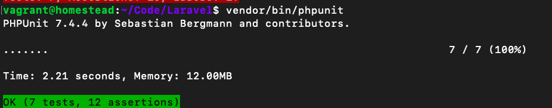

# FRAMEWORK LARAVEL

### Introducció
**Laravel** és un framework de codi obert per al desenvolupament d'aplicacions web en PHP que posseeix una sintaxi simple, expressiva i elegant. Va ser creat en 2011 per Taylor Otwell, inspirant-se en **Ruby on Rails i Symfony**, dels quals ha adoptat els seus principals avantatges.
Laravel facilita el desenvolupament simplificant el treball amb tasques comunes com l'autenticació, el enrutamiendo, gestió sessions, l'emmagatzematge en caché, etc. Algunes de les principals característiques i avantatges de Laravel són:

* Esta dissenyat per a desenvolupar sota el patró **MVC** (model - vista - controlador), centrant-se en la correcta separació i modularització del codi. El que facilita el treball en equip, així com la claredat, el manteniment i la reutilització del codi.
* Integra un sistema **ORM de mapeado de dades relacional** anomenat **Eloquent** encara que també permet la construcció de consultes directes a força de dades mitjançant la seua **Query Builder**.
* Permet la gestió de **bases de dades** i la manipulació de taules des de codi, mantenint un control de versions de les mateixes mitjançant el seu sistema de **Migracions**.
* Utilitza un **sistema de plantilles** per a les vistes anomenat **Blade**, el qual fa ús de la cache per a donar-li major velocitat. Blade facilita la
creació de **vistes** mitjançant l'ús de layouts, herència i seccions.
* Facilita l'extensió de funcionalitat mitjançant paquets o **llibreries externes**. D'aquesta forma és molt senzill afegir paquets que ens
faciliten el desenvolupament d'una aplicació i ens estalvien molt temps de programació.
* Incorpora un **intèrpret de línia de comandos** anomenat **Artisan** que ens ajudarà amb un munt de tasques rutinàries com la creació de
diferents components de codi, treball amb la base de dades i migracions, gestió de rutes, cachés, cues, tasques programades, etc.

### MVC: Model - Vista - Controlador
El model–vista–controlador (MVC) és un patró d'arquitectura de programari que separa les dades i la lògica de negoci d'una aplicació de la interfície d'usuari i el mòdul encarregat de gestionar els esdeveniments i les comunicacions. Per a açò MVC proposa la construcció de tres components diferents que són el model, la vista i el controlador, és a dir, d'una banda defineix components per a la representació de la informació, i d'altra banda per a la interacció de l'usuari. Aquest patró d'arquitectura de programari es basa en les idees de **reutilització de codi** i la **separació de conceptes**, característiques que cerquen facilitar la tasca de desenvolupament d'aplicacions i el seu posterior manteniment.
De manera genèrica, els components de MVC es podrien definir com segueix:

* El **Model**: És la **representació de la informació** amb la qual el sistema opera, per tant gestiona tots els accessos a aquesta informació, tant consultes com a actualitzacions. Les peticions d'accés o manipulació d'informació arriben al 'model' a través del 'controlador'.
* El **Controlador**: **Respon a esdeveniments** (usualment accions de l'usuari) i **invoca peticions al 'model'** quan es fa alguna sol·licitud d'informació (per exemple, editar un document o un registre en una base de dades). Per tant es podria dir que el 'controlador' fa d'intermediari entre la 'vista' i el 'model'.
* La **Vista**: **Presenta el 'model'** i les dades preparades pel controlador a l'usuari de **forma visual**. L'usuari podrà interactuar amb la vista i realitzar altres peticions que s'enviaran al controlador.

###Funcionament bàsic

En aquesta secció anem a analitzar l'estructura d'un projecte, és a dir, on va cada cosa, i a continuació veurem el cicle de vida d'una petició en Laravel.

#### Estructura d'un projecte

En crear un nou projecte de Laravel se'ns generarà una estructura de carpetes i fitxers per a organitzar el nostre codi. És important que coneguem perquè val cada element i on hem de col·locar el nostre codi. Les carpetes que més utilitzarem i les que millor haurem de conèixer són:

* **app** – Conté el codi principal de l'aplicació. Aquesta carpeta al seu torn està dividida en moltes subcarpetas que analitzarem en la següent secció.
* **config** – Ací es troben tots els arxius de configuració de l'aplicació: base dades, cache, correus, sessions o qualsevol altra configuració general de l'aplicació.
* **database** – En aquesta carpeta s'inclou tot el relacionat amb la definició de la base de dades del nostre projecte. Dins d'ella podem trobar al seu torn tres carpetes: factors, migrations i seeds. En el capítol sobre base de dades analitzarem millor el seu contingut.
* **public** – És l'única carpeta pública, l'única que hauria de ser visibleen el nostre servidor web. Tot les peticions i sol·licituds a l'aplicació passen per aquesta carpeta, ja que en ella es troba el index.php, aquest arxiu és el que inicia tot el procés d'execució del
framework. En aquest directori també s'allotgen els arxius CSS, Javascript, imatges i altres arxius que es vulguen fer públics.
* **resources** – Aquesta carpeta conté al seu torn tres carpetes: assets, views i lang:
* **resources/views**–Este directori conté les vistes de la nostra aplicació. En general seran plantilles de HTML que usen els controladors per a mostrar la informació. Cal tenir en compte que en aquesta carpeta **NO** s'emmagatzemen els Javascript, CSS
o imatges, aqueix tipus d'arxius s'han de guardar en la carpeta public.
* **resources/lang** – En aquesta carpeta es guarden arxius PHP que contenen arrays amb els textos del nostre lloc web en
diferents llenguatges, solament serà necessari utilitzar-la en cas que es desitge que l'aplicació es puga traduir.
* **resources/assets** – S'utilitza per a emmagatzemar els fonts dels assets tipus less o sass que s'haurien de compilar per a generar les fulles d'estil públiques. No és necessari usar aquesta carpeta ja que podem escriure directament les les fulles
d'estil dins de la carpeta public.
* **bootstrap** – En aquesta carpeta s'inclou el codi que es carrega per a processar cadascuna de les cridades al nostre projecte. Normalment
no haurem de modificar gens d'aquesta carpeta.
* **storage** – En aquesta carpeta Laravel emmagatzema tota la informació interna necessaris per a l'execució de la web, com són els arxius de sessió, la caché, la compilació de les vistes, fique informació i els logs del sistema. Normalment tampoc haurem de tocar gens
dins d'aquesta carpeta, unicamente se sol accedir a ella per a consultar els logs.
* **routes** – En aquesta carpeta es defineixen totes les rutes del nostre lloc web, enllaçant una URL del navegador amb un mètode d'un controlador. A més ens permet realitzar validacions (mitjançant Middleware) i altres operacions sobre les rutes del nostre lloc.
* **tests**–Esta carpeta se utilitza per als fixers amb les proves automatitzades. Laravel inclou un sistema que facilita tot el procés de
proves amb PHPUnit.
* **vendor** – En aquesta carpeta s'allotgen totes les llibreries i dependències que conformen el framework de Laravel. Aquesta carpeta tampoc l'haurem de modificar, ja que tot el codi que conté són llibreries que s'instal·len i actualitzen mitjançant l'eina **Composer**.
A més en la carpeta arrel també podem trobar dos fitxers molt importants i que també utilitzarem:
* **.env** – Aquest fitxer s'utilitza per a emmagatzemar els valors de configuració que són propis de la màquina o instal·lació actual. El que ens permet canviar fàcilment la configuració segons la màquina en la qual s'instal·le i
tenir opcions diferents per a producció, per a diferents desenvolupadors, etc. Important, aquest fitxer hauria d'estar en el **.gitignore**.
* **composer.json** – Aquest fitxer és l'utilitzat per Composer per a realitzar la instal·lació de Laravel. En una instal·lació inicial
únicament s'especificarà la instal·lació d'un paquet, el propi framework de Laravel, però podem especificar la instal·lació d'altres llibreries o paquets externs que afigen funcionalitat a Laravel.

#### Carpeta App
La carpeta app és la que conté el codi principal del projecte, com són les rutes, controladors, filtres i models de dades. Si accedim a aquesta carpeta veurem que conté al seu torn moltes sub-carpetes, però la principal que anem a utilitzar és la carpeta Http:

* **app/Http/Controllers** – Conté tots els arxius amb les classes dels controladors que serveixen per a interactuar amb els models, les vistes i manejar la lògica de l'aplicació.
* **app/Http/Middleware** – Són els filtres o classes intermèdies que podem utilitzar per a realitzar determinades accions, com la validació de permisos, abans o després de l'execució d'una petició a una ruta del nostre projecte web.

En l'arrel de app també podem trobar el fitxer **User.php**. Aquest fitxer és un model de dades que ve predefinit per Laravel per a treballar amb els usuaris de la web, que inclou mètodes per a fer login, registre, etc. 

#### Funcionament bàsic

El funcionament bàsic que segueix Laravel després d'una petició web a una URL del nostre lloc és el següent:

* Totes les peticions entren a través del fitxer **public/index.php**, el qual en primer lloc comprovarà en el fitxer de rutes (**routes/web.php**) si la URL és vàlida i en cas de ser-ho al fet que controlador ha de fer la petició.

* A continuació cridarà al mètode del controlador assignat per a aquesta ruta. Com hem vist, el controlador és el punt d'entrada de les peticions de l'usuari, el qual, depenent de la petició:
	* Accedirà a la base de dades (si fóra necessari) a través dels "models" per a obtenir dades (o per a afegir, modificar o eliminar).
	* Després d'obtenir les dades necessàries els prepararà per a passar-li'ls a la vista.
	
* En el tercer pas el controlador cridarà a una vista amb una sèrie de dades associades, la qual es prepararà per a
mostrar-se correctament a partir de les dades d'entrada i finalment es mostrarà a l'usuari. 
A continuació s'inclou un xicotet esquema d'aquest funcionament:


### Rutes

Les rutes de la nostra aplicació aplicació s'han de definir en el fitxer routes/web.php. Est és el punt centralitzat per a la definició de rutes i qualsevol ruta no definida en aquest fitxer no serà vàlida, generat una excepció (el que retornarà un error 404).
Les rutes, en la seua forma més senzilla, poden retornar directament un valor des del propi fitxer de rutes, però també podran generar la trucada a una vista o a un controlador. Començarem veient el primer tipus de rutes i en seccions posteriors es tractarà com enllaçar-les amb una vista o amb un controlador.

#### Rutes bàsiques
Les rutes, a més de definir la URL de la petició, també indiquen el mètode amb el qual s'ha de fer aquesta petició. Els dos mètodes més utilitzats i que començarem veient són les peticions tipus GET i tipus POST. Per exemple, per a definir una petició tipus GET hauríem d'afegir el següent codi al nostre fitxer routes.php:
    
	Route::get('/', function()
	{ return 'Hola món!'; });


Aquest codi es llançaria quan es realitze una petició tipus GET a la ruta arrel de la nostra aplicació. Si estem treballant en local aquesta ruta seria http://localhost (en el notre cas **intranet.my**) però quan la web estiga en producció es referiria al domini principal, per exemple: http://www.dirección-de-tu-web.com. 
És important indicar que si es realitza una petició tipus POST o d'un altre tipus que no siga GET a aquesta adreça es retornaria un error ja que aqueixa ruta no està definida.

Per a definir una ruta tipus POST es realitzaria de la mateixa forma però canviant el verb GET per POST:

    
    Route::post('foo/bar', function()
    {
        return 'Hola món!';
    });
    

De la mateixa forma podem definir rutes per a peticions tipus **PUT** o **DELETE**:

    
    Route::put('foo/bar', function () {// });
    
    Route::delete('foo/bar', function () {// });
        

#### Afegir paràmetres a les rutes

Si volem afegir paràmetres a una ruta simplement els hem d'indicar entre claus {} a continuació de la ruta, de la forma:
    
    Route::get('user/{id}', function($id)
    {
    return 'User '.$id; });
    

En aquest cas estem definint la ruta /user/{id}, on echo és requerit i pot ser qualsevol valor. En cas de no especificar cap id es produiria un error. El paràmetre se li passarà a la funció, el qual es podrà utilitzar (com veurem més endavant) para per exemple obtenir dades de la base de dades, emmagatzemar valors, etc.

També podem indicar que un paràmetre és opcional simplement afegint el símbol ? al final (i en aquest cas no donaria error si no es realitza la petició amb aquest paràmetre):

    
    Route::get('user/{name?}', function($name = null)
    {
        return $name;
    });
    
    
##### Checkpoint
A hores d'ara ja hauríem de ser capaces de crear una web amb contingut estàtic, simplement modificant el fitxer de rutes i retornant tot el contingut des d'ací. Però açò no és el correcte perquè acabaríem amb un fitxer routes.php inmens amb tot el codi barrejat en el mateix arxiu. 


### Artisan

Laravel inclou un interfície de línia de comandos (CLI, Command line interface) anomenat **Artisan**. Aquesta utilitat ens va a permetre realitzar múltiples tasques necessàries durant el procés de desenvolupament o desplegament a producció d'una aplicació, per la qual cosa ens facilitarà i accelerarà el treball.
Per a veure una llista de totes les opcions que inclou Artisan podem executar el següent comando en un consola o terminal del sistema en la carpeta arrel del nostre projecte:
    
    php artisan list

Si volem obtenir una ajuda més detallada sobre alguna de les opcions de Artisan simplement hem d'escriure la paraula **help** davant del comando en qüestió, per exemple:

    
    php artisan help migrate
 
A poc a poc anirem veient més opcions de Artisan, de moment anem a comentar solament dues opcions importants: el llistat de rutes i la generació de codi.

#### Llistat de rutes
Per a veure un llistat amb totes les rutes que hem definit en el fitxer routes.php podem executar el comando: 
    
    php artisan route:list

Açò ens mostrarà una taula amb el mètode, l'adreça, l'acció i els filtres definits per a totes les rutes. D'aquesta forma podem comprovar totes les rutes de la nostra aplicació i assegurar-nos que estiga tot correcte.

##### Generació de codi

A través de l'opció make podem generar diferents components de Laravel (controladors, models, filtres, etc.) com si foren plantilles, açò ens estalviarà molt treball i podrem començar a escriure directament el contingut del component. Per exemple, per a crear un nou controlador hauríem d'escriure:

    
    php artisan make:controller TaskController
    


### Vistes

Les vistes són la forma de presentar el resultat (una pantalla del nostre lloc web) de forma visual a l'usuari, el qual podrà interactuar amb ell i tornar a realitzar una petició. Les vistes a més ens permeten separar tota la part de presentació de resultats de la lògica (controladors) i de la base de dades (models).

Per tant no hauran de realitzar cap tipus de consulta ni processament de dades, simplement rebran dades i els prepararan per a mostrar-los com HTML.

##### Definir vistes
Les vistes s'emmagatzemen en la carpeta **resources/views** com a fitxers PHP, i per tant tindran l'extensió .php.

Contindran el codi HTML del nostre lloc web, barrejat amb els **assets** (CSS, imatges, Javascripts, etc. que estaran emmagatzemats en la carpeta public) i una **mica de codi PHP (o codi Blade de plantilles, com veurem més endavant)** per a presentar les dades d'entrada com un resultat HTML.

A continuació s'inclou un exemple d'una vista simple, emmagatzemada en el fitxer resources/views/home.php, que simplement mostrarà per pantalla Hola <nombre    !, on <nombre     és una variable de PHP que la vista ha de rebre com a entrada per a poder mostrar-la.

```html
 <html>    
     <head>    
        <title>El meu Web</title>  
     </head>    
     <body>    
        <h1>Hola <?php echo $nombre; ?></h1>    
     </body>     
 </html> 
```    

#### Referenciar i retornar vistes
Una vegada tenim una vista hem d'associar-la a una ruta per a poder mostrar-la. Per a açò hem d'anar al fitxer routes.php com hem vist abans i escriure el següent codi:

```php    
    Route::get('/', function(){
         return view('home', array('nom' =>'Javi'));
    });
```

En aquest cas estem definint que la vista es retorne quan es faça una petició tipus GET a l'arrel del nostre lloc. L'únic canvi que hem fet pel que fa al que vam veure en la secció anterior de rutes ha sigut en el valor retornat per la funció, el qual genera la vista usant el mètode view i la retorna. Aquesta funció rep com a paràmetres:

* El nom de la vista (en aquest cas home), el qual serà un fitxer emmagatzemat en la carpeta views, acordar-vos que la vista anterior d'exemple l'havíem guardat en resources/views/home.php. Per a indicar el nom de la vista s'utilitza el mateix nom del
fitxer però sense l'extensió .php.
* Com a segon paràmetre rep un array de dades que se li passaran a la vista. En aquest cas la vista rebrà una variable anomenada $nom amb valor "Javi".
* Com hem vist per a referenciar una vista únicament hem d'escriure el nom del fitxer que la conté però sense l'extensió .php. En l'exemple, per a carregar la vista emmagatzemada en el fitxer home.php la referenciem mitjançant el nom home, sense l'extensió .php ni la ruta resources/views.
* Les vistes es poden organitzar en sub-carpetes dins de la carpeta resources/views, per exemple podríem tenir una carpeta resources/views/user i dins d'aquesta totes les vistes relacionades, com per exemple login.php, register.php o profile.php. En aquest cas per a referenciar les vistes que estan dins de sub-carpetes hem d'utilitzar la notació tipus "dot", en la qual les barres que separen les carpetes se substitueixen per punts. Per exemple, per a referenciar la
vista resources/views/user/login.php usaríem el nom user.login, o la resources/views/user/register.php la carregaríem de la forma:

```php    
Route::get('register', function(){
	return view('user.register'); 
});
```    

#### Passar dades a una vista

Com hem vist, per a passar dades a una vista hem d'utilitzar el segon paràmetre del mètode view, el qual accepta un array associatiu. En aquest array podem afegir totes la variables que vulguem utilitzar dins de la vista, ja siguen de tipus variable normal (cadena, sencer, etc.) o un altre array o objecte amb més dades. Per exemple, per a enviar a la vista profile totes les dades de l'usuari que el seu echo rebem a través de la ruta hauríem de fer:

```php    
 Route::get('user/profile/{id}', function($id)
 {
  	$user = // Carregar les dades de l'usuari a partir de $id
 	return view('user.profile', array('user' =>$user)); 
 });
```     

Laravel a més ofereix una alternativa que crea una notació una mica més clara. En lloc de passar un array com a segon paràmetre podem utilitzar el mètode with per a indicar una a una les variables o continguts que volem enviar a la vista:

    
     $view = view('home')->with('nom', 'Javi');
     $view = view('user.profile')
         ->with('user', $user)
         ->with('editable', false);
         
### [Plantilles mitjançant Blade](https://laravel.com/docs/6.x/blade)

Laravel utilitza Blade per a la definició de plantilles en les vistes. Aquesta llibreria permet realitzar tot tipus d'operacions amb les dades, a més de la substitució de seccions de les plantilles per un altre contingut, herència entre plantilles, definició de layouts o plantilles base, etc.

Els fitxers de vistes que utilitzen el sistema de plantilles Blade han de tenir l'extensió **.blade.php**. Aquesta extensió tampoc s'haurà d'incloure a l'hora de referenciar una vista des del fitxer de rutes o des d'un controlador. És a dir, utilitzarem view('home') tant si el fitxer es diu home.php com home.blade.php.

En general el codi que inclou Blade en una vista començarà pels símbols **@** o **{{**, el qual posteriorment serà processat i preparat per a mostrar-se per pantalla. Blade no afig sobrecàrrega de processament, ja que totes les vistes són preprocesadas i escorcollades, per contra ens brinda utilitats que ens ajudaran en el disseny i modularització de les vistes.

#### Mostrar dades
El mètode més bàsic que tenim en Blade és el de mostrar dades, per a açò utilitzarem les claus dobles (**{{ }}**) i dins d'elles escriurem la variable o funció amb el contingut a mostrar:
    
    Hola {{ $name }}.

Com hem vist podem mostrar el contingut d'una variable o fins i tot cridar a una funció per a mostrar el seu
resultat. Blade s'encarrega d'escapar el resultat cridant a htmlentities per a prevenir errors i atacs de tipus XSS. Si en algun cas no volem escapar les dades haurem de cridar a:
    
    Hola {!! $name !!}.

Nota: En general sempre haurem d'usar les claus dobles, especialment si anem a mostrar dades que són proporcionats pels usuaris de l'aplicació. Açò evitarà que injecten símbols que produïsquen errors o injecten codigo javascript que s'execute sense que nosaltres vulguem. Per tant, aquest últim mètode solament hem d'utilitzar-ho si estem segurs que no volem que s'escape el contingut.

#### Mostrar una dada sola si existeix
Per a comprovar que una variable existeix o té un determinat valor podem utilitzar l'operador ternari de la forma:
    
    {{ isset($name) ? $name : 'Valor per defecte' }}
    
O simplement usar la notació que inclou Blade per a aquesta fi: 
    
    {{ $name or 'Valor per defecte' }}
  
#### Comentaris
Per a escriure comentaris en Blade s'utilitzen els símbols **{{-- i --}}**

#### Estructures de control
Blade ens permet utilitzar l'estructura if de les següents formes:
    
    @if( count($users) === 1 )
     Solament hi ha un usuari!
    @elseif (count($users) > 1)
      Hi ha molts usuaris!
    @else
    	No hi ha cap usuari. 
    @endif

En els següents exemples es pot veure com realitzar bucles tipus for, while o foreach:

#####for
    
    @for ($i = 0; $i < 10; $i++)
         El valor actual és {{ $i }}
    @endfor

##### while
    
    @while (true)
       <p>Sóc un bucle while infinit!</p>   
    @endwhile

##### foreach
    
    @foreach ($users as $user)
      <p>   Usuari {{ $user->name }} amb identificador: {{ $user->echo }}</p>    
    @endforeach
    

Aquesta són les estructures de control més utilitzades. Ademas d'aquestes Blade defineix algunes més que podem veure directament en la seua documentació: http://laravel.com/docs/5.7/blade


#### Plantilles

Blade també ens permet la definició de layouts per a crear una estructura HTML base amb seccions que seran
emplenades per altres plantilles o vistes filles. Per exemple, podem crear un layout amb el contingut principal o comú de la nostra web (head, bodi, etc.) i definir una sèrie de seccions que seran emplenats per altres plantilles per a completar el codi. Aquest layout pot ser utilitzat per a totes les pantalles del nostre lloc web, la qual cosa ens permet que en la resta de plantilles no hàgem de repetir tot aquest codi.
A continuació d'inclou un exemple d'una plantilla tipus layoutalmacenada en el fitxer resources/views/layouts/master.blade.php:
    
    <html>    
    	<head>    
     		<title>El meu Web</title>    
     </head>    
     <body>    
      @section('menu')
        Contingut del menu
      @show
     	<div class="container">    
     		 @yield('content')
     	</div>    
     </body>    
    </html>  
  
Posteriorment, en una altra plantilla o vista, podem indicar que estenga el layout que hem creat (amb @extends('layouts.master')) i que complete les dues seccions de contingut que havíem definit en el mateix:

    
    @extends('layouts.master')
    @section('menu')
     @parent
       <p>Aquest contingut és afegit al menú principal.</p>    
    @endsection
    @section('content')
    	<p>Aquest apartat apareixerà en la secció "content".</p>    
   	@endsection
    

Com es pot veure, les vistes que estenen un layout simplement han de sobreescriure les seccions del layout. La directiva @section permet anar afegint contingut en les plantilles filles, mentre que @yield serà substituït pel contingut que s'indique. 
    

#### Incloure sub-vistes

En Blade podem indicar que s'incloga una plantilla dins d'una altra plantilla, per a açò disposem de la instrucció **@include**:
    
    @include('view_name')

Ademas podem passar-li un array de dades a la vista a carregar usant el segon paràmetre del mètode include: 
    
     @include('view_name',array('some'=>'data'))

Aquesta opció és molt útil per a crear vistes que siguen reutilitzables o per a separar el contingut d'una vista en diversos fitxers.

#### Formularis

En quelcom lloc del formulari has d'incloure la directiva de seguretat contra atacs CSRF

```php
<form method="POST" action="/profile">
    @csrf

    ...
</form>
```

També es pot canviar el mètode del formulari a PUT

```php
<form action="/foo/bar" method="POST">
    @method('PUT')

    ...
</form>
```

Hi han directives per a tractar els errors de formulari.


#### Proves amb laravel
En les primeres rutes de la nostra aplicació, utilitzem el navegador per a provar aquestes rutes i URLs. El problema d'aquestes proves en el navegador és que no perduren en el temps ni poden executar-se de forma ràpida / automàtica. Així que avui veurem com podem provar el codi que desenvolupem de forma més intel·ligent, utilitzant el component de proves automatitzades que ve inclòs amb Laravel.

##### Directori de proves
Laravel inclou en el directori principal del teu projecte un directori anomenat /tests. En aquest directori anem a escriure codi que es va a encarregar de provar el codi de la resta de l'aplicació. Aquest directori està separat en dos subdirectoris:
* El directori Feature on escrivim proves que emulen peticions HTTP al servidor.
* El directori Unit on escrivim proves que s'encarreguen de provar parts individuals de l'aplicació (com a classes i mètodes).

##### Escrivint una prova
El comanament per a generar noves proves és **php artisan make:test NombreDeLaPruebaTest**
En la prova simularem una petició HTTP GET a la URL del mòdul d'usuaris. Amb **assertStatus** comprovem que la URL carrega de forma correcta verificant que el status HTTP siga 200. Amb el mètode **assertSee**  comprovem que podem veure el text “Usuaris”:
    
    / @test /
    function it_loads_the_users_lists_page(){
    	$this->get(‘usuaris)->assertStatus(200)->assertSee(‘Usuaris’);
    	}
    

Perquè PHPUnit execute el mètode com una prova, has de col·locar l'anotació / @test / abans de la declaració
del mètode o col·locar el prefix test_ en el nom del mètode com a tal: 

    
	function test_it_loads_the_users_lists_page(
		{	
		$this->get(‘usuaris)->assertStatus(200)->assertSee(‘Usuaris’);
		}
    

En cas contrari el mètode NO serà executat com una prova, la qual cosa és útil perquè ens permet agregar mètodes helpers dins de la nostra classe de proves.

##### Notes

* Pots executar les proves amb vendor/bin/phpunit o crear un àlies per a la consola (àlies t=vendor/bin/phpunit).
* Pots llegir sobre els mètodes d'assercions disponibles en la documentació de Laravel.


#  VideoClub

Com a exemple anem a desenvolupar una xicoteta web per a la gestió interna d'un videoclub, començarem per definir les rutes i vistes del lloc i a poc a poc en els següents exercicis l'anirem completant fins a acabar el lloc web complet.

L'objectiu és realitzar un lloc web per a la gestió interna en un videoclub, el qual estarà protegit mitjançant usuari i contrasenya. Una vegada autoritzat l'accés, l'usuari podrà llistar el catàleg de pel·lícules, veure informació detallada d'una pel·lícula, realitzar cerques o filtrats i algunes operacions més de gestió.

### Exercici 1 - Definició de les rutes

En aquest exercici anem a definir les rutes principals que va a tenir el nostre lloc web. Per a començar simplement indicarem que les rutes retornen una cadena (així podrem comprovar que s'han creat correctament). A continuació s'inclou una taula amb les rutes a definir (totes de tipus  GET) i el text que han de mostrar:

| Ruta | Text a mostrar | 
| -- | -- |
| /	  |	Pantalla principal |
| login | Login usuari |
| logout | Logout usuari |
| catalog  | Llistat pel·lícules |
| catalog/show/{id}| Vista detall pel·lícula {id} |
| catalog/create  | Afegir pel·lícula |
| catalog/edit/{id}| Modificar pel·lícula {id} |


##### Solució:

```php
   Route::get('/', function () { return 'Pagina principal';});
    Route::get('login', function () { return 'Login usuari';});
    Route::get('logout', function () { return 'Logout usuari';});
    Route::get('catalog', function () { return 'Llistat pel.licules';});
    Route::get('catalog/show/{id}', function () { return "Vista detall pel.licula $id";});
    Route::get('catalog/create', function () { return 'Afegir pel.licula';});
    Route::get('catalog/edit/{id}', function () {return "Modificar pel.licula $id";});
```

Per a comprovar que les rutes s'hagen creat correctament utilitza el comando de  artisan que retorna un llistat de rutes i a més prova també les rutes en el navegador.

```php
php artisan route:list
```


### Exercici 2 -  Layout principal de les vistes amb  Bootstrap 

En aquest exercici anem a crear el  layout base que van a utilitzar la resta de vistes del lloc web i a més inclourem la llibreria  Bootstrap per a utilitzar-la com a estil base.
Laravel 5.8 ja inclou bootstrap però laravel 6.0 no. Així que cal instalar-lo:

* Fes **composer require laravel/ui**
* Despres **php artisan ui bootstrap**

* Fes **npm install** des de la linea de comanaments. Acò instal.larà tots els paquets que estàn en el packaje.son en el directori **node_modules**

* Fes **npm run-dev** des de la linea de comanaments. Aço compilarà totes les dependències i les ficarà en els fitxers **public/css/app.cs** i **public/js/app.js**. 

Dels materials que ens hem descarregat copiem la plantilla per a la barra de navegació principal (navbar.blade.php) i l'emmagatzemem en la carpeta  resources/views/partials.
A continuació anem a crear el **layout principal** del nostre lloc:

* Anem a crear el fitxer **resources/views/layouts/master.blade.php**.
* Li afegim com contingut la plantilla base HTML que proposa  Bootstrap en la seua [documentació](https://getbootstrap.com/docs/4.4/getting-started/introduction/)
, modificant els següents elements:
 * Canviem les rutes per a la càrrega dels  assets que venen en laravel per defecte. Per a generar la ruta completa i que trobe els recursos haurem d'escriure els següents comandos:

			.....
			<!-- Bootstrap -->
			<meta name="csrf-token" content="{{ csrf_token() }}">
			<link href="{{ asset('css/app.css') }}" rel="stylesheet">
			.....
			<script src="{{ asset('js/app.js') }}" ></script>
     
* Dins de la secció <body> de l'HTML, eliminem el text que ve d'exemple (\<h1> Hello,  world! \</h1>) i incloem la barra de navegació que hem guardat abans utilitzant el següent codi:


		@include('partials.navbar')


* A continuació de la barra de navegació afegim la secció principal on apareixerà el contingut de la web:

		<div class="container"> @yield('content')</div>
	
Amb açò ja hem definit el layout principal, no obstant açò encara no podem provar-ho ja que no està associat a cap ruta. 

##### Solució:

```php
<!DOCTYPE html>
	<html lang="es">
	  <head>
	    <meta charset="utf-8">
	    <meta http-equiv="X-UA-Compatible" content="IE=edge">
	    <meta name="viewport" content="width=device-width, initial-scale=1">
	    <!-- The above 3 meta tags *must* come first in the head; any other head content must come *after* these tags -->
	    <title>Video Club</title>
	    <meta name="csrf-token" content="{{ csrf_token() }}">
	    <!-- Bootstrap -->
	     <link href="{{ asset('css/app.css') }}" rel="stylesheet">
	  </head>
	  <body>
	    @include('partials.navbar')
	    <div id='app' class="container"> @yield('content')</div>
	   
	    <!-- Scripts -->
	    <script src="{{ asset('js/app.js') }}" ></script>
	  </body>
	</html>
```

### Exercici 3 - Crear la resta de vistes

En aquest exercici anem acabar una primera versió estable de la web. En primer lloc crearem les vistes associades a cada ruta, les quals hauran d'estendre del  layout que hem fet en l'exercici anterior i mostrar (en la secció de  content del  layout) el text d'exemple que havíem definit per a cada ruta en l'exercici 2.
En general totes les vistes tindran un codi similar al següent (variant únicament la secció  content):

 	@extends('layouts.master')
	@section('content')
 		Pantalla principal 
	@stop

Per a organitzar millor les vistes les anem a agrupar en  sub-carpetes dins de la carpeta  resources/views seguint la següent estructura:

| Vista | Carpeta | Ruta associada |
|--|--|--|
| home.blade.php |  resources/views/ | / |
| login.blade.php |  resources/views/auth/ |  login |
| index.blade.php | resources/views/catalog/ | catalog |
| show.blade.php  | resources/views/catalog/ | catalog/show/{ id} |
| create.blade.php | resources/views/catalog/ | catalog/ create |
| edit.blade.php |  resources/views/catalog/ |  catalog/edit/{id} |

Creem una vista separada per a totes les rutes excepte para la ruta " logout", la qual no tindrà cap vista.
Finalment anem a actualitzar les rutes del fitxer  routes/web.php perquè es carreguen les vistes que acabem de crear. Acordar-vos que per a referenciar les vistes que estan dins de carpetes la barra / de separació es transforma en un punt, i que a més, com a segon paràmetre, podem passar dades a la vista. A continuació s'inclouen alguns exemples:

	return view('home');
	return view('catalog.index');
	return view('catalog.show',array('id'=>$id));
 
Una vegada fets aquests canvis ja podem provar-ho en el navegador, el qual hauria de mostrar en tots els casos la plantilla base amb la barra de navegació principal i els estils de  Bootstrap aplicats. En la secció principal de contingut de moment solament podrem veure els textos que hem posat d'exemple.


##### Solució:

web.php

```php
	Route::get('/', function () { return view('home');});
	Route::get('login', function () {return view('login');});
	Route::get('logout', function () { return 'Logout usuari';});
	Route::get('catalog', function () { return view('index');});
	Route::get('catalog/show/{id}', function ($id) { return view('show',['pelicula'=>$id]);});
	Route::get('catalog/create', function () { return view('create');});
	Route::get('catalog/edit/{id}', function ($id) {return view('edit',['pelicula' =>$id]);});
```
	
edit.blade

```php
	@extends('layouts.master')
	@section('content')
    	Editar pel.licula id {{$pelicula}}
	@stop
```	

show.blade

```php
	@extends('layouts.master')
	@section('content')
    	Mostrar pel.licula id {{$pelicula}}
	@stop
```	

create.blade

```php
	@extends('layouts.master')
	@section('content')
    	Crear pel.licula 
	@stop
```	

home.blade

```php
	@extends('layouts.master')
	@section('content')
    	Pagina principal 
	@stop
```	

index.blade

```php
	@extends('layouts.master')
	@section('content')
    	Catalogo
	@stop
```	

login.blade

```php
	@extends('layouts.master')
	@section('content')
    	Login
	@stop
```	


### Exercici 4 - Crear les proves

Crea un fitxer de proves en la consola del  artisan

	php artisan make:test BasicTest
 
Crea un prova per a  comprobrar que va la pantalla d'inici:

```php
public function testLoadHomePage(){ 
	$this->get('/')->assertStatus(200)->assertSee('Pantalla principal');
}
``` 	
Comprova totes les vistes:

##### Solució

```php
class BasicTest extends TestCase
{
    public function testLoadHomePage(){ 
        $this->get('/')->assertStatus(200)->assertSee('Pantalla principal');
    }
    public function testLoadCatalogPage(){ 
        $this->get('/catalog')->assertStatus(200)->assertSee('Catalogo');
    }
    public function testLoadCreatePage(){ 
        $this->get('/catalog/create')->assertStatus(200)->assertSee('Crear pel.licula');
    }
    public function testLoadEditPage(){ 
        $this->get('/catalog/edit/2')->assertStatus(200)->assertSee('Editar pel.licula id 2');
    }
    public function testLoadShowPage(){ 
        $this->get('/catalog/show/2')->assertStatus(200)->assertSee('Mostrar pel.licula id 2');
    }
}
```




    
