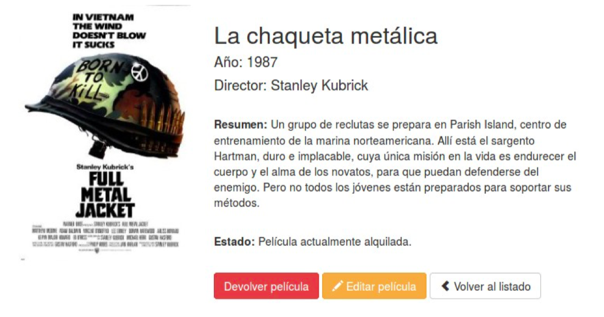

# FRAMEWORK LARAVEL


### Controladors
Fins al moment hem vist solament com retornar una cadena per a una ruta i com associar una vista a una ruta directament en el fitxer de rutes. Però en general la forma recomanable de treballar serà associar aquestes rutes a un mètode d'un controlador. Açò ens permetrà separar molt millor el codi i crear classes (controladors) que agrupen tota la funcionalitat d'un determinat recurs. Per exemple, podem crear un controlador per a gestionar tota la lògica associada al control d'usuaris o qualsevol altre tipus de recurs.

Com ja vam veure en la secció d'introducció, els controladors són el punt d'entrada de les peticions dels usuaris i són els que han de contenir tota la lògica associada al processament d'una petició, encarregant-se de realitzar les consultes necessàries a la base de dades, de preparar les dades i de cridar a la vista corresponent amb aquestes dades.

#### Controlador bàsic

Els controladors s'emmagatzemen en fitxers PHP en la carpeta **app/Http/Controllers** i normalment se'ls afig el sufix Controller, per exemple **UserController.php** o MoviesController.php. A continuació s'inclou un exemple bàsic d'un controlador emmagatzemat en el fitxer app/Http/Controllers/
UserController.php:

```php 
<?php
	namespace App\Http\Controllers;
	use App\User;
	use App\Http\Controllers\Controller;

	class UserController extends Controller {
	/**
		Mostrar información de un usuario.  @param 			int $id
		@return Response
	**/
	public function showProfile($id) {
		$user = User::findOrFail($id);
		return view('user.profile', ['user' => $user]); }
		}
```		

Tots els controladors han d'estendre la classe base **Controller**. Aquesta classe ve ja creada per defecte amb la instal·lació de Laravel, la podem trobar en la carpeta **app/Http/Controllers**. S'utilitza per a centralitzar tota la lògica que es vaja a utilitzar de forma compartida pels controladors de la nostra aplicació. Per defecte solament carrega codi per a validació i autorització, però podem afegir en la mateixa tots els mètodes que necessitem.

En el codi d'exemple, el mètode showProfile(id) l'única cosa que realitza és obtenir les dades d'un usuari, generar la vista user.profile a partir de les dades obtingudes i retornar-la com a valor de tornada perquè es mostre per pantalla.

Una vegada definit un controlador ja podem associar-ho a una ruta. Per a açò hem de modificar el fitxer de rutes **routes.php** de la forma:

```php 
Route::get('user/{id}', 'Usercontroller@showprofile');
``` 
	
En lloc de passar una funció com a segon paràmetre, hem d'escriure una cadena que continga el nom del controlador, seguit d'una arrova **@** i del nom del mètode que volem associar. No és necessari afegir res més, ni els paràmetres que rep el mètode en qüestió, tot açò es fa de forma automàtica.

#### Crear un nou controlador
Com hem vist els controladors s'emmagatzemen dins de la carpeta app/Http/Controllers com a fitxers PHP. Per a crear un de nou ben el podem fer a mà i emplenar nosaltres tot el codi, o podem utilitzar el següent comando de Artisan que ens avançarà tot el treball:

	php artisan make:controller MoviesController

Aquest comando crearà el controlador MoviesController dins de la carpeta app/Http/Controllers i ho completarà amb el codi bàsic que hem vist abans. En afegir l'opció --plain li indiquem que no afegisca cap mètode al controlador, per la qual cosa el cos de la classe estarà buit. De moment anem a utilitzar aquesta opció per a afegir nosaltres mateixos els mètodes que necessitem. 

#### Controladors i espais de noms

També podem crear sub-carpetes dins de la carpeta Controllers per a organitzar-nos millor. En aquest cas, l'estructura de carpetes que creem no tindrà res a veure amb la ruta associada a la petició i, de fet, a l'hora de fer referència al controlador únicament haurem de fer-ho a través del seu espai de noms.

Com hem vist en referenciar el controlador en el fitxer de rutes únicament hem d'indicar el seu nom i no tota la ruta ni l'espai de noms App\Http\Controllers. Açò és perquè el servei encarregat de carregar les rutes afig automàticament l'espai de noms arrel per als controladors. 
Si fiquem tots els nostres controladors dins del mateix espai de noms no haurem d'afegir res més. Però si decidim crear sub-carpetes i organitzar els nostres controladors en sub-espais de noms, llavors sí que haurem d'afegir aqueixa part.

Per exemple, si vam crear un controlador en **App\Http\Controllers\Photos\AdminController**, llavors per a registrar una ruta fins a aquest controlador hauríem de fer:

	Route::get('foo', 'Photos\Admincontroller@method');

#### Controladors resource

Laravel resource assigna les rutes "de CRUD" típiques a un controlador amb una línia sola de codi. Per exemple, pots desitjar crear un controlador que maneja tot peticions d'HTTP per "fotos". Utilitzant la instrucció d'Artesisan:

	php artisan make:controller PhotoController --resource

Aquesta ordre generarà un controlador a **app/Controladors/d'Http/PhotoController.php**. El controlador contindrà un mètode per cada de les operacions de recurs disponibles.

Després, pots registrar un resourceful al fixer de rutes:

	Route::resource('fotos , 'PhotoController');
	
Aquesta declaració de ruta sola crea rutes múltiples per manejar una varietat d'accions en el recurs. El controlador generat ja tindrà mètodes per cada d'aquestes accions amb les variables conseqüents.

Pots registrar molts controladors de recuros passant un array de recursos:

	Route::resource([
		'fotos => 'PhotoController',
		'correus => 	'PostController'
	]);

|Method| URI	|Action	|Route Name|
|--|--|--|--|
|GET|	/photos|	index|	photos.index|
|GET|	/photos/create|	create|	photos.create|
|POST|	/photos|	store|	photos.store|
|GET|	/photos/{photo}|	show|	photos.show|
|GET|	/photos/{photo}/edit|	edit|	photos.edit|
|PUT/PATCH|	/photos/{photo}|	update|	photos.update|
|DELETE|	/photos/{photo}|	destroy|	photos.destroy|

#### Caché de rutes
Si definim totes les nostres rutes perquè utilitzen controladors podem aprofitar la nova funcionalitat per a crear una caché de les rutes.
És important que estiguen basades en controladors perquè si definim respostes directes des del fitxer de rutes (com vam veure en el capítol anterior) la caché no funcionarà.
Gràcies a la caché Laravel indiquen que es pot accelerar el procés de registre de rutes fins a 100 vegades. 
Per a generar la caché simplement hem d'executar el comando de Artisan:

	php artisan route:cache

Si cregem més rutes i volem afegir-les a la caché simplement hem de tornar a llançar el mateix comando. 

Per a esborrar la caché de rutes i no generar una nova caché hem d'executar:

	php artisan route:clear

La caché es recomana crear-la solament quan ja anem a passar a producció nostra web. Quan estem treballant en la web és possible que afegim noves rutes i sinó ens acordem de regenerar la caché la ruta no funcionarà.


### Middleware o filtres

Els components anomenats Middleware són un mecanisme proporcionat per Laravel per a filtrar les peticions HTTP que es realitzen a una aplicació. 
Un filtre o middleware es defineix com una classe PHP emmagatzemada en un fitxer dins de la carpeta **app/Http/Middleware**. 
Cada middleware s'encarregarà d'aplicar un tipus concret de filtre i de decidir que realitzar amb la petició realitzada: 

* permetre la seua execució
* donar un error
* redireccionar a una altra pàgina en cas de no permetre-la.

Laravel inclou diversos filtres per defecte, un d'ells és l'encarregat de realitzar **l'autenticació dels usuaris**. Aquest filtre ho podem aplicar sobre **una ruta**, un conjunt de **rutes** o sobre un **controlador** en concret. 

Aquest middleware s'encarregarà de filtrar les peticions a aquestes rutes: en cas d'estar loguegat i tenir permisos d'accés li permetrà continuar amb la petició, i en cas de no estar autenticat el redireccionará al formulari de login.

Laravel inclou middleware per a **gestionar l'autenticació**, el **mode manteniment**, la **protecció contra CSRF**, i alguns mes. Tots aquests filtres els podem trobar en la carpeta **app/Http/Middleware**, els quals els podem modificar o ampliar la seua funcionalitat. Però a més d'aquests podem crear els nostres propis Middleware com veurem a continuació.

#### Definir un nou Middleware
Per a crear un nou Middleware podem utilitzar el comando de Artisan: 

	php artisan make:middleware MyMiddleware

Aquest comanament crearà la classe MyMiddleware dins de la carpeta app/Http/Middleware amb el següent contingut per defecte:

	<?php

	namespace App\Http\Middleware;
	use Closure;

	class MyMiddleware
	{
    	/**
     	* Handle an incoming request.
     	*
     	* @param  \Illuminate\Http\Request  $request
     	* @param  \Closure  $next
     	* @return mixed
     	*/
    	public function handle($request, Closure $next)
    	{
        	return $next($request);
    	}	
	}
	
El codi generat per Artisan ja ve preparat perquè puguem escriure directament la implementació del filtre a realitzar dins de la funció handle. Com podem veure, aquesta funció solament inclou el valor de tornada amb una trucada a return **$next($request);** , que el que fa és continuar amb la petició i executar el mètode que ha de processar-la. Com a entrada la funció handle rep dos paràmetres:

* $request: En la qual ens vénen tots els paràmetres d'entrada de la peticion.
* $next: El mètode o funció que ha de processar la petició.

Per exemple podríem crear un filtre que redirigisca al home si l'usuari té menys de 18 anys i en un altre cas que li permeta accedir a la ruta:

	public function handle($request, Closure $next) {
		if ($request->input('age') < 18) { 
			return redirect('home');
		}
		return $next($request); 
	}
	
Com hem dit abans, podem fer tres coses amb una petició:

* Si tot és correcte permetre que la petició continue retornant: return $next($request);
* Realitzar una redirecció a una altra ruta per a no permetre l'accés amb: return redirect('home');
* Llançar una excepció o cridar al mètode abort per a mostrar una pàgina d'error: abort(403, 'Unauthorized
action.');


#### Ús de Middleware
De moment hem vist perquè val i com es defineix un Middleware, en aquesta secció veurem com utilitzar-los. Laravel permet la utilització de Middleware de tres formes diferents: global, associat a rutes o grups de rutes, o associat a un controlador o a un mètode d'un controlador. 
En els tres casos serà necessari registrar primer el Middleware en la classe **app/Http/Kernel.php**.

##### Middleware global
Per a fer que un Middleware s'execute amb totes les peticions HTTP realitzades a una aplicació simplement ho hem de registrar en el array **$middleware** definit en la classe app/Http/Kernel.php. 

Per exemple:

	protected $middleware = 
	[ \Illuminate\Foundation\Http\Middleware\CheckForMaintenanceMode::class, 
		\App\Http\Middleware\EncryptCookies::class, 
		\Illuminate\Cookie\Middleware\AddQueuedCookiesToResponse::class, 
		\Illuminate\Session\Middleware\StartSession::class, 
		\Illuminate\View\Middleware\ShareErrorsFromSession::class,
		\App\Http\Middleware\VerifyCsrfToken::class, 
		\App\Http\Middleware\MyMiddleware::class,
	];

En aquest exemple hem registrat la classe MyMiddleware al final del array. Si volem que el nostre middleware s'execute abans que un altre filtre simplement haurem de col·locar-ho abans en la posició del array.

#### Middleware associat a rutes
En el cas de voler que el nostre middleware s'execute solament quan es cride a una ruta o a un grup de rutes també haurem de registrar-ho en el fitxer **app/Http/Kernel.php**, però en el array **$routeMiddleware**. En afegir-ho a aquest array a més haurem d'assignar-li un nom o clau, que serà el que després utilitzarem associar-ho amb una ruta.

En primer lloc afegim el nostre filtre al array i li assignem el nom "CheckAge":

	protected $routeMiddleware = [
	'auth' => \App\Http\Middleware\Authenticate::class,
	'auth.basic' => \Illuminate\Auth\Middleware\AuthenticateWithBasicAuth::class, 
	'guest' => \App\Http\Middleware\RedirectIfAuthenticated::class,
	'CheckAge' => \App\Http\Middleware\MyMiddleware::class,
	];

Una vegada registrat el nostre middleware ja ho podem utilitzar en el fitxer de rutes **app/Http/routes.php** mitjançant la clau o nom assignat, per exemple:

	Route::get('profile', [
	'middleware' => 'checkAge',
	'uses' => 'Usercontroller@showprofile'
	]);
	
Si volem associar diversos middleware amb una ruta simplement hem d'afegir un array amb les claus. Els filtres s'executaran en l'ordre indicat en aquest array:

	Route::get('profile', [
	'middleware' => ['Auth','checkAge'],
	'uses' => 'Usercontroller@showprofile'
	]);
	
Laravel també permet associar els filtres amb les rutes usant el mètode middleware() sobre la definició de la ruta de la forma:

	Route::get('/', function () { // ...})->middleware(['first', 'second']);
	
	// O sobre un controlador:
	
	Route::get('profile', 'Usercontroller@showprofile')->middleware('auth');
	
##### Middleware dins de controladors

També és possible indicar el middleware a utilitzar des de dins d'un controlador. En aquest cas els filtres també hauran d'estar registrador en el array **$routeMiddleware** del fitxer app/Http/Kernel.php. 

Per a utilitzar-los es recomana realitzar l'assignació en el constructor del controlador i assignar els filtres usant la seua clau mitjançant el mètode middleware. Podrem indicar que es filtren tots els mètodes, solament alguns, o tots excepte els indicats, per exemple:

	class UserController extends Controller {
	/
 	Instantiate a new UserController instance. 
 	@return void
	/
	public function __construct() {
		// Filtrar tots els mètodes 
		$this->middleware('auth');
		// Filtrar solament aquests mètodes...
		$this->middleware('log', ['only' => ['fooAction', 'barAction']]);
		// Filtrar tots els mètodes excepte...
		$this->middleware('subscribed', ['except' => ['fooAction', 'barAction']]); }
	}

#### Revisar els filtres assignats
En crear una aplicació Web és important assegurar-se que totes les rutes definides són correctes i que les parts privades realment estan protegides. Per a açò Laravel inclou el següent mètode de Artisan:

	php artisan route:list

Aquest mètode mostra una taula amb totes les rutes, mètodes i accions. A més per a cada ruta indica els filtres associats, tant si estan definits des del fitxer de rutes com des de dins d'un controlador. Per tant és molt útil per a comprovar que totes les rutes i filtres que hem definit s'hagen creat correctament.

#### Pas de paràmetres
Un Middleware també pot rebre paràmetres. Per exemple, podem crear un filtre per a comprovar si l'usuari loguejat té un determinat rol indicat per paràmetre. Per a açò el primer que hem de fer és afegir un tercer paràmetre a la funció handle del Middleware:

	<?php

	namespace App\Http\Middleware;
	use Closure;

		class CheckRole
		{
    	/**
     	* Handle the incoming request.
     	*
     	* @param  \Illuminate\Http\Request  $request
     	* @param  \Closure  $next
     	* @param  string  $role
     	* @return mixed
     	*/
    		public function handle($request, Closure $next, $role)
    		{
        		if (! $request->user()->hasRole($role)) {
            	// Redirect...
       		}
				return $next($request);
    		}

		}
En el codi anterior d'exemple s'ha afegit el tercer paràmetre $role a la funció. Si el nostre filtre necessita rebre més paràmetres simplement hauríem d'afegir-los de la mateixa forma a aquesta funció.

Per a passar un paràmetre a un middleware en la definició d'una ruta ho haurem d'afegir a continuació del nom del filtre separat per dos punts, per exemple:

	Route::put('post/{id}', ['middleware' => 	'role:editor', function ($id) { //
	}]);
	
Si hem de passar més d'un paràmetre al filtre els separarem per comes, per exemple: role:editor,admin.

### Rutes avançades

Laravel permet crear grups de rutes per a especificar opcions comunes a totes elles, com per exemple un middleware, un prefix, un subdomini o un espai de noms que s'ha d'aplicar sobre totes elles.

A continuació anem a veure algunes d'aquestes opcions, en tots els casos usarem el mètode Route::group, el qual rebrà com a primer paràmetre les opcions a aplicar sobretot el grup i com a segon paràmetre una clausula amb la definició de les rutes.

#### Middleware sobre un grup de rutes

Aquesta opció és molt útil per a aplicar un filtre sobretot un conjunt de rutes, d'aquesta forma solament haurem d'especificar el filtre una vegada i a més ens permetrà dividir les rutes en seccions (distingint millor al fet que seccions se'ls està aplicant un filtre):

	Route::group(['middleware' => 'auth'], function () 		{ 
		Route::get('/', function () {
		// Ruta filtrada pel middleware });
		Route::get('user/profile', function () { // Ruta 		filtrada pel middleware
		}); 
	});
	
#### Grups de rutes amb prefix

També podem utilitzar l'opció d'agrupar rutes per a indicar un prefix que s'afegirà a totes les URL del grup. Per exemple, si volem definir una secció de rutes que comencen pel prefix dashboard hauríem de fer el següent:

	Route::group(['prefix' => 'dashboard'], function () 		{ Route::get('catalog', function () 		{ / ... / }); Route::get('users', function () 		{ / ... / });
	});
	
També podem crear grups de rutes dins d'altres grups. Per exemple per a definir un grup de rutes a utilitzar en una API i crear diferents rutes segons la versió de la API podríem fer:

	Route::group(['prefix' => 'api'], function() {
		Route::group(['prefix' => 'v1'], function() {
		// Rutes amb el prefix api/v1
			Route::get('recurs', 'ControllerAPIv1@getRecurso'); 
			Route::post('recurs', 'ControllerAPIv1@postRecurso'); 
			Route::get('recurs/{id}', 'ControllerAPIv1@putRecurso');
		});
		Route::group(['prefix' => 'v2'], function() {
		// Rutes amb el prefix api/v2
			Route::get('recurs', 'ControllerAPIv2@getRecurso'); 
			Route::post('recurs', 'ControllerAPIv2@postRecurso'); 
			Route::get('recurs/{id}', 'ControllerAPIv2@putRecurso');
		}); 
	});
D'aquesta forma podem crear seccions dins del nostre fitxer de rutes per a agrupar, per exemple, totes les rutes públiques, totes les de la secció privada d'administració, secció privada d'usuari, les rutes de les diferents versions de la API del nostre lloc, etc.

#### Redireccions
Com a resposta a una petició també podem retornar una redirecció. Aquesta opció serà interessant quan, per exemple, l'usuari que no estiga loguejat i ho vulguem redirigir al formulari de login, o quan es produïsca un error en la validació d'una petició i vulguem redirigir a una altra ruta.

Per a açò simplement hem d'utilitzar el mètode redirect indicant com a paràmetre la ruta a redireccionar, per exemple:

	return redirect('user/login');

O si volem tornar a la ruta anterior simplement podem usar el mètode back: 
	
	return back();

#### Redirecció a una acció d'un controlador
També podem redirigir a un mètode d'un controlador mitjançant el mètode action de la forma: 
	
	return redirect()->action('Homecontroller@index');

Si volem afegir paràmetres per a la trucada al mètode del controlador hem d'afegir-los passant un array com a segon paràmetre:

	return redirect()->action('Usercontroller@profile', [1]);

#### Redirecció amb els valors de la petició
Les redireccions se solen utilitzar després d'obtenir algun error en la validació d'un formulari o després de processar alguns paràmetres d'entrada. En aquest cas, perquè en mostrar el formulari amb els errors produïts puguem afegir les dades que havia escrit l'usuari haurem de tornar a enviar els valors enviats amb la petició usant el mètode withInput():

	return redirect('form')->withInput();
	// O per a reexpedir les dades d'entrada excepte alguns:
	return redirect('form')->withInput($request->except('password'));
	
Aquest mètode també ho podem usar amb la funció back o amb la funció action: 

	return back()->withInput();
	return redirect()->action('Homecontroller@index')->withInput();


	
## VideoClub

En els exercicis d'aquesta part anem a continuar amb el lloc web que comencem per a la gestió d'un videoclub. Primer afegirem els controladors i mètodes associats a cada ruta, i posteriorment també completarem les vistes usant formularis i el sistema de plantilles Blade.

### Definint Controladors
En aquest primer exercici anem a crear els controladors necessaris per a gestionar la nostra aplicació i a més actualitzarem el fitxer de rutes perquè els utilitze.
Comencem per afegir els dos controladors que ens van a fer falta: **CatalogController.php** i **HomeController.php**. 
Per a açò heu d'utilitzar el comando de Artisan que permet crear un controlador buit (sense mètodes).
A continuació anem a afegir els mètodes d'aquests controladors. En la següent taula resumeixen podem veure un llistat dels mètodes per controlador i les rutes que tindran associades:

|Ruta |Controlador| Mètode|
|--|--|--|
|/| HomeController| getHome|
|catalog|CatalogController|getIndex|
|catalog/show/{id}| CatalogController|getShow|
|catalog/create|CatalogController|getCreate|
|catalog/edit/{id}|CatalogController|getEdit|


Acordeu-vos que els mètodes getShow i getEdit hauran de rebre com a paràmetre el $id de l'element a mostrar o editar, per la qual cosa la definició del mètode en el controlador haurà de ser com la següent:

	public function getShow($id) {
	return view('catalog.show', array('id'=>$id)); }
	
Finalment anem a canviar el fitxer de rutes routes/web.php per tal que totes les rutes que teníem definides (excepte les de login i logout que les deixarem com estan) apunten als nous mètodes dels controladors, per exemple:

	Route::get('/', 'Homecontroller@gethome');

El codi que teníem posat per a cada ruta amb el return amb la generació de la vista ho heu de moure al mètode del controlador corresponent.

Comprova que les proves segueixen funcionant. En cas contrari corregeix les fallades.


**routes.php**

```php 
Route::get('/','homeController@getHome');
Route::get('login', function () {return view('login');});
Route::get('logout', function () { return 'Logout usuari';});
Route::get('catalog','catalogController@getIndex');
Route::get('catalog/show/{id}', 'catalogController@getShow');
Route::get('catalog/create','catalogController@getCreate');
Route::get('catalog/edit/{id}','catalogController@getEdit');
```	
	
**catalogController.php**

```php 
	<?php
	namespace App\Http\Controllers;
	use Illuminate\Http\Request;

	class catalogController extends Controller
	{
	    public function getIndex(){
	        return view('index');
	    }
	    public function getShow($id){
	        return view('show',['pelicula'=>$id]);
	    }
	    public function getCreate(){
	        return view('create');
	    }
	    public function getEdit($id){
	        return view('edit',['pelicula' =>$id]);
	    }
	}
```
	
**homeController.php**

```php 
<?php

	namespace App\Http\Controllers;
		
	use Illuminate\Http\Request;
		
	class homeController extends Controller
	{
	    public function getHome()
	    {
	        return redirect()->action('Catalogcontroller@getindex');
	    }
}
```	

### Completant les vistes

En aquest exercici anem a acabar els mètodes dels controladors que hem creat en l'exercici anterior i a més completarem les vistes associades:

**Mètode Homecontroller@gethome**

En aquest mètode de moment solament anem a fer una redirecció a l'acció que mostra el llistat de pel·lícules del catàleg: 
	
	return redirect()->action('Catalogcontroller@getindex'); 
	
Més endavant haurem de comprovar si l'usuari està logueado o no, i en cas que no l'aquest redirigir-li al formulari de login.

**Mètode CatalogController@getIndex**

Aquest mètode ha de mostrar un llistat de totes les pel·lícules que té el videoclub. El llistat de pel·lícules ho podeu obtenir del fitxer array_peliculas.php facilitat amb els materials. Aquest array de pel·lícules ho heu de copiar com a variable membre de la classe (més endavant les emmagatzemarem en la base de dades). En el mètode del controlador simplement haurem de modificar la generació de la vista per a passar-li aquest array de pel·lícules complet (**$this->arrayPeliculas**).

I en la vista corresponent simplement haurem d'incloure el següent tros de codi en la seua secció content: 


```html
	<div class="row">
		@foreach( $arrayPeliculas as $key => $pelicula ) 		
			<div class="col-xs-6 col-sm-4 col-md-3 text-center">
				<a href="{{ url('/catalog/show/'.$key) }}">
					 
					<h4 style="min-height:45px;margin:5px 0 10px 0">
					{{$pelicula['title']}} </h4>
				</a>
			</div> 
		@endforeach
	</div>
``` 

Com es pot veure en el codi, en primer lloc es crea una fila (usant el sistema de reixeta de Bootstrap) i a continuació es realitza un bucle foreach utilitzant la notació de Blade per a iterar per totes les pel·lícules. Per a cada pel·lícula obtenim la seua posició en el array i les seues dades associades, i generem una columna per a mostrar-los. 

És important que ens fixem en com s'itera pels elements d'un array de dades i en la forma d'accedir als valors. A més s'ha inclòs un enllaç perquè en prémer sobre una pel·lícula ens porte a l'adreça **/catalog/show/{$key}**, sent key la posició d'aqueixa pel·lícula en el array.

**Mètode Catalogcontroller@getshow**

Aquest mètode s'utilitza per a mostrar la vista detall d'una pel·lícula. Hem de tenir en compte que el mètode corresponent rep un identificador que (de moment) es refereix a la posició de la pel·lícula en el array. Per tant, haurem d'agafar aquesta pel·lícula del array ($this->arrayPeliculas[$id]) i passar-li-la a la vista.

En aquesta vista anem a crear dues columnes, la primera columna per a mostrar la imatge de la pel·lícula i la segona per a incloure tots els detalls. A continuació s'inclou l'estructura HTML que hauria de tenir aquesta pantalla:

```html 
	<div class="row">
		<div class="col-sm-4">
			{{-- TOT: Imatge de la pel·lícula --}}
		</div>
		<div class="col-sm-8">
			{{-- TOT: Dades de la pel·lícula --}}
		</div> 
	</div>
```	

En la columna de l'esquerra completem el TOT per a inserir la imatge de la pel·lícula. En la columna de la dreta s'hauran de mostrar totes les dades de la pel·lícula: títol, any, director, resum i el seu estat. 

Per a mostrar l'estat de la pel·lícula consultarem el valor rented del array, el qual podrà tenir dos casos:

* En cas d'estar disponible (false) apareixerà l'estat "Pel·lícula disponible" i un botó blau per a "Llogar pel·lícula".
* En cas d'estar llogada (true) apareixerà l'estat "Pel·lícula actualment llogada" i un botó roig per a "Retornar pel·lícula".

A més hem d'incloure dos botons més, un botó que ens portarà a editar la pel·lícula i un altre per a tornar al llistat de pel·lícules.

**Nota**: els botons de llogar/retornar de moment no han de funcionar. Acordeu-vos que en Bootstrap podem transformar un enllaç en un botó, simplement aplicant les classes "**btn btn-default**" (més info [en](http://getbootstrap.com/css/#buttons)).
Aquesta pantalla finalment hauria de tenir una aparença similar a la següent:
  
  
**Mètode Catalogcontroller@getcreate**

Aquest mètode retorna la vista "catalog.create" per a afegir una nova pel·lícula. Per a crear aquest formulari en la vista corresponent ens podem basar en el contingut de la plantilla "catalog_create.php". Aquesta plantilla té una sèrie de ToDo's que cal completar. En total haurà de tenir els següents camps:

|Label|Name|Tipus de camp|
|--|--|--|
|Títol| title| text| 
|Any| year | text|
|Director| director | text|
|Poster| poster| text|
|Resum|synopsis| textarea|

A més tindrà un botó al final amb el text "Afegir pel·lícula".
De moment el formulari no funcionarà. Més endavant ho acabarem.

**Mètode Catalogcontroller@getedit**

Aquest mètode permetrà modificar el contingut d'una pel·lícula. El formulari serà exactament igual al d'afegir pel·lícula, així que ho podem copiar i pegar en aquesta vista i simplement canviar els següents punts:
* El títol per "Modificar pel·lícula".
* El text del botó d'enviament per "Modificar pel·lícula".
* Afegir just sota l'obertura del formulari el camp ocult per a indicar que es va a enviar per PUT.
Recordeu que Laravel inclou el mètode  **@method('PUT')** que ens ajudarà a fer açò.
De moment no haurem de fer res més, més endavant ho completarem perquè s'emplene amb les dades de la pel·lícula a editar.

**homeController.php**

```php 
	<?php
	
	namespace App\Http\Controllers;
	
	use Illuminate\Http\Request;
	
	class HomeController extends Controller
	{
	    public function getHome(){
	        return redirect()->action('CatalogController@getIndex');
	    }
	}
```	
	
**catalogController.php**
	
```php 
	..
	private $arrayPeliculas = ...
	
	public function getIndex(){
        return view('index',['arrayPeliculas'=>$this->arrayPeliculas]);
    }
    public function getShow($id){
        $pelicula = $this->arrayPeliculas[$id];
        return view('show',compact('pelicula','id'));
    }
    public function getCreate(){
        return view('create');
    }
    public function getEdit($id){
        return view('edit',['pelicula' =>$id]);
    }
```    
    
**show.blade.php**

```php 
	@extends('layouts.master')
	@section('content')
	    <div class="row">
			<div class="col-sm-4">
	                    
			</div>
			<div class="col-sm-8">
	                    <h2>{{$pelicula['title']}}</h2>
	                    <h4>{{$pelicula['year']}}</h4>
	                    <h4>{{$pelicula['director']}}</h4>
	                    <p><strong>Resumen: </strong>{{$pelicula['synopsis']}}</p>
	                    <p><strong>Estado: </strong>Pel.lícula @if ($pelicula['rented'])  Actualment llogada @else disponible @endif</p>
	                    <p>
	                       @if ($pelicula['rented']) 
	                        <a href='' class="btn btn-info">Tornar Pel.lícula</a> 
	                       @else 
	                        <a href='' class="btn btn-danger">Llogar Pel.lícula</a>
	                       @endif 
	                       <a href="\catalog\edit\{{$id}}" class="btn btn-warning"><i class="fa fa-pencil"></i>Editar Pel.lícula</a>
	                       <a href="\catalog" class="btn btn-default">Tornar catàleg</a>
	                    </p>
			</div> 
		</div>
	@stop
``` 	
	
**create.blade.php**

```php 
	@extends('layouts.master')
	@section('content')
	<div class="row" style="margin-top:20px">
	    <div class="col-md-offset-3 col-md-6">
	        <div class="panel panel-default">
	            <div class="panel-heading">
	                <h3 class="panel-title text-center">
	                    <span class="glyphicon glyphicon-film" aria-hidden="true"></span>
	                    Afegir pel.lícula
	                </h3>
	            </div>
	            <div class="panel-body" style="padding:30px">
	                <form method='POST'>
	                    @csrf
	                    <div class="form-group">
	                        <label for="title">Título</label>
	                        <input type="text" name="title" id="title" class="form-control">
	                    </div>
	
	                    <div class="form-group">
	                        <label for='year'>Any:</label>
	                        <input type='number' name='year' />
	                    </div>
	                    <div class="form-group">
	                        <label for='director'>Director:</label>
	                        <input type='text' name='director' />
	                    </div>
	
	                    <div class="form-group">
	                        <label for='poster'>Poster:</label>
	                        <input type='url' name='poster' />
	                    </div>
	
	                    <div class="form-group">
	                        <label for="synopsis">Resumen</label>
	                        <textarea name="synopsis" id="synopsis" class="form-control" rows="3"></textarea>
	                    </div>
	
	                    <div class="form-group text-center">
	                        <button type="submit" class="btn btn-primary" style="padding:8px 100px;margin-top:25px;">
	                            Afegir pel.lícula
	                        </button>
	                    </div>
	                </form>
	            </div>
	        </div>
	    </div>
	</div>
	@stop
```	
	
**edit.blade.php**

```php 
	@extends('layouts.master')
	@section('content')
	<div class="row" style="margin-top:20px">
	    <div class="col-md-offset-3 col-md-6">
	        <div class="panel panel-default">
	            <div class="panel-heading">
	                <h3 class="panel-title text-center">
	                    <span class="glyphicon glyphicon-film" aria-hidden="true"></span>
	                    Modificar pel.lícula
	                </h3>
	            </div>
	            <div class="panel-body" style="padding:30px">
	                <form method='POST'>
	                    @csrf
	                    @method('PUT')
	                    <div class="form-group">
	                        <label for="title">Título</label>
	                        <input type="text" name="title" id="title" class="form-control">
	                    </div>
	                    <div class="form-group">
	                        <label for='year'>Any:</label>
	                        <input type='number' name='year' />
	                    </div>
	                    <div class="form-group">
	                        <label for='director'>Director:</label>
	                        <input type='text' name='director' />
	                    </div>
	                    <div class="form-group">
	                        <label for='poster'>Poster:</label>
	                        <input type='url' name='poster' />
	                    </div>
	
	                    <div class="form-group">
	                        <label for="synopsis">Resumen</label>
	                        <textarea name="synopsis" id="synopsis" class="form-control" rows="3"></textarea>
	                    </div>
	                    <div class="form-group text-center">
	                        <button type="submit" class="btn btn-primary" style="padding:8px 100px;margin-top:25px;">
	                            Modificar pel.lícula
	                        </button>
	                    </div>
	                </form>
	            </div>
	        </div>
	    </div>
	</div>
	@stop
```	

### Modificant les proves

Perquè totes seguisquen funcionant.

```php 
class BasicTest extends TestCase
	{
	    public function testLoadHomePage(){ 
	        $this->get('/')->assertStatus(302);
	    }
	    public function testLoadCatalogPage(){ 
	        $this->get('/catalog')->assertStatus(200)->assertSee('Catàleg');
	    }
	    public function testLoadCreatePage(){ 
	        $this->get('/catalog/create')->assertStatus(200)->assertSee('Afegir pel.lícula');
	    }
	    public function testLoadEditPage(){ 
	        $this->get('/catalog/edit/2')->assertStatus(200)->assertSee('Modificar pel.lícula');
	    }
	    public function testLoadShowPage(){ 
	        $this->get('/catalog/show/2')->assertStatus(200)->assertSee('Editar Pel.lícula');
	    }
	}
```	