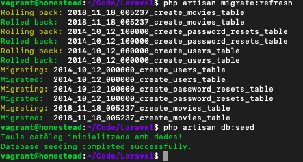
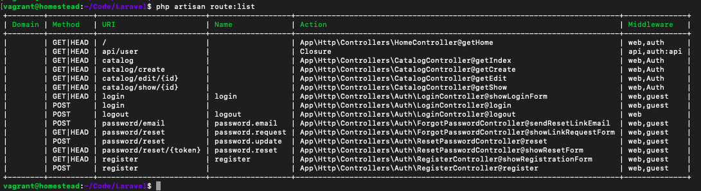

# FRAMEWORK LARAVEL

## Dades d'entrada
Laravel facilita l'accés a les dades d'entrada de l'usuari a través de solament uns pocs mètodes. No importa el tipus de petició que s'haja realitzat (POST, GET, PUT, DELETE), si les dades són d'un formulari o si s'han afegit a la query string, en tots els casos s'obtindran de la mateixa forma.

Per a aconseguir accés a aquests mètodes Laravel utilitza **injecció de dependències**. Açò és simplement afegir la classe **Request** al constructor o mètode del controlador en el qual ho necessitem. Laravel s'encarregarà d'injectar aquesta dependència ja inicialitzada i directament podrem usar aquest paràmetre per a obtenir les dades d'entrada. A continuació s'inclou un exemple:

```php
<?php
	namespace App\Http\Controllers;
	use Illuminate\Http\Request;
	use Illuminate\Routing\Controller;
	
	class UserController extends Controller {
		public function store(Request $request) {
			$name = $request->input('nom');
			//... 
		}
	}
```	
		
En aquest exemple com es pot veure s'ha afegit la classe Request com a paràmetre al mètode store. Laravel automàticament s'encarrega d'injectar aquestes dependències pel que directament podem usar la variable **$request** per a obtenir les dades d'entrada.

Si el mètode del controlador tinguera més paràmetres simplement els haurem d'afegir a continuació de les dependències, per exemple:

```php
	public function edit(Request $request, $id) {
	//... }
```
	
A continuació veurem els mètodes i dades que podem obtenir a partir de la variable $request.

#### Obtenir els valors d'entrada

Per a obtenir el valor d'una variable d'entrada usem el mètode **input** indicant el nom de la variable: 
	$name = $request->input('nom');
	// O simplement....
	$name = $request->nom;
	
També podem especificar un valor per defecte com a segon paràmetre: 

	$name = $request->input('nom', 'Pedro');
	
#### Comprovar si una variable existeix
Si ho necessitem podem comprovar si un determinat valor existeix en les dades d'entrada: 

	if ($request->has('nom')) { //...}

#### Obtenir dades agrupades

O també podem obtenir totes les dades d'entrada alhora (en un array) o solament alguns d'ells:

```php
	// Obtenir tots:
		$input = $request->all();
	// Obtenir solament els camps indicats:
		$input = $request->only('username', 'password');
	// Obtenir tots excepte els indicats: 
		$input = $request->except('credit_card');
```	

#### Obtenir dades d'un array
Si l'entrada prové d'un input tipus array d'un formulari (per exemple una llista de checkbox), si volem podrem utilitzar la següent notació amb punts per a accedir als elements del array d'entrada:

	$input = $request->input('products.0.name');

### JSON
Si l'entrada està codificada format JSON (per exemple quan ens comuniquem a través d'una API és bastant comuna) també podrem accedir als diferents camps de les dades d'entrada de forma normal (amb els mètodes que hem vist, per exemple: 

	$nom = $request->input('nom');
	
### Fitxers d'entrada

Laravel facilita una sèrie de classes per a treballar amb els fitxers d'entrada. Per exemple per a obtenir un fitxer que s'ha enviat en el camp amb nom photo i guardar-ho en una variable, hem de fer:

	$file = $request->file('photo');
	// O simplement... 
	$file = $request->photo;
	
Si volem podem comprovar si un determinat camp té un fitxer assignat:
	
	if ($request->hasFile('photo')) { //...}

El Symfony\Component\HttpFoundation\File\UploadedFile estén de la classe de PHP [SplFileInfo](http://php.net/manual/es/class.splfileinfo.php), per tant, tindrem molts mètodes que podem utilitzar per a obtenir dades del fitxer o per a gestionar-ho.

Per exemple, per a comprovar si el fitxer que s'ha pujat és vàlid:

	if ($request->file('photo')->isValid()) { //...}

O per a moure el fitxer d'entrada a una ruta determinada: 

	// Moure el fitxer a la ruta conservant el nom original
		$request->file('photo')->move($destinationPath);
	// Moure el fitxer a la ruta amb un nou nom: 
		$request->file('photo')->move($destinationPath, $fileName);
		
Laravel incorpora una llibreria que ens permet gestionar l'accés i escriptura de fitxers en un emmagatzematge. L'interessant d'açò és que ens permet manejar de la mateixa forma l'emmagatzematge en local, en Amazon S3 i en Rackspace Cloud Storage, simplement ho hem de configurar en config/filesystems.php i posteriorment els podrem usar de la mateixa forma. 

Per exemple, per a emmagatzemar un fitxer pujat mitjançant un formulari hem d'usar el mètode store indicant com a paràmetre la ruta on volem emmagatzemar el fitxer (sense el nom del fitxer):

```php
$path = $request->photo->store('images');
$path = $request->photo->store('images', 's3'); // Especificar un emmagatzematge
```

Aquests mètodes retornaran el path fins al fitxer emmagatzemat de forma relativa a l'arrel de disc configurada. Per al nom del fitxer es generarà automàticament un UUID (identificador únic universal). Si volem especificar nosaltres el nom hauríem d'usar el mètode storeAs:

	$path = $request->photo->storeAs('images', 'filename.jpg'); 
	$path = $request->photo->storeAs('images', 'filename.jpg', 's3');
	
Altres mètodes que podem utilitzar per a recuperar informació del fitxer són:

```php
	// Obtenir la ruta:
	$path = $request->file('photo')->getRealPath();
	// Obtenir el nom original:
	$name = $request->file('photo')->getClientOriginalName();
	// Obtenir l'extensió:
	$extension = $request->file('photo')->getClientOriginalExtension();
	// Obtenir la grandària:
	$size = $request->file('photo')->getSize();
	// Obtenir el Type:
	$acarone = $request->file('photo')->getMimeType();
```

## Control d'usuaris

Laravel inclou una sèrie de mètodes i classes que faran que la implementació del control d'usuaris siga molt ràpida i senzilla. De fet, quasi tot el treball ja està fet, solament haurem d'indicar on volem utilitzar-ho i alguns xicotets detalls de configuració.

Per defecte, en crear un nou projecte de Laravel, ja s'inclou tot el necessari:

* La configuració predeterminada en **config/auth.php**.
* La migració per a la base de dades de la taula d'usuaris amb tots els camps necessaris.
* El model de dades d'usuari (User.php) dins de la carpeta app amb tota la implementació necessària.
* Els controladors per a gestionar totes les accions relacionades amb el control d'usuaris (dins de **App\Http\Controllers\Auth**).
* A més d'açò haurem d'executar el següent comando per a generar les rutes i vistes necessàries per a realitzar el login, registre i per a recuperar la contrasenya:

		composer require laravel/ui --dev
		php artisan ui vue --auth


#### Configuració inicial

La configuració del sistema d'autenticació es pot trobar en el fitxer **config/auth.php**, el qual conté diverses opcions (ben documentades) que ens permetran, per exemple: canviar el sistema d'autenticació (que per defecte és a través de Eloquent), canviar el model de dades usat per als usuaris (per defecte serà User) i canviar la taula d'usuaris (que per defecte serà users). 

Si anem a utilitzar aquests valors no serà necessari que realitzem cap canvi.
La migració de la taula d'usuaris (cridada users) també està inclosa (veure carpeta **database/migrations**). Per defecte inclou tots els camps necessaris, però si necessitem algun més el podem afegir per a guardar per exemple l'adreça o el telèfon de l'usuari. A continuació s'inclou el codi de la funció up de la migració:

```php
	<?php
	
	use Illuminate\Support\Facades\Schema;
	use Illuminate\Database\Schema\Blueprint;
	use Illuminate\Database\Migrations\Migration;
	
	class CreateUsersTable extends Migration
	{
	    /**
	     * Run the migrations.
	     *
	     * @return void
	     */
	    public function up()
	    {
	        Schema::create('users', function (Blueprint $table) {
	            $table->increments('id');
	            $table->string('name');
	            $table->string('email')->unique();
	            $table->timestamp('email_verified_at')->nullable();
	            $table->string('password');
	            $table->rememberToken();
	            $table->timestamps();
	        });
	    }
	
	    /**
	     * Reverse the migrations.
	     *
	     * @return void
	     */
	    public function down()
	    {
	        Schema::dropIfExists('users');
	    }
	}
```	
	
Com es pot veure el nom de la taula és users, amb un índex id autoincremental, i els camps de name, email, password, on el camp email s'estableix com a únic perquè no es puguen emmagatzemar emails repetits. A més s'afigen els timestamps que usa Eloquent per a emmagatzemar automàticament la data de registre i actualització, i el camp remember_token per a recordar la sessió de l'usuari.

En la carpeta app es troba el model de dades (anomenat User.php) per a treballar amb els usuaris. Aquesta classe ja inclou tota la implementació necessària i per defecte no haurem de modificar gens. Però si volem podem modificar aquesta classe per a afegir-li més mètodes o relacions amb altres taules, etc.
Laravel també inclou diversos controladors (LoginController, RegisterController, ResetPasswordController i ForgotPasswordController) per a l'autenticació d'usuaris, els quals els pots trobar en l'espai de noms App\Http\Controllers\Auth (i en la mateixa carpeta). 

**LoginController** i **RegisterController** inclouen mètodes per a ajudar-nos en el procés d'autenticació, registre i tancament de sessió; mentre que **ResetPasswordController** i **ForgotPasswordController** contenen la lògica per a ajudar-nos en el procés de restaurar una contrasenya. 

Per a la majoria d'aplicacions amb aquests mètodes serà suficient i no haurem d'afegir res més.

L'única cosa que falta per afegir i configurar correctament perquè tot funcione són les rutes i les vistes.

#### Rutes

Per defecte Laravel no inclou les rutes per al control d'usuaris, que cal generar amb el comandament vist abans i que afegirà les següents línies al fitxer routes/web.php:

	Auth::routes();
	Route::get('/home', 'Homecontroller@index');
	
La primera línia (Auth::routes) és la que afig totes les rutes per al login, logout, registre i per a recuperar la contrasenya. La segona entrada afig la ruta home que apunta al controlador HomeController (el qual s'haurà creat
també), aquesta ruta és la que s'utilitza per a redirigir als usuaris quan realitzen el login correctament. En la següent taula es pot veure un resum de totes les rutes afegides:

|Method| Url|Acció|Filtres
|--|--|--|--|
|GET |login|Logincontroller@showloginform |web,guest|
|POST|login|Logincontroller@login| web,guest|
|POST|logout|Logincontroller@logout|web|
|GET|register|Registercontroller@showregistrationform|web,guest|
|POST|register| Registercontroller@register |web,guest|
|POST| password/email|Forgotpasswordcontroller@sendresetlinkemail |web,guest|
|GET| password/reset|Forgotpasswordcontroller@showlinkrequestform|web,guest|
|POST| password/reset|Resetpasswordcontroller@reset|web,guest|
|GET| password/reset/{token}| Resetpasswordcontroller@showresetform|web,guest|
|GET| home|Homecontroller@index|web,auth|

Com es pot veure aquestes rutes ja estan enllaçades amb els controladors i mètodes que incorpora el propi Laravel. En accedir a la ruta login per GET es cridarà a Logincontroller@showloginform el qual s'encarregarà de mostrar el formulari de login, i el mateix per a la ruta register tipus GET per al registre. 

Les rutes login i register per POST s'encarregaran de processar les dades enviades pels formularis. En accedir a la ruta logoutpor POST es tancarà la sessió. 

A més hi ha quatre rutes que s'utilitzen per a recuperar la contrasenya de l'usuari: en accedir a password/reset per GET es mostrarà el formulari perquè escriguem la nostra adreça de correu i enviar-nos el link per a restablir la contrasenya (la qual cosa ho gestionarà la petició a password/email mitjançant POST). En prémer sobre el link enviat al correu s'accedirà a password/reset/{token} per GET amb el token generat, açò ens mostrarà el formulari perquè establim una nova contrasenya i finalment ho enviem a password/reset mitjançant POST.

Les adreces URLs generades són fixes, si volem modificar-les el més senzill és que comentem la línia Auth::routes() que s'ha afegit al fitxer de rutes i que les escriguem nosaltres manualment, copiant el mateix que generaria Auth::routes() però canviant únicament les URLs.

#### Vistes

Totes aquestes vistes les podrem trobar en la carpeta **resources/views/auth** amb els noms **login.blade.php** per al formulari de login, **register.blade.php** per al formulari de registre, **passwords/email.blade.php** per al formulari de recuperar contrasenya i **passwords/reset.blade.php** per al formulari de restaurar la contrasenya. 

Aquests noms i rutes són **obligatoris** ja que els controladors que inclou Laravel accediran a ells, per la qual cosa no haurem de canviar-los.

Si obrim qualsevol d'ells veurem com utilitza el sistema de plantilles de Blade, en tots ells hereta del layout layouts/app.blade.php mitjançant la directiva @extends('layouts.app') i emplena el contingut de la seua zona central content. 

Aquesta plantilla de layout estableix l'estructura bàsica, carrega la fulla d'estil i Javascript de Bootstrap, i afig el menú principal amb botons per a accedir al login i registre. Cadascun dels formularis està enllaçat amb la ruta corresponent, i a més inclou codi per a mostrar els errors generats i tornar a emplenar els camps després d'un error amb el text que haja escrit l'usuari.
A manera d'exemple s'inclou el codi per a la vista del formulari de login:

```php
@extends('layouts.app')
	
@section('content')
<div class="container">
    <div class="row justify-content-center">
        <div class="col-md-8">
            <div class="card">
                <div class="card-header">{{ __('Login') }}</div>
	
                <div class="card-body">
                    <form method="POST" action="{{ route('login') }}">
                        @csrf
	
                        <div class="form-group row">
                            <label for="email" class="col-sm-4 col-form-label text-md-right">{{ __('E-Mail Address') }}</label>
	
                            <div class="col-md-6">
                                <input id="email" type="email" class="form-control{{ $errors->has('email') ? ' is-invalid' : '' }}" name="email" value="{{ old('email') }}" required autofocus>
	
                                @if ($errors->has('email'))
                                    <span class="invalid-feedback" role="alert">
                                        <strong>{{ $errors->first('email') }}</strong>
                                    </span>
                                @endif
                            </div>
                        </div>
	
                        <div class="form-group row">
                            <label for="password" class="col-md-4 col-form-label text-md-right">{{ __('Password') }}</label>
	
                            <div class="col-md-6">
                                <input id="password" type="password" class="form-control{{ $errors->has('password') ? ' is-invalid' : '' }}" name="password" required>
	
                                @if ($errors->has('password'))
                                    <span class="invalid-feedback" role="alert">
                                        <strong>{{ $errors->first('password') }}</strong>
                                    </span>
                                @endif
                            </div>
                        </div>
	
                        <div class="form-group row">
                            <div class="col-md-6 offset-md-4">
                                <div class="form-check">
                                    <input class="form-check-input" type="checkbox" name="remember" id="remember" {{ old('remember') ? 'checked' : '' }}>
	
                                    <label class="form-check-label" for="remember">
                                        {{ __('Remember Me') }}
                                    </label>
                                </div>
                            </div>
                        </div>
	
                        <div class="form-group row mb-0">
                            <div class="col-md-8 offset-md-4">
                                <button type="submit" class="btn btn-primary">
                                    {{ __('Login') }}
                                </button>
	
                                <a class="btn btn-link" href="{{ route('password.request') }}">
                                    {{ __('Forgot Your Password?') }}
                                </a>
                            </div>
                        </div>
                    </form>
                </div>
            </div>
        </div>
    </div>
</div>
@endsection
```

Si ho desitgem podem modificar el contingut i disseny de qualsevol vista, així com del layout, l'única cosa que hem de mantenir igual és la URL a la qual s'envia el formulari i els noms de cadascun dels inputs del formulari.

### Autenticació d'un usuari

Una vegada configurat tot el sistema, afegides les rutes i les vistes per a realitzar el control d'usuaris ja podem utilitzar-ho. Si accedim a la ruta login ens apareixerà la vista amb el formulari de login, sol·licitant el nostre email i contrasenya per a accedir. 

El camp tipus checkbox anomenat "remember" ens permetrà indicar si desitgem que la sessió romanga oberta fins que es tanque manualment. És a dir, encara que es tanque el navegador i passen diversos dies l'usuari seguiria estant autoritzat.

Si les dades introduïdes són correctes es crearà la sessió de l'usuari i se li redirigirà a la ruta "/home". 
Si volem canviar aquesta ruta hem de definir la propietat **redirectTo** en el controlador LoginController, per exemple:

	protected $redirectTo = '/';
	
A més podem definir aquesta propietat en RegisterController i ResetPasswordController per a canviar la URL de redirecció després del registre i després de restablir la contrasenya, respectivament.

##### Registre d'un usuari

Si accedim a la ruta register ens apareixerà la vista amb el formulari de registre, sol·licitant-nos els camps nom, email i contrasenya. En prémer el botó d'enviament del formulari es dirà a la ruta register per POST i s'emmagatzemarà el nou usuari en la base de dades.

Si no hem afegit cap camp més en la migració no haurem de configurar res més. No obstant açò si hem afegit algun camp més a la taula d'usuaris haurem d'actualitzar dos mètodes del controlador RegisterController: **validator** i **create**. 
En el mètode validators implemente haurem d'afegir aquest camp al array de validacions (solament en el cas que necessitem validar-ho). I en el mètode create haurem d'afegir els camps addicionals que desitgem emmagatzemar. El codi d'aquest mètode és el següent:

```php
	protected function create(array $data) { 
		return User::create([
			'name' => $data['name'],
			'email' => $data['email'],
			'phone' => $data['phone'], // Camp afegit 
			'password' => bcrypt($data['password']),
		]); 
	}
```	
	

Com podem veure utilitza el model de dades **User** per a crear l'usuari i emmagatzemar les variables que rep en el array de dades $data. En aquest array de dades ens arribaran tots els valors dels camps del formulari, per tant, si afegim més camps al formulari i a la taula d'usuaris simplement haurem d'afegir-los també en aquest mètode.

És important destacar que la contrasenya es xifra usant el mètode **bcrypt**, per tant les contrasenyes s'emmagatzemaren xifrades en la base de dades. Aquest xifrat es basa en la clau **hash** que es general en crear un nou projecte de Laravel (veure capítol de "Instal·lació") i que es troba emmagatzemada en el fitxer **.env** en la variable APP_KEY. És important que aquest hash s'haja establit a l'inici (que no estiga buit o s'un per defecte) i que a més **no es modifique** una vegada l'aplicació es puje a producció.

##### Registre manual d'un usuari

Si volem afegir un usuari manualment ho podem fer de forma normal usant el model User de Eloquent, amb l'única precaució de xifrar la contrasenya que es va a emmagatzemar. A continuació s'inclou un exemple d'una funció que crea un nou usuari a partir dels paràmetres d'entrada rebuts d'un formulari:

	public function store(Request $request) {
		$user = new User;
		$user->name = $request->input('name');
		$user->email = $request->input('email'); 
		$user->password = bcrypt( $request->input('password') ); 
		$user->save();
	}
	
##### Accedir a les dades de l'usuari autenticat

Una vegada que l'usuari està autenticat podem accedir a les dades del mateix a través del mètode Auth::user(), per exemple:

	user = Auth::user();
	
Aquest mètode ens retornarà null en cas que no estiga autenticat. Si estem segurs que l'usuari està autenticat (perquè estem en una ruta protegida) podrem accedir directament a les seues propietats:
	
	$email = Auth::user()->email;

Important: per a utilitzar la classe Auth hem d'afegir l'espai de noms 

	use Illuminate\Support\Facades\Auth;, 
	
d'una altra forma ens apareixerà un error indicant que no pot trobar la classe.

L'usuari també s'injecta en els paràmetres d'entrada de la petició (en la classe Request). Per tant, si en un mètode d'un controlador usem la injecció de dependències també podrem accedir a les dades de l'usuari:

	use Illuminate\Http\Request;
	
	class ProfileController extends Controller {
		public function updateProfile(Request $request) {
			if ($request->user()) {
				$email = $request->user()->email;
			} 
		}
	}
	
##### Tancar la sessió

Si accedim a la ruta logout per POST es tancarà la sessió i es redirigirà a la ruta /. Tot açò ho farà automàticament el mètode logout del controlador LoginController.

Per a tancar manualment la sessió de l'usuari actualment autenticat hem d'utilitzar el mètode: **Auth::logout()**;

Posteriorment podrem fer una redirecció a una pàgina principal per a usuaris no autenticats.

##### Comprovar si un usuari està autenticat
Per a comprovar si l'usuari actual s'ha autenticat en l'aplicació podem utilitzar el mètode Auth::check() de la forma:

	if (Auth::check()) {
	// L'usuari està correctament autenticat
	}
	
No obstant açò, el recomanable és utilitzar **Middleware**  per a realitzar aquesta comprovació abans de permetre l'accés a determinades rutes.

##### Protegir rutes
El sistema d'autenticació, per a protegir l'accés a rutes i solament permetre la seua visualització per usuaris correctament autenticats, usarem el middleware\Illuminate\Auth\Middleware\Authenticate.php l'àlies del qual és auth. 

Per a utilitzar aquest middleware hem d'editar el fitxer routes/web.php i 
modificar les rutes que vulguem protegir, per exemple:

	// Per a protegir una clausula: Route::get('admin/catalog', function() {
	// Solament es permet l'accés a usuaris autenticats })->middleware('auth');
	// Per a protegir una acció d'un controlador:
	
	Route::get('profile', 'Profilecontroller@show')->middleware('auth');
	
Si l'usuari que accedeix no està validat es generarà una excepció que li redirigirà a la ruta login. Si desitgem canviar aquesta adreça haurem de modificar el mètode que gestiona l'excepció, el qual ho podrem trobar en **App\Exceptions\Handler@unauthenticated**.

Si desitgem protegir l'accés a tota una zona del nostre lloc web (per exemple la part d'administració o la gestió d'un recurs), el més còmode és crear un grup amb totes aqueixes rutes que utilitze el middlewareauth, per exemple:

	Route::group(['middleware' => 'auth'], function() { 
		Route::get('catalog', 'Catalogcontroller@getindex'); 
		Route::get('catalog/create', 'Catalogcontroller@getcreate'); // ...
	});
	
Si ho desitgem també podem especificar l'ús d'aquest middleware des del constructor del controlador:

	public function __construct() { 
		$this->middleware('auth');
	}
	
No obstant açò, el més recomanable és indicar-ho des del fitxer de rutes doncs així tindrem totes les rutes i filtres centralitzats en un únic fitxer.

## Exemple: VideoClub


### Migració de la taula usuaris

En primer lloc anem a crear la taula de la base de dades per a emmagatzemar els usuaris que tindran accés a la plataforma de gestió del videoclub.

Com hem vist en la teoria, Laravel ja inclou una migració amb el nom **create_users_table** per a la taula users amb tots els camps necessaris. Anem a obrir aquesta migració i a comprovar que els camps inclosos coincideixen amb els de la següent taula:

|Camp|Tipus| Modificador|
|--|--|--|
|id|Autoincremental||
|name|String||
|email|String|unique|
|password| String||
|remember_token|Camp remember_token|| 
|timestamps|Timestamps de Eloquent||


Comprova també que en el mètode down de la migració es desfacen els canvis que es fan en el mètode up, en aquest cas seria eliminar la taula.

Finalment usem el comando de Artisan que afig les noves migracions i comprovem amb PHPMyAdmin que la taula s'ha creat correctament amb tots camps indicats.

### Seeder d'usuaris

Ara anem a procedir a emplenar la taula users amb les dades inicials. Per a açò editem el fitxer de llavors situat en **database/seeds/DatabaseSeeder.php** i seguirem els següents passos:

* Anem a crear un mètode privat (dins de la mateixa classe) anomenat seedUsers() que s'haurà de cridar des del mètode run de la forma:

		public function run() {
			// ... Trucada al seed del catàleg
			self::seedUsers();
			$this->command->info('Taula usuaris inicialitzada amb dades!'); 
		}

* Dins del nou mètode seedUsers() realitzem les següents accions:
	* En primer lloc esborrem el contingut de la taula users.
	* I a continuació vam crear un parell d'usuaris de prova. Recorda que per a guardar el password és necessari encriptar-ho manualment usant el mètode bcrypt (Revisa la secció "Registre d'un usuari").
	* Finalment haurem d'executar el comando de Artisan que processa les llavors. Una vegada realitzat açò comprovem en PHPMyAdmin que s'han afegit els usuaris a la taula users.

**database/seeds/DatabaseSeeder.php**

```php
	   public function run()
	    {
	        self::seedCatalog();
	        self::seedUsers();
	        $this->command->info('Taula catàleg inicialitzada amb dades!');
	    }

	    private function seedUsers()
	    {
	        DB::table('users')->delete();
	        $u1 = new User;
	        $u1->name = 'Ignasi Gomis';
	        $u1->email = 'igomis@cipfpbatoi.es';
	        $u1->password = bcrypt('1234');
	        $u1->save();
	        $u2 = new User;
	        $u2->name = 'Fernando Gomis';
	        $u2->email = 'fgomis@cipfpbatoi.es';
	        $u2->password = bcrypt('4321');
	        $u2->save();
	        
	    }
    	private function seedCatalog(){
	...
```


	
### Sistema d'autenticació


A continuació edita el fitxer routes/web.php i realitza les següents accions:

* Elimina (o comenta) les rutes de login i logout que havíem afegit manualment en els primers exercicis a fi que s'utilitzen les noves rutes definides per Laravel.
* Afig un middleware de tipus grup que aplique el filtre auth per a protegir totes les rutes del catàleg (menys l'arrel / i les d'autenticació).
* Revisa mitjançant el comando de Artisan php artisan route:list les noves rutes i que el filtre auth s'aplique correctament.
* Afig la ruta de logout dins del grup del middleware (Route::get('/logout','Auth\Logincontroller@logout'))
* Modifica el controlador LoginController perquè quan es realitze el login et redirigisca a la ruta /catalog. Per a açò has de modificar la seua propietat **redirectTo** per a afegir la ruta de redirecció (revisa l'apartat "Autenticació d'un usuari" de la teoria).
* Modifica la vista de login generada per Laravel (resources/views/auth/login.blade.php) perquè en lloc d'utilitzar el seu layout utilitze el que vam crear en els primers exercicis (resources/views/layouts/master.blade.php).
* Comprova en aquest punt que el sistema d'autenticació funciona correctament: no et permet entrar a la rutes protegides si no estàs autenticat, pots accedir amb els usuaris definits en el fitxer de llavors i funciona el botó de tancar sessió.
* Finalment edita la vista resources/views/partials/navbar.blade.php que havíem copiat de les plantilles i canvia la línia @if( true || Auth::check() ) per @if( Auth::check() ). D'aquesta forma el menú solament es mostrarà quan l'usuari estiga autenticat.

### Afegir i editar pel·lícules

En primer lloc anem a afegir les rutes que ens van a fer falta per a arreplegar les dades en enviar els formularis. Per a açò editem el fitxer de rutes i afegim dues rutes (també protegides pel filtre auth):

* Una ruta de tipus POST per a la url catalog/create que apuntarà al mètode postCreate del controlador CatalogController.
* I una altra ruta tipus PUT per a la url catalog/edit/{id} que apuntarà al mètode putEdit del controlador CatalogController.

A continuació anem a editar la vista catalog/edit.blade.php amb els següents canvis:

* Revisar que el mètode d'enviament del formulari siga tipus PUT.
* Hem de modificar tots els inputs perquè com a valor del camp pose el valor corresponent de la pel·lícula. Per exemple en el primer input hauríem d'afegir value="{{$pelicula->title}}". 
* Realitza el mateix per a la resta de camps: year, director, poster i synopsis. L'únic camp diferent serà el de synopsis ja que el input és tipus textarea, en aquest cas el valor ho haurem de posar directament entre l'etiqueta d'obertura i la de tancament.
* 
Finalment hem d'actualitzar el controlador CatalogController amb els dos nous mètodes. En tots dos casos hem d'usar la injecció de dependències per a afegir la classe Request com a paràmetre d'entrada (revisa la secció "Dades d'entrada" de la teoria). A més per a cada mètode farem:

* En el mètode postCreate vam crear una nova instància del model Movie, assignem el valor de tots els camps d'entrada (title, year, director, poster i synopsis) i els guardem. Finalment, després de guardar, fem una redirecció a la ruta /catalog.
* En el mètode putEdit cerquem la pel·lícula amb l'identificador passat per paràmetre, actualitzem els seus camps i els guardem. Finalment realitzem una redirecció a la pantalla amb la vista detalle de la pel·lícula editada.
Nota: de moment en cas d'error no es mostrarà res.

```php
** web.php **

	Auth::routes();
	Route::get('/','HomeController@getHome');
	Route::group(['middleware'=>'auth'],function(){
	    Route::get('/logout','Auth\Logincontroller@logout');
	    Route::get('catalog','CatalogController@getIndex');
	    Route::get('catalog/show/{id}', 'CatalogController@getShow');
	    Route::get('catalog/create','CatalogController@getCreate');
	    Route::post('catalog/create','CatalogController@postCreate');
	    Route::get('catalog/edit/{id}','CatalogController@getEdit');
	    Route::put('catalog/edit/{id}','CatalogController@putEdit');
	});
	


** HomeController **

	<?php
	
	namespace App\Http\Controllers;
	
	use Illuminate\Http\Request;
	use Illuminate\Support\Facades\Auth;
	
	class HomeController extends Controller
	{
	    
	    public function getHome()
	    {
	        if (Auth::user())
	            return redirect()->action('CatalogController@getIndex');
	        else 
	            return redirect('login');
	    }
	}
	
** CatalogController **

	<?php
	
	namespace App\Http\Controllers;
	
	use Illuminate\Http\Request;
	use App\Movie;
	
	class CatalogController extends Controller
	{
	    public function getIndex(){
	        $arrayPeliculas = Movie::all();
	        return view('index',compact('arrayPeliculas'));
	    }
	    public function getShow($id){
	        $pelicula = Movie::findOrFail($id);
	        return view('show',compact('pelicula'));
	    }
	    public function getCreate(){
	        return view('create');
	    }
	    public function postCreate(Request $request){
	        $movie = new Movie();
	        $movie->title = $request->title;
	        $movie->year = $request->year;
	        $movie->director = $request->director;
	        $movie->poster = $request->poster;
	        $movie->synopsis = $request->synopsis;
	        $movie->save();
	        return redirect('/catalog');
	    }
	    public function getEdit($id){
	        $pelicula = Movie::findOrFail($id);
	        return view('edit',compact('pelicula'));
	    }
	    public function putEdit(Request $request,$id){
	        $movie = Movie::findOrFail($id);
	        $movie->title = $request->title;
	        $movie->year = $request->year;
	        $movie->director = $request->director;
	        $movie->poster = $request->poster;
	        $movie->synopsis = $request->synopsis;
	        $movie->save();
	        return redirect("/catalog/show/$id");
	    }
	}
```

### Proves

Ara fallen totes les proves en les quals hem d'estar autenticats. Per a corregir açò hem d'executar el get una vegada que ens hàgem loguejat. Per a fer açò tenim actuar com un usuari.

	private function defaultUser(){ 
		return User::find(1);
	}
	
	public function testLoadCreatePage(){ 
       $this->actingAs($this->defaultUser())->get('/catalog/create')->assertStatus(200)->assertSee('Afegir pel.lícula');
    }
	
Fes que totes les proves tornen a funcionar.