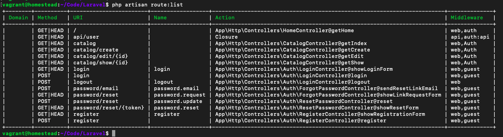

## Solucions VideoClub (entrega 4)

### Exercici 2 - Seeder d'usuaris

**database/seeds/DatabaseSeeder.php**

	...
	   public function run()
	    {
	        self::seedCatalog();
	        self::seedUsers();
	        $this->command->info('Taula catàleg inicialitzada amb dades!');
	    }

	    private function seedUsers()
	    {
	        DB::table('users')->delete();
	        $u1 = new User;
	        $u1->name = 'Ignasi Gomis';
	        $u1->email = 'igomis@cipfpbatoi.es';
	        $u1->password = bcrypt('1234');
	        $u1->save();
	        $u2 = new User;
	        $u2->name = 'Fernando Gomis';
	        $u2->email = 'fgomis@cipfpbatoi.es';
	        $u2->password = bcrypt('4321');
	        $u2->save();
	        
	    }
    	private function seedCatalog(){
	...

### Exercici 3 - Sistema d'autenticació

** web.php **

	Auth::routes();
	Route::get('/','HomeController@getHome');
	Route::group(['middleware'=>'auth'],function(){
	    Route::get('/logout','Auth\Logincontroller@logout');
	    Route::get('catalog','CatalogController@getIndex');
	    Route::get('catalog/show/{id}', 'CatalogController@getShow');
	    Route::get('catalog/create','CatalogController@getCreate');
	    Route::post('catalog/create','CatalogController@postCreate');
	    Route::get('catalog/edit/{id}','CatalogController@getEdit');
	    Route::put('catalog/edit/{id}','CatalogController@putEdit');
	});
	

** HomeController **

	<?php
	
	namespace App\Http\Controllers;
	
	use Illuminate\Http\Request;
	use Illuminate\Support\Facades\Auth;
	
	class HomeController extends Controller
	{
	    
	    public function getHome()
	    {
	        if (Auth::user())
	            return redirect()->action('CatalogController@getIndex');
	        else 
	            return redirect('login');
	    }
	}
	
** CatalogController **

	<?php
	
	namespace App\Http\Controllers;
	
	use Illuminate\Http\Request;
	use App\Movie;
	
	class CatalogController extends Controller
	{
	    public function getIndex(){
	        $arrayPeliculas = Movie::all();
	        return view('index',compact('arrayPeliculas'));
	    }
	    public function getShow($id){
	        $pelicula = Movie::findOrFail($id);
	        return view('show',compact('pelicula'));
	    }
	    public function getCreate(){
	        return view('create');
	    }
	    public function postCreate(Request $request){
	        $movie = new Movie();
	        $movie->title = $request->title;
	        $movie->year = $request->year;
	        $movie->director = $request->director;
	        $movie->poster = $request->poster;
	        $movie->synopsis = $request->synopsis;
	        $movie->save();
	        return redirect('/catalog');
	    }
	    public function getEdit($id){
	        $pelicula = Movie::findOrFail($id);
	        return view('edit',compact('pelicula'));
	    }
	    public function putEdit(Request $request,$id){
	        $movie = Movie::findOrFail($id);
	        $movie->title = $request->title;
	        $movie->year = $request->year;
	        $movie->director = $request->director;
	        $movie->poster = $request->poster;
	        $movie->synopsis = $request->synopsis;
	        $movie->save();
	        return redirect("/catalog/show/$id");
	    }
	}

