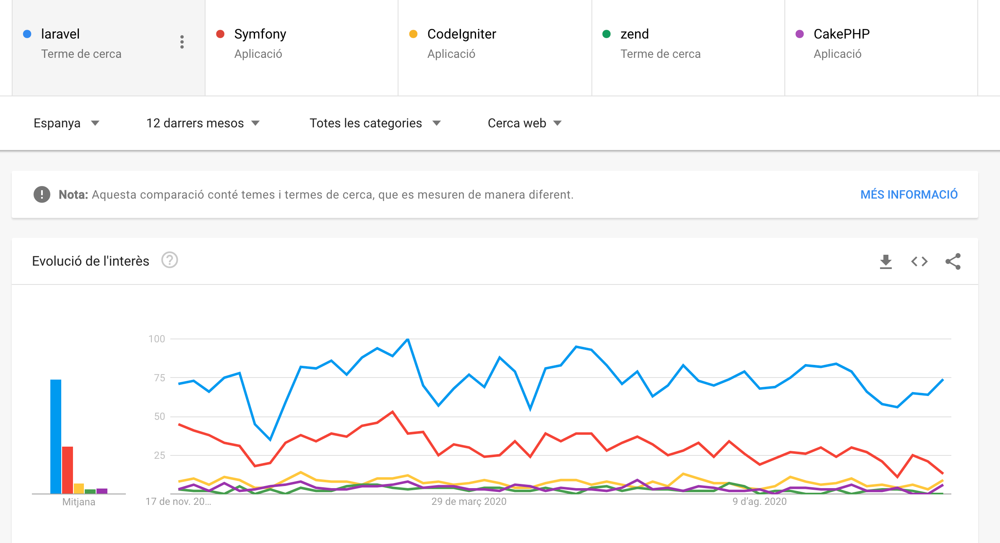
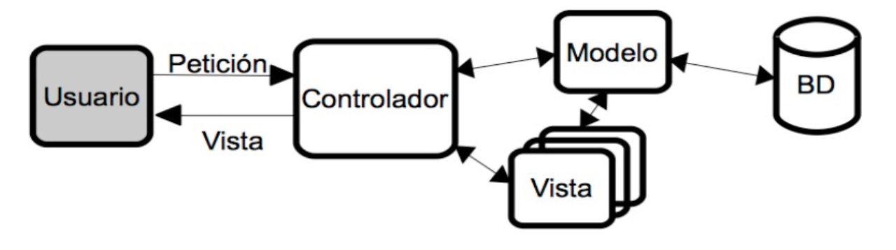
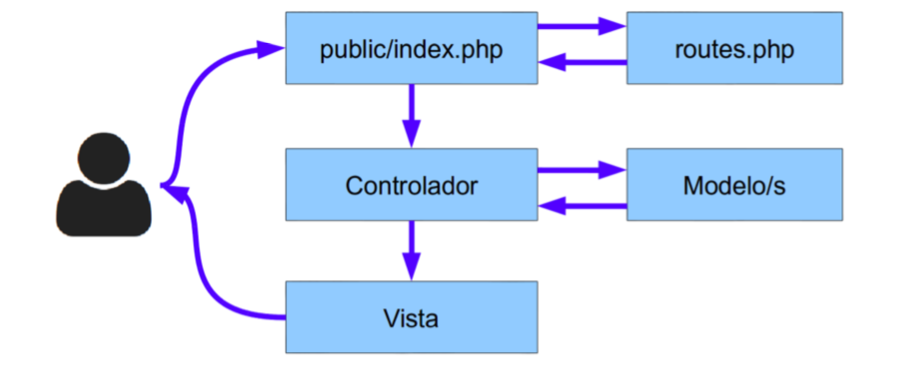

# INTRODUCCIÓ ALS FRAMEWORKS PHP I LARAVEL

## Frameworks

Un **framework** és una eina que proporciona una sèrie de mòduls que ajuden a organitzar i desenvolupar un producte programari. En el cas concret dels **frameworks PHP**, la majoria d'ells proporcionen una sèrie de comandos o eines per a crear projectes amb una estructura determinada (normalment, seguint el patró **MVC** que veurem després), de manera que ja donen una base de treball feta, i facilitats per a poder crear el model de dades, la connexió a la base de dades, les rutes de les diferents seccions de l'aplicació, etc.

### Exemples de frameworks PHP

Actualment existeix una gran varietat de frameworks PHP que triar per a desenvolupar les nostres aplicacions. Alguns dels més populars són:

* Laravel, un framework relativament recent (va ser creat en 2011), i que ha guanyat bastant popularitat en els últims anys. La seua filosofia és el poder desenvolupar projectes de manera elegant i simple. Compta amb una àmplia comunitat de suport darrere, i se li augura un futur bastant consolidat.

* Symfony, creat en 2005, compta amb més camí fet que Laravel, i una estructura més consolidada. En les seues primeres versions es presentava com un framework més monolític (s'instal·laven massa mòduls que després no necessitàvem), però recentment ha adaptat la seua estructura per a fer-la més modular.

* CodeIgniter, un framework més lleuger que els anteriors, però també amb un ampli grup de seguidors i desenvolupadors. Va ser creat en 2006 i, encara que ha patit una etapa d'abandó, ha tornat a agafar força en els últims anys, potser a causa de la seua simplicitat d'ús.

* CakePHP, creat en 2005, és un altre framework similar a CodeIgniter quant a simplicitat i facilitat d'ús. Té una àmplia comunitat també darrere que li dóna suport.

* Zend, creat en 2006, és un altre framework bastant popular, encara que potser amb menor visibilitat que els anteriors hui dia, a l'altura de CakePHP.

* Phalcon, un altre framework de recent creació (2012), amb una potent capacitat de processament de pàgines PHP, i la possibilitat de treballar com microframework (més lleuger, per a oferir funcionalitats molt específicas) o com framework complet. 

De fet, molts frameworks més antics també han incorporat recentment la possibilitat d'executar-los com microframeworks. Quasi tots els frameworks PHP tenen una sèrie de característiques comunes, com són l'ús del patró MVC per a desenvolupar els seus projectes, la injecció de dependències per a gestionar recursos com ara connexions a bases de dades, o elements compartits per tota l'aplicació, la possibilitat de desenvolupar tant webs completes com serveis REST accessibles des de diversos clients, etc.

### Quin triar

A l'hora de decantar-nos per l'un o l'altre framework, no ens hauríem de deixar enganyar per la popularitat d'aquest, en termes de quota de mercat. En aqueix terreny, Symfony i Laravel probablement són els més demandats, però la corba d'aprenentatge en ells pot ser que siga més pronunciada que en uns altres a priori més senzills, com CodeIgniter o CakePHP.

Cada framework pot estar millor orientat que un altre per a determinats tipus de projectes o necessitats. Si volem aprendre una cosa ràpida per a llançar l'aplicació com més prompte millor, potser Symfony **no** és la millor opció. Si, per contra, preferim xopar-nos d'un framework amb una comunitat important darrere que ens puga donar suport i ens garantisca un temps de vida llarg, llavors Symfony o Laravel poden ser millors candidats.

### Per què Laravel?

Arribats a aquest punt... quines característiques té Laravel que ens hagen fet triar-ho per a aquest curs enfront d'altres frameworks? És un framework que ofereix bastants avantatges.

És bastant popular hui dia, potser el que més, si atenem diferents webs estadístiques. Per exemple, si comparem les cerques en **Google Trends** dels principals frameworks PHP, observem que Laravel és el més destacat:



També és un dels frameworks PHP que més demanda laboral a nivell nacional segons  **InfoJobs**.

Té una gran comunitat darrere, la qual cosa permet trobar fàcilment ajuda per a problemes que tinguem
Té una bona documentació, tant per terceres parts com a través de la seua pròpia pàgina oficial. Disposa d'algunes llibreries addicionals que permeten afegir funcionalitat molt interessant, com el motor de plantilles **Blade**, o el **ORM Eloquent**, que veurem més endavant, així com llibreries de terceres parts que podem incorporar als nostres projectes.

En realitat, una vegada es coneix un d'aquests frameworks, és més senzill assimilar la resta, arribat el moment. Així que Laravel pot ser un bon punt de partida. En concret, durant el curs utilitzarem la versió 8 del framework, que es recolza en PHP 7 per a funcionar.

### Característiques

**Laravel** és un framework de codi obert per al desenvolupament d'aplicacions web en PHP que posseeix una sintaxi simple, expressiva i elegant. Va ser creat en 2011 per Taylor Otwell, inspirant-se en **Ruby on Rails i Symfony**, dels quals ha adoptat els seus principals avantatges.

Laravel facilita el desenvolupament simplificant el treball amb tasques comunes com l'autenticació, el enrutamiendo, gestió sessions, l'emmagatzematge en caché, etc. Algunes de les principals característiques i avantatges de Laravel són:

* Esta dissenyat per a desenvolupar sota el patró **MVC** (model - vista - controlador), centrant-se en la correcta separació i modularització del codi. El que facilita el treball en equip, així com la claredat, el manteniment i la reutilització del codi.
* Integra un sistema **ORM de mapeado de dades relacional** anomenat **Eloquent** encara que també permet la construcció de consultes directes a força de dades mitjançant la seua **Query Builder**.
* Permet la gestió de **bases de dades** i la manipulació de taules des de codi, mantenint un control de versions de les mateixes mitjançant el seu sistema de **Migracions**.
* Utilitza un **sistema de plantilles** per a les vistes anomenat **Blade**, el qual fa ús de la cache per a donar-li major velocitat. Blade facilita la
creació de **vistes** mitjançant l'ús de layouts, herència i seccions.
* Facilita l'extensió de funcionalitat mitjançant paquets o **llibreries externes**. D'aquesta forma és molt senzill afegir paquets que ens
faciliten el desenvolupament d'una aplicació i ens estalvien molt temps de programació.
* Incorpora un **intèrpret de línia de comandos** anomenat **Artisan** que ens ajudarà amb un munt de tasques rutinàries com la creació de
diferents components de codi, treball amb la base de dades i migracions, gestió de rutes, cachés, cues, tasques programades, etc.


### Primers passos amb Laravel

Ara que ja tenim tot el sistema preparat per a desenvolupar projectes Laravel, vegem els primers passos que hem de donar per a crear aquests projectes.

Per a tindre	localitzats tots	els	 projectes, començarem per crear	una	carpeta en la carpeta  code (si utilitzem homestead). Els projectes que fem a partir d'ara els situarem dins d'aquesta carpeta, cadascun en la seua pròpia subcarpeta.

#### Crear projectes Laravel

Per a crear projectes Laravel, emprarem el comando que ja hauríem de tindre disponible, si hem seguit els passos donats en el document d'Instal·lació del programari necessari, o si estem utilitzant la màquina virtual proporcionada, on ja ve el comando instal·lat. Ens haurem de situar en la carpeta on vulguem crear el projecte (la carpeta **code** que hem comentat anteriorment), i escriure aquest comando:

```php
laravel new Biblioteca
```
Això crearà una carpeta "Biblioteca" amb el contingut inicial del projecte dins, emprant l'última versió de Laravel que tinguem instal·lada.

### El comanament Artisan

Laravel inclou un interfície de línia de comandos (CLI, Command line interface) anomenat **Artisan**. Aquesta utilitat ens va a permetre realitzar múltiples tasques necessàries durant el procés de desenvolupament o desplegament a producció d'una aplicació, per la qual cosa ens facilitarà i accelerarà el treball.
Per a veure una llista de totes les opcions que inclou Artisan podem executar el següent comando en un consola o terminal del sistema en la carpeta arrel del nostre projecte:
    
    php artisan list

Si volem obtenir una ajuda més detallada sobre alguna de les opcions de Artisan simplement hem d'escriure la paraula **help** davant del comando en qüestió, per exemple:

    
    php artisan help migrate
 
A poc a poc anirem veient més opcions de Artisan, de moment anem a comentar solament dues opcions importants: el llistat de rutes i la generació de codi.

Per a veure un llistat amb totes les rutes que hem definit en el fitxer routes.php podem executar el comando: 
    
    php artisan route:list

Açò ens mostrarà una taula amb el mètode, l'adreça, l'acció i els filtres definits per a totes les rutes. D'aquesta forma podem comprovar totes les rutes de la nostra aplicació i assegurar-nos que estiga tot correcte.


#### Estructura d'un projecte Laravel

En crear un nou projecte de Laravel se'ns generarà una estructura de carpetes i fitxers per a organitzar el nostre codi. És important que coneguem perquè val cada element i on hem de col·locar el nostre codi. Les carpetes que més utilitzarem i les que millor haurem de conèixer són:

* **app** – Conté el codi principal de l'aplicació. Aquesta carpeta al seu torn està dividida en moltes subcarpetas que analitzarem en la següent secció.
* **config** – Ací es troben tots els arxius de configuració de l'aplicació: base dades, cache, correus, sessions o qualsevol altra configuració general de l'aplicació.
* **database** – En aquesta carpeta s'inclou tot el relacionat amb la definició de la base de dades del nostre projecte. Dins d'ella podem trobar al seu torn tres carpetes: factors, migrations i seeds. En el capítol sobre base de dades analitzarem millor el seu contingut.
* **public** – És l'única carpeta pública, l'única que hauria de ser visibleen el nostre servidor web. Tot les peticions i sol·licituds a l'aplicació passen per aquesta carpeta, ja que en ella es troba el index.php, aquest arxiu és el que inicia tot el procés d'execució del
framework. En aquest directori també s'allotgen els arxius CSS, Javascript, imatges i altres arxius que es vulguen fer públics.
* **resources** – Aquesta carpeta conté al seu torn tres carpetes: assets, views i lang:
* **resources/views**–Este directori conté les vistes de la nostra aplicació. En general seran plantilles de HTML que usen els controladors per a mostrar la informació. Cal tenir en compte que en aquesta carpeta **NO** s'emmagatzemen els Javascript, CSS
o imatges, aqueix tipus d'arxius s'han de guardar en la carpeta public.
* **resources/lang** – En aquesta carpeta es guarden arxius PHP que contenen arrays amb els textos del nostre lloc web en
diferents llenguatges, solament serà necessari utilitzar-la en cas que es desitge que l'aplicació es puga traduir.
* **resources/assets** – S'utilitza per a emmagatzemar els fonts dels assets tipus less o sass que s'haurien de compilar per a generar les fulles d'estil públiques. No és necessari usar aquesta carpeta ja que podem escriure directament les les fulles
d'estil dins de la carpeta public.
* **bootstrap** – En aquesta carpeta s'inclou el codi que es carrega per a processar cadascuna de les cridades al nostre projecte. Normalment
no haurem de modificar gens d'aquesta carpeta. Conté l'arxiu **app.php**, que és el que posa en marxa l'aplicació i la **caché**.
* **storage** – En aquesta carpeta Laravel emmagatzema tota la informació interna necessaris per a l'execució de la web, com són els arxius de sessió, la caché, la compilació de les vistes, fique informació i els logs del sistema. Normalment tampoc haurem de tocar gens
dins d'aquesta carpeta, unicamente se sol accedir a ella per a consultar els logs.
* **routes** – En aquesta carpeta es defineixen totes les rutes del nostre lloc web, enllaçant una URL del navegador amb un mètode d'un controlador. A més ens permet realitzar validacions (mitjançant Middleware) i altres operacions sobre les rutes del nostre lloc. Hi han per a accedir a contingut web normal
( web.php ), com per a serveis web ( api.php ), com per a comandos i altres opcions.
* **tests**–Esta carpeta se utilitza per als fixers amb les proves automatitzades. Laravel inclou un sistema que facilita tot el procés de
proves amb PHPUnit.
* **vendor** – En aquesta carpeta s'allotgen totes les llibreries i dependències que conformen el framework de Laravel. Aquesta carpeta tampoc l'haurem de modificar, ja que tot el codi que conté són llibreries que s'instal·len i actualitzen mitjançant l'eina **Composer**.
A més en la carpeta arrel també podem trobar dos fitxers molt importants i que també utilitzarem:
* **.env** – Aquest fitxer s'utilitza per a emmagatzemar els valors de configuració que són propis de la màquina o instal·lació actual. El que ens permet canviar fàcilment la configuració segons la màquina en la qual s'instal·le i
tenir opcions diferents per a producció, per a diferents desenvolupadors, etc. Important, aquest fitxer hauria d'estar en el **.gitignore**.
* **composer.json** – Aquest fitxer és l'utilitzat per Composer per a realitzar la instal·lació de Laravel. En una instal·lació inicial
únicament s'especificarà la instal·lació d'un paquet, el propi framework de Laravel, però podem especificar la instal·lació d'altres llibreries o paquets externs que afigen funcionalitat a Laravel.

##### Carpeta App
La carpeta app és la que conté el codi principal del projecte, com són les rutes, controladors, filtres i models de dades. Si accedim a aquesta carpeta veurem que conté al seu torn moltes sub-carpetes, però la principal que anem a utilitzar és la carpeta Http:

* **app/Console** - Per definir els nostres comanaments
* **app/Exceptions** - Per definir les nostres exempcions
* **app/Http/Controllers** – Conté tots els arxius amb les classes dels controladors que serveixen per a interactuar amb els models, les vistes i manejar la lògica de l'aplicació.
* **app/Http/Middleware** – Són els filtres o classes intermèdies que podem utilitzar per a realitzar determinades accions, com la validació de permisos, abans o després de l'execució d'una petició a una ruta del nostre projecte web.
* **Providers** - Conté els proveïdors de serveis de l'aplicació, més els que puguem definir nosaltres.
* A més, ací s'inclouen, o es poden incloure, carpetes addicionals per a la nostra aplicació, com la carpeta **Events** per a definir els esdeveniments que ocórreguen, o diferents carpetes per a emmagatzemar el model de dades o classes de la nostra aplicació.

En l'arrel de app també podem trobar el fitxer **User.php**. Aquest fitxer és un model de dades que ve predefinit per Laravel per a treballar amb els usuaris de la web, que inclou mètodes per a fer login, registre, etc. 

#### Arquitectura d'un projecte Laravel

Una vegada vista l'estructura de carpetes i arxius que es genera quan creguem un projecte Laravel, és important també tindre unes nocions bàsiques de com s'interconnecten els elements internament, i què fa que un projecte Laravel es puga posar en marxa.

#### Els proveïdors de serveis (service providers)

Els proveïdors de serveis són els principals responsables de l'arrancada o posada en marxa de tot projecte Laravel, la qual cosa es coneix com bootstrapping. S'encarreguen de registrar els components del projecte, dependències externes, classes i mètodes definidos per nosaltres, per a fer-los accessibles a la resta de l'aplicació.

Si obrim l'arxiu **config/app.php** del nostre projecte Laravel, veurem entre altres coses una secció denominada **providers**, on es definix un array amb tots els proveïdors de serveis que es posen en marxa en arrancar l'aplicació. Entre altres coses, hi ha proveïdors de serveis per a accés a la base de dades (**DatabaseServiceProvider**), autenticació d'usuaris (**AuthServiceProvider**), etc.

##### Les classes del nucli de Laravel

Per a poder desenvolupar els components de les aplicacions Laravel, és necessari comptar amb una infraestructura prèvia de classes que ens faciliten aquesta tasca. Així, al llarg de les següents sessions farem ús d'algunes classes proporcionades per Laravel que vénen preinstal·lades amb el framework, com ara **Route,Model** etc, i que ens permeten o bé heretar d'elles per a crear altres subclasses (com és el cas dels models de dades) o bé utilitzar alguns mètodes d'utilitat que aquestes classes proporcionen (com el cas del classe **Route**, per exemple).

Convé tindre present que totes aquestes classes pertanyents al nucli de Laravel parteixen d'un espai de noms comú anomenat **Illuminate** , per la qual cosa, en els arxius font on les utilitzem, serà freqüent trobar instruccions **use** que comencen per aquest espai de noms. Per exemple:

```php
use Illuminate\Database\Eloquent\Model;
```

##### Altres elements

A més dels dos pilars anteriors sobre els quals se sustenta fonamentalment el desenvolupament de projectes en Laravel, podem parlar d'altres elements que ens poden resultar d'utilitat en el desenvolupament, com són els facades i els contracts.

Les facades proporcionen una interfície estàtica als elements de l'aplicació, de manera que faciliten l'accésa uns certs mètodes o utilitats. Per exemple, la facade	**cache** permet accedir de manera senzilla amb el seu mètode **get**a unes certes propietats cachejades prèviament.

```php
return Cache::get('key');
```

Els **contracts** són un conjunt d'interfícies que proporcionen el nucli de serveis oferits per Laravel. Per exemple, mètodes per a enviar e-mails, o encolar tasques en una cola de prioritat, etc.


##### MVC: Model - Vista - Controlador

El model–vista–controlador (MVC) és un patró d'arquitectura de programari que separa les dades i la lògica de negoci d'una aplicació de la interfície d'usuari i el mòdul encarregat de gestionar els esdeveniments i les comunicacions. Per a açò MVC proposa la construcció de tres components diferents que són el model, la vista i el controlador, és a dir, d'una banda defineix components per a la representació de la informació, i d'altra banda per a la interacció de l'usuari. Aquest patró d'arquitectura de programari es basa en les idees de **reutilització de codi** i la **separació de conceptes**, característiques que cerquen facilitar la tasca de desenvolupament d'aplicacions i el seu posterior manteniment.
De manera genèrica, els components de MVC es podrien definir com segueix:

* El **Model**: És la **representació de la informació** amb la qual el sistema opera, per tant gestiona tots els accessos a aquesta informació, tant consultes com a actualitzacions. Les peticions d'accés o manipulació d'informació arriben al 'model' a través del 'controlador'.
* El **Controlador**: **Respon a esdeveniments** (usualment accions de l'usuari) i **invoca peticions al 'model'** quan es fa alguna sol·licitud d'informació (per exemple, editar un document o un registre en una base de dades). Per tant es podria dir que el 'controlador' fa d'intermediari entre la 'vista' i el 'model'.
* La **Vista**: **Presenta el 'model'** i les dades preparades pel controlador a l'usuari de **forma visual**. L'usuari podrà interactuar amb la vista i realitzar altres peticions que s'enviaran al controlador.



##### Funcionament bàsic

El funcionament bàsic que segueix Laravel després d'una petició web a una URL del nostre lloc és el següent:

* Totes les peticions entren a través del fitxer **public/index.php**, el qual en primer lloc comprovarà en el fitxer de rutes (**routes/web.php**) si la URL és vàlida i en cas de ser-ho al fet que controlador ha de fer la petició.

* A continuació cridarà al mètode del controlador assignat per a aquesta ruta. Com hem vist, el controlador és el punt d'entrada de les peticions de l'usuari, el qual, depenent de la petició:
	* Accedirà a la base de dades (si fóra necessari) a través dels "models" per a obtenir dades (o per a afegir, modificar o eliminar).
	* Després d'obtenir les dades necessàries els prepararà per a passar-li'ls a la vista.
	
* En el tercer pas el controlador cridarà a una vista amb una sèrie de dades associades, la qual es prepararà per a
mostrar-se correctament a partir de les dades d'entrada i finalment es mostrarà a l'usuari. 
A continuació s'inclou un xicotet esquema d'aquest funcionament:



### Prova de projectes

[Video](https://youtu.be/5qLGvozSsL0)

Per a poder provar un projecte de Laravel hem de fer una sèrie de passos previs. Si tenim instal·lat el Laravel Homestead, són els seguents:

* Crea un nou projecte en laravel

```php
laravel new nom_projecte
```

* Configurar el servidor per tal de que responga el domini i el **/etc/host** de la maquina. En homestead

```php
serve domini.my /home/vagrant/code/nom_domini/public
```

* Donar permisos a la carpeta storage i a cache

```php
sudo chmod -R 777 bootstrap/cache
sudo chmod -R 777 storage
sudo chmod -R 777 storage/logs
```

Després d'estos pasos ja podem vore el Laravel en nom_domini.my

#### Una altra forma alternativa de provar els projectes

A través de l'eina	**artisan**, tenim una alternativa una mica més ràpida per a provar els nostres projectes Laravel de manera local. Si optem per aquesta opció, podem ometre la creació del domini, ja que no utilitzarem nginx com a servidor. Només necessitem realitzar el pasos de configuració  la primera vegada que posem en marxa l'aplicació.

Després, des de l'arrel del projecte, executem aquest comando:

```php
php artisan serve
```

Això posarà en marxa un xicotet servidor per a provar el projecte, i podrem accedir a ell des de la URL http://localhost:8000, encara que, de totes maneres, en executar el comando ens informarà de la URL amb la qual accedir.

### Important un projecte Laravel

Per a finalitzar aquesta primera sessió, indicarem unes instruccions necessàries en el cas que vulguem importar un projecte Laravel a un nou ordinador, descarregant-lo de, per exemple, un repositori GitHub. Atés que unes certes carpetes i arxius no es pugen a aquest repositori (o no haurien de pujar-se), és convenient saber com regenerar aquests elements en la nova ubicació del projecte.

#### L'arxiu de configuració de variables d'entorn .env

Un d'aquests arxius no inclosos és l'arxiu **.env**, que conté informació sensible, com la contrasenya d'accés a la base de dades. No obstant això, el que sí que s'inclou és una còpia inicial d'aquest, en l'arxiu **.env.backup** o **.env.example**, depenent de la versió de Laravel que utilitzem.
N'hi ha prou amb fer una còpia d'aquest arxiu en la carpeta arrel del projecte...

```php
cp .env.example .env
```

... i després editar aquest arxiu per a establir la configuració oportuna en el lloc on hàgem importat el projecte: paràmetres de connexió a la base de dades, i altres variables d'entorn que anirem veient en aquestes sessions.

#### La clau del projecte

Laravel necessita d'una clau en la variable d'entorn APP_KEY de l'arxiu **.env** anterior, que per defecte està buida. Aquesta clau és un codi aleatori de 32 caràcters, que Laravel empra per a encriptar cookies. Podem generar una clau amb el comando **php artisan** (des de l'arrel del projecte):

```php
php artisan key:generate
```

i ja la tindrem llista en el nostre arxiu **.env**	

#### Dependències PHP

Un altre dels elements del projecte que no es comparteix en repositoris és la carpeta, on vénen descarregades les dependències PHP del nostre projecte. Per defecte, en generar un nou projecte Laravel, es pressuposen algunes d'elles, incloses en l'arxiu	de l'arrel del projecte.
Per a tornar-les a instal·lar on hàgem clonat el projecte, executem aquest comando des de l'arrel del projecte (suposant que ja tinguem instal·lat el comando de passos anteriors):

```php
composer install
```

#### Dependències Javascript
De la mateixa manera, existeixen algunes dependències per a la part de client (com per exemple Bootstrap, o jQuery), definidas en l'arxiu **package.json** en la carpeta  de l'arrel del projecte, i que es troben preinstal·lades **node_modules**. Aquesta carpeta, no obstant això, tampoc es comparteix en el repositori, així que per a tornar-la a generar en el projecte clonat, i suposant que també tindrem instal·lada l'eina **nmp**
de passos anteriors, executem el comando següent des de l'arrel del projecte:

```php
npm install
```


