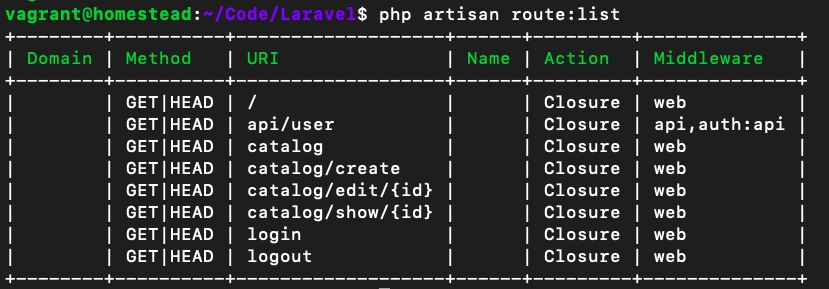
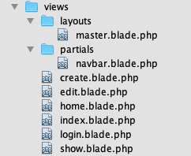
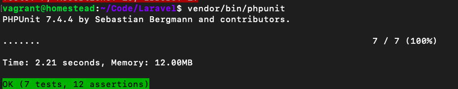
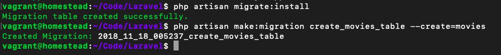
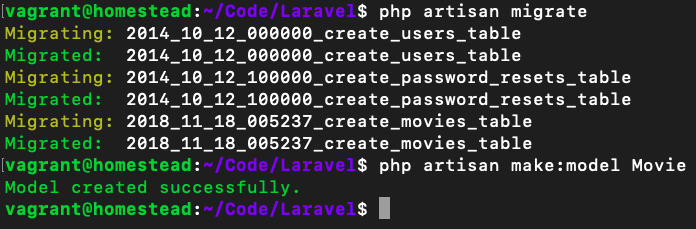
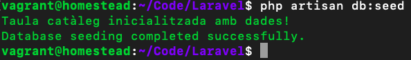

# Exemple

## Videoclub

Com a exemple anem a desenvolupar una xicoteta web per a la gestió interna d'un videoclub, començarem per definir les rutes i vistes del lloc i a poc a poc en els següents exercicis l'anirem completant fins a acabar el lloc web complet.

L'objectiu és realitzar un lloc web per a la gestió interna en un videoclub, el qual estarà protegit mitjançant usuari i contrasenya. Una vegada autoritzat l'accés, l'usuari podrà llistar el catàleg de pel·lícules, veure informació detallada d'una pel·lícula, realitzar cerques o filtrats i algunes operacions més de gestió.

### Definició de les rutes

[Video](https://youtu.be/tQuMBNMA-kc)

En aquest exercici anem a definir les rutes principals que va a tenir el nostre lloc web. Per a començar simplement indicarem que les rutes retornen una cadena (així podrem comprovar que s'han creat correctament). A continuació s'inclou una taula amb les rutes a definir (totes de tipus  GET) i el text que han de mostrar:

| Ruta | Text a mostrar | 
| -- | -- |
| /	  |	Pantalla principal |
| login | Login usuari |
| logout | Logout usuari |
| catalog  | Llistat pel·lícules |
| catalog/show/{id}| Vista detall pel·lícula {id} |
| catalog/create  | Afegir pel·lícula |
| catalog/edit/{id}| Modificar pel·lícula {id} |


##### Solució:

```php
   Route::get('/', function () { return 'Pagina principal';});
    Route::get('login', function () { return 'Login usuari';});
    Route::get('logout', function () { return 'Logout usuari';});
    Route::get('catalog', function () { return 'Llistat pel.licules';});
    Route::get('catalog/show/{id}', function () { return "Vista detall pel.licula $id";});
    Route::get('catalog/create', function () { return 'Afegir pel.licula';});
    Route::get('catalog/edit/{id}', function () {return "Modificar pel.licula $id";});
```

Per a comprovar que les rutes s'hagen creat correctament utilitza el comando de  artisan que retorna un llistat de rutes i a més prova també les rutes en el navegador.

```php
php artisan route:list
```


### Layout principal de les vistes amb  Bootstrap 

En aquest exercici anem a crear el  layout base que van a utilitzar la resta de vistes del lloc web i a més inclourem la llibreria  Bootstrap per a utilitzar-la com a estil base.
Laravel 5.8 ja inclou bootstrap però laravel 6.0 no. Així que cal instalar-lo:

* Fes **composer require laravel/ui**
* Despres **php artisan ui bootstrap**

* Fes **npm install** des de la linea de comanaments. Acò instal.larà tots els paquets que estàn en el packaje.son en el directori **node_modules**

* Fes **npm run-dev** des de la linea de comanaments. Aço compilarà totes les dependències i les ficarà en els fitxers **public/css/app.cs** i **public/js/app.js**. 

Dels materials que ens hem descarregat copiem la plantilla per a la barra de navegació principal (navbar.blade.php) i l'emmagatzemem en la carpeta  resources/views/partials.
A continuació anem a crear el **layout principal** del nostre lloc:

* Anem a crear el fitxer **resources/views/layouts/master.blade.php**.
* Li afegim com contingut la plantilla base HTML que proposa  Bootstrap en la seua [documentació](https://getbootstrap.com/docs/4.4/getting-started/introduction/)
, modificant els següents elements:
 * Canviem les rutes per a la càrrega dels  assets que venen en laravel per defecte. Per a generar la ruta completa i que trobe els recursos haurem d'escriure els següents comandos:

			.....
			<!-- Bootstrap -->
			<meta name="csrf-token" content="{{ "{{ csrf_token() " }}}}">
			<link href="{{ "{{ asset('css/app.css') " }}}}" rel="stylesheet">
			.....
			<script src="{{ "{{ asset('js/app.js') " }}}}" ></script>
     
* Dins de la secció <body> de l'HTML, eliminem el text que ve d'exemple (\<h1> Hello,  world! \</h1>) i incloem la barra de navegació que hem guardat abans utilitzant el següent codi:


		@include('partials.navbar')


* A continuació de la barra de navegació afegim la secció principal on apareixerà el contingut de la web:

		<div class="container"> @yield('content')</div>
	
Amb açò ja hem definit el layout principal, no obstant açò encara no podem provar-ho ja que no està associat a cap ruta. 

##### Solució:

```php
<!DOCTYPE html>
	<html lang="es">
	  <head>
	    <meta charset="utf-8">
	    <meta http-equiv="X-UA-Compatible" content="IE=edge">
	    <meta name="viewport" content="width=device-width, initial-scale=1">
	    <!-- The above 3 meta tags *must* come first in the head; any other head content must come *after* these tags -->
	    <title>Video Club</title>
	    <meta name="csrf-token" content="{{ "{{ csrf_token() " }}}}">
	    <!-- Bootstrap -->
	     <link href="{{ "{{ asset('css/app.css') " }}}}" rel="stylesheet">
	  </head>
	  <body>
	    @include('partials.navbar')
	    <div id='app' class="container"> @yield('content')</div>
	   
	    <!-- Scripts -->
	    <script src="{{ "{{ asset('js/app.js') " }}}}" ></script>
	  </body>
	</html>
```

### Crear la resta de vistes

En aquest exercici anem acabar una primera versió estable de la web. En primer lloc crearem les vistes associades a cada ruta, les quals hauran d'estendre del  layout que hem fet en l'exercici anterior i mostrar (en la secció de  content del  layout) el text d'exemple que havíem definit per a cada ruta en l'exercici 2.
En general totes les vistes tindran un codi similar al següent (variant únicament la secció  content):

 	@extends('layouts.master')
	@section('content')
 		Pantalla principal 
	@stop

Per a organitzar millor les vistes les anem a agrupar en  sub-carpetes dins de la carpeta  resources/views seguint la següent estructura:

| Vista | Carpeta | Ruta associada |
|--|--|--|
| home.blade.php |  resources/views/ | / |
| login.blade.php |  resources/views/auth/ |  login |
| index.blade.php | resources/views/catalog/ | catalog |
| show.blade.php  | resources/views/catalog/ | catalog/show/{ id} |
| create.blade.php | resources/views/catalog/ | catalog/ create |
| edit.blade.php |  resources/views/catalog/ |  catalog/edit/{id} |

Creem una vista separada per a totes les rutes excepte para la ruta " logout", la qual no tindrà cap vista.
Finalment anem a actualitzar les rutes del fitxer  routes/web.php perquè es carreguen les vistes que acabem de crear. Acordar-vos que per a referenciar les vistes que estan dins de carpetes la barra / de separació es transforma en un punt, i que a més, com a segon paràmetre, podem passar dades a la vista. A continuació s'inclouen alguns exemples:

	return view('home');
	return view('catalog.index');
	return view('catalog.show',array('id'=>$id));
 
Una vegada fets aquests canvis ja podem provar-ho en el navegador, el qual hauria de mostrar en tots els casos la plantilla base amb la barra de navegació principal i els estils de  Bootstrap aplicats. En la secció principal de contingut de moment solament podrem veure els textos que hem posat d'exemple.


##### Solució:

web.php

```php
	Route::get('/', function () { return view('home');});
	Route::get('login', function () {return view('login');});
	Route::get('logout', function () { return 'Logout usuari';});
	Route::get('catalog', function () { return view('index');});
	Route::get('catalog/show/{id}', function ($id) { return view('show',['pelicula'=>$id]);});
	Route::get('catalog/create', function () { return view('create');});
	Route::get('catalog/edit/{id}', function ($id) {return view('edit',['pelicula' =>$id]);});
```
	
edit.blade

```php
	@extends('layouts.master')
	@section('content')
    	Editar pel.licula id {{ "{{$pelicula" }}}}
	@stop
```	

show.blade

```php
	@extends('layouts.master')
	@section('content')
    	Mostrar pel.licula id {{ "{{$pelicula" }}}}
	@stop
```	

create.blade

```php
	@extends('layouts.master')
	@section('content')
    	Crear pel.licula 
	@stop
```	

home.blade

```php
	@extends('layouts.master')
	@section('content')
    	Pagina principal 
	@stop
```	

index.blade

```php
	@extends('layouts.master')
	@section('content')
    	Catalogo
	@stop
```	

login.blade

```php
	@extends('layouts.master')
	@section('content')
    	Login
	@stop
```	




### Crear les proves

Crea un fitxer de proves en la consola del  artisan

	php artisan make:test BasicTest
 
Crea un prova per a  comprobrar que va la pantalla d'inici:

```php
public function testLoadHomePage(){ 
	$this->get('/')->assertStatus(200)->assertSee('Pantalla principal');
}
``` 	
Comprova totes les vistes:

##### Solució

```php
class BasicTest extends TestCase
{
    public function testLoadHomePage(){ 
        $this->get('/')->assertStatus(200)->assertSee('Pantalla principal');
    }
    public function testLoadCatalogPage(){ 
        $this->get('/catalog')->assertStatus(200)->assertSee('Catalogo');
    }
    public function testLoadCreatePage(){ 
        $this->get('/catalog/create')->assertStatus(200)->assertSee('Crear pel.licula');
    }
    public function testLoadEditPage(){ 
        $this->get('/catalog/edit/2')->assertStatus(200)->assertSee('Editar pel.licula id 2');
    }
    public function testLoadShowPage(){ 
        $this->get('/catalog/show/2')->assertStatus(200)->assertSee('Mostrar pel.licula id 2');
    }
}
```



### Definint Controladors

[Video](https://youtu.be/VwNTfrN8XTU)

En aquest primer exercici anem a crear els controladors necessaris per a gestionar la nostra aplicació i a més actualitzarem el fitxer de rutes perquè els utilitze.
Comencem per afegir els dos controladors que ens van a fer falta: **CatalogController.php** i **HomeController.php**. 
Per a açò heu d'utilitzar el comando de Artisan que permet crear un controlador buit (sense mètodes).
A continuació anem a afegir els mètodes d'aquests controladors. En la següent taula resumeixen podem veure un llistat dels mètodes per controlador i les rutes que tindran associades:

|Ruta |Controlador| Mètode|
|--|--|--|
|/| HomeController| getHome|
|catalog|CatalogController|getIndex|
|catalog/show/{id}| CatalogController|getShow|
|catalog/create|CatalogController|getCreate|
|catalog/edit/{id}|CatalogController|getEdit|


Acordeu-vos que els mètodes getShow i getEdit hauran de rebre com a paràmetre el \$id de l'element a mostrar o editar, per la qual cosa la definició del mètode en el controlador haurà de ser com la següent:

	public function getShow($id) {
	return view('catalog.show', array('id'=>$id)); }
	
Finalment anem a canviar el fitxer de rutes routes/web.php per tal que totes les rutes que teníem definides (excepte les de login i logout que les deixarem com estan) apunten als nous mètodes dels controladors, per exemple:

	Route::get('/', 'Homecontroller@gethome');

El codi que teníem posat per a cada ruta amb el return amb la generació de la vista ho heu de moure al mètode del controlador corresponent.

Comprova que les proves segueixen funcionant. En cas contrari corregeix les fallades.


**routes.php**

```php 
Route::get('/','homeController@getHome');
Route::get('login', function () {return view('login');});
Route::get('logout', function () { return 'Logout usuari';});
Route::get('catalog','catalogController@getIndex');
Route::get('catalog/show/{id}', 'catalogController@getShow');
Route::get('catalog/create','catalogController@getCreate');
Route::get('catalog/edit/{id}','catalogController@getEdit');
```	

##### Renderitzant les vistes
	
**catalogController.php**

```php 
	<?php
	namespace App\Http\Controllers;
	use Illuminate\Http\Request;

	class catalogController extends Controller
	{
	    public function getIndex(){
	        return view('index');
	    }
	    public function getShow($id){
	        return view('show',['pelicula'=>$id]);
	    }
	    public function getCreate(){
	        return view('create');
	    }
	    public function getEdit($id){
	        return view('edit',['pelicula' =>$id]);
	    }
	}
```
	
**homeController.php**

```php 
<?php

	namespace App\Http\Controllers;
		
	use Illuminate\Http\Request;
		
	class homeController extends Controller
	{
	    public function getHome()
	    {
	        return redirect()->action('Catalogcontroller@getindex');
	    }
}
```	

### Completant les vistes

En aquest exercici anem a acabar els mètodes dels controladors que hem creat en l'exercici anterior i a més completarem les vistes associades:

**Mètode Homecontroller@gethome**

En aquest mètode de moment solament anem a fer una redirecció a l'acció que mostra el llistat de pel·lícules del catàleg: 
	
	return redirect()->action('Catalogcontroller@getindex'); 
	
Més endavant haurem de comprovar si l'usuari està logueado o no, i en cas que no l'aquest redirigir-li al formulari de login.

**Mètode CatalogController@index**

Aquest mètode ha de mostrar un llistat de totes les pel·lícules que té el videoclub. El llistat de pel·lícules ho podeu obtenir del fitxer array_peliculas.php facilitat amb els materials. Aquest array de pel·lícules ho heu de copiar com a variable membre de la classe (més endavant les emmagatzemarem en la base de dades). En el mètode del controlador simplement haurem de modificar la generació de la vista per a passar-li aquest array de pel·lícules complet (**$this->arrayPeliculas**).

I en la vista corresponent simplement haurem d'incloure el següent tros de codi en la seua secció content: 


```php
	<div class="row">
		@foreach( $arrayPeliculas as $key => $pelicula ) 		
			<div class="col-xs-6 col-sm-4 col-md-3 text-center">
				<a href="{{ "{{  url('/catalog/show/'.$key) " }}}}">
					 
					<h4 style="min-height:45px;margin:5px 0 10px 0">
					{{ "{{ $pelicula['title']" }}}} </h4>
				</a>
			</div> 
		@endforeach
	</div>
``` 

Com es pot veure en el codi, en primer lloc es crea una fila (usant el sistema de reixeta de Bootstrap) i a continuació es realitza un bucle foreach utilitzant la notació de Blade per a iterar per totes les pel·lícules. Per a cada pel·lícula obtenim la seua posició en el array i les seues dades associades, i generem una columna per a mostrar-los. 

És important que ens fixem en com s'itera pels elements d'un array de dades i en la forma d'accedir als valors. A més s'ha inclòs un enllaç perquè en prémer sobre una pel·lícula ens porte a l'adreça **/catalog/show/{\$key}**, sent key la posició d'aqueixa pel·lícula en el array.

**Mètode Catalogcontroller@show**

Aquest mètode s'utilitza per a mostrar la vista detall d'una pel·lícula. Hem de tenir en compte que el mètode corresponent rep un identificador que (de moment) es refereix a la posició de la pel·lícula en el array. Per tant, haurem d'agafar aquesta pel·lícula del array ($this->arrayPeliculas[$id]) i passar-li-la a la vista.

En aquesta vista anem a crear dues columnes, la primera columna per a mostrar la imatge de la pel·lícula i la segona per a incloure tots els detalls. A continuació s'inclou l'estructura HTML que hauria de tenir aquesta pantalla:

```html 
	<div class="row">
		<div class="col-sm-4">
			{{ "{{ -- TOT: Imatge de la pel·lícula --" }}}}
		</div>
		<div class="col-sm-8">
			{{ "{{ -- TOT: Dades de la pel·lícula --" }}}}
		</div> 
	</div>
```	

En la columna de l'esquerra completem el TOT per a inserir la imatge de la pel·lícula. En la columna de la dreta s'hauran de mostrar totes les dades de la pel·lícula: títol, any, director, resum i el seu estat. 

Per a mostrar l'estat de la pel·lícula consultarem el valor rented del array, el qual podrà tenir dos casos:

* En cas d'estar disponible (false) apareixerà l'estat "Pel·lícula disponible" i un botó blau per a "Llogar pel·lícula".
* En cas d'estar llogada (true) apareixerà l'estat "Pel·lícula actualment llogada" i un botó roig per a "Retornar pel·lícula".

A més hem d'incloure dos botons més, un botó que ens portarà a editar la pel·lícula i un altre per a tornar al llistat de pel·lícules.

**Nota**: els botons de llogar/retornar de moment no han de funcionar. Acordeu-vos que en Bootstrap podem transformar un enllaç en un botó, simplement aplicant les classes "**btn btn-default**" (més info [en](http://getbootstrap.com/css/#buttons)).
Aquesta pantalla finalment hauria de tenir una aparença similar a la següent:
  
  
**Mètode Catalogcontroller@create**

Aquest mètode retorna la vista "catalog.create" per a afegir una nova pel·lícula. Per a crear aquest formulari en la vista corresponent ens podem basar en el contingut de la plantilla "catalog_create.php". Aquesta plantilla té una sèrie de ToDo's que cal completar. En total haurà de tenir els següents camps:

|Label|Name|Tipus de camp|
|--|--|--|
|Títol| title| text| 
|Any| year | text|
|Director| director | text|
|Poster| poster| text|
|Resum|synopsis| textarea|

A més tindrà un botó al final amb el text "Afegir pel·lícula".
De moment el formulari no funcionarà. Més endavant ho acabarem.

**Mètode Catalogcontroller@edit**

Aquest mètode permetrà modificar el contingut d'una pel·lícula. El formulari serà exactament igual al d'afegir pel·lícula, així que ho podem copiar i pegar en aquesta vista i simplement canviar els següents punts:
* El títol per "Modificar pel·lícula".
* El text del botó d'enviament per "Modificar pel·lícula".
* Afegir just sota l'obertura del formulari el camp ocult per a indicar que es va a enviar per PUT.
Recordeu que Laravel inclou el mètode  **@method('PUT')** que ens ajudarà a fer açò.
De moment no haurem de fer res més, més endavant ho completarem perquè s'emplene amb les dades de la pel·lícula a editar.

**homeController.php**

```php 
	<?php
	
	namespace App\Http\Controllers;
	
	use Illuminate\Http\Request;
	
	class HomeController extends Controller
	{
	    public function getHome(){
	        return redirect()->action('CatalogController@getIndex');
	    }
	}
```	
	
**catalogController.php**
	
```php 
	..
	private $arrayPeliculas = ...
	
	public function index(){
        return view('index',['arrayPeliculas'=>$this->arrayPeliculas]);
    }
    public function show($id){
        $pelicula = $this->arrayPeliculas[$id];
        return view('show',compact('pelicula','id'));
    }
    public function create(){
        return view('create');
    }
    public function edit($id){
        return view('edit',['pelicula' =>$id]);
    }
```    
    
**show.blade.php**

```php 
	@extends('layouts.master')
	@section('content')
	    <div class="row">
			<div class="col-sm-4">
	                    
			</div>
			<div class="col-sm-8">
	                    <h2>{{ "{{ $pelicula['title']" }}}}</h2>
	                    <h4>{{ "{{ $pelicula['year']" }}}}</h4>
	                    <h4>{{ "{{ $pelicula['director']" }}}}</h4>
	                    <p><strong>Resumen: </strong>{{ "{{ $pelicula['synopsis']" }}}}</p>
	                    <p><strong>Estado: </strong>Pel.lícula @if ($pelicula['rented'])  Actualment llogada @else disponible @endif</p>
	                    <p>
	                       @if ($pelicula['rented']) 
	                        <a href='' class="btn btn-info">Tornar Pel.lícula</a> 
	                       @else 
	                        <a href='' class="btn btn-danger">Llogar Pel.lícula</a>
	                       @endif 
	                       <a href="{{ "{{ route('catalog.edit',$id)" }}}}" class="btn btn-warning"><i class="fa fa-pencil"></i>Editar Pel.lícula</a>
	                       <a href="\catalog" class="btn btn-default">Tornar catàleg</a>
	                    </p>
			</div> 
		</div>
	@stop
```	
	
**create.blade.php**

```php 
	@extends('layouts.master')
	@section('content')
	<div class="row" style="margin-top:20px">
	    <div class="col-md-offset-3 col-md-6">
	        <div class="panel panel-default">
	            <div class="panel-heading">
	                <h3 class="panel-title text-center">
	                    <span class="glyphicon glyphicon-film" aria-hidden="true"></span>
	                    Afegir pel.lícula
	                </h3>
	            </div>
	            <div class="panel-body" style="padding:30px">
	                <form method='POST'>
	                    @csrf
	                    <div class="form-group">
	                        <label for="title">Título</label>
	                        <input type="text" name="title" id="title" class="form-control">
	                    </div>
	
	                    <div class="form-group">
	                        <label for='year'>Any:</label>
	                        <input type='number' name='year' />
	                    </div>
	                    <div class="form-group">
	                        <label for='director'>Director:</label>
	                        <input type='text' name='director' />
	                    </div>
	
	                    <div class="form-group">
	                        <label for='poster'>Poster:</label>
	                        <input type='url' name='poster' />
	                    </div>
	
	                    <div class="form-group">
	                        <label for="synopsis">Resumen</label>
	                        <textarea name="synopsis" id="synopsis" class="form-control" rows="3"></textarea>
	                    </div>
	
	                    <div class="form-group text-center">
	                        <button type="submit" class="btn btn-primary" style="padding:8px 100px;margin-top:25px;">
	                            Afegir pel.lícula
	                        </button>
	                    </div>
	                </form>
	            </div>
	        </div>
	    </div>
	</div>
	@stop
```	
	
**edit.blade.php**

```php 
	@extends('layouts.master')
	@section('content')
	<div class="row" style="margin-top:20px">
	    <div class="col-md-offset-3 col-md-6">
	        <div class="panel panel-default">
	            <div class="panel-heading">
	                <h3 class="panel-title text-center">
	                    <span class="glyphicon glyphicon-film" aria-hidden="true"></span>
	                    Modificar pel.lícula
	                </h3>
	            </div>
	            <div class="panel-body" style="padding:30px">
	                <form method='POST'>
	                    @csrf
	                    @method('PUT')
	                    <div class="form-group">
	                        <label for="title">Título</label>
	                        <input type="text" name="title" id="title" class="form-control">
	                    </div>
	                    <div class="form-group">
	                        <label for='year'>Any:</label>
	                        <input type='number' name='year' />
	                    </div>
	                    <div class="form-group">
	                        <label for='director'>Director:</label>
	                        <input type='text' name='director' />
	                    </div>
	                    <div class="form-group">
	                        <label for='poster'>Poster:</label>
	                        <input type='url' name='poster' />
	                    </div>
	
	                    <div class="form-group">
	                        <label for="synopsis">Resumen</label>
	                        <textarea name="synopsis" id="synopsis" class="form-control" rows="3"></textarea>
	                    </div>
	                    <div class="form-group text-center">
	                        <button type="submit" class="btn btn-primary" style="padding:8px 100px;margin-top:25px;">
	                            Modificar pel.lícula
	                        </button>
	                    </div>
	                </form>
	            </div>
	        </div>
	    </div>
	</div>
	@stop
```	

### Modificant les proves

Perquè totes seguisquen funcionant.

```php 
class BasicTest extends TestCase
	{
	    public function testLoadHomePage(){ 
	        $this->get('/')->assertStatus(302);
	    }
	    public function testLoadCatalogPage(){ 
	        $this->get('/catalog')->assertStatus(200)->assertSee('Catàleg');
	    }
	    public function testLoadCreatePage(){ 
	        $this->get('/catalog/create')->assertStatus(200)->assertSee('Afegir pel.lícula');
	    }
	    public function testLoadEditPage(){ 
	        $this->get('/catalog/edit/2')->assertStatus(200)->assertSee('Modificar pel.lícula');
	    }
	    public function testLoadShowPage(){ 
	        $this->get('/catalog/show/2')->assertStatus(200)->assertSee('Editar Pel.lícula');
	    }
	}
```	


### Configuració de la base de dades

[Video](https://youtu.be/SYAffKndJTI)

En primer lloc anem a configurar correctament la base de dades. Per a açò hem d'actualitzar els fitxers **config/database.php** i **.env** per a indicar que anem a usar una base de dades tipus MySQL cridada "videoclub" juntament amb el nom d'usuari i contrasenya d'accés (**homestead** i **secret**)

A continuació obrim PHPMyAdmin i creem una nova base de dades anomenada videoclub. Per a comprovar que tot s'ha configurat correctament anem a un terminal en la carpeta del nostre projecte i executem el comando que crea la taula de migracions. 

Si tot va bé podrem actualitzar des de PHPMyAdmin i comprovar que s'ha creat aquesta taula dins de la nostra nova base de dades.

Si ens donara algun error haurem de revisar els valors indicats en el fitxer .env. 

Ara anem a crear la taula que utilitzarem per a emmagatzemar el catàleg de pel·lícules. Executa el comando de Artisan per a crear la migració anomenada **create_movies_table** per a la taula movies. 

Una vegada creat edita aquest fitxer per a afegir tots els camps necessaris, aquests són:

 |Camp| Tipus|Valor per defecte|
 |--|--|--|
 |id|Autoincremental||
 | title |String||
 |year| String de longitud 8||
 | director| String de longitud 64|| 
 |poster| String||
 |rented|Booleà |false|
 |synopsis|Text||
 |timestamps|Timestamps de Eloquent||
 
Recorda que en el mètode down de la migració has de desfer els canvis que has fet en el mètode up, en aquest cas seria eliminar la taula.

Finalment executarem el comando de Artisan que afig les noves migracions i comprovarem en PHPMyAdmin que la taula s'ha creat correctament amb els camps que li hem indicat.

**.env**

```php 
...
DB_CONNECTION=mysql
DB_HOST=127.0.0.1
DB_PORT=3306
DB_DATABASE=videoclub
DB_USERNAME=homestead
DB_PASSWORD=secret
...
```	



**create\_movies\_table.php**

```php 

<?php
	
use Illuminate\Support\Facades\Schema;
use Illuminate\Database\Schema\Blueprint;
use Illuminate\Database\Migrations\Migration;
	
class CreateMoviesTable extends Migration
{
    /**
     * Run the migrations.
     *
     * @return void
     */
    public function up()
    {
        Schema::create('movies', function (Blueprint $table) {
            $table->increments('id');
            $table->string('title');
            $table->string('year',8);
            $table->string('director',64);
            $table->string('poster');
            $table->boolean('rented')->default(false);
            $table->text('synopsis');
            $table->timestamps();
        });
    }
	
    /**
     * Reverse the migrations.
     *
     * @return void
     */
    public function down()
    {
        Schema::dropIfExists('movies');
    }
}
```

### Model de dades

[Video](https://youtu.be/Y0W5GNNQFXU)

Anem a crear el model de dades associat amb la taula movies. Per a açò usarem el comando apropiat de Artisan per a crear el model anomenat Movie.

Una vegada creat aquest fitxer ho obrirem i comprovarem que el nom de la classe siga el correcte i que herete de la classe Model. 
I ja està, no és necessari fer res més, el cos de la classe pot estar buit ({}), tot la resta es fa automàticament!



### Seeders
 
Ara anem a procedir a emplenar la taula de la base de dades amb les dades inicials. Per a açò editem el fitxer de llavors situat en **database/seeds/DatabaseSeeder.php** i seguirem els següents passos:

* Crear un mètode privat (dins de la mateixa classe) anomenat seedCatalog() que s'haurà de cridar des del mètode run de la forma:

```php 
public function run() {
	self::seedCatalog();
	$this->command->info('Taula catàleg inicialitzada amb dades!'); 
}
```	

* Movem el array de pel·lícules que es facilitava en els materials i que havíem copiat dins del controlador CatalogController a la classe de llavors (DatabaseSeeder.php), guardant-ho de la mateixa forma, com a variable privada de la classe.
* Dins del nou mètode seedCatalog() realitzem les següents accions:
	* En primer lloc esborrem el contingut de la taula movies amb **DB::table('movies')->delete();**
	* I a continuació afegim el següent codi:

```php 	
foreach( $this->arrayPeliculas as $pelicula) { 
	$p = new Movie;
	$p->title = $pelicula['title'];
	$p->year = $pelicula['year'];
	$p->director = $pelicula['director']; 
	$p->poster = $pelicula['poster']; 
	$p->rented = $pelicula['rented']; 
	$p->synopsis = $pelicula['synopsis']; 
	$p->save();
}
```

Finalment haurem d'executar el comando de Artisan que processa les llavors i una vegada realitzat obrirem
PHPMyAdmin per a comprovar que s'emplenat la taula movies amb el llistat de pel·lícules.

Si t'apareix l'error "**Fatal error: Class 'Movie' not found**" revisa si has indicat l'espai de noms
del model que vas a utilitzar (use App\Movie;).

```php 

use Illuminate\Database\Seeder;
use App\Movie;

class DatabaseSeeder extends Seeder
{
private $arrayPeliculas = 
..
public function run()
	    {
	        self::seedCatalog();
	        $this->command->info('Taula catàleg inicialitzada amb dades!');
	    }
	
	    
    private function seedCatalog()
    {
        DB::table('movies')->delete();

        foreach ($this->arrayPeliculas as $pelicula) {
            $p = new Movie;
            $p->title = $pelicula['title'];
            $p->year = $pelicula['year'];
            $p->director = $pelicula['director'];
            $p->poster = $pelicula['poster'];
            $p->rented = $pelicula['rented'];
            $p->synopsis = $pelicula['synopsis'];
            $p->save();
        }
    }
}    
```



### Ús de la base de dades

Anem a actualitzar els mètodes del controlador CatalogController perquè obtinguen les dades des de la base de dades. Seguirem els següents passos:

* Modificar el mètode index perquè obtinga tota la llista de pel·lícules des de la base de dades usant el model Movie i que li la passe a la vista.
* Modificar el mètode show perquè obtinga la pel·lícula passada per paràmetre usant el mètode findOrFail i li la passe a la vista.
* Modificar el mètode edit perquè obtinga la pel·lícula passada per paràmetre usant el mètode findOrFail i li la passe a la vista.

Si en provar-ho t'apareix l'error "**Class 'Videoclub\Http\Controllers\Movie' not found**" revisa si has indicat l'espai de noms del model que vas a utilitzar (use Videoclub\Movie;).

Ja no necessitarem més el array de pel·lícules (\$arrayPeliculas) que havíem posat en el controlador, així que ho podem comentar o eliminar.

Ara haurem d'actualitzar les vistes perquè en lloc d'accedir a les dades del array els obtinga de l'objecte amb la pel·lícula. Per a açò canviarem en tots els llocs on hàgem posat \$pelicula['camp'] per \$pelicula->camp.

A més, en la vista catalog/index.blade.php, en comptes d'utilitzar l'índex del array (\$key) com a identificador per a crear l'enllaç a catalog/show/{id}, haurem d'utilitzar el camp id de la pel·lícula (\$pelicula->id). 
El mateix en la vista catalog/show.blade.php, per a generar l'enllaç d'editar pel·lícula haurem d'afegir l'identificador de la pel·lícula a la ruta catalog/edit.

**catalogController.php**

```php 
	use Illuminate\Http\Request;
	use App\Movie;
	
	class CatalogController extends Controller
	{
	    public function getIndex(){
	        $arrayPeliculas = Movie::all();
	        return view('index',compact('arrayPeliculas'));
	    }
	    public function getShow($id){
	        $pelicula = Movie::findOrFail($id);
	        return view('show',compact('pelicula'));
	    }
	    public function getCreate(){
	        return view('create');
	    }
	    public function getEdit($id){
	        $pelicula = Movie::findOrFail($id);
	        return view('edit',compact('pelicula'));
	    }
	}
```	
	
**index.blade.php**

```
	@extends('layouts.master')
	@section('content')
	<h2 >Catàleg</h2>
	    <div class="row">
	    @foreach( $arrayPeliculas as $pelicula )        
	        <div class="col-xs-6 col-sm-4 col-md-3 text-center">
	            <a href="{{ "{{ url('/catalog/show/'.$pelicula->id) " }}}}">
	                 
	                <h4 style="min-height:45px;margin:5px 0 10px 0">
	                {{ "{{$pelicula->title" }}}} </h4>
	            </a>
	        </div> 
	    @endforeach
	    </div>  
	@stop
```

**show.blade.php**

```php
	@extends('layouts.master')
	@section('content')
	    <div class="row">
			<div class="col-sm-4">
	                    poster" }}}}" alt="{{ "{{$pelicula->title" }}}}"/>
			</div>
			<div class="col-sm-8">
	                    <h2>{{ "{{$pelicula->title" }}}}</h2>
	                    <h4>{{ "{{$pelicula->year" }}}}</h4>
	                    <h4>{{ "{{$pelicula->director" }}}}</h4>
	                    <p><strong>Resumen: </strong>{{ "{{$pelicula->synopsis" }}}}</p>
	                    <p><strong>Estado: </strong>Pel.lícula @if ($pelicula->rented)  Actualment llogada @else disponible @endif</p>
	                    <p>
	                       @if ($pelicula->rented) 
	                        <a href='' class="btn btn-info">Tornar Pel.lícula</a> 
	                       @else 
	                        <a href='' class="btn btn-danger">Llogar Pel.lícula</a>
	                       @endif 
	                       <a href="\catalog\edit\{{ "{{$pelicula->id" }}}}" class="btn btn-warning"><i class="fa fa-pencil"></i>Editar Pel.lícula</a>
	                       <a href="\catalog" class="btn btn-default">Tornar catàleg</a>
	                    </p>
			</div> 
		</div>
	@stop
```

### Afegir i editar pel·lícules

[Video](https://youtu.be/eg47wpRMNxw)

En primer lloc anem a afegir les rutes que ens van a fer falta per a arreplegar les dades en enviar els formularis. Per a açò editem el fitxer de rutes i afegim dues rutes (també protegides pel filtre auth):

* Una ruta de tipus POST per a la url catalog/create que apuntarà al mètode postCreate del controlador CatalogController.
* I una altra ruta tipus PUT per a la url catalog/edit/{id} que apuntarà al mètode putEdit del controlador CatalogController.

A continuació anem a editar la vista catalog/edit.blade.php amb els següents canvis:

* Revisar que el mètode d'enviament del formulari siga tipus PUT.
* Hem de modificar tots els inputs perquè com a valor del camp pose el valor corresponent de la pel·lícula. Per exemple en el primer input hauríem d'afegir value="{{$pelicula->title}}". 
* Realitza el mateix per a la resta de camps: year, director, poster i synopsis. L'únic camp diferent serà el de synopsis ja que el input és tipus textarea, en aquest cas el valor ho haurem de posar directament entre l'etiqueta d'obertura i la de tancament.
* 
Finalment hem d'actualitzar el controlador CatalogController amb els dos nous mètodes. En tots dos casos hem d'usar la injecció de dependències per a afegir la classe Request com a paràmetre d'entrada (revisa la secció "Dades d'entrada" de la teoria). A més per a cada mètode farem:

* En el mètode postCreate vam crear una nova instància del model Movie, assignem el valor de tots els camps d'entrada (title, year, director, poster i synopsis) i els guardem. Finalment, després de guardar, fem una redirecció a la ruta /catalog.
* En el mètode putEdit cerquem la pel·lícula amb l'identificador passat per paràmetre, actualitzem els seus camps i els guardem. Finalment realitzem una redirecció a la pantalla amb la vista detalle de la pel·lícula editada.
Nota: de moment en cas d'error no es mostrarà res.


** web.php **

```php
	Auth::routes();
	Route::get('/','HomeController@getHome');
	Route::group(['middleware'=>'auth'],function(){
	    Route::get('/logout','Auth\Logincontroller@logout');
	    Route::get('catalog','CatalogController@getIndex');
	    Route::get('catalog/show/{id}', 'CatalogController@getShow');
	    Route::get('catalog/create','CatalogController@getCreate');
	    Route::post('catalog/create','CatalogController@postCreate');
	    Route::get('catalog/edit/{id}','CatalogController@getEdit');
	    Route::put('catalog/edit/{id}','CatalogController@putEdit');
	});
```
	


** HomeController **

```php
	<?php
	
	namespace App\Http\Controllers;
	
	use Illuminate\Http\Request;
	use Illuminate\Support\Facades\Auth;
	
	class HomeController extends Controller
	{
	    
	    public function getHome()
	    {
	        if (Auth::user())
	            return redirect()->action('CatalogController@getIndex');
	        else 
	            return redirect('login');
	    }
	}
```	
	
** CatalogController **

```php
	<?php
	
	namespace App\Http\Controllers;
	
	use Illuminate\Http\Request;
	use App\Movie;
	
	class CatalogController extends Controller
	{
	    public function getIndex(){
	        $arrayPeliculas = Movie::all();
	        return view('index',compact('arrayPeliculas'));
	    }
	    public function getShow($id){
	        $pelicula = Movie::findOrFail($id);
	        return view('show',compact('pelicula'));
	    }
	    public function getCreate(){
	        return view('create');
	    }
	    public function postCreate(Request $request){
	        $movie = new Movie();
	        $movie->title = $request->title;
	        $movie->year = $request->year;
	        $movie->director = $request->director;
	        $movie->poster = $request->poster;
	        $movie->synopsis = $request->synopsis;
	        $movie->save();
	        return redirect('/catalog');
	    }
	    public function getEdit($id){
	        $pelicula = Movie::findOrFail($id);
	        return view('edit',compact('pelicula'));
	    }
	    public function putEdit(Request $request,$id){
	        $movie = Movie::findOrFail($id);
	        $movie->title = $request->title;
	        $movie->year = $request->year;
	        $movie->director = $request->director;
	        $movie->poster = $request->poster;
	        $movie->synopsis = $request->synopsis;
	        $movie->save();
	        return redirect("/catalog/show/$id");
	    }
	}
```
### Validació Formulari

[Video](https://youtu.be/iojmY5DbpXU)


### Proves

Ara fallen totes les proves en les quals hem d'estar autenticats. Per a corregir açò hem d'executar el get una vegada que ens hàgem loguejat. Per a fer açò tenim actuar com un usuari.

	private function defaultUser(){ 
		return User::find(1);
	}
	
	public function testLoadCreatePage(){ 
       $this->actingAs($this->defaultUser())->get('/catalog/create')->assertStatus(200)->assertSee('Afegir pel.lícula');
    }
	
Fes que totes les proves tornen a funcionar.

## Instal.lació de paquets

[Video](https://youtu.be/IND2inVKTEE)

Els paquets són la manera primària d'afegir funcionalitat a Laravel. Els paquets podrien ser qualsevol cosa d'una manera: des de un gran de treballar amb dates com **Carbon**, o un marc de testatge de BDD sencer com **Behat**.

Naturalment, hi ha tipus diferents de paquets. Alguns paquets són independent del framework, treballen amb qualsevol marc de PHP. Qualssevol d'aquests paquets poden ser utilitzats amb Laravel afegint-los dins el vostre arxiu composer.json o amb **composer require**

D'altra banda, altres paquets són per ús amb Laravel. Aquests paquets poden tenir rutes, controladors, vistes, i la configuració concretament per a Laravel. 

#### Exemple: StydeNet Html package

Aquest [paquet](https://github.com/StydeNet/html) conté una col·lecció de classes de PHP per generar components d'HTML comú, com:

* Menus
* Missatges d'Alerta
* Col.leccions en formularis
* Camps de ràdios i checkboxes en formulari

És una extensió del paquet [**HTML de Laravel Colective**](https://laravelcollective.com/docs/master/html) i serà molt útil per generar formularis i HTML dinàmicament.

* Per **Instal·lar** fes córrer el **composer require "styde/html=~1.8"** o afegint **"styde/html": "~1.8"** a l'arxiu composer.json.
	
* També, necessites registrar en el **app/Http/Kernel.php** el middleware \Styde\Html\Alerta\Middleware::class despres del middleware **StartSession** . 

		// Per Laravel superior a 5.4
		protected $middlewareGroups = [
		    \Styde\Html\Alert\Middleware::class,
		    //...
		];

Aquest middleware és necessitat per fer els missatges d'alerta persistents entre sessions, després de que cada petició és completada.

Ara tindràs automàticament disponibles el següents components:

	Alert => Styde\Html\Facades\Alert
	Field => Styde\Html\Facades\Field
	Menu  => Styde\Html\Facades\Menu
	Form  => Collective\Html\FormFacade
	Html  => Collective\Html\HtmlFacade
	
Opcionalment, pots també executar **php artisan vendor:publish --provider='Styde\Html\HtmlServiceProvider'** per publicar l'arxiu de configuració en **config/html.php** i revisar les seves opcions i valors.

### Instal.la el component styde

Ja està explicat dalt.

###Refactorizar el formulari

En primer lloc, anem a canviar el formulari 'create'. Substituïm tot el codi html per este que utilitza la classe Form dels components instal.lats. El formulari està associat està associat a un model i posse els camps que en fan falta. No cal possar el @csfr doncs es possa automàticament.

```php

	* {!! Form::model(new App\Movie(),['class'=>'form-horizontal form-label-left','enctype'=>"multipart/form-data"]) !!}
	    {!! Field::text('title') !!}
	    {!! Field::text('year') !!}
	    {!! Field::text('director') !!}
	    {!! Field::text('poster') !!}
	    {!! Field::textarea('synopsis') !!}
	    {!! Form::submit('Enviar',['class'=>'btn btn-success','id'=>'submit']) !!}
    {!! Form::close() !!}	*
    
```
 
Canviarem, de la mateixa forma, el formulari de modificació, tenint en compte que si en conte de passar-li el model li passe un element del model, el valors s'afegisen al formulari.

```php
	{!! Form::model($pelicula,['class'=>'form-horizontal form-label-left','enctype'=>"multipart/form-data",'method'=>'PUT']) !!}
        {!! Field::text('title') !!}
        {!! Field::text('year') !!}
        {!! Field::text('director') !!}
        {!! Field::select('id_genre') !!}
        {!! Field::text('poster') !!}
        {!! Field::textarea('synopsis') !!}
    {!! Form::submit('Enviar',['class'=>'btn btn-success','id'=>'submit']) !!}
    {!! Form::close() !!}
```

### Refactoritzar els mètodes create i update

Anem a utilitzar l'assignament massiu per a omplir tots els camp a l'hora. Pots fer-ho declarant en el model la variable **$fillable** o la variable **$guard**

Després hauràs de substituir l'assignació de tots els camps, en el metodes create i update, per l'instrucció:


	$movie->fill($request->toArray());

storeMovie.php

```php
	<?php
	
	namespace App\Http\Requests;
	
	use Illuminate\Foundation\Http\FormRequest;
	use DateTime;
	
	class StoreMovie extends FormRequest
	{
	    /**
	     * Determine if the user is authorized to make this request.
	     *
	     * @return bool
	     */
	    public function authorize()
	    {
	        return true;
	    }
	
	    /**
	     * Get the validation rules that apply to the request.
	     *
	     * @return array
	     */
	    public function rules()
	    {
	        $now = new DateTime;
	        $year = $now->format("Y");
	        return [
	            'title' => 'required|max:255',
	            'year' => "required|numeric|min:1900|max:$year",
	            'poster' => 'required'
	        ];
	    }
	}
```

catalogController.php

```php	
	...
	public function postCreate(StoreMovie $request){
        $movie = new Movie();
        $movie->fill($request->toArray());
        $movie->save();
        return redirect('/catalog');
    }
    public function putEdit(StoreMovie $request,$id){
        $movie = Movie::findOrFail($id);
        $movie->fill($request->toArray());
        $movie->save();
        return redirect("/catalog/show/$id");
    }
    ...	
```    

movie.php

```php
protected $guarded = [];
```
    
### Afegir relació u a molts.

[Video](https://youtu.be/4Jm81EV0F0Q)

* Crea un taula, mitjançant una migració(create_genres_table) que es diga genres (generè en anglés) ('id','titulo') 

```php
<?php

use Illuminate\Database\Migrations\Migration;
use Illuminate\Database\Schema\Blueprint;
use Illuminate\Support\Facades\Schema;

class CreateGenresTable extends Migration
{
    /**
     * Run the migrations.
     *
     * @return void
     */
    public function up()
    {
        Schema::create('genres', function (Blueprint $table) {
            $table->increments('id');
            $table->string('title');
        });
    }

    /**
     * Reverse the migrations.
     *
     * @return void
     */
    public function down()
    {
        Schema::dropIfExists('genres');
    }
}
```


* Anem a crear una migració alter_movies_table per afegir un camp (id_genre) i crear la clau forània amb genres.

		<?php
		
		use Illuminate\Support\Facades\Schema;
		use Illuminate\Database\Schema\Blueprint;
		use Illuminate\Database\Migrations\Migration;
		
		class AlterMoviesTable extends Migration
		{
		    /**
		     * Run the migrations.
		     *
		     * @return void
		     */
		    public function up()
		    {
		        Schema::table('movies', function (Blueprint $table) {
		            $table->integer('id_genre')->unsigned()->nullable();
		            $table->foreign('id_genre')->references('id')->on('genres')->onUpdate('CASCADE')->onDelete('SET NULL');
			});
		    }
		
		    /**
		     * Reverse the migrations.
		     *
		     * @return void
		     */
		    public function down()
		    {
		        Schema::table('movies', function (Blueprint $table) {
		            $table->dropForeign('movies_id_genre_foreign');
		            $table->dropColumn('id_genre');
		        });
		    }
	}

* Executa la migració i comprova que tot s'ha executat correctament.
* Emplena la taula Genres amb uns quants.
* Afegix el model Genre.
* Afegix la rel.lació belongsTo al model Movie per vincular-la al model Genre.

		public function Genre(){
		        return $this->belongsTo(Genre::class,'id_genre');
		    }
		    
* Afegix la rel.lació HasMany al model Genre.

```php
public function movies(){
        return $this->belongsToMany(Movie::class);
}
```

* Per tal que en la vista es motre el titol del gènere:

```php

		<p><strong>Genere:</strong>
		 @if ($pelicula->Genre)  {{ $pelicula->Genre->title @if ($pelicula->rented)
                    <form action= {{action('catalogController@putReturn',$pelicula->id)}} method="POST" style="display:inline">
                        {{ method_field('PUT') }}
                        @csrf
                        <button type="submit" class="btn btn-info" > Tornar Película</button>
                    </form>
                @else
                    <form action= {{action('catalogController@putRent',$pelicula->id)}} method="POST" style="display:inline">
                        {{ method_field('PUT') }}
                        @csrf
                        <button type="submit" class="btn btn-secondary" > Llogar Película</button>
                    </form>
                    <form action= {{action('catalogController@deleteMovie',$pelicula->id)}} method="POST" style="display:inline">
                        {{ method_field('DELETE') }}
                        @csrf
                        <button type="submit" class="btn btn-danger"  > Esborrar Película</button>
                    </form>
                @endif}} 
		 @else Desconocido
		 @endif
		</p>
```


### Afegir el camp Gènere al formulari.

[Video](https://youtu.be/Tn3gV_kHD-g)

Anem a utilitza el component d'Styde:

	{!! Field::select('id_genre') !!}

que posarem a les vistes. Si a este component li passem un array de paràmetres, es possarà com a valors seleccionables:

	{!! Field::select('id_genre',['terror','musical','thriller']) !!}
	
També es pot declarar una funció en el model Movie per a que torne els valors.

```php
	public function getIdGenreOptions(){
		return ['terror','musical','thriller']
	}
```

Però el que volem és que els valor s'agafem de la **taula Genres**. Tal i com així:

```php
public function getIdGenreOptions()
{
        return Genre::all()->toArray();
}
```


Però aço no acaba de funcionar perquè torna un array d'esta forma

```php

	array:2 [▼
	  0 => array:2 [▼
	    "id" => 1
	    "titulo" => "Terror"
	  ]
	  1 => array:2 [▼
	    "id" => 2
	    "titulo" => "Fantástico"
	  ]
	]
```


però per a que funcionara hauria de ser d'aquesta altra

```php

	array:2 [▼
	  1 => "Terror"
	  2 => "Fantástico"
	  ]
	]
```

	
Aixì que anem a fer una funció genèrica php que donada una col.lecció d'objectes i dos camps del mateix, genere un array per a l'option.

	function hazArray($elementos,'campo1','campo2')
	{
	    return $array
	}

i la cridariem de la següent forma:

```php

	public function getIdGenreOptions()
    {
        return hazArray(Genre::all(),'id','titulo');
    }
```

    
 De moment declara-la com a privada en el model per a provar que funciona.

 **Nota: en Laravel, per a poder vore el valor d'una variable i para l'execució del programa s'utilitza la funció dd($variable)** 


#### HelperServiceProvider

[Video](https://youtu.be/sFvxC6zXFjM)

Però, esta funció ha de poser ser visible en tota la  aplicació. Per tal de aconseguir-ho anem a crear un fitxer on guardar les nostres funcions genèriques.

  * Crea una carpeta **Helpers** dins de **app**
  * Crea un fitxer **myHelpers** dins d'aquesta carpeta.
  * copia la funció hazArray

```php
<?php

function hazArray($elementos, $campo1, $campo2)
	{
	    $todos = [];
	    foreach ($elementos as $elemento)
	        $todos[$elemento->$campo1] = $elemento->$campo2;
	    return $todos;
	}
```

Per a que les funcions d'aquest fitxer siguen visibles en l'aplicació anem a crear un ServiceProvider i a registrar-lo:

	php artisan make:provider HelperServiceProvider
	
Crearà un fitxer en la carpeta Providers.
L'editem per afegir el nostre Helper.

```php

	/**
	     * Register services.
	     *
	     * @return void
	     */
	    public function register()
	    {
	        require_once base_path() . '/app/Helpers/myHelpers.php';
	    }
```

	    
I ara registrem el ServiceProvider en el fitxer **config/app.php**

```php

'providers' => [

        /*
         * Laravel Framework Service Providers...
         */
        Illuminate\Auth\AuthServiceProvider::class,
        
        .....

        /*
         * Package Service Providers...
         */

        /*
         * Application Service Providers...
         */
        App\Providers\AppServiceProvider::class,
        App\Providers\AuthServiceProvider::class,
        // App\Providers\BroadcastServiceProvider::class,
        App\Providers\EventServiceProvider::class,
        App\Providers\RouteServiceProvider::class,
        App\Providers\HelperServiceProvider::class,

    ],
```
    
I com cada volta que toquen un fitxer de configuració executem

	php artisan config:cache

I tot ha de funcionar. Ja podem triar un gènere en cada pel.licula.

### El component de menu styde.

[Video](https://youtu.be/_KFSmCnFkqM)

Anem a fer el menu des d'un fitxer de text utilitzan el component de menu del paquet instal.lat

Substituïm el navbar per :

```php
	<nav class="navbar navbar-expand-md navbar-light navbar-laravel">
	    <div class="container">
	        <a class="navbar-brand" href="{{url('/')}}">
	            <span class="glyphicon glyphicon-tower" aria-hidden="true"></span>
	            Videoclub
	        </a>
	        <button class="navbar-toggler" type="button" data-toggle="collapse" data-target="#navbarSupportedContent" aria-controls="navbarSupportedContent" aria-expanded="false" aria-label="{{ __('Toggle navigation') }}">
	                <span class="navbar-toggler-icon"></span>
	        </button>
	        @if( Auth::check() )
	            {!! Menu::make(config('menu'), 'navbar-nav mr-auto') !!}
	        @endif
	    </div>
	</nav>
```
	
on config('menu') enllaça en un fitxer que hem de crear en la carpeta config i de nom menu.php. Este haurà de contindre:

```php

	<?php
	
	return [
		'catalogo' => ['url' => '/catalog'],
		'nueva' => ['title' => 'Nueva Película', 'url' => '/catalog/create'],
		'logout' => ['title' => 'Cerrar Sesion' ,'url' => '/logout']
	];
```

**Cal fer php artisan config:cache**

On estan les opcions de menu.

### Completant botons

En aquest exercici anem a afegir la funcionalitat dels botons de llogar, retornar i eliminar pel·lícules. En tots els casos haurem de crear una nova ruta, un nou mètode en el controlador , actualitzar el boton en la vista i mostrar una notificació despres de realitzar l'acció. En la següent taula es mostra un resum de la nova ruta a afegir:

|Ruta|Tipus|Controlador/Acció|
|--|--|--|
|/catalog/rent/{id}|PUT|CatalogController@putRent|
|/catalog/return/{id}|PUT|CatalogController@putReturn|
|/catalog/delete/{id}|DELETE|CatalogController@deleteMovie|

Aquests tres mètodes són similars al mètode que ja havíem implementat abans per a editar les dades d'una pel.lícula. En el cas de **putRent** i **putReturn** únicament modificarem el camp **rented** assignant-li el valor true i false respectivament i una vegada guardat crearem la notificació i realitzarem una redirecció a la pantalla amb la vista detalle de la pel.lícula. En el mètode deleteMovie també obtindrem el registre de la pel·lícula però haurem de cridar al mètode delete() de la mateixa, una vegada fet açò afegirem la notificació i realitzarem una redirecció al llistat general de pel·lícules.

A continuació hem d'editar la vista detalle de pel·lícules per a modificar els botons (show.blade). Atès que les accions han de realitzaren utilitzant peticions HTTP tipus PUT i DELETE no podem posar un enllaç normal (ja que seria de tipus GET). Per a solucionar-ho hem de crear un formulari al voltant del botó i assignar al formulari el mètode corresponent.

Per exemple:

```php

	<form action= {{action('CatalogController@putReturn',$pelicula->id)}} method="POST" style="display:inline">
		{{ method_field('PUT') }}
		{{ csrf_field() }}
		<button type="submit" class="btn btn-danguer" style= "display:inline" > Devolver Película</button>
	</form>
```

### Fes un manteniment per a la taula de gèneres i fica-la al menu.

Per a fer submenus amb styde :

```php

	return [
		'catalogo' => [ 'submenu' => [
	            'lista' =>[ 'title'=> 'Catálogo', 'url' => '/catalog'],
	            'nueva' => ['title' => 'Nueva Película', 'url' => '/catalog/create'],
	        ]],
	        'genero' => ['submenu' => [ 
	            'genre' => ['title' => 'Mantenimiento Generos' , 'url' => '/genre'],
	            'nuevo' => ['title' => 'Nuevo Genero', 'url' => '/genre/create']
	            ]],
		'logout' => ['title' => 'Cerrar Sesion' ,'url' => '/logout']
	];
```


web.php

```php
        Route::put('catalog/return/{id}','catalogController@putReturn');
	Route::put('catalog/rent/{id}','catalogController@putRent');
	Route::delete('catalog/{id}','catalogController@deleteMovie'); 
```

catalogController

```php
public function putRent($id){
        $pelicula = Movie::findOrFail($id);
        $pelicula->rented = true;
        $pelicula->save();
        return redirect("/catalog/show/$id");
    }
    public function putReturn($id){
        $pelicula = Movie::findOrFail($id);
        $pelicula->rented = false;
        $pelicula->save();
        return redirect("/catalog/show/$id");
    }
    public function deleteMovie($id){
        Movie::findOrFail($id)->delete();
        return redirect("/catalog");
    }
```

show.blade.php

```php
 @if ($pelicula->rented)
                    <form action= {{action('catalogController@putReturn',$pelicula->id)}} method="POST" style="display:inline">
                        {{ method_field('PUT') }}
                        @csrf
                        <button type="submit" class="btn btn-info" > Tornar Película</button>
                    </form>
                @else
                    <form action= {{action('catalogController@putRent',$pelicula->id)}} method="POST" style="display:inline">
                        {{ method_field('PUT') }}
                        @csrf
                        <button type="submit" class="btn btn-secondary" > Llogar Película</button>
                    </form>
                    <form action= {{action('catalogController@deleteMovie',$pelicula->id)}} method="POST" style="display:inline">
                        {{ method_field('DELETE') }}
                        @csrf
                        <button type="submit" class="btn btn-danger"  > Esborrar Película</button>
                    </form>
                @endif
    @endif
```


web.php

```php
Route::get('genre','genreController@getIndex');
Route::get('genre/create','genreController@getCreate');
Route::post('genre/create','genreController@postCreate');
Route::get('genre/edit/{id}','genreController@getEdit');
Route::put('genre/edit/{id}','genreController@putEdit');
Route::get('genre/delete/{id}','genreController@delete');
```

genreController.php

```php
<?php
	
	namespace App\Http\Controllers;
	
	use Illuminate\Http\Request;
	use App\Genre;
	
	
	class GenreController extends Controller
	{
	    public function getIndex(){
	        $generos = Genre::all();
	        return view('genre.index',compact('generos'));
	    }
	    
	    public function getCreate(){
	        return view('genre.create');
	    }
	    public function postCreate(Request $request){
	        $genre = new Genre();
	        $genre->fill($request->toArray());
	        $genre->save();
	        return redirect('/genre');
	    }
	    public function getEdit($id){
	        $genre = Genre::findOrFail($id);
	        return view('genre.edit',compact('genre'));
	    }
	    public function putEdit(Request $request,$id){
	        $genre = Genre::findOrFail($id);
	        $genre->fill($request->toArray());
	        $genre->save();
	        return redirect("/genre");
	    }
	    public function delete($id){
	        Genre::findOrFail($id)->delete();
	        return redirect("/genre");
	    }
	}
	
```

create.blade.php


```php
@extends('layouts.master')
	@section('content')
	<div class="row" style="margin-top:20px">
	    <div class="col-md-offset-3 col-md-6">
	        <div class="panel panel-default">
	            <div class="panel-heading">
	                <h3 class="panel-title text-center">
	                    <span class="glyphicon glyphicon-film" aria-hidden="true"></span>
	                    Afegir gènere
	                </h3>
	            </div>
	            <div class="panel-body" style="padding:30px">
	                {!! Form::model(new App\Genre,['class'=>'form-horizontal form-label-left','enctype'=>"multipart/form-data"]) !!}
	                    {!! Field::text('title') !!}
	                    {!! Form::submit('Enviar',['class'=>'btn btn-success','id'=>'submit']) !!}
	                {!! Form::close() !!}
	            </div>
	        </div>
	    </div>
	</div>
	@stop
```	

edit.blade.php

```php
	@extends('layouts.master')
	@section('content')
	<div class="row" style="margin-top:20px">
	    <div class="col-md-offset-3 col-md-6">
	        <div class="panel panel-default">
	            <div class="panel-heading">
	                <h3 class="panel-title text-center">
	                    <span class="glyphicon glyphicon-film" aria-hidden="true"></span>
	                    Modificar Genere
	                </h3>
	            </div>
	            {!! Form::model($genre,['class'=>'form-horizontal form-label-left','enctype'=>"multipart/form-data"]) !!}
	                @method('PUT')
	                {!! Field::text('title') !!}
	            {!! Form::submit('Enviar',['class'=>'btn btn-success','id'=>'submit']) !!}
	            {!! Form::close() !!}
	        </div>
	    </div>
	</div>
	</div>
	@stop
```
	
index.blade.php

```php
	@extends('layouts.master')
	@section('content')
	<h2 >Gèneres</h2>
	    <div class="row">
	        <table class="table-bordered table-info">
	            <tr><th>id</th><th>Titulo</th><th>Operacion</th></tr>
			    @foreach( $generos as $genero )        
			    <tr>
			        <td>{{$genero->id}}</td>
			        <td>{{$genero->title}}</td>
			        <td><a href='/genre/edit/{{$genero->id}}'><i class='fa fa-edit'></i></a>
			            <a href='/genre/delete/{{$genero->id}}'><i class='fa fa-trash'></i></a>
			        </td>
			    </tr>
			    @endforeach
	        </table>
	    </div>  
	@stop

```

### Alertes 

[Video](https://youtu.be/y-zb8hB2GD4)

El component d'Styde te un sistema de notificacions. Per a fer-lo servir cal possar en la vista on volem que ixquen les notificacions. En el nostre cas serà en la plantilla, després de mostrar el contingut:

master.blade.php

```php

	...
	<div id='app' class="container"> 
        @yield('content')
        {!! Alert::render() !!}
    </div>
    ...
```

    
I ara quan guardem una pel.licula podem mostrar una notificació a l'usuari:

CatalogController.php

```php

	...
	public function postCreate(StoreMovie $request){
        $movie = new Movie();
        $movie->fill($request->toArray());
        $movie->save();
        Alert::success("S'ha guardat la pel.licula");
        return redirect('/catalog');
    }
	...
```

	
### ACCÉS (LOGIN) EN UNA APP AMB SOCIALITE


[Video](https://youtu.be/aNIG2wYKPPA)

Laravel disposa d'un paquet oficial, anomenat Laravel Socialite que ens ofereix una via ràpida i fàcil, per a oferir una forma d'autenticació amb proveïdors de OAuth, suportant de forma oficial a la data, Facebook, Twitter, LinkedIn, Google, GitHub i Bitbucket. Pot ser estès amb facilitat implementant el paquet Socialite Providers

Per fer un sistema d'autenticació per [Facebook](https://castris.com/acceso-login-en-una-app-de-laravel-5-7-con-socialite/)

### Control de qui lloga la pel.licula.

[Video](https://youtu.be/E-wOk2kCVSQ)


Cada volta que un usuari lloga un pel.licula anem a apuntar-ho en una taula **rents**. 

	php artisan make:migration create_rents_table

* Crearem la migració amb els camps per a la taula **rents**: id, id_user, id_movie, dateRent, dateReturn i amb les claus fonànies corresponents i creem les relaciones molts a molts entre els models movie i users. 

```php
	<?php

use Illuminate\Database\Migrations\Migration;
use Illuminate\Database\Schema\Blueprint;
use Illuminate\Support\Facades\Schema;

class CreateRentsTable extends Migration
{
    /**
     * Run the migrations.
     *
     * @return void
     */
    public function up()
    {
        Schema::create('rents', function (Blueprint $table)
        {
            $table->increments('id');
            $table->integer('id_movie')->unsigned();
            $table->integer('id_user')->unsigned();
            $table->date('dateRent')->nullable();
            $table->date('dateReturn')->nullable();
            $table->foreign('id_movie')->references('id')->on('movies')->onUpdate('CASCADE')->onDelete('CASCADE');
            $table->foreign('id_user')->references('id')->on('users')->onUpdate('CASCADE')->onDelete('CASCADE');
        });
    }

    /**
     * Reverse the migrations.
     *
     * @return void
     */
    public function down()
    {
        Schema::dropIfExists('rents');
    }
}

```


**Movie.php**

```php
public function users(){
        return $this->belongstoMany(User::class,'rents','id_movie', 'id_user')->withPivot(['dateRent','dateReturn']);
    }
```

**User.php**

```php
public function movies(){
        return $this->belongstoMany(Movie::class,'rents','id_user', 'id_movie')->withPivot(['dateRent','dateReturn']);
    }
```
    
* Fem que quan un usuari llogue s'afegisca un enllaç de la rel.lació:
	
	* Utilitzarem la funció attach de la rel.lació i transaccions per fer les dos operacions o cap.
	* Utilitza la funció updateExistingPivot per a tornar la pel.licula, ja que la relació ja existeix.

```php
 public function putRent($id){
        DB::transaction(function () use($id) {
            $pelicula = Movie::findOrFail($id);
            $pelicula->rented = true;
            $pelicula->save();
            $pelicula->users()->attach(Auth::id(), ['dateRent' => date('Y/m/d')]);
        });

        return redirect("/catalog/show/$id");
    }
    public function putReturn($id){
        DB::transaction(function () use($id){
            $pelicula = Movie::findOrFail($id);
            $pelicula = Movie::findOrFail($id);
            $pelicula->rented = false;
            $pelicula->save();
            $pelicula->users()->updateExistingPivot(Auth::id(), ['dateReturn' =>date('Y/m/d')]);
        });
        return redirect("/catalog/show/$id");
    }
```

### Que un usuari no puga retornar una pel.licula que no te llogada.

* Per a fer-ho més senzill anem a definir una altra rel.lació en la taula users que incloga les pel.licules de l'usuari que el camp dateReturn siga null

```php
 public function rent_movies(){
        return $this->belongsToMany(Movie::class,'rents','id_user', 'id:movie')->withPivot(['dateRent','dateReturn'])->wherePivot('dateReturn',null);
    }
```

* Utilitzan esta relació en la vista mostrarem el botó de retornar soles si la pel.licula està entre les llogades per l'usuari. Una rel.lació torna una col.lecció ([collection](https://laravel.com/docs/6.0/collections)). Anem a utilitzar el mètodo contains de la col.lecció:

		@if (Auth::user()->rent_movies->contains($pelicula)) 
