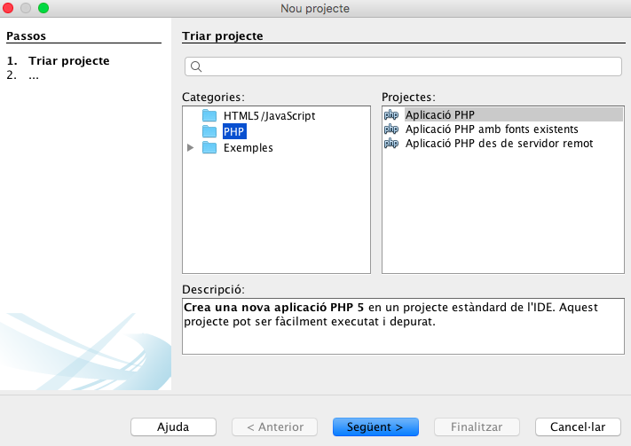

#### Preparació de l'entorn

Pera fer correr les aplicacions de servidor ens cal, com a mínim, un **servidor web**, l'interpret de **php** i un **motor de base de dades**. 

	* Podem optar per qualsevol solució **LAMP** (Linux, Apache, Mysql, PHP). Als que haurem d'afegir, una vegada els projectes es facen grans composer, git i les opcions de la part de client.
	* Podem optar per una solució docker.
	* Podem optar per una màquina virtual 

#### Configuració netbeans

A l'hora de crer un nou projecte haurem de seleccionar les següents opcions

